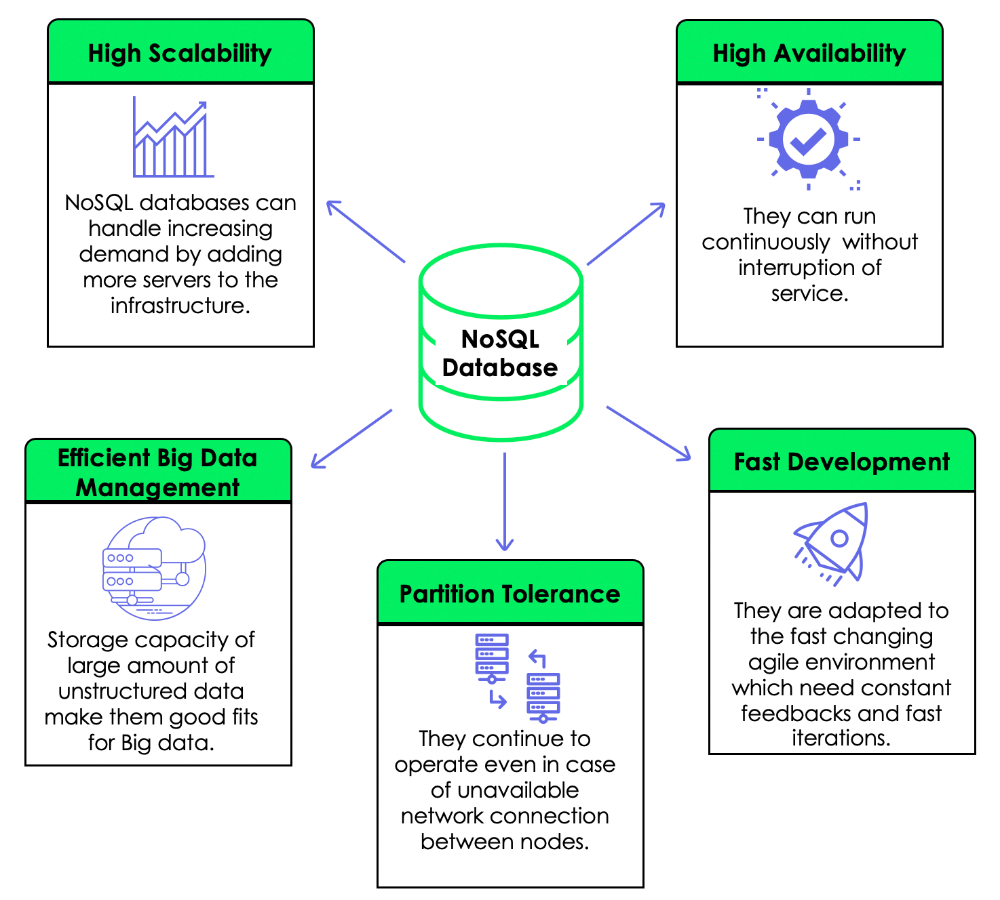
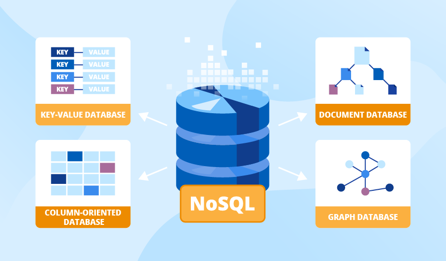
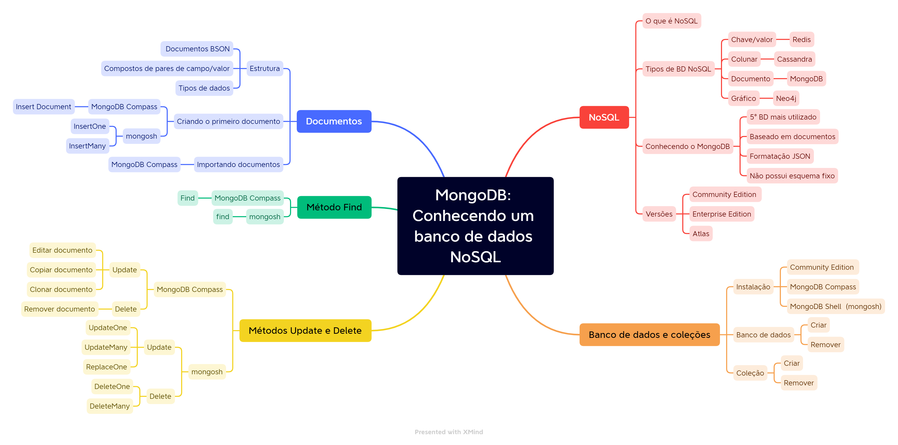
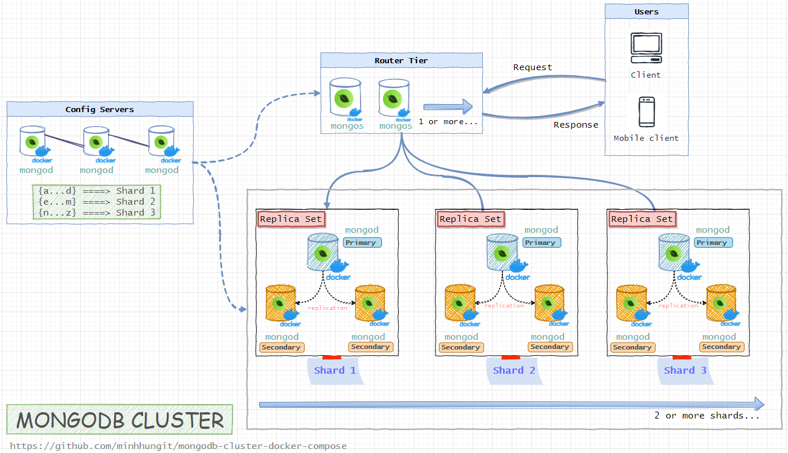
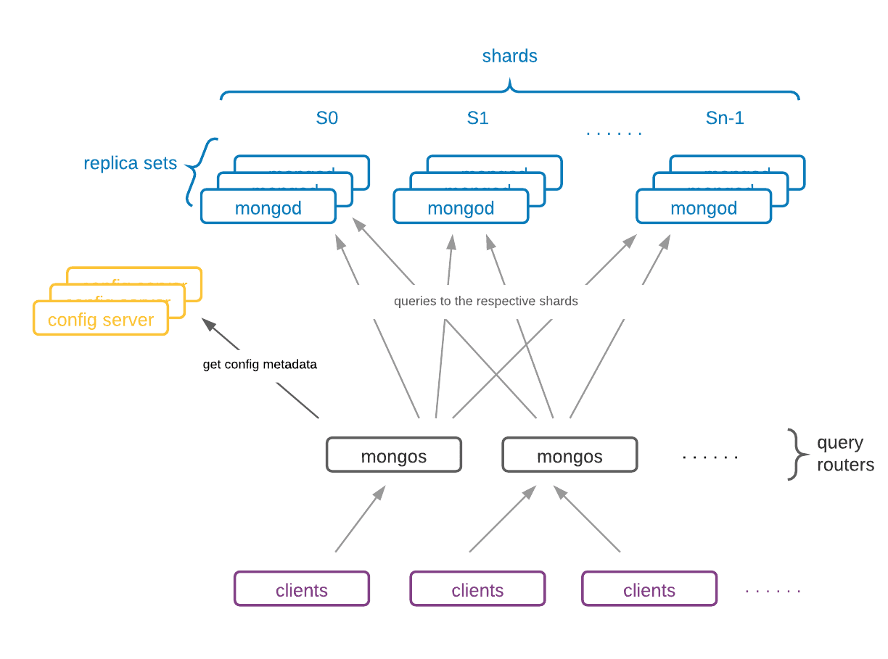
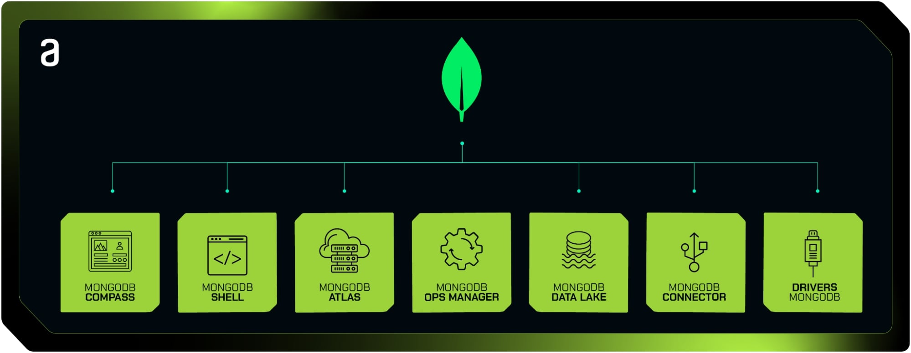
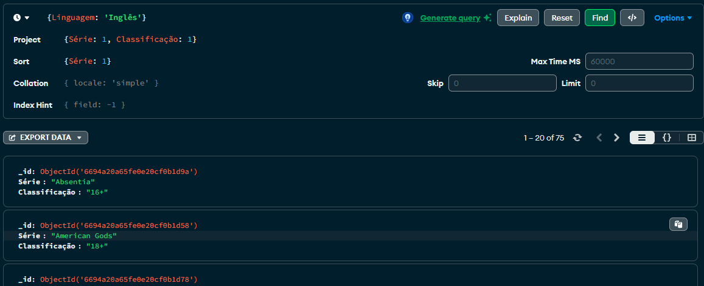

# NoSQL com MongoDB

- [NoSQL com MongoDB](#nosql-com-mongodb)
  - [Banco de Dados Orientado a Documentos](#banco-de-dados-orientado-a-documentos)
    - [MongoDB](#mongodb)
    - [Ferramentas MongoDB](#ferramentas-mongodb)
    - [Boas Práticas com MongoDB](#boas-práticas-com-mongodb)
  - [Primeiros Passos](#primeiros-passos)
    - [BSON](#bson)
      - [Especificações e Tipos](#especificações-e-tipos)
      - [Diferenças Entre BSON e JSON](#diferenças-entre-bson-e-json)
      - [Importando e Exportando](#importando-e-exportando)
    - [CRUD](#crud)
  - [Operados](#operados)
    - [Operadores de Consulta e Projeção](#operadores-de-consulta-e-projeção)
    - [Miscellaneous Operators](#miscellaneous-operators)
    - [Operadores de Update](#operadores-de-update)
    - [Aggregation](#aggregation)
  - [Modelagem de Dados](#modelagem-de-dados)
    - [Embedding vs. Referencing](#embedding-vs-referencing)

## Banco de Dados Orientado a Documentos

MongoDB é um conceito de banco de dados orientado a documentos, ou seja, utiliza o conceito de dados e documentos autocontidos e auto descritivos; isso implica que o documento em si já define como ele deve ser apresentado e qual o significado dos dados armazenados.

Tem como características conter todas as informações importantes em um único documento, livre de esquemas, identificadores únicos e universais (UUID), consultas de documentos através de métodos avançados de agrupamento e filtragem (MapReduce) e por sofrer com redundância e inconsistência.

Este tipo de banco também é conhecido como NoSQL (Not Only SQL), devido à ausência da linguagem nele, mas não se resume somente a isso. De forma resumida, esse tipo de banco de dados não traz consigo as ideias do modelo relacional e nem a linguagem SQL.



Entre suas diferenças, se destacam: seguir um padrão, ter sua própria linguagem de consulta e sua própria estrutura da armazenamento; sendo que a maior diferença entre os modelos se encontra aqui, onde o banco orientado a documentos lida com documentos e não com registros como no modelo relacional, que por sua vez é representado usando uma abordagem bidimensional (tabelas de duas dimensões: linhas e colunas).

**NoSQL ↓**



Outros exemplos de bancos NoSQL (além de documento) são: 

- Grafos
  - Não existem tabelas, documentos ou qualquer outra estrutura que seja comparável a uma tabela
  - Tudo são nós (vértices) e relacionamentos (arestas)
  - O mais popular entre eles é o Neo4j
- Chave/Valor
  - Todos os registros fazem parte da mesma coleção de elementos
  - Comparado aos modelos relacionais, é como se o banco de dados inteiro fosse uma única tabela que possui apenas duas colunas, uma com a chave , e uma outra com valor
  - Redis é um exemplo desse tipo
- Colunar
  -  A estrutura principal dos bancos colunares é basicamente uma grande tabela
  -  Cada registro pode ter quantas e quais colunas precisar (schemaless)
  -  Um exemplo deste tipo é o Cassandra

### MongoDB

O MongoDB tem como características ser open source licenciado pela GNU AGPL (Affero General Public License) versão 3.0, possuir alta performance, não possuir esquemas, ser escrito em C++, multiplataforma e ser formado por um conjunto de aplicativos JSON. Diversas linguagens e plataforma já possuem drivers para o MongoDB, entre elas destacam-se: C, C#, C++, Haskell, Java, JavaScript, Perl, PHP, Python, Ruby e Scala. Além disso, o MongoDB possui binários para diversas plataformas como Windows, Mac OS X, Linux e Solaris.

Apresenta 3 versões: 

- Community
  - Sua versão gratuita
  - Disponível para fins de avaliação e desenvolvimento
  - Com ela é possível criar diversos bancos de dados e coleções,  trabalhar com documentos e realizar análises dos dados
- Enterprise 
  - Sua versão comercial
  - Ela inclui recursos adicionais não disponibilizados na versão gratuita, como recursos avançados de segurança, assistência especializada, ferramentas poderosas, entre outros
- Atlas
  - Sua versão na hospedada na nuvem
  - É possível experimentar o Atlas gratuitamente com um cluster de 512 MB

Ele atualmente já é utilizado por diversas empresas para armazenar e trabalhar com os dados, um exemplo disso é a EA Sports FIFA. Para atender milhões de jogadores, o estúdio de desenvolvimento Spearhead da EA selecionou o MongoDB para armazenar dados do usuário e estado do jogo.



Por não possuir esquema, o mongoDB garante um crescimento horizontal do banco de forma muito mais ágil, sendo perfeito para aplicações como:

- E-Commerces que dependem de grande volume de dados
  - Por exemplo, taxas, valores de produtos, endereços de clientes, métodos de pagamento, etc
- Aplicações que usem NodeJS ou Redis no backend devido à facilidade de manutenção, altíssima performance e integração com Javascript
- Sistemas de gerenciamento de conteúdos baseadas em Big Data.

**Vantagens ↓**

Não possui um esquema fixo, ou seja, dentro de uma mesma coleção, vários documentos que possuem diversos campos diferentes; isso facilita a reestruturação do banco de dados. Ainda pode evitar problemas, como travamentos ou até garantir a segurança dos dados.

Também disponibiliza o recurso de réplicas. Com isso, ele garante uma maior disponibilidade dos dados, já que, além do servidor principal, podemos ter mais duas cópias desse servidor em outras máquinas.

Conta também com o Cluster, o qual garante a capacidade de lidar com uma grande quantidade de dados. O Cluster faz com que os dados sejam espalhados em diversas outras máquinas.



- Alta performance
  - Uma única consulta pode retornar tudo o que é preciso sobre o documento
- Escalabilidade
- Flexibilidade
- Manipulação de uma quantidade massiva de dados
- Bom desempenho
- Facilidade para consultas
  - Não existem transações e join
- Indexação
- Transações ACID
  - Introduziu o suporte a transações ACID em sua versão 4.0
- Comunidade Ativa e Ecossistema

O escalonamento horizontal com Sharding é muito bem implementado no MongoDB. Sharding é utilizado quando se tem muitos dados e está no limite do disco, dessa forma, esses dados são divididos entre várias máquinas, assim alcançando mais rendimento e maior capacidade de armazenamento em disco. Portanto, quanto mais Shards, maior será o armazenamento e o desempenho. Banco de dados relacionais muito utilizados como o MySQL não suportam esse tipo de solução por padrão, para isso é necessário manipular os dados em uma camada acima da base de dados, sendo muito mais trabalhoso.



Consultas SQL são de fácil conversão para MongoDB, tendo uma maior facilidade para migração de um banco relacional para o modelo orientado a documentos.

Por fim, a funcionalidade GridFS é responsável por armazenar arquivos de grandes dimensões; isso significa que vídeos, arquivos, entre outros, podem ser armazenados diretamente no banco de dados, diferente do modelo relacional que armazena tudo no filesystem e disponibiliza apenas uma referência para esses arquivos. O tempo de resposta desses arquivos armazenados no MongoDB é comparado ao tempo de resposta dos arquivos em filesystem.

Porém, entre suas desvantagens é que quando se quer alterar todos os registros relacionados a uma única semântica, é necessário tratar um a um; possui um suporte menos ágil comparado a grandes empresas e apesar de dar suporte a agregação de coleções, sua aplicação pode ser bastante complexa.

### Ferramentas MongoDB

São essenciais para o desenvolvimento, administração e otimização de bancos de dados MongoDB. Elas abrangem uma variedade de funcionalidades, desde ferramentas de linha de comando até interfaces gráficas e bibliotecas de terceiros.



Algumas de suas principais ferramentas são:

**Compass ↓**

GUI visual para interagir com bancos de dados MongoDB. Permite explorar, visualizar e analisar dados, criar consultas e índices, e gerenciar coleções.

**Shell ↓**

Interface de linha de comando para interagir com bancos de dados MongoDB. Permite executar consultas, scripts e comandos de administração diretamente no shell.

**Atlas ↓**

Plataforma de banco de dados como serviço (DBaaS) fornecida pela MongoDB Inc. Permite implantar, gerenciar e escalar clusters MongoDB na nuvem de maneira simples e eficiente.

**Ops Manager ↓**

Plataforma de gerenciamento e monitoramento para implantações do MongoDB em ambientes de produção. Oferece recursos avançados de monitoramento, backup, automação e segurança.

**Atlas Data Lake ↓**

Ferramenta que permite consultar e analisar dados armazenados em nuvens de armazenamento, como Amazon S3 e Azure Data Lake Storage, usando o MongoDB Query Language (MQL).

**BI Connector ↓**

Ponte entre o MongoDB e ferramentas de business intelligence (BI), permitindo que aplicativos de BI como Tableau e Power BI consultem dados armazenados no MongoDB usando SQL.

**Drivers ↓**

Bibliotecas de cliente disponíveis para várias linguagens de programação, como Python, Java, Node.js, e muitas outras, que permitem que aplicativos se conectem e interajam com bancos de dados MongoDB.

### Boas Práticas com MongoDB

**Usar compressão e otimizar recursos ↓**

Possui um serviço de compressão robusto implementado no seu motor de armazenamento WiredTiger que encurta nomes, mas se quiser melhorar ainda mais a performance, evite campos com nomes grandes.

Outra boa prática para otimização de recursos é separar o armazenamento, a maior parte do acesso aos dados terá um desempenho melhor em discos de acesso aleatório como SSDs porém, o Mongo armazena os ‘logs’ de forma sequencial podendo estes serem armazenados em discos tradicionais como RAID.

**Executar um único MongoDB por servidor ↓**

Aqui é preciso deixar explícito que não é sobre clusterização ou sharding. O que está sendo referido é da execução do mesmo processo mongod executado lado a lado no mesmo servidor.

Isso é considerado uma má prática, pois haverá um tipo de ‘concorrência’ pelos recursos do servidor resultando em uma perda geral de desempenho.

**Armazenar os dados do registro em um único documento ↓**

Uma das fraquezas do MongoDB é a inconsistência dos dados. Se eles estiverem espalhados em diferentes documentos, o risco de isso acontecer aumenta. Além disso, as buscas tem uma performance muito melhor quando rodam em um único documento.

**Evitar documentos grandes ↓**

Apesar do MongoDB possuir uma boa compressão para gerenciamento de arquivos binários, esse tipo de armazenamento deve ser sempre evitado. Um dos motivos é justamente a limitação do tamanho de cada documento para 16 MB. A boa notícia é que documentos ocupam muito menos espaço que linhas e dificilmente uma linha chega a este tamanho.

**Evitar informações desnecessárias: índices, nomes... ↓**

Existem vários problemas em utilizar informações desnecessárias em um banco de dados, desde perda de performance até complexidade de manutenção. Geralmente, um banco com muitos dados desnecessários é resultado de uma má modelagem. Na dúvida, vale rever a regra de negócio.

**Usar covered queries quando possível ↓**

Segundo a documentação do MongoDB, uma busca coberta (covered query) pode ser usada quando: ‘Todos os campos da consulta são partes do índice’ e ‘todos os campos na mesma consulta retornam o índice’.

Caso esses requisitos sejam atendidos, usar um índice pode dar um grande ganho de desempenho na busca, visto que o mongo não precisará mais ler estes dados, somente extraí-los do índice, o que é muito mais rápido.

**Usar inserções em massa quando necessário ↓**

Bancos NoSQL são otimizados para receberem uma grande quantidade de dados em alta velocidade, portanto, é uma boa prática aproveitar esse benefício. Deve-se pensar nisso ao criar a regra de inserção de dados da aplicação de modo que esse recurso seja bem aproveitado.

**Fazer backups diários ↓**

Fazer backups é sempre importante, e, como o MongoDB lida com muitos dados, acidentes podem causar danos irreparáveis. A vantagem é que, como os documentos são geralmente leves, os backups são rápidos de serem realizados e recuperados, o que faz com que seja uma boa prática fazer backups diariamente.

## Primeiros Passos

Como muitos bancos de dados, o MongoDB pode ser acessado e usado via linha de comando, possuindo também o seu próprio script shell, o Mongosh. Após a sua instalação na máquina, é só inicializar o seu serviço (se já não foi iniciado), abrir o prompt de comando e se conectar a ele com o comando `mongosh`. 

Diferente da linguagem SQL, os comandos de MongoDB são case sensitive, ou seja `use` != `USE`.

**Criando ou Alternando Databases ↓**

Para a criação de um novo banco de dados ou para alternar entre bancos já existentes.

```sh
use db_name
```

Porém, mesmo após ter sido criado pela linha de comando, o banco não aparecerá no Compass, isso porque para um banco de dados ser criado de fato, ele precisa conter dados/coleções. As coleções são análogas às tabelas em bancos de dados relacionais.

_Restrições de nomeação ↓_

Para implantações do MongoDB em sistemas operacionais Windows, os nomes de banco de dados não podem conter nenhum dos seguintes caracteres:

→ `/. "$*<>:|?`

Já para implantações do MongoDB em em sistemas operacionais Unix e Linux, os nomes de banco de dados não podem conter nenhum dos seguintes caracteres:

→ `/. "$`

Além disso, os nomes de banco de dados não podem conter o caractere nulo. Os nomes de banco de dados não podem estar vazios e devem ter menos de 64 caracteres.

**Criando Coleções ↓**

```sh
db.createCollection(name, options)
```

Pode ser usado para criar uma:

- Coleção tampada
- Coleção agrupada
- Nova coleção que usa validação de documentos

Se usar o parâmetro opcional `options`, é possível criar uma:

- Coleção limitada
- Coleção personalizada
- View

É possível também criar uma coleção da seguinte forma:

```sh
use myNewDatabase
db.myCollection.insertOne( { x: 1 } );
```

Como a coleção não existe ainda, o MongoDB cria ela quando armazena o dado. 

_Restrições de nomeação ↓_

Os nomes das coleções devem começar com um sublinhado ou um caractere de letra. Não podem:

- Conter o `$`.
- Ser uma string vazia (por exemplo "", ).
- Conter o caractere nulo.
- Começar com o system.prefixo. (Reservado para uso interno)

**Mostrando Databases ↓**

Apresenta uma lista dos bancos de dados já existentes.

```sh
show databases
```

Ou

```sh
show dbs
```

**Deletando Databases e Coleções ↓**

Primeiro é necessário garantir de que se está conectado a database que será deletada, para então rodar o comando `dropDatabase`.

```sh
use db_name
db.dropDatabase()
```

Caso todas as coleções e dados tenham sido removidos de um banco de dados, ele também é automaticamente removido, pois precisa conter dados para existir.

```sh
db.collection_name.drop()
```

**Criando Exibições ↓**

```sh
db.createView()
```

### BSON

Antes de começar com os comandos para CRUD de um documento, é preciso entender como os dados são armazenados. O MongoDB trabalha com uma estrutura de documentos no formato BSON (Binary JSON).

BSON é uma notação de objeto de JavaScript codificado em binário, ou seja, uma notação de objeto textual baseada em JSON, porém que permite mais tipos de dados, pois codifica tipos e tamanho de informações para que seja mais fácil para a máquina fazer o parse.

```
{"hello": "world"}


\x16\x00\x00\x00           // total document size
\x02                       // 0x02 = type String
hello\x00                  // field name
\x06\x00\x00\x00world\x00  // field value
\x00                       // 0x00 = type EOO ('end of object')
```

Assim como JSON, suporta diversas linguagens de programação, incluindo: C, C++, C#, Java, JavaScript, PHP, Python, Ruby, e Swift.

#### Especificações e Tipos

O elemento mais oa alto da estrutura deve ser do tipo objeto BSON e deve conter umm ou mais elementos, onde cada elemento pode ser um nome de campo (string), um tipo, ou um valor. Alguns dos seus tipos são:

| type       | bytes                                                                  |
| ---------- | ---------------------------------------------------------------------- |
| byte       | 1 byte (8-bits)                                                        |
| int32      | 4 byte (32-bit signed integer, two's complement)                       |
| int64      | 8 byte (64-bit signed integer, two's complement)                       |
| uint64     | 8 byte (64-bit unsigned integer)                                       |
| double     | 8 byte (64-bit IEEE 754-2008 binary floating-point)                    |
| decimal128 | 16 byte (128-bit IEEE 754-2008 decimal floating-point)                 |
| date       | 8 byte (64-bits integer)                                               |
| objectId   | 12 byte (4B timestamp value, 5B random value, 3B incrementing counter) |
| array      | based on data (byte array = 1B, short array = 2B, integer array = 4B)  |

O valor de um campo em um documento pode ser qualquer um dos tipos de dados BSON, incluindo outros documentos, matrizes e matrizes de documentos. O tamanho máximo de um documento BSON é 16 megabytes.

#### Diferenças Entre BSON e JSON

**Tipo ↓**

_JSON_ → seus arquivos são escritos no formato textual

_BSON_ → seus arquivos são escritos em formato binário

**Velocidade ↓**

_JSON_ → lê de forma rápida, mas é mais lento para construir

_BSON_ → lento para ler, mas é mais rápido para construir e escanear

**Espaço ↓**

_JSON_ → seus dados são um pouco menores em tamanho de byte

_BSON_ → seus dados são um pouco maiores em tamanho de byte

**Codificação e Decodificação ↓**

_JSON_ → pode ser enviado por APIs sem codificar ou decodificar

_BSON_ → seus arquivos são codificados antes do armazenamento e decodificados antes de serem exibidos

**Parse ↓**

_JSON_ → é um formato legível para humanos que não precisa de parsing

_BSON_ → é um formato que precisa de parsing, já que é gerado pela máquina e não legível para humanos

**Tipos de Dados ↓**

_JSON_ → possui um set específico de tipos de dados: string, boolean, number. array, object e null

_BSON_ → oferece tipos de dados adicionais, como: bindata e decimal128 

**Uso ↓**

_JSON_ → é usado para enviar dados por network (em sua maioria, por APIs)

_BSON_ → bancos de dados o usam para armazenar dados

#### Importando e Exportando

**Importando Um Arquivo ↓**

```sh
mongorestore -d db_name /path/file.bson
```

**Importando Uma Coleção ↓**

```sh
mongorestore --drop -d db_name -c collection_name /path/file.bson
```

**Exportando Documentos ↓**

```sh
mongorestore -d db_name /path/
```

**Exportando Coleções ↓**

```sh
bsondump collection.bson
```

```sh
bsondump --outFile=collection.json collection.bson
```

### CRUD

**Create ↓**

Operações de criação ou inserção adicionam novos documentos a coleção. Se a coleção não existe, a operação também cria a coleção. É possível inserir somente um documento ou múltiplos documentos em uma única operação.

Se um `id` não for especificado na criação do documento, o MongoDB irá adicionar um campo `_id` com um valor `ObjectId` para ele. O nome do campo `_id` é reservado para uso como primary key; seu valor deve ser único na coleção, é imutável e pode ser de qualquer tipo que não seja um array.

Além disso, os nomes dos campos não poder conter o caractere `NULL`.

_Adicionando Um ↓_

```sh
db.collection.insertOne({[data here]})
```

```sh
use sample_mflix

db.movies.insertOne(
  {
    title: "The Favourite",
    genres: [ "Drama", "History" ],
    runtime: 121,
    rated: "R",
    year: 2018,
    directors: [ "Yorgos Lanthimos" ],
    cast: [ "Olivia Colman", "Emma Stone", "Rachel Weisz" ],
    type: "movie"
  }
)
```

_Adicionando Vários ↓_

```sh
db.collection.insertMany([{[data here]}, ...])
```

```sh
use sample_mflix

db.movies.insertMany([
   {
      title: "Jurassic World: Fallen Kingdom",
      genres: [ "Action", "Sci-Fi" ],
      runtime: 130,
      rated: "PG-13",
      year: 2018,
      directors: [ "J. A. Bayona" ],
      cast: [ "Bryce Dallas Howard", "Rafe Spall" ],
      type: "movie"
    },
    {
      title: "Tag",
      genres: [ "Comedy", "Action" ],
      runtime: 105,
      rated: "R",
      year: 2018,
      directors: [ "Jeff Tomsic" ],
      cast: [ "Annabelle Wallis", "Jeremy Renner", "Jon Hamm" ],
      type: "movie"
    }
])
```

Outros métodos que também podem adicionar novos documentos em uma coleção:

- Quando usado com a opção `upsert: true`
  - `db.collection.updateOne()`
  - `db.collection.updateMany()`
  - `db.collection.findAndModify()`
  - `db.collection.findOneAndUpdate()`
  - `db.collection.findOneAndReplace()`
- `db.collection.bulkWrite()`

**Read ↓**

Operações de leitura recuperam documentos de uma coleção; ou seja, consultam uma coleção por documentos. É possível especificar critérios ou filtros para identificar qual documento deve ser retornado.

```sh
db.collection.find()
```

_Consultando Todos os Documentos de uma Coleção ↓_

```sh
use sample_mflix

db.movies.find()

: ' 
 equivalent to the following command
  SELECT * FROM movies'
```
_Condição de Igualdade ↓_

```sh
use sample_mflix

db.movies.find( { "title": "Titanic" } )

: ' 
equivalent to the following command
  SELECT * FROM movies WHERE title = "Titanic"'
```

_Condições em Consultas ↓_

```sh
{ <field1>: { <operator1>: <value1> }, ... }
```

```sh
use sample_mflix

db.movies.find( { rated: { $in: [ "PG", "PG-13" ] } } )

: ' 
equivalent to the following command
  SELECT * FROM movies WHERE rated in ("PG", "PG-13")'
```

_Consultas com Operadores Lógicos ↓_

```sh
use sample_mflix

# AND
db.movies.find( { countries: "Mexico", "imdb.rating": { $gte: 7 } } )
```

```sh
use sample_mflix

# OR
db.movies.find( {
     year: 2010,
     $or: [ { "awards.wins": { $gte: 5 } }, { genres: "Drama" } ]
} )
```

→ Compass



_FILTER_: utilizado para especificar qual será a condição que os documentos devem atender para serem retornados na busca.

_PROJECT_: utilizado para especificar quais campos serão ou não retornados na consulta.

- Ao Informar o nome do campo e informar 0, todos os campos, exceto os campos especificados no campo project, são retornados. Se o campo receber o valor de 1, ele será retornado na consulta. 
- O campo _id é retornado por padrão, a menos que este seja especificado no campo project e definido como 0.

_SORT_: especifica a ordem de classificação dos documentos retornados.

- Para especificar a ordem crescente de um campo, defina o campo como 1.
- Para especificar a ordem decrescente de um campo, defina o campo como -1.

_MAX TIME MS_: define o limite de tempo cumulativo em milissegundos para processar as operações da barra de consulta. Se o limite de tempo for atingido antes da conclusão da operação, o Compass interrompe a operação.

_COLLATION_: utilizado para especificar regras específicas do idioma para comparação de textos, como regras para letras maiúsculas ou minúsculas, acentos, entre outros.

_SKIP_: especifica quantos documentos devem ser ignorados antes de retornar o conjunto de resultados.

_LIMIT_: especifica o número máximo de documentos a serem retornados.

```sh
db.collection.find(
  {fieldName: value},
  {fieldName: value}
).limit(5)

db.user.find(
  {age: {$gt: 18} },
  {name: 1, address: 1}
).limit(5)
```

**Update ↓**

Operações de atualização modificam documentos existentes em uma tabela. É possível alterar somente um documento ou múltiplos documentos em uma única operação. Também se pode especificar um critério ou filtros para identificar quais documentos serão atualizados; estes usam a mesma sintaxe que nas operações de consulta.

```sh
{
  <update operator>: { <field1>: <value1>, ... },
  <update operator>: { <field2>: <value2>, ... },
  ...
}
```

_Atualizando Um ↓_

```sh
db.collection.updateOne(<filter>, <update>)
```

```sh
use sample_mflix

db.movies.updateOne( { title: "Twilight" },
{
  $set: {
    plot: "A teenage girl risks everything–including her life–when she falls in love with a vampire."
  },
  $currentDate: { lastUpdated: true }
})
```

_Atualizando Vários ↓_

```sh
db.collection.updateMany(<filter>, <update>)
```
```sh
use sample_airbnb

db.listingsAndReviews.updateMany(
  { security_deposit: { $lt: 100 } },
  {
    $set: { security_deposit: 100, minimum_nights: 1 }
  }
)
```

_Substituindo Um ↓_

Para substituir completamente um documento - exceto o seu `id` - é só passar o novo documento por inteiro como argumento deste comando.


```sh
db.collection.replaceOne()
```

```sh
db.accounts.replaceOne(
  { account_id: 371138 },
  { account_id: 893421, limit: 5000, products: [ "Investment", "Brokerage" ] }
)
```

Outros métodos que também podem atualizar documentos em uma coleção:

- `db.collection.findOneAndReplace()`
- `db.collection.findOneAndUpdate()`
- `db.collection.findAndModify()`
- `db.collection.bulkWrite()`

**Delete ↓**

Operações de remoção deletam documentos existentes de uma coleção. É possível deletar somente um documento ou múltiplos documentos em uma única operação. Também se pode especificar um critério ou filtros para identificar quais documentos serão removidos; estes usam a mesma sintaxe que nas operações de consulta e update.

_Deletando Todos ↓_

```sh
db.collection.deleteMany(<filter>)
```

```sh
use sample_mflix

db.movies.deleteMany()
```

_Deletando Vários com Condicional ↓_

Para deletar vários documentos de uma vez, mas sem deletar todos, é só necessário passar um argumento como filtro.

```sh
use sample_mflix

db.movies.deleteMany( { title: "Titanic" } )
```

_Deletando Um com Condicional ↓_

```sh
db.collection.deleteOne(<filter>)
```

```sh
use sample_mflix

db.movies.deleteOne( { cast: "Brad Pitt" } )
```

Outros métodos que também podem remover documentos em uma coleção:

- `db.collection.remove()`
- `db.collection.findOneAndDelete()`
- `db.collection.findAndModify()`
- `db.collection.bulkWrite()`

## Operados 

### Operadores de Consulta e Projeção

**Comparativos ↓**

| Name   | Desc                                                               |
| ------ | ------------------------------------------------------------------ |
| `$eq`  | matches values that are equal to a specified value                 |
| `$gt`  | matches values that are greater than a specified value             |
| `$gte` | matches values that are greater than or equal to a specified value |
| `$in`  | matches any of the values specified in an array                    |
| `$lt`  | matches values that are less than a specified value                |
| `$lte` | matches values that are less than or equal to a specified value    |
| `$ne`  | matches all values that are not equal to a specified value         |
| `$nin` | matches none of the values specified in an array                   |

**Lógicos ↓**

| Name   | Desc                                                                              |
| ------ | --------------------------------------------------------------------------------- |
| `$and` | logical AND, returns all documents that match the conditions of both clauses      |
| `$not` | inverts a query expression and returns documents that do not match the expression |
| `$nor` | logical NOR, returns all documents that fail to match both clauses                |
| `$or`  | logical OR, returns all documents that match the conditions of either clause      |

**Element ↓**

| Name     | Desc                                                  |
| -------- | ----------------------------------------------------- |
| `$exist` | matches documents that have the specified field       |
| `$type`  | selects documents if a field is of the specified type |

**Evaluation ↓**

| Name          | Desc                                                                  |
| ------------- | --------------------------------------------------------------------- |
| `$expr`       | allows use of aggregation expressions within the query language       |
| `$jsonSchema` | validate documents against the given JSON Schema                      |
| `$mod`        | performs a mod operation on the value and selects matching documentes |
| `$regex`      | selects documentes where values match a specified regular expression  |
| `$text`       | performs a text search                                                |
| `$where`      | matches documents that satisfy a JavaScript expression                |

**Geospatial ↓**

| Name             | Desc                                                           |
| ---------------- | -------------------------------------------------------------- |
| `$geoIntersects` | selects geometries that intersect with a GeoJSON geometry      |
| `$geoWidth`      | selects geometries within a bounding GeoJSON geometry          |
| `$near`          | returns geospatial objects in proximity to a point             |
| `$nearSphere`    | returns geospatial objects in proximity to a point on a sphere |

**Array ↓**

| Name         | Desc                                                                                 |
| ------------ | ------------------------------------------------------------------------------------ |
| `$all`       | matches arrays that contain all elements specified in the query                      |
| `$elemMatch` | selects documents if element in the array field matches all the specified conditions |
| `$size`      | selects documents if a the array field is a specified size                           |

**Bitwise ↓**

| Name            | Desc                                                                                           |
| --------------- | ---------------------------------------------------------------------------------------------- |
| `$bitsAllClear` | matches numeric or binary values in which a set of bit positions all have a value of 0         |
| `$bitsAllSet`   | matches numeric or binary values in which a set of bit positions all have a value of 1         |
| `$bitsAnyClear` | matches numeric or binary values in which any bit from a set of bit positions has a value of 0 |
| `$bitsAnySet`   | matches numeric or binary values in which any bit from a set of bit positions has a value of 1 |

**Projection ↓**

| Name         | Desc                                                                                  |
| ------------ | ------------------------------------------------------------------------------------- |
| `$`          | projects the first element in an array that matches the query condition               |
| `$elemMatch` | projects the first element in an array that matches the specified condition           |
| `$meta`      | projects the document's score assigned during the `$text` operation                   |
| `$slice`     | limits the number of elements projected from an array; supports skip and limit slices |

### Miscellaneous Operators

| Name       | Desc                                     |
| ---------- | ---------------------------------------- |
| `$comment` | adds a comment to a query predicate      |
| `$rand`    | generates a random float between 0 and 1 |

### Operadores de Update

**Fields ↓**

| Name           | Desc                                                                                             |
| -------------- | ------------------------------------------------------------------------------------------------ |
| `$currentDate` | sets the value of a field to current date, either as a Date or a Timestamp                       |
| `$inc`         | increments the value of the field by the specified amount                                        |
| `$min`         | only updates the field if the specified value is less than the existing field value              |
| `$max`         | only updates the field if the specified value is greater than the existing field value           |
| `$mul`         | multiplies the value of the field by the specified amount                                        |
| `$rename`      | renames a field                                                                                  |
| `$set`         | sets the value of a field in a document                                                          |
| `$setOnInsert` | sets the value if an update results in an insert; has no effect on updates in existing documents |
| `$unset`       | removes the specified field from a document                                                      |

**Array ↓**

| Name              | Desc                                                                                                  |
| ----------------- | ----------------------------------------------------------------------------------------------------- |
| `$`               | placeholder; update the first element that matches                                                    |
| `$[]`             | placeholder; update all elements in an array for the documents that match                             |
| `$[<identifier>]` | placeholder; update all elements that match the `arrayFilters` condition for the documents that match |
| `$addToSet`       | adds elements to an array only if they do not already exist in the set                                |
| `$pop`            | removes the first or last item of an array                                                            |
| `$pull`           | removes all array elements that match a specified query                                               |
| `$push`           | adds an item to an array                                                                              |
| `$pullAll`        | removes all matching values from an array                                                             |

**Modifiers ↓**

| Name        | Desc                                                                                      |
| ----------- | ----------------------------------------------------------------------------------------- |
| `$each`     | modifies the `$push` and `$addToSet` operators to append multiple items for array updates |
| `$position` | modifies the `$push` operator to specify the position in the array to add elements        |
| `$slice`    | modifies the `$push` operator to limit the size of updated arrays                         |
| `$sort`     | modifies the `$push` operator to reorder documents stored in an array                     |

**Bitwise ↓**

| Name   | Desc                                                              |
| ------ | ----------------------------------------------------------------- |
| `$bit` | performs bitwise `AND`, `OR`, and `XOR` updates of integer values |

### Aggregation

Pipelines de agregações permitem agrupar, ordenar, executar cálculos, analisar dados e muito mais. Podem ter uma ou mais "estágios"; a ordem destes estágios é importante, pois cada estágio age sobre o resultado do estágio anterior.

```sh
{ <operator>: [ <argument1>, <argument2> ... ] }
```

```sh
db.posts.aggregate([
  // Stage 1: Only find documents that have more than 1 like
  {
    $match: { likes: { $gt: 1 } }
  },
  // Stage 2: Group documents by category and sum each categories likes
  {
    $group: { _id: "$category", totalLikes: { $sum: "$likes" } }
  }
])
```

**Aritméticos ↓**

| Name        | Desc                                                                                                         |
| ----------- | ------------------------------------------------------------------------------------------------------------ |
| `$abs`      | returns the absolute value of a number                                                                       |
| `$add`      | adds numbers to return the sum, numbers and a date to return a new date (treats the numbers as milliseconds) |
| `$divide`   | returns the result of dividing the first number by the second; accepts two argument expressions              |
| `$floor`    | returns the largest integer less than or equal to the specified number                                       |
| `$ceil`     | returns the smallest integer greater than or equal to the specified number                                   |
| `$mod`      | returns the remainder of the first number divided by the second. Accepts two argument expressions            |
| `$multiply` | multiplies numbers to return the product; accepts any number of argument expressions                         |
| `$pow`      | raises a number to the specified exponent                                                                    |
| `$round`    | rounds a number to to a whole integer or to a specified decimal place                                        |
| `$subtract` | subtracts numbers or dates to return the difference; date - date = milliseconds, date - milliseconds = date  |

**Expressões de Array ↓**

| Name             | Desc                                                                                                    |
| ---------------- | ------------------------------------------------------------------------------------------------------- |
| `$arrayElemAt`   | returns the element at the specified array index                                                        |
| `$arrayToObject` | converts an array of key value pairs to a document                                                      |
| `$objectToArray` | converts a document to an array of documents representing key-value pairs                               |
| `$concatArrays`  | concatenates arrays to return the concatenated array                                                    |
| `$filter`        | selects a subset of the array to return an array with only the elements that match the filter condition |
| `$in`            | returns a boolean indicating whether a specified value is in an array                                   |
| `$indexOfArray`  | searches an array for an occurrence of a specified value, returning the index of the first occurrence   |
| `$isArray`       | determines if the operand is an array; returns a boolean                                                |
| `$map`           | applies a subexpression to each element of an array, returning the array of resulting values in order   |
| `$range`         | outputs an array containing a sequence of integers according to user-defined inputs                     |
| `$reduce`        | applies an expression to each element in an array and combines them into a single value                 |
| `$reverseArray`  | returns an array with the elements in reverse order                                                     |
| `$size`          | returns the number of elements in the array; accepts a single expression as argument                    |
| `$slice`         | returns a subset of an array                                                                            |
| `$sortArray`     | sorts the elements of an array                                                                          |
| `$zip`           | merge two arrays together                                                                               |

**Bitwise ↓**

| Name      | Desc                                                                                               |
| --------- | -------------------------------------------------------------------------------------------------- |
| `$bitAnd` | bitwise `and` operation; returns an array of `int` or `long` values                                |
| `$bitNot` | bitwise `not` operation; returns a single argument or an array with a single `int` or `long` value |
| `$bitOr`  | bitwise `or` operation ; returns an array of `int` or `long` values                                |
| `$bitXor` | bitwise `xor` operation ; returns an array of `int` and `long` values                              |

**Lógicos ↓**

| Name   | Desc                                                                                                            |
| ------ | --------------------------------------------------------------------------------------------------------------- |
| `$and` | returns true only when all its expressions evaluate to true; accepts any number of argument expressions         |
| `$not` | returns the boolean value that is the opposite of its argument expression; accepts a single argument expression |
| `$or`  | returns true when any of its expressions evaluates to true; accepts any number of argument expressions          |

**Comparativos ↓**

| Name   | Desc                                                                                                        |
| ------ | ----------------------------------------------------------------------------------------------------------- |
| `$cmp` | returns `0` if equivalent, `1` if value greater than the second, and `-1` if the value less than the second |
| `$eq`  | returns `true` if the values are equivalent                                                                 |
| `$gt`  | returns `true` if the first value is greater than the second                                                |
| `$gte` | returns `true` if the first value is greater than or equal to the second                                    |
| `$lt`  | returns `true` if the first value is less than the second.                                                  |
| `$lte` | returns `true` if the first value is less than or equal to the second                                       |
| `$ne`  | returns `true` if the values are not equivalent                                                             |

**Condicionais ↓**

| Name      | Desc                                                                                                         |
| --------- | ------------------------------------------------------------------------------------------------------------ |
| `$cond`   | ternary operator that evaluates one expression; returns the value of one of the other two expressions        |
| `$ifNull` | returns either the expression 1 result (not null) or the result of the expression 2 (null)                   |
| `$switch` | evaluates a series of case expressions; when expr = `true`, `$switch` executes the expression and breaks out |

**Custom ↓**

| Name           | Desc                                  |
| -------------- | ------------------------------------- |
| `$accumulator` | defines a custom accumulator function |
| `$function`    | defines a custom function             |

**Data Size ↓**

| Name          | Desc                                                                                        |
| ------------- | ------------------------------------------------------------------------------------------- |
| `$binarySize` | returns the size of a given string or binary data value's content in bytes                  |
| `$bsonSize`   | returns the size in bytes of a given document (i.e. bsontype `Object`) when encoded as BSON |

**Expressões de Data ↓**

| Name              | Desc                                                                                                |
| ----------------- | --------------------------------------------------------------------------------------------------- |
| `$dateAdd`        | adds a number of time units to a date object                                                        |
| `$dateSubtract`   | subtracts a number of time units from a date object                                                 |
| `$dateDiff`       | returns the difference between two dates                                                            |
| `$dateFromString` | converts a date/time string to a date object                                                        |
| `$dateToString`   | returns the date as a formatted string                                                              |
| `$dateOfMonth`    | returns the day of the month for a date as a number between 1 and 31                                |
| `$dateOfWeek`     | returns the day of the week for a date as a number between 1 (Sunday) and 7 (Saturday)              |
| `$dateOfYear`     | returns the day of the year for a date as a number between 1 and 366 (leap year)                    |
| `$hour`           | returns the hour for a date as a number between 0 and 23                                            |
| `$minute`         | returns the minute for a date as a number between 0 and 59                                          |
| `$second`         | returns the seconds for a date as a number between 0 and 60 (leap seconds)                          |
| `$millisecond`    | returns the milliseconds of a date as a number between 0 and 999                                    |
| `$isoDayOfWeek`   | returns the weekday number in ISO 8601 format, ranging from 1 (for Monday) to 7 (for Sunday)        |
| `$IsoWeek`        | returns the week number in ISO 8601 format, ranging from 1 to 53                                    |
| `$isoWeekYear`    | returns the year number in ISO 8601 format. starts Monday of week 1 and ends Sunday last week (ISO) |
| `$month`          | returns the month for a date as a number between 1 (January) and 12 (December)                      |
| `$week`           | returns the week number for a date as a number between 0  and 53                                    |
| `$year`           | returns the year for a date as a number (e.g. 2014)                                                 |
| `$toDate`         | converts value to a Date                                                                            |

**Expressões de Objeto ↓**

| Name             | Desc                                                                      |
| ---------------- | ------------------------------------------------------------------------- |
| `$mergeObjects`  | combines multiple documents into a single document                        |
| `$objectToArray` | converts a document to an array of documents representing key-value pairs |
| `$setField`      | adds, updates, or removes a specified field in a document                 |

**Expressões de String ↓**

| Name            | Desc                                                                                                     |
| --------------- | -------------------------------------------------------------------------------------------------------- |
| `$concat`       | concatenates any number of strings                                                                       |
| `$trim`         | removes whitespace or the specified characters from the beginning and end of a string                    |
| `$ltrim`        | removes whitespace or the specified characters from the beginning of a string                            |
| `$rtrim`        | removes whitespace or the specified characters from the end of a string                                  |
| `$slipt`        | splits a string into substrings based on a delimiter; returns an array of substrings                     |
| `$toLower`      | converts a string to lowercase. Accepts a single argument expression                                     |
| `$toUpper`      | converts a string to uppercase. Accepts a single argument expression                                     |
| `$regexFind`    | applies a regular expression to a string and returns information on the first matched substring          |
| `$regexFindAll` | applies a regular expression to a string and returns information on the all matched substrings           |
| `$regexMatch`   | applies a regular expression to a string and returns a boolean that indicates if a match is found or not |
| `$replaceOne`   | replaces the first instance of a matched string in a given input                                         |
| `$replaceAll`   | replaces all instances of a matched string in a given input                                              |

**Expressões de Tipo ↓**

| Name          | Desc                                                                                       |
| ------------- | ------------------------------------------------------------------------------------------ |
| `$convert`    | converts a value to a specified type                                                       |
| `$isNumber`   | returns `true` if resolves to an number; `false` to any BSON type, `null` or missing field |
| `$toBool`     | converts value to a boolean                                                                |
| `$toDate`     | converts value to a Date                                                                   |
| `$toDecimal`  | converts value to a Decimal128                                                             |
| `$toDouble`   | converts value to a double                                                                 |
| `$toInt`      | converts value to an integer                                                               |
| `$toLong`     | converts value to a long                                                                   |
| `$toObjectId` | converts value to an ObjectId                                                              |
| `$toString`   | converts value to a string                                                                 |
| `$type`       | return the BSON data type of the field                                                     |

**Acumuladores ↓**

| Name            | Desc                                                                            |
| --------------- | ------------------------------------------------------------------------------- |
| `$avg`          | returns an average of numerical values. Ignores non-numeric values              |
| `$count`        | returns the number of documents in a group                                      |
| `$top`          | returns the top element within a group according to the specified sort order    |
| `$bottom`       | returns the bottom element within a group according to the specified sort order |
| `$first`        | returns the result of an expression for the first document in a group           |
| `$last`         | returns the result of an expression for the last document in a group            |
| `$sum`          | returns a sum of numerical values. Ignores non-numeric values                   |
| `$push`         | returns an array of expression values for documents in each group               |
| `$max`          | returns the highest expression value for each group                             |
| `$min`          | returns the lowest expression value for each group                              |
| `$mergeObjects` | returns a document created by combining the input documents for each group      |

## Modelagem de Dados

> https://www.mongodb.com/docs/manual/data-modeling/
>
> https://www.mongodb.com/docs/manual/applications/data-models-relationships/
>
> https://www.mongodb.com/blog/post/6-rules-of-thumb-for-mongodb-schema-design

### Embedding vs. Referencing