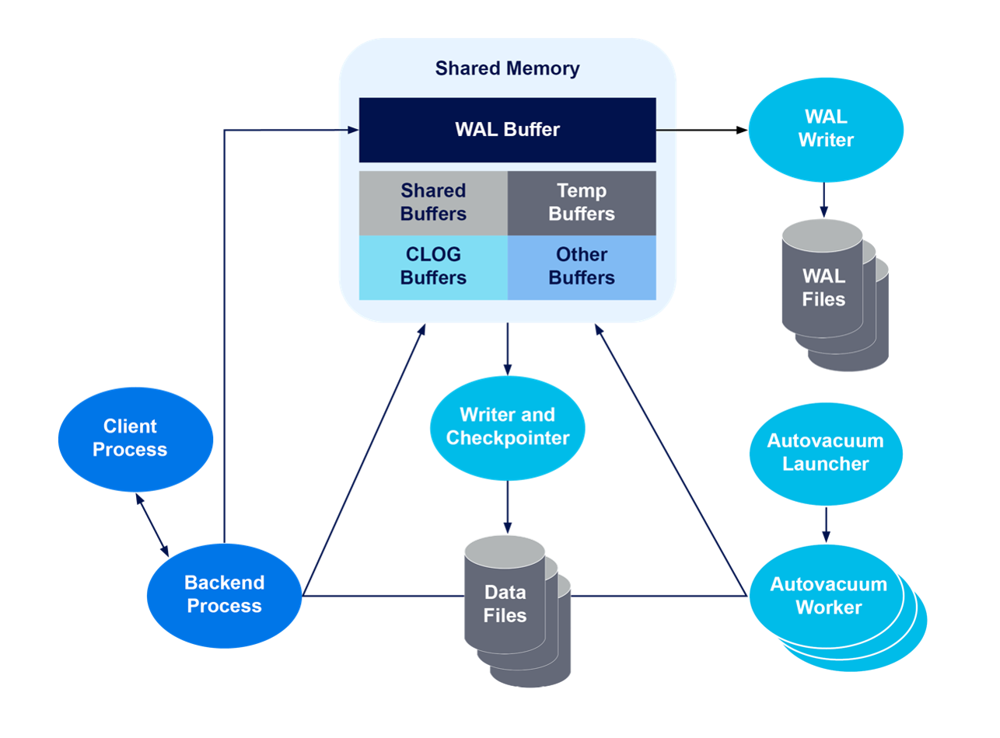
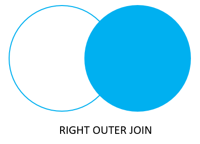
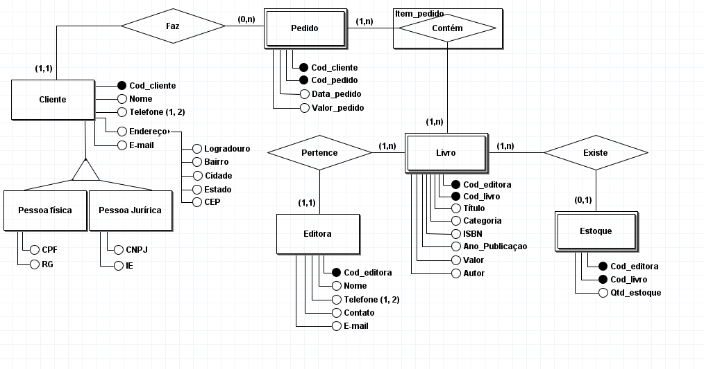
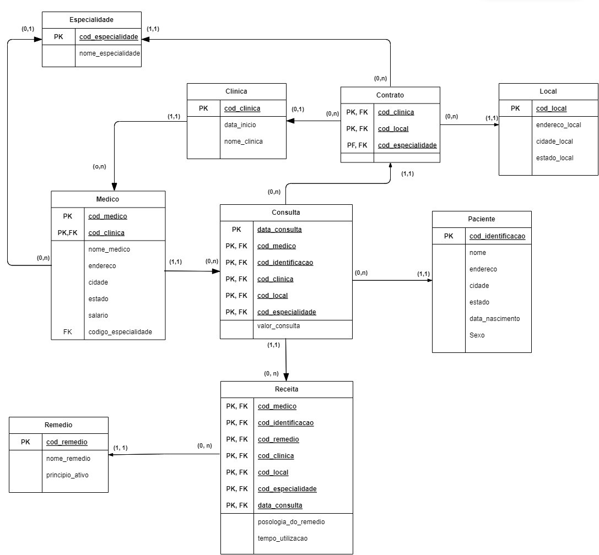
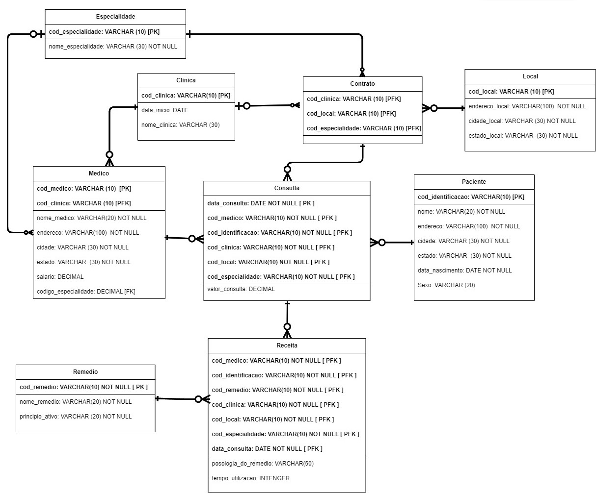
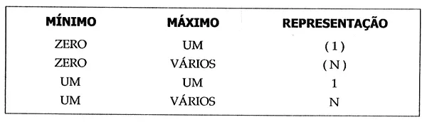
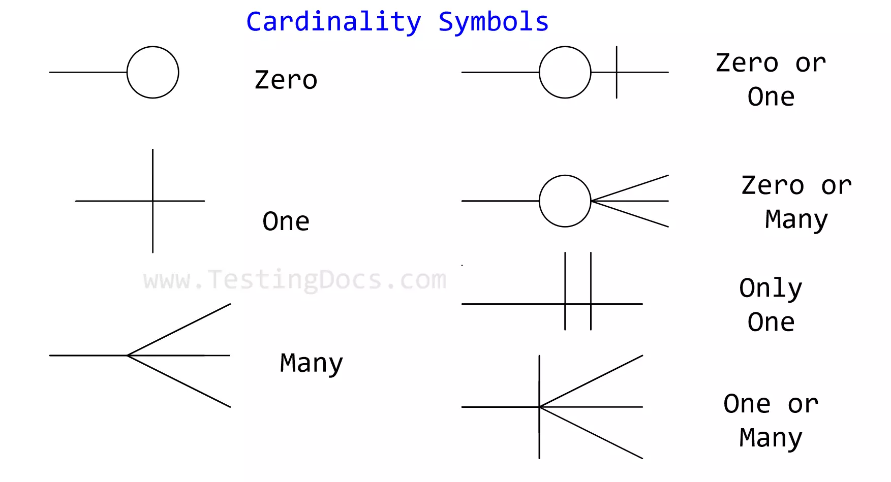
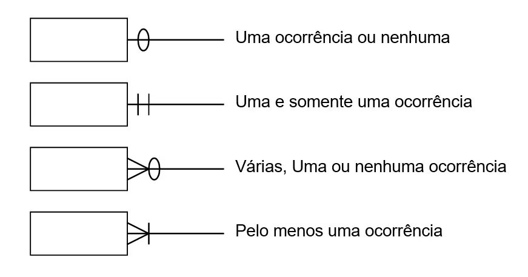

# PostgreSQL

- [PostgreSQL](#postgresql)
  - [Contextualizando](#contextualizando)
    - [Aplicações e Benefícios](#aplicações-e-benefícios)
  - [Arquitetura do PostgreSQL](#arquitetura-do-postgresql)
    - [Shared Memory](#shared-memory)
    - [Background Process](#background-process)
    - [Data Files/Data Directory Structure](#data-filesdata-directory-structure)
  - [Data Types](#data-types)
    - [Numérico](#numérico)
    - [Caracteres](#caracteres)
    - [Booleano](#booleano)
    - [Monetário](#monetário)
    - [Dados Binários](#dados-binários)
    - [Data/Tempo](#datatempo)
    - [Enumerados](#enumerados)
    - [Geométrico](#geométrico)
    - [Endereço Network](#endereço-network)
    - [Bit String](#bit-string)
    - [Text Search](#text-search)
    - [UUID](#uuid)
    - [XML](#xml)
    - [JSON](#json)
    - [Array](#array)
    - [Composite](#composite)
    - [Range](#range)
  - [Joins](#joins)
  - [Cascade](#cascade)
    - [Remoção em Cascata](#remoção-em-cascata)
    - [Atualização em Cascata](#atualização-em-cascata)
  - [Modelagem de Dados](#modelagem-de-dados)
    - [Tipos de Modelagem de Dados](#tipos-de-modelagem-de-dados)
    - [Tipos de Relacionamentos](#tipos-de-relacionamentos)
      - [Representações, Implementações e Exemplos](#representações-implementações-e-exemplos)

## Contextualizando

O PostgreSQL atua como sistema de gerenciamento de banco de dados objeto-relacional (ORDBMS); sendo seu foco a implementação de SQL em estruturas, garantindo um trabalho com os padrões desse tipo de ordenação dos dados.

Ele é um dos cinco SGBDs relacionais mais utilizados no mercado. Por ser de código aberto e gratuito, também é uma das primeiras escolhas de desenvolvedores no início da construção de um projeto.

Objetos, classes e sobrecarga de funções são suportados diretamente no PostgreSQL. É possível estender os tipos de dados para criar tipos de dados personalizados, devido às suas características orientadas a objetos. Isto garante alta flexibilidade para desenvolvedores que operam com modelos de dados complexos que requerem integração com banco de dados.

A herança de tabela é outra característica suportada pelo PostgreSQL devido às suas características orientadas a objetos. O child table pode herdar as colunas do parent table, além das outras colunas que a child table possui, tornando-a diferente de si mesma.

Uma das principais características do PostgreSQL é a sua capacidade de lidar com cargas de trabalho complexas e de grande escala. Dessa forma, suporta várias linguagens de programação e oferece recursos avançados, como suporte a transações ACID, replicação, particionamento e consultas geoespaciais.

As suas versões mais recentes incluem aprimoramentos na replicação, otimizações de consultas, suporte a JSON, recursos de análise avançada e melhorias na escalabilidade.

De modo geral, o PostgreSQL é um verdadeiro organizador de todas as informações, funcionando também como uma plataforma de rápido acesso para consultas e configurações.

**Recursos ↓**

- Point-In-Time Recovery

Permite que os desenvolvedores usem o PITR para restaurar bancos de dados para um momento específico no tempo ao executar iniciativas de recuperação de dados. Como o PostgreSQL mantém um log de gravação antecipada (WAL) o tempo todo, ele registra todas as alterações no banco de dados.

Isso facilita a restauração dos sistemas de arquivos para um ponto de partida estável. 

Ferramentas de terceiros facilitam e tornam isso mais confiável; a maioria dos serviços PostgreSQL gerenciados na nuvem cuidará disso automaticamente.

- Procedimentos Armazenados

Oferece suporte integrado a várias linguagens procedurais, dando aos desenvolvedores a capacidade de criar sub-rotinas personalizadas chamadas stored procedures. 

Esses procedimentos podem ser criados e chamados em um banco de dados específico. Com o uso de extensões, linguagens processuais também podem ser usadas para desenvolvimento em muitas outras linguagens de programação, incluindo Perl, Python, JavaScript e Ruby.

### Aplicações e Benefícios

**Principais Aplicações ↓**

- Desenvolvimento de aplicativos web e móveis 

Oferece suporte a uma ampla gama de linguagens e frameworks, tornando-se uma escolha popular.

- Sistemas de gerenciamento de conteúdo (CMS) 

Muitos CMS populares, como o Drupal e o WordPress, suportam o PostgreSQL como opção de banco de dados.

- Análise de dados 

Possui recursos avançados para consultas complexas e análise de dados, utilizado em projetos de business intelligence e data warehousing.

- Sistema de comércio eletrônico 

Uma escolha comum para armazenar dados de produtos, pedidos e informações de clientes em plataformas de comércio eletrônico.

- Aplicações de geolocalização 

Com recursos avançados de dados geoespaciais, é muito indicado em aplicativos que requerem recursos de localização, como serviços de mapeamento e rastreamento.

- OLTP e funções analíticas

É ótimo para gerenciar protocolos OLTP (Processamento de Transações Online). 

Como um banco de dados OLTP de propósito geral, o PostgreSQL atende bem a diversas situações, como comércio eletrônico, CRMs e registros financeiros. A conformidade com SQL e o otimizador de consultas do PostgreSQL também o tornam valioso para análises gerais de seus dados.

**Benefícios ↓**

Um de seus pontos principais é sua adequação em padrões de conformidade, ajudando a construir bancos de dados otimizados. Ele lida bem com altos volumes de solicitações e com cargas de trabalho grandes, ou seja, funciona muito bem para sites com intensidade de acesso, como e-commerces.

- Confiabilidade e conformidade de padrões

Oferece verdadeira semântica ACID para transações e tem total suporte para chaves estrangeiras, joinins, views, triggers e procedimentos armazenados, em muitas linguagens diferentes. 

Ele inclui a maioria dos tipos de dados SQL como INTEGER, VARCHAR, TIMESTAMP, e BOOLEAN. Também suporta o armazenamento de grandes objetos binários, incluindo imagens, vídeos ou sons. 

É confiável, pois tem uma grande rede de suporte integrada à comunidade. O PostgreSQL é um banco de dados tolerante a falhas graças ao seu registro write-ahead.

- Desempenho

Suporta uma variedade de otimizações de desempenho normalmente encontradas somente na tecnologia de banco de dados proprietário, como suporte geoespacial e concorrência irrestrita. 

Isso torna o PostgreSQL extremamente eficiente ao executar análises de dados profundas e extensas em vários tipos de dados. As operações de escrita nele podem ser realizadas simultaneamente sem a necessidade de cadeados de leitura/gravação. 

Os índices são usados para acelerar as consultas ao lidar com grandes quantidades de dados, o que permite aos bancos de dados encontrar uma linha específica sem a necessidade de percorrer todos os dados.

É possível até mesmo criar um índice de expressão, que funciona no resultado de uma expressão ou função em vez de apenas o valor de uma coluna. A indexação parcial também é suportada, na qual apenas uma parte da tabela é indexada. 

Ele também suporta a paralelização de consultas de leitura, compilação Just-in-time (JIT) de expressões e transações aninhadas (via savepoints) garantindo grande performance e eficiência.

- Escalabilidade

Suporta Unicode, conjuntos de caracteres internacionais, codificações de caracteres multi-byte, e é sensível ao local para ordenação, sensibilidade a maiúsculas e minúsculas, e formatação. 

O PostgreSQL é altamente escalável – no número de usuários simultâneos, ele pode acomodar assim como a quantidade de dados que ele pode gerenciar. Além disso, é multi-plataforma e pode rodar em muitos sistemas operacionais incluindo Linux, Microsoft Windows, OS X, FreeBSD, e Solaris.

- Suporte de linguagem profunda

É um dos bancos de dados mais flexíveis para desenvolvedores devido à sua compatibilidade e suporte a várias linguagens de programação. 

PL/PGSQL é uma linguagem procedural nativa fornecida pelo PostgreSQL que tem diferentes características modernas. Ele apoia o tipo de dados JSON que é leve e garante a flexibilidade incluída em um único pacote. 

Linguagens populares como Python, JavaScript, C/C++, Ruby, Java, Go e outros oferecem suporte maduro para PostgreSQL, permitindo que desenvolvedores executem tarefas de banco de dados em qualquer linguagem em que são proficientes sem gerar conflitos de sistema.

- Extensões

Possui vários conjuntos robustos de recursos, incluindo recuperação point-in-time, Controle de Concorrência Multi-Versão (MVCC), tablespaces, controles de acesso granulares, replicação assíncrona, um planejador/otimizador de consultas refinado e registro write-ahead. 

- Suporte de simultaneidade

Quando vários usuários acessam dados ao mesmo tempo, os sistemas de banco de dados tradicionais geralmente bloqueiam o acesso aos registros para evitar conflitos de leitura/gravação.

O PostgreSQL gerencia a concorrência de forma eficiente por meio do seu uso do MVCC (Multiversion Concurrency Control). Na prática, isso significa que as leituras não bloqueiam as escritas e as escritas não bloqueiam as leituras.

O Controle de Concorrência Multi-Versões permite a leitura e escrita simultânea de tabelas, bloqueando apenas atualizações simultâneas da mesma linha. Desta forma, os conflitos são evitados.

- Open Source

A implantação de tecnologia de gerenciamento de banco de dados de código aberto oferece benefícios exclusivos para empresas, incluindo custos melhores, maior flexibilidade e inovação nem sempre disponível com soluções de banco de dados proprietárias. 

Desenvolvido por um grupo diversificado de contribuidores, o PostgreSQL se baseia em uma sólida base de conhecimento, experiência e valores de código aberto.

- Capacidade de balanceamento de carga

Ele garante alta disponibilidade e balanceamento de carga através da operação do servidor standby, planejamento contínuo, preparação do primário para servidores standby, configuração de um servidor standby, streaming de replicação, slots de replicação, replicação em cascata, e arquivamento contínuo em standby.

Adicionalmente, o PostgreSQL suporta replicação síncrona, onde duas instâncias de banco de dados podem ser executadas ao mesmo tempo e o banco de dados mestre é sincronizado com um banco de dados escravo simultaneamente, garantindo ainda mais alta disponibilidade.

Pode ser configurado para garantir alta disponibilidade de serviços por meio de métodos de replicação assíncrona ou síncrona em vários servidores. Isso garante que os bancos de dados de produção estejam sempre disponíveis para clientes e desenvolvedores.

## Arquitetura do PostgreSQL

O seu servidor tem uma estrutura simples, consistindo de uma Memória Compartilhada, Processos de Background e uma estrutura de Diretório de Dados.

Inicialmente, uma solicitação é enviada pelo cliente para o servidor. Então, o servidor PostgreSQL processa os dados usando buffers compartilhados e processos em segundo plano. O arquivo físico do servidor de banco de dados do PostgreSQL é armazenado no diretório de dados.



### Shared Memory

A memória compartilhada é reservada para cache de log de transações e cache de banco de dados. Ela ainda tem elementos como Buffers Compartilhados, Buffers WAL, Memória de Trabalho e Memória de Trabalho de Manutenção.

- Shared Buffers

Estes buffers servem para minimizar o DISK IO do servidor. Para cumprir este objetivo, é justo definir o valor do buffer compartilhado como 25% da memória total se tiver um servidor dedicado para o PostgreSQL. 

O valor padrão dos buffers compartilhados a partir da versão 9.3 é de 128 MB. É imperativo tentar minimizar a contenção quando vários usuários o acessam simultaneamente. 

Blocos frequentemente utilizados devem ficar no buffer o máximo de tempo possível. Isto permite que ele acesse os dados o mais rápido possível.

- Buffers WAL

Armazenam temporariamente as mudanças no banco de dados. O arquivo WAL consiste de conteúdo escrito pelo buffer WAL em um ponto pré-determinado no tempo. 

Os arquivos WAL e os buffers WAL são significativos para recuperar os dados durante o backup e a recuperação.

- Work Mem

Este espaço de memória é usado para operações de bitmap, ordenação, fusão de junções e hash para gravar dados em arquivos temporários em disco. A configuração padrão a partir da versão 9.3 é de 4 MB.

- Maintenance Work Mem

Este slot de memória é usado para operações de banco de dados como ANALYZE, VACUUM, ALTER TABLE, e CREATE INDEX. A configuração padrão a partir da versão 9.4 é de 64 MB.

### Background Process

Cada processo de fundo é integral e executa uma função única para gerenciar o servidor. Alguns processos importantes de fundo são: checkpointer, background writer, writer wal, archiver e logger.

- Checkpointer

Quando ocorre um ponto de verificação, o dirty buffer é gravado no arquivo. O Checkpointer essencialmente grava todas as páginas sujas da memória para o disco e limpa a área de buffer compartilhada. 

Se o banco de dados falhar, a perda de dados pode ser medida obtendo a diferença entre o tempo do último ponto de verificação e o tempo de parada do PostgreSQL.

- Background Writer Process

Atualiza os logs e as informações de backup. Até a versão 9.1, este processo era integrado junto com o processo de checkpointer, que era feito regularmente Entretanto, a partir da versão 9.2, o processo de checkpointer foi separado do processo de escrita em segundo plano.

- Writer WAL

Este processo escreve e descarrega os dados WAL no buffer WAL periodicamente para o armazenamento persistente.

- Archiver

Se habilitado, este processo tem a responsabilidade de copiar os arquivos de log WAL para um diretório especificado.

- Logger/Logging Collector

Este processo escreve um buffer WAL para o arquivo WAL.

### Data Files/Data Directory Structure

O PostgreSQL possui vários bancos de dados que juntos formam um cluster de bancos de dados. Quando inicializados, os bancos de dados template0, template1 e Postgres são criados. A criação do novo banco de dados do usuário é feita através de bancos de dados modelo, que consistem nas tabelas do catálogo do sistema. 

Embora a lista de tabelas no template0 e template1 seja a mesma após a inicialização, somente o banco de dados template1 pode criar os objetos que o usuário precisa, portanto o banco de dados do usuário é criado através da clonagem do banco de dados template1.

Os dados necessários para o cluster são armazenados dentro do diretório de dados do cluster, que também é chamado de “PGDATA”. Ele consiste de vários subdiretórios. Alguns subdiretórios importantes são:

- Global
  - Consiste de tabelas em cluster, tais como o banco de dados de usuários.
- Base
  -  É a localização física do espaço de tabelas padrão. 
  -  Ele contém vários subdiretórios por banco de dados, dentro dos quais os catálogos do sistema são armazenados.
- PID
  - Consiste no atual ID do processo de pós-mestre (PID).
- PG_VERSION
  - Consiste na informação da versão do banco de dados.
- PG_NOTIFY
  - Contém os dados de status LISTEN/NOTIFY. 
  - Estes arquivos podem ser úteis para a solução de problemas.

## Data Types

O PostgreSQL possuí uma ampla gama de tipos de dados, e ainda permite que o desenvolvedor adicione novos tipos utilizando do comando `CREATE TYPE`.

> Referências: https://www.postgresql.org/docs/current/datatype.html

Os tipos de dados mais utilizados são: `integer`, `real`, `serial`, `numeric`, `varchar(n)`, `char(n)`, `text`, `boolean`, `date`, `time` e `timestamp`.

O PostgreSQL também permite a criação de tipos, como exemplo, a criação de um tipo como `enum`, `interval` ou `composite`.

```sql
CREATE TYPE type_name AS ENUM ('opt_one', 'opt-two', 'opt_three');
```

### Numérico

| Name               | Storage Size | Range                                                    |
| ------------------ | ------------ | -------------------------------------------------------- |
| `smallint`         | 2 bytes      | -32768 to +32767                                         |
| `integer`          | 4 bytes      | -2147483648 to +2147483647                               |
| `bigint`           | 8 bytes      | -9223372036854775808 to +9223372036854775807             |
| `decimal`          | variable     | 131072 digits before decimal; 16383 digits after decimal |
| `numeric`          | variable     | 131072 digits before decimal; 16383 digits after decimal |
| `real`             | 4 bytes      | 6 decimal digits precision                               |
| `double precision` | 8 bytes      | 15 decimal digits precision                              |
| `smallserial`      | 2 bytes      | 1 to 32767                                               |
| `seral`            | 4 bytes      | 1 to 2147483647                                          |
| `bigserial`        | 8 bytes      | 1 to 9223372036854775807                                 |

### Caracteres

| Name                               | Desc                                     |
| ---------------------------------- | ---------------------------------------- |
| `character varying(n), varchar(n)` | variable-length with limit               |
| `character(n), char(n), bpchar(n)` | fixed-length, blank-padded               |
| `bpchar`                           | variable unlimited length, blank-trimmed |
| `text`                             | variable unlimited length                |

### Booleano

| Name      | Storage Size | Values                                               |
| --------- | ------------ | ---------------------------------------------------- |
| `boolean` | 1 bytes      | true (TRUE, yes, on, 1) or false (FALSE, no, off, 0) |

### Monetário

| Name    | Storage Size | Desc            | Range                                          |
| ------- | ------------ | --------------- | ---------------------------------------------- |
| `money` | 8 bytes      | currency amount | -92233720368547758.08 to +92233720368547758.07 |

### Dados Binários

| Name    | Storage Size                               | Desc                          |
| ------- | ------------------------------------------ | ----------------------------- |
| `bytea` | 1 or 4 bytes plus the actual binary string | variable-length binary string |

### Data/Tempo

| Name                           | Storage  | Desc          | Low Value        | High Value      | Resolution    |
| ------------------------------ | -------- | ------------- | ---------------- | --------------- | ------------- |
| timestamp [(p)] [w/o timezone] | 8 bytes  | date and time | 4713 BC          | 294276 AD       | 1 microsecond |
| timestamp [(p)] w/timezone     | 8 bytes  | date and time | 4713 BC          | 294276 AD       | 1 microsecond |
| date                           | 4 bytes  | date          | 4713 BC          | 5874897 AD      | 1 day         |
| time [(p)] [ w/o timezone ]    | 8 bytes  | time of day   | 00:00:00         | 24:00:00        | 1 microsecond |
| time [(p)] w/ timezone         | 12 bytes | time of day   | 00:00:00+1559    | 24:00:00-1559   | 1 microsecond |
| interval [fields] [(p)]        | 16 bytes | time interval | -178000000 years | 178000000 years | 1 microsecond |

### Enumerados

Compreendem um tipo estático e ordenado de valores. São equivalentes aos tipos `enum` encontrados em diversas linguagens de programação. Exemplo de tipos enumerados podem ser: os dias da semana, ou status de um pedação dados.

Enumerados são case sensitive, e espaços em branco também importam para seu uso e comparações. Cada enumerado é separado e não pode ser comparado com outros tipos enumerados. Para fazer operações assim, é possível criar operadores customizados ou adicionar casts explicitas na query. 

Declaração e uso: 

```sql
CREATE TYPE mood as ENUM ('sad', 'ok', 'happy');
```

```sql
CREATE TYPE mood AS ENUM ('sad', 'ok', 'happy');
CREATE TABLE person (
    name text,
    current_mood mood
);
INSERT INTO person VALUES ('Moe', 'happy');
SELECT * FROM person WHERE current_mood = 'happy';
 name | current_mood
------+--------------
 Moe  | happy
(1 row)
```

A ordenação dos valores de um tipo enumerado é a order na qual estes valores foram listadas quando declarados. Todos os comparadores padrão e funções agregadas relacionadas são suportados para enums.

Ordenação:

```sql
INSERT INTO person VALUES ('Larry', 'sad');
INSERT INTO person VALUES ('Curly', 'ok');
SELECT * FROM person WHERE current_mood > 'sad';
 name  | current_mood
-------+--------------
 Moe   | happy
 Curly | ok
(2 rows)

SELECT * FROM person WHERE current_mood > 'sad' ORDER BY current_mood;
 name  | current_mood
-------+--------------
 Curly | ok
 Moe   | happy
(2 rows)

SELECT name
FROM person
WHERE current_mood = (SELECT MIN(current_mood) FROM person);
 name
-------
 Larry
(1 row)
```

### Geométrico

| Name      | Storage Size | Desc                | Representation    |
| --------- | ------------ | ------------------- | ----------------- |
| `point`   | 16 bytes     | point on a plane    | (x,y)             |
| `line`    | 32 bytes     | infinite line       | {A,B,C}           |
| `lseg`    | 32 bytes     | finite line segment | ((x1,y1),(x2,y2)) |
| `box`     | 32 bytes     | rectangular box     | ((x1,y1),(x2,y2)) |
| `path`    | 16+16n bytes | closed path         | ((x1,y1),...)     |
| `path`    | 16+16n bytes | open path           | [(x1,y1),...]     |
| `polygon` | 40+16n bytes | polygon             | ((x1,y1),...)     |
| `circle`  | 24 bytes     | circle              | <(x,y),r>         |

### Endereço Network

| Name       | Storage Size  | Desc                             |
| ---------- | ------------- | -------------------------------- |
| `cidr`     | 7 or 19 bytes | IPV4 and IPV6 networks           |
| `inet`     | 7 or 19 bytes | IPV4 and IPV6 hosts and networks |
| `macaddr`  | 6 bytes       | MAC addresses                    |
| `macaddr8` | 8 bytes       | MAC addresses (EUI-64 format)    |

### Bit String

São strings de 1 e 0. Podem ser usadas para armazenar ou visualizar máscaras bit. Existem 2 tipos: `bit(n)` e `bit varying(n)`, onde `n` é um inteiro positivo. 

No primeiro, o dado deve ter o tamanho exato ao n especificado; resultará em erro a tentativa de armazenar valor maior ou menor de comprimento do bit string. Já o segundo permite um tamanho variável, indo até o máximo especificado pelo n; strings maiores resultaram em erro.

Declarar um bit sem n é equivalente a `bit(1)`, enquanto bit variável sem n equivale a um comprimento ilimitado.

```sql
CREATE TABLE test (a BIT(3), b BIT VARYING(5));
INSERT INTO test VALUES (B'101', B'00');
INSERT INTO test VALUES (B'10', B'101');

ERROR:  bit string length 2 does not match type bit(3)

INSERT INTO test VALUES (B'10'::bit(3), B'101');
SELECT * FROM test;

  a  |  b
-----+-----
 101 | 00
 100 | 101
```

### Text Search

Este tipo inclui 2 tipos de dados que são designados a suportar uma procura completo de texto, a qual é a atividade de pesquisar uma coleção de documentos de linguagem natural para localizar os melhores matches de uma query.

O `tsvector` representa um documento em uma forma optimizada para pesquisa de texto; o `tsquery` similarmente representa uma query de texto.

```sql
SELECT 'a fat cat sat on a mat and ate a fat rat'::tsvector;
                      tsvector
----------------------------------------------------
 'a' 'and' 'ate' 'cat' 'fat' 'mat' 'on' 'rat' 'sat'

SELECT $$the lexeme 'Joe''s' contains a quote$$::tsvector;
                    tsvector
------------------------------------------------
 'Joe''s' 'a' 'contains' 'lexeme' 'quote' 'the'

SELECT 'a:1 fat:2 cat:3 sat:4 on:5 a:6 mat:7 and:8 ate:9 a:10 fat:11 rat:12'::tsvector;
                                  tsvector
-------------------------------------------------------------------​------------
 'a':1,6,10 'and':8 'ate':9 'cat':3 'fat':2,11 'mat':7 'on':5 'rat':12 'sat':4
```

```sql
SELECT 'fat & rat'::tsquery;
    tsquery
---------------
 'fat' & 'rat'

SELECT 'fat & (rat | cat)'::tsquery;
          tsquery
---------------------------
 'fat' & ( 'rat' | 'cat' )

SELECT 'fat & rat & ! cat'::tsquery;
        tsquery
------------------------
 'fat' & 'rat' & !'cat'


SELECT 'fat:ab & cat'::tsquery;
    tsquery
------------------
 'fat':AB & 'cat'
```

### UUID

Este tipo armazena Universally Unique Identifiers (UUID) como definidos pelo RFC 4122, ISO/IEC 9834-8:2005, e os padrões relacionados. O identificador é uma quantidade de 128 bits gerada por um algoritmo escolhido para que seja muito improvável que o mesmo identificador seja gerado por qualquer outro usuário do mesmo algoritmo; Portanto, para sistemas distribuídos, estes identificadores fornecem uma garantia de exclusividade melhor que geradores sequenciais, que são único apenas dentro de seu contexto.

É escrito como uma sequência de dígitos hexadecimais em minúsculas, em diversos grupos separados por hifens, especialmente um grupo de 8 dígitos seguido de 3 grupos de 4 díginos que é seguido de um grupo de 12 dígitos, dando um total de 32 dígitos representando os 128 bits.

```
a0eebc99-9c0b-4ef8-bb6d-6bb9bd380a11
```

Além do formato acima, o PostgreSQL aceita os seguintes formatos alternativos:

```
A0EEBC99-9C0B-4EF8-BB6D-6BB9BD380A11
{a0eebc99-9c0b-4ef8-bb6d-6bb9bd380a11}
a0eebc999c0b4ef8bb6d6bb9bd380a11
a0ee-bc99-9c0b-4ef8-bb6d-6bb9-bd38-0a11
{a0eebc99-9c0b4ef8-bb6d6bb9-bd380a11}
```

O output sempre será no formato padrão.

### XML

Pode ser usado para armazenar dados XML. Sua vantagem sobre armazenar este tipo de dado em um campo de texto é que verifica os valores de input para boa formatação, e há funções suportadas para executar operações type-safe nelas.

Usar este tipo de dado requere a instalação com a build `configure --with-libxml`.

O tipo `xml` armazena "documentos" bem formados, como definidos pelo padrão XML, tão como fragmentos de "conteúdo", que são definidos por referência para o mais permissível "documento node" dos modelos de dados XQuery a XPath. A grosso modo, isso significa que os fragmentos de conteúdo podem ter mais de um elemento de nível superior ou nó de caractere.

A expressão `xmlvalue IS DOCUMENT` pode ser usada para avaliar se o dado `xml` é um documento completo ou um fragmento de conteúdo.

```sql
XMLPARSE ( { DOCUMENT | CONTENT } value)
```

```sql
XMLPARSE (DOCUMENT '<?xml version="1.0"?><book><title>Manual</title><chapter>...</chapter></book>')
XMLPARSE (CONTENT 'abc<foo>bar</foo><bar>foo</bar>')

xml '<foo>bar</foo>'
'<foo>bar</foo>'::xml
```

### JSON

Dados em formato JSON podem até ser armazenados como `text`, mas o tipo de dado JSON tem a vantagem de forçar que cada valor armazenado seja válido de acordo com as regras do JSON. Há também funções específicas e operadores disponíveis para dados armazenados dessa maneira.

PostgreSQL oferece 2 maneiras para armazenar dados JSON: `json` e `jsonb`. Para implementar mecanismos de buscas eficientes para estes dados, também é oferecido o tipo `jsonpath`.

Os tipos `json` e `jsonb` aceitando sets de valores quase idênticos como input. A sua maio diferença prática é a eficiência. O primeiro armazena a cópia exata do texto de input, o qual funções de processamento deve fazer o parsing para cada execução; enquanto o segundo armazena em um formato binário decomposto que deixa o input mais lento devido a adição de conversão, mas é sinaficamente mais rápido no processamento, ele também suporta index.

O `json` preserva espaços insignificantes entre tokens, como também a ordem das keys dentro dos objetos. Outro ponto é, se um objeto possui a mesma key repetida mais de uma vez, todos os pares são mantidos - no processamento, somente é considerado o último par. Já o `jsonb` não preserva os espaços, nem a ordem das keys ou duplicatas (mantendo somente o último valor).

Em geral, a maioria das aplicações preferem o `jsonb`, a não ser que tenham necessidades especificas.

| JSON Primitive Type | PostgreSQL Type | Notes                                     |
| ------------------- | --------------- | ----------------------------------------- |
| `string`            | text            | \u0000 is disallowed, as are some Unicode |
| `number`            | numeric         | NaN and infinity values are disallowed    |
| `boolean`           | boolean         | only lowercase true and false             |
| `null`              | (none)          | SQL NULL is a different concept           |

```sql
-- Simple scalar/primitive value
-- Primitive values can be numbers, quoted strings, true, false, or null
SELECT '5'::json;

-- Array of zero or more elements (elements need not be of same type)
SELECT '[1, 2, "foo", null]'::json;

-- Object containing pairs of keys and values
-- Note that object keys must always be quoted strings
SELECT '{"bar": "baz", "balance": 7.77, "active": false}'::json;

-- Arrays and objects can be nested arbitrarily
SELECT '{"foo": [true, "bar"], "tags": {"a": 1, "b": null}}'::json;
```

```sql
SELECT '{"bar": "baz", "balance": 7.77, "active":false}'::json;
                      json
-------------------------------------------------
 {"bar": "baz", "balance": 7.77, "active":false}
(1 row)

SELECT '{"bar": "baz", "balance": 7.77, "active":false}'::jsonb;
                      jsonb
--------------------------------------------------
 {"bar": "baz", "active": false, "balance": 7.77}
(1 row)
```

### Array

Permite colunas de uma tabela a serem definidas como arrays multidimensionais e de comprimento variável. Arrays podem conter qualquer tipo base built-in ou user-defined, `enum`, `composite`, `range`, ou `domain`.

```sql
CREATE TABLE sal_emp (
    name            text,
    pay_by_quarter  integer[],
    schedule        text[][]
);
```

```sql
pay_by_quarter  integer ARRAY
```

### Composite

Representa uma estrutura de uma linha ou registro; essencialmente é lista de nomes campos e seus tipos de dados.

```sql
CREATE TYPE complex AS (
    r       double precision,
    i       double precision
);

CREATE TYPE inventory_item AS (
    name            text,
    supplier_id     integer,
    price           numeric
);

CREATE TABLE on_hand (
    item      inventory_item,
    count     integer
);

INSERT INTO on_hand VALUES (ROW('fuzzy dice', 42, 1.99), 1000);
```

### Range

Representam uma gama de valores de um tipo de elemento (chamado deo range's subtype). Ranges de `timestamp` podem ser usados para representar os intervalos de tempo em que uma sala de reunião está reservada; neste caso, o tipo é `tsrange` (timestamp range), e `timestamp` é o subtipo.

O subtipo deve ter uma ordem total para que seja bem definido se os valores dos elementos estão dentro, antes ou depois de uma range de valores.

Ranges são úteis porque eles representam muitos valores de elementos em um único valor range, e porque conceitos como overlapping ranges podem ser expressados de forma clara. Alguns exemplos são ranges de tempo e data para cronogramas, escalas de preço, e escalas de medidas. Toda a range tem uma multirange correspondente - uma lista ordenada de ranges não nulas, não vazias e não não contíguas. A maioria dos seus operadores também funcionam em multiranges, e elas têm algumas funções próprias.

| Range       | Subtype                | Multirange       |
| ----------- | ---------------------- | ---------------- |
| `int4range` | inter                  | `int4multirange` |
| `int8range` | bigint                 | `int8multirange` |
| `numrange`  | numeric                | `nummultirange`  |
| `tsrange`   | timestamp w/o timezone | `tsmultirange`   |
| `tstzrange` | timestamp w/ timezone  | `tstzmultirange` |
| `daterange` | date                   | `datemultirange` |

```sql
CREATE TABLE reservation (room int, during tsrange);
INSERT INTO reservation VALUES
    (1108, '[2010-01-01 14:30, 2010-01-01 15:30)');

-- Containment
SELECT int4range(10, 20) @> 3;

-- Overlaps
SELECT numrange(11.1, 22.2) && numrange(20.0, 30.0);

-- Extract the upper bound
SELECT upper(int8range(15, 25));

-- Compute the intersection
SELECT int4range(10, 20) * int4range(15, 25);

-- Is the range empty?
SELECT isempty(numrange(1, 5));
```

## Joins

Nada mais é do que uma query que traz resultados de 2 ou mais tabelas, ou várias instâncias da mesma tabela. Elas combinam linhas de uma tabela com linhas de uma segunda tabela, com uma expressão especificando quais linhas devem ser juntadas.

O PostgreSQL suporta os seguintes tipos de joins: `inner join`, `left join`, `right join`, `full outer join`, `cross join`, `natural join` e `self-join`.


Tabela de demonstração ↓

```sql
CREATE TABLE basket_a (
    a INT PRIMARY KEY,
    fruit_a VARCHAR (100) NOT NULL
);

CREATE TABLE basket_b (
    b INT PRIMARY KEY,
    fruit_b VARCHAR (100) NOT NULL
);

INSERT INTO basket_a (a, fruit_a)
VALUES
    (1, 'Apple'),
    (2, 'Orange'),
    (3, 'Banana'),
    (4, 'Cucumber');

INSERT INTO basket_b (b, fruit_b)
VALUES
    (1, 'Orange'),
    (2, 'Apple'),
    (3, 'Watermelon'),
    (4, 'Pear');
```

**Inner Join ↓**

Examina todas as linhas da primeira tabela, comparando os valores de sua coluna com os valores da coluna da segunda tabela. Se os valores forem iguais, o `inner join` cria uma junção que contêm estes valores; criando uma coluna para cada valor e tabela.

```sql
SELECT
    a,
    fruit_a,
    b,
    fruit_b
FROM
    basket_a
INNER JOIN basket_b
    ON fruit_a = fruit_b;
```

```
 a | fruit_a | b | fruit_b
---+---------+---+---------
 1 | Apple   | 2 | Apple
 2 | Orange  | 1 | Orange
(2 rows)
```

Ou seja, retorna registros que tenham valores compatíveis em ambas as tabelas.


**Left (Outer) Join ↓**

Em seu contexto, a primeira tabela é chamada de left table, e a segunda como right table. O `left join` começa selecionando dados da tabela esquerda, então os compara com o da tabela direita. Se os valores forem iguais, cria uma junção de ambas tabelas, porém, se não forem iguais, cria a junção e retorna `null` para o que falta na tabela direita.

```sql
SELECT
    a,
    fruit_a,
    b,
    fruit_b
FROM
    basket_a
LEFT JOIN basket_b 
   ON fruit_a = fruit_b;
```

```
 a | fruit_a  |  b   | fruit_b
---+----------+------+---------
 1 | Apple    |    2 | Apple
 2 | Orange   |    1 | Orange
 3 | Banana   | null | null
 4 | Cucumber | null | null
(4 rows)
```

Ou seja, retorna todos os registros da tabela a esquerda, e os registros compatíveis da tabela a direita.


**Right (Outer) Join ↓**

É a junção reversa do `left join`, ou seja, começa selecionando dados da tabela direita, então os compara com o da tabela esquerda. Se os valores forem iguais, cria uma junção de ambas tabelas, porém, se não forem iguais, cria a junção e retorna `null` para o que falta na tabela esquerda.

```sql
SELECT
    a,
    fruit_a,
    b,
    fruit_b
FROM
    basket_a
RIGHT JOIN basket_b ON fruit_a = fruit_b;
```

```
  a   | fruit_a | b |  fruit_b
------+---------+---+------------
    2 | Orange  | 1 | Orange
    1 | Apple   | 2 | Apple
 null | null    | 3 | Watermelon
 null | null    | 4 | Pear
(4 rows)
```

Ou seja, retorna todos os registros da tabela a direita, e os registros compatíveis da tabela a esquerda.



**Full (Outer) Join ↓**

Retorna todos os dados de ambas as tabelas, com os valores compatíveis alinhados (se existirem). No caso onde não há combinações, é retornado `null`.

```sql
SELECT
    a,
    fruit_a,
    b,
    fruit_b
FROM
    basket_a
FULL OUTER JOIN basket_b 
    ON fruit_a = fruit_b;
```

```
  a   | fruit_a  |  b   |  fruit_b
------+----------+------+------------
    1 | Apple    |    2 | Apple
    2 | Orange   |    1 | Orange
    3 | Banana   | null | null
    4 | Cucumber | null | null
 null | null     |    3 | Watermelon
 null | null     |    4 | Pear
(6 rows)
```


## Cascade

O objetivo de uma chave estrangeira é interligar uma ou mais colunas, garantindo que seus dados tenham integridade referencial. Ou seja, alterações nos dados da coluna original, podem (e, em muitos casos, devem) afetar coluna que o referencia.

A coluna que recebe essa referência também está restrita na alteração, inserção e remoção de dados, pois deve somente refletir os dados da coluna original.

Analogia do usuário `ypercube™` sobre as funcionalidades em cascata e os relacionamentos entre tabelas:

> If you like the Parent and Child terms and you feel they are easy to be remembered, you may like the translation of ON DELETE CASCADE to Leave No Orphans!
> 
> Which means that when a Parent row is deleted (killed), no orphan row should stay alive in the Child table. All children of the parent row are killed (deleted), too. If any of these children has grandchildren (in another table through another foreign key) and there is ON DELETE CASCADE defined, these should be killed, too (and all descendants, as long as there is a cascade effect defined.)
>
> The FOREIGN KEY constraint itself could also be described as Allow No Orphans! (in the first place). No Child should ever be allowed (written) in the child table if it hasn't a Parent (a row in the parent table).
>
> For consistency, the ON DELETE RESTRICT can be translated to the (less aggressive) You Can't Kill Parents! Only childless rows can be killed (deleted.)

Comentário adicional do usuário `Christopher McGowan` sobre a analogia:
 
> The parent analogy can still work if we don't say "orphan". If there are two references to two separate parents on a child entry, this can still be seen as a child of a divorced couple. Restrict: "I won't let you kill my mom" Cascade: "If you kill my dad, I will also die"

### Remoção em Cascata

O `delete cascade` é uma funcionalidade que permite que dados na coluda filha também serão excluídos caso o dado seja deletado na tabela original. Para usá-lo, é preciso adicionar como comando opcional na criação/definição de uma chave estrangeira.

```sql
CREATE TABLE tbl_name (
  col_name DATATYPE CONSTRAINT,
  col_name DATATYPE REFERENCE tbl_name (col_name) ON DELETE CASCADE;
);
```

```sql
CREATE TABLE customer_details (
cust_id INTEGER PRIMARY KEY,
cust_name TEXT NOT NULL
);

CREATE TABLE order_details(
order_id INTEGER PRIMARY KEY,
customer_id INTEGER REFERENCES customer_details (cust_id) ON DELETE CASCADE,
order_date DATE
);
```

Essa ação referencial é, geralmente, vista como uma ferramenta útil para a manutenção da integridade da base de dados, mas, em certos casos, pode afetar a performance da base (caso hajam muitas linhas na tabela, ou seja uma tabela grande) ou ocasionar perda de dados por remoções acidentais.

As constraints `set null` e `set default` podem ser usadas como alternativa caso ocorram problemas de performance.

### Atualização em Cascata

Similar a ação referencial anterior, o `update cascade` garante que os dados alterados na coluna original, também serão alterados na coluna filha.

```sql
CREATE TABLE tbl_name (
  col_name DATATYPE CONSTRAINT,
  col_name DATATYPE REFERENCE tbl_name (col_name) ON UPDATE CASCADE;
);
```

## Modelagem de Dados

Envolve a criação de modelos conceituais, lógicos e físicos que descrevem como os dados estão relacionados entre si e como são armazenados e acessados dentro de um sistema. A sua importância é inegável para proporcionar uma base sólida para a construção de sistemas eficazes e confiáveis. 

Quando se compreende e representa adequadamente a estrutura e fluxo dos dados, é possível projetar sistemas que atendam às necessidades específicas da organização, garantindo a integridade, consistência e qualidade dos dados.

Seus objetivos principais são:

- **Precisão de Dados**

Busca garantir que os dados armazenados em um sistema sejam precisos e livres de erros. Isso envolve a definição clara e precisa dos tipos de dados, formatos e restrições aplicáveis a cada campo.

- **Integridade de Dados**

Os dados devem ser consistentes e confiáveis em todo o sistema, sem contradições ou inconsistências que possam comprometer sua utilidade ou confiabilidade. Isso é fundamental para assegurar a integridade dos dados.

- **Consistência de Dados**

É crucial para garantir que diferentes partes de um sistema de informação interpretem e usem os dados de maneira uniforme e coerente. Padrões e convenções são estabelecidos para garantir essa consistência em toda a organização.

### Tipos de Modelagem de Dados

Pode ser dividida em diferentes tipos, cada um com seu próprio conjunto de características e objetivos. Os principais tipos de modelagem de dados são:

- **Modelagem Conceitual**

Concentra-se na representação abstrata e independente de implementação dos dados. Nesta fase, os principais elementos são entidades, atributos e os relacionamentos entre elas.

O objetivo é capturar os requisitos e conceitos do negócio de uma forma compreensível para os usuários finais e os stakeholders. É comumente representada por meio de diagramas como o Diagrama de Entidade-Relacionamento (DER) ou Modelagem de Objetos.



- **Modelagem Lógica**

Traduz a modelagem conceitual em uma estrutura mais detalhada e específica, mas ainda independente de plataforma. Neste estágio, são definidos as chaves primárias, chaves estrangeiras e outras restrições.

O objetivo é criar um modelo que seja próximo o suficiente da implementação para guiar o desenvolvimento do banco de dados, mas ainda abstrato o bastante para ser independente de tecnologia.

É comumente representada por meio de diagramas como o Modelo de Dados Relacional.



- **Modelagem Física**

É o estágio final onde o modelo é implementado em um sistema de gerenciamento de banco de dados específico. Neste momento, são definidos os tipos dos dados e detalhes como a organização física dos dados, índices, particionamento e outros aspectos de desempenho são considerados.

O objetivo é otimizar o modelo para a plataforma específica e garantir um desempenho eficiente do banco de dados.

É representada através de scripts de criação de banco de dados específicos para o sistema de gerenciamento de banco de dados escolhido.



Cada tipo de modelagem de dados desempenha um papel crucial em diferentes estágios do ciclo de vida do desenvolvimento de banco de dados.

A modelagem conceitual estabelece os requisitos do negócio, a modelagem lógica traduz esses requisitos em uma estrutura de dados compreensível e a modelagem física finaliza a implementação detalhada no ambiente de banco de dados específico.

### Tipos de Relacionamentos

A cardinalidade é um conceito fundamental na modelagem de dados, pois tem a função de descrever a quantidade mínima e máxima de relacionamentos. Por exemplo, quantos alunos estão matriculados em uma turma, ou quantas turmas um aluno está matriculado.

Os tipos de cardinalidade definem restrições precisas nessas relações numéricas, especificando matematicamente as associações permitidas entre ocorrências de entidades. Existem quatro tipos principais de cardinalidade que podem existir entre duas entidades em um modelo de dados: Um-para-Um (1:1), Um-para-Muitos (1:N), Muitos-para-Muitos (N:M) e Zero-ou-Um-para-Muitos (0..1:N).



O parêntesis representa a cardinalidade mínima zero, e a ausência deste, a cardinalidade mínima um. Para indicar o valor máximo UM, usamos o número 1, e o valor máximo VÁRIOS a letra N.



Cada tipo de relacionamento tem exemplos e casos de uso específicos, além de implicações na modelagem da database. Determinar o tipo correto de cardinalidade com base nas regras de negócio é crucial para a representação precisa de um modelo de dados.

Exclusividade e opcionalidade são fatores-chave na determinação do tipo de cardinalidade adequado para um relacionamento. A composição de entidades e a existência de associações múltiplas também influenciam a escolha da cardinalidade.

Validar o entendimento das regras de negócio por meio de especialistas do domínio e exemplos reais de dados é essencial para determinar a cardinalidade correta.



#### Representações, Implementações e Exemplos

- **Um para Um 1:1**

Um relacionamento 1:1 significa que cada instância de uma entidade se relaciona com no máximo uma única instância de outra entidade, e vice-versa. Um exemplo bastante comum dessa cardinalidade é Pessoa → CPF, onde cada pessoa possui somente um CPF associado a ela, e cada CPF pertence exclusivamente a uma pessoa.

Os relacionamentos 1:1 garantem que cada instância de entidade tenha no máximo uma associação correspondente, capturando relações exclusivas de ‘um-para-um’ entre os dados.

Relacionamentos 1:1 são os mais simples de implementar, usando chaves estrangeiras para associar as tabelas pai e filho.

- **Uma para Muitos 1:N**

Um relacionamento 1:N significa que cada instância de uma entidade se relaciona com muitas instâncias de outra entidade, mas não é mútuo, ou seja, não funciona de forma vice-versa. Por exemplo, a cardinalidade entre Curso → Aulas, onde um curso é composto por várias aulas, mas cada aula pertence somente a um curso.

Outras relações comuns são Livro → Páginas, Carrinho → Compras e Categoria → Itens. Em todos esses casos, uma entidade está no “lado de um” da relação, enquanto muitas instâncias relacionadas estão no “lado de muitos”.

Esse tipo de relacionamento é comum para representar composições e outros relacionamentos hierárquicos nos dados.

Relacionamentos 1:N também usam chaves estrangeiras para associar as tabelas pai e filho.

- **Muitos para Muitos N:M**

Um relacionamento N:M significa que muitas instâncias de ambas as entidades se relacionam umas com as outras. Por exemplos, as relações Alunos → Cursos, onde qualquer aluno pode estar inscrito em qualquer curso, e cursos têm muitos alunos. 

Outros exemplos são Atores → Filmes, Jogadores → Times, Passageiros → Voos. Em todos esses casos, muitas instâncias de ambas as entidades estão todas relacionadas.

Devido à natureza complexa dos relacionamentos N:M, eles geralmente são implementados no banco de dados usando uma tabela de associação separada para armazenar todas as associações entre pares de instâncias.

Essa tabela armazena todas as associações entre pares de instâncias das entidades relacionadas.

- **Zero ou Um para Muitos 0..1:N**

Um relacionamento 0..1:N significa que uma instância de uma entidade pode se relacionar com nenhuma ou no máximo uma única instância da outra entidade, mas cada instância dessa outra pode se relacionar com muitas da primeira. Por exemplo, a cardinalidade entre Funcionário → Gerentes em uma empresa, onde um funcionário pode não ter um gerente ou pode ter exatamente um gerente, mas cada gerente tem muitos funcionários.

Esse tipo de relacionamento é útil para representar situações em que uma entidade pode ou não ter uma associação com outra entidade.

Relacionamentos 0..1:N são implementados adicionando uma coluna opcional na tabela ‘filho’ para armazenar uma chave estrangeira da tabela ‘pai’.