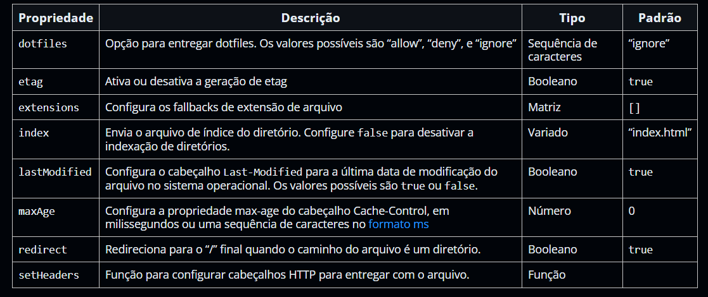

# Express

- [Express](#express)
  - [Roteamento](#roteamento)
    - [Métodos de Roteamento](#métodos-de-roteamento)
    - [Caminhos](#caminhos)
    - [Parâmetros de Rota](#parâmetros-de-rota)
    - [Manipulação de Rota](#manipulação-de-rota)
    - [Métodos de Resposta](#métodos-de-resposta)
    - [app.route() e express.Router](#approute-e-expressrouter)
  - [Middlewares](#middlewares)
    - [Nível do Aplicativo](#nível-do-aplicativo)
    - [Nível de Roteador](#nível-de-roteador)
    - [De Manipulação de Erro](#de-manipulação-de-erro)
    - [Integrado](#integrado)
    - [De Terceiros](#de-terceiros)
  - [Template Engine](#template-engine)
  - [Manipulação de Erros](#manipulação-de-erros)
    - [Manipulador de Erros Padrão](#manipulador-de-erros-padrão)
  - [Depuração](#depuração)
  - [Proxy](#proxy)


> https://expressjs.com/pt-br/

## Roteamento

Refere-se a como os endpoints de uma aplicação (URIs) respondem às requisições do cliente; à determinação de como um aplicativo responde a uma solicitação do cliente por um endpoint específico, que é uma URI (ou caminho) e um método de solicitação HTTP específico (`GET`, `POST`, e assim por diante).

Cada rota pode ter uma ou múltiplas funções de manipulação, que são executadas quanto a rota é correspondida.

```js
app.METHOD(PATH, HANDLER);
```

```
app.method(path, callback [, callback ...])
```

Onde:
  - `app` é uma instância do express
  - `METHOD` é um método de solicitação HTTP
    - `get`
    - `post`
    - `put`
    - `delete`
  - `PATH` é um caminho no servidor
    - `'/'`
    - `'/user'`
    - `'/landing'`
  - `HANDLER` é a função executada quando a rota é correspondida
    - `(req, res)`

Esses métodos de roteamento especificam uma função callback a ser chamada quando a aplicação recebe uma requisição à rota e método HTTP especificados. Em outras palavras, a aplicação “escuta” requisições que se encaixam nas rotas e métodos especificados e, quando há alguma correspondência, chama a função callback especificada.

Na realidade, métodos de roteamento podem possuir mais de uma função callback como argumento. Com múltiplas funções, é importante passar `next` como argumento da função e chamar `next()` para passar o controle para a próxima.

```js
const express = require('express');
const app = express();
const port = 3000;

app.get('/', (req, res) => {
  res.send('Hello World!');
});

app.listen(port, () => {
  console.log(`Example app listening on port ${port}`);
});
```

```sh
node app.js
```

### Métodos de Roteamento

Um método de roteamento é derivado a partir de um dos métodos HTTP, e é anexado a uma instância da classe `express`, sendo suportados métodos correspondentes a todos os métodos de requisição HTTP.

|              |            |               |
| ------------ | ---------- | ------------- |
| `checkout`   | `mkcol`    | `purge`       |
| `copy`       | `move`     | `´put`        |
| `delete`     | `m-search` | `report`      |
| `get`        | `notify`   | `search`      |
| `head`       | `options`  | `subscribe`   |
| `lock`       | `patch`    | `trace`       |
| `merge`      | `post`     | `unlock`      |
| `mkactivity` |            | `unsubscribe` |

Existem também um método de roteamento especial, `all`, este não é derivado de nenhum método HTTP. Ele é usado para carregar funções de middleware em um caminho para todos os métodos de solicitação.

```js
app.all(path, callback [, callback ...]);
```

```js
app.all('/secret', (req, res, next) => {
  console.log('Accessing the secret section ...')
  next() // pass control to the next handler
})
```

O método `app.all()` é útil para mapear a lógica "global" para prefixos de caminho específicos ou correspondências arbitrárias. Por exemplo, exigir que todas as rotas do ponto em diante exijam autenticação e carreguem automaticamente um usuário. Lembre-se de que esses retornos de chamada não precisam atuar como pontos finais: `loadUser` pode executar uma tarefa e, em seguida, chamar `next()` para continuar combinando rotas subsequentes.

```js
app.all('*', requireAuthentication, loadUser)
```

```js
app.all('*', requireAuthentication)
app.all('*', loadUser)
```

Outro exemplo é a funcionalidade "global" na lista de permissões. O exemplo é semelhante aos anteriores, mas restringe apenas os caminhos que começam com "/api":

```js
app.all('/api/*', requireAuthentication)
```

### Caminhos

Caminhos de rota, em combinação com os métodos de solicitação, definem os terminais em que as solicitações podem ser feitas. Caminhos de rota podem ser sequências de caracteres, padrões de sequência, ou expressões regulares.

O Express usa o `path-to-regexp` para verificar a correspondência de caminhos de rota; O Express Route Tester é uma ferramenta útil para testar rotas básicas do Express, apesar de não suportar a correspondência de padrões. Os caracteres `?`, `+`, `*`, e `()` são subconjuntos de suas contrapartes em expressões regulares. O hífen (-) e o ponto (.) são interpretados literalmente por caminhos baseados em sequências de caracteres.

Sequências de consulta não fazem parte dos caminhos de rota.

```js
app.get('/', (req, res) => {
  res.send('root')
});

app.get('/random.text', (req, res) => {
  res.send('random.text')
});

app.get('/ab?cd', (req, res) => {
  res.send('ab?cd') // acd and abcd
});

app.get('/ab+cd', (req, res) => {
  res.send('ab+cd') //  abcd, abbcd, abbbcd, and so on
});

app.get('/ab*cd', (req, res) => {
  res.send('ab*cd') // abcd, abxcd, abRANDOMcd, ab123cd, and so on
});

app.get('/ab(cd)?e', (req, res) => {
  res.send('ab(cd)?e') // /abe and /abcde
});

app.get(/a/, (req, res) => {
  res.send('/a/') // anything with an 'a' in it
});

app.get(/.*fly$/, (req, res) => {
  res.send('/.*fly$/') // butterfly and dragonfly, but not butterflyman, dragonflyman, and so on
})
```

Além disso, é importante pontuar que o Express trabalha com precedência de rota, ou seja, as rotas são chamadas em sequência. Isso significa que é necessário adicionar essas rotas em uma ordem de complexidade, da maior para a menor.

### Parâmetros de Rota

São segmentos nomeados do URL que são usados para capturar os valores especificados em sua posição no URL. Os valores capturados são preenchidos no objeto `req.params`, com o nome do parâmetro de rota especificado no caminho como suas respectivas chaves.

```
Route path: /users/:userId/books/:bookId
Request URL: http://localhost:3000/users/34/books/8989
req.params: { "userId": "34", "bookId": "8989" }
```

Para definir rotas com parâmetros, é necessário somente especificar os seus parâmetros no caminho da rota:

```js
app.get('/users/:userId/books/:bookId', (req, res) => {
  res.send(req.params)
})
```

O nome dos parâmetros de rota deve ser composto de "caracteres de palavra" ([A-Za-z0-9_]). Como o hífen (-) e o ponto (.) são interpretados literalmente, eles podem ser usados junto com os parâmetros de rota para fins úteis. Para ter mais controle sobre a cadeia de caracteres exata que pode ser correspondida por um parâmetro de rota, é possível acrescentar uma expressão regular entre parênteses (()):

```
Route path: /flights/:from-:to
Request URL: http://localhost:3000/flights/LAX-SFO
req.params: { "from": "LAX", "to": "SFO" }
```

```
Route path: /plantae/:genus.:species
Request URL: http://localhost:3000/plantae/Prunus.persica
req.params: { "genus": "Prunus", "species": "persica" }
```

```
Route path: /user/:userId(\d+)
Request URL: http://localhost:3000/user/42
req.params: {"userId": "42"}
```

### Manipulação de Rota

É possível fornecer várias funções callback que se comportam como middleware para manipular uma solicitação. A única exceção é que estes callbacks podem chamar `next('route')` para efetuar um bypass nos callbacks restantes. É possível usar este mecanismo para impor pré-condições em uma rota, e em seguida passar o controle para rotas subsequentes se não houveram razões para continuar com a rota atual.

Manipuladores de rota podem estar na forma de uma função, uma matriz de funções, ou combinações de ambas, como mostrado nos seguintes exemplos.

Uma única função callback pode manipular uma rota:

```js
app.get('/example/a', (req, res) => {
  res.send('Hello from A!')
});
```

Mais de uma função callback pode manipular uma rota (certificando de especificar o objeto `next`):

```js
app.get('/example/b', (req, res, next) => {
  console.log('the response will be sent by the next function ...')
  next()
}, (req, res) => {
  res.send('Hello from B!')
})
```

Uma matriz de funções callback podem manipular uma rota:

```js
const cb0 = function (req, res, next) {
  console.log('CB0')
  next()
}

const cb1 = function (req, res, next) {
  console.log('CB1')
  next()
}

const cb2 = function (req, res) {
  res.send('Hello from C!')
}

app.get('/example/c', [cb0, cb1, cb2])
```

Uma combinação de funções independentes e matrizes de funções podem manipular uma rota:

```js
const cb0 = function (req, res, next) {
  console.log('CB0')
  next()
}

const cb1 = function (req, res, next) {
  console.log('CB1')
  next()
}

app.get('/example/d', [cb0, cb1], (req, res, next) => {
  console.log('the response will be sent by the next function ...')
  next()
}, (req, res) => {
  res.send('Hello from D!')
})
```

### Métodos de Resposta

Os métodos do objeto de resposta podem enviar uma resposta ao cliente, e finalizar o ciclo solicitação-resposta. Se nenhum destes métodos forem chamados a partir de um manipulador de rota, a solicitação do cliente será deixada em suspenso.

| Method             | Desc                                                                                 |
| ------------------ | ------------------------------------------------------------------------------------ |
| `res.download()`   | Prompt a file to be downloaded                                                       |
| `res.end()`        | End the response process                                                             |
| `res.json()`       | Send a JSON response                                                                 |
| `res.jsonp()`      | Send a JSON response with JSONP support                                              |
| `res.redirect()`   | Redirect a request                                                                   |
| `res.render()`     | Render a view template                                                               |
| `res.send()`       | Send a response of various types                                                     |
| `res.sendFile()`   | Send a file as an octet stream                                                       |
| `res.sendStatus()` | Set the response status code and send its string representation as the response body |

### app.route() e express.Router

**app.route() ↓**

É possível criar manipuladores de rota encadeáveis para um caminho usando o `route`. Como o caminho é especificado em uma localização única, criar rotas modulares é útil, já que reduz redundâncias e erros tipográficos.

```js
app.route('/book')
  .get((req, res) => {
    res.send('Get a random book')
  })
  .post((req, res) => {
    res.send('Add a book')
  })
  .put((req, res) => {
    res.send('Update the book')
  })
```

**express.Router ↓**

A classe `express.Router` pode ser usada para criar manipuladores de rota modulares e montáveis. Uma instância de `Router` é um middleware e sistema de roteamento completo; por essa razão, ela é frequentemente referida como um “mini-aplicativo”.

O `router` se comporta como um próprio middleware, então é possível o usar como argumento para `app.use()` ou como argumento de método `use` de outro `router`.

O seguinte exemplo cria um roteador como um módulo, carrega uma função de middleware nele, define algumas rotas, e monta o módulo router em um caminho no aplicativo principal.

```js
const express = require('express')
const router = express.Router()

// middleware that is specific to this router
const timeLog = (req, res, next) => {
  console.log('Time: ', Date.now())
  next()
}
router.use(timeLog)

// define the home page route
router.get('/', (req, res) => {
  res.send('Birds home page')
})
// define the about route
router.get('/about', (req, res) => {
  res.send('About birds')
})

module.exports = router
```

```js
const birds = require('./birds')

// ...

app.use('/birds', birds)
```

O aplicativo será agora capaz de manipular solicitações aos caminhos `/birds` e `/birds/help`, assim como chamar a função de middleware `timeLog` que é específica para a rota.

Assim, é possível usar o `router` para uma URL específica, então separando as rotas em arquivos ou mini-apps.

## Middlewares

São funções que tem que tem acesso ao objeto de solicitação (req), o objeto de resposta (res), e a próxima função de middleware no ciclo solicitação-resposta do aplicativo. A próxima função middleware é comumente denotada por uma variável chamada `next`.

```js
(req, res, next) {}
```

Funções de middleware podem executar as seguintes tarefas:

- Executar qualquer código
- Fazer mudanças nos objetos de solicitação e resposta
- Encerrar o ciclo de solicitação-resposta
- Chamar o próximo middleware na pilha

Se a atual função de middleware não terminar o ciclo de solicitação-resposta, ela precisa chamar `next()` para passar o controle para a próxima função de middleware. Caso contrário, a solicitação ficará suspensa.

Um aplicativo Express pode usar os seguintes tipos de middleware:

- Middleware de nível do aplicativo
- Middleware de nível de roteador
- Middleware de manipulação de erros
- Middleware integrado
- Middleware de Terceiros

É possível carregar middlewares de nível de roteador e de nível do aplicativo com um caminho de montagem opcional. É possível também carregar uma série de funções de middleware juntas, o que cria uma sub-pilha do sistema de middleware em um ponto de montagem.

O exemplo a seguir mostra os elementos de uma chamada de função de middleware:


1. O método HTTP para o qual a função de middleware é aplicada.
   1. `get`
2. Caminho (rota) para o qual a função de middleware é aplicada.
   1. `'/'`
3. A função de middleware.
   1. `function`
4. Argumento de solicitação HTTP para a função de middleware, chamado de "req" por convenção.
   1. `req`
5. Argumento de resposta HTTP para a função de middleware, chamado de "res" por convenção.
   1. `res`
6. Argumento de retorno de chamada para a função de middleware, chamado de "next" por convenção.
   1. `next`

```js
var express = require('express');
var app = express();

app.get('/', function (req, res) {
  res.send('Hello World!');
});

app.listen(3000);
```

A função `next()` não faz parte do Node.js ou da API Express, mas é o terceiro argumento que é passado para a função de middleware. A função `next()` poderia ter qualquer nome, mas por convenção ela é sempre chamada de “next”. Para evitar confusão, sempre use esta convenção.

```js
var express = require('express');
var app = express();

var requestTime = function (req, res, next) {
  req.requestTime = Date.now();
  next();
};

app.use(requestTime);

app.get('/', function (req, res) {
  var responseText = 'Hello World!';
  responseText += 'Requested at: ' + req.requestTime + '';
  res.send(responseText);
});

app.listen(3000);
```

A ordem de carregamento do middleware é importante: funções de middleware que são carregadas primeiro também são executadas primeiro. Se um middleware enviar uma resposta para o cliente, o fluxo da requisição encerra nessa resposta, e quaisquer middlewares registrados depois desse não serão executados. Afinal, apenas uma resposta pode ser enviada para cada requisição.

Dentro de um middleware, se a função `next` não for executada e nem enviar uma resposta para o cliente, a requisição ficará em processamento até ser encerrada por causa do longo tempo de espera de resposta do servidor. 

Pensando no modelo MVC, controladores também são considerados middlewares do Express. Eles são o tipo mais convencional de middleware, que recebem até três parâmetros. Na verdade, a própria documentação diz que uma aplicação Express é essencialmente composta pela execução de várias funções middlewares em resposta às requisições.

### Nível do Aplicativo 

É possível vincular middlewares de nível de aplicativo a uma instância do objeto app usando as funções `app.use()` e `app.METHOD()`, onde METHOD é o método HTTP da solicitação que a função manipula.

```js
var app = express();

app.use(function (req, res, next) {
  console.log('Time:', Date.now());
  next();
});
```

```js
app.use('/user/:id', function (req, res, next) {
  console.log('Request Type:', req.method);
  next();
});
```

Manipuladores de rota permitem definir várias rotas para um caminho. O exemplo abaixo define duas rotas para solicitações `GET` no caminho `/user/:id`. A segunda rota não irá causar nenhum problema, mas ela nunca será chamada pois a primeira rota termina o ciclo solicitação-resposta.

```js
app.get('/user/:id', function (req, res, next) {
  console.log('ID:', req.params.id);
  next();
}, function (req, res, next) {
  res.send('User Info');
});

// handler for the /user/:id path, which prints the user ID
app.get('/user/:id', function (req, res, next) {
  res.end(req.params.id);
});
```

Para pular o restante das funções de middleware de uma pilha de middlewares do roteador, se chama `next('route')` para passar o controle para a próxima rota. NOTA: O `next('route')` irá funcionar apenas em funções de middleware que são carregadas usando as funções `app.METHOD()` ou `router.METHOD()`.

```js
app.get('/user/:id', function (req, res, next) {
  // if the user ID is 0, skip to the next route
  if (req.params.id == 0) next('route');
  // otherwise pass the control to the next middleware function in this stack
  else next(); //
}, function (req, res, next) {
  // render a regular page
  res.render('regular');
});

// handler for the /user/:id path, which renders a special page
app.get('/user/:id', function (req, res, next) {
  res.render('special');
});
```

### Nível de Roteador

Middlewares de nível de roteador funcionam da mesma forma que os middlewares de nível do aplicativo, mas estão vinculados a uma instância do `express.Router()`.

```js
var router = express.Router();
```

Eles são carregados usando as funções `router.use()` e `router.METHOD()`.

```js
var app = express();
var router = express.Router();

// a middleware function with no mount path. This code is executed for every request to the router
router.use(function (req, res, next) {
  console.log('Time:', Date.now());
  next();
});

// a middleware sub-stack shows request info for any type of HTTP request to the /user/:id path
router.use('/user/:id', function(req, res, next) {
  console.log('Request URL:', req.originalUrl);
  next();
}, function (req, res, next) {
  console.log('Request Type:', req.method);
  next();
});

// a middleware sub-stack that handles GET requests to the /user/:id path
router.get('/user/:id', function (req, res, next) {
  // if the user ID is 0, skip to the next router
  if (req.params.id == 0) next('route');
  // otherwise pass control to the next middleware function in this stack
  else next(); //
}, function (req, res, next) {
  // render a regular page
  res.render('regular');
});

// handler for the /user/:id path, which renders a special page
router.get('/user/:id', function (req, res, next) {
  console.log(req.params.id);
  res.render('special');
});

// mount the router on the app
app.use('/', router);
```

### De Manipulação de Erro

Middlewares de manipulação de erros sempre levam quatro argumentos; se deve fornecer os quatro argumentos para identificá-lo como uma função de middleware de manipulação de erros. Mesmo se não precisar usar o objeto `next`, é preciso especificá-lo para manter a assinatura. Caso contrário, o objeto `next` será interpretado como um middleware comum e a manipulação de erros falhará.

Defina funções de middleware de manipulação de erros da mesma forma que outras funções de middleware, exceto que com quatro argumentos ao invés de três, especificamente com a assinatura `(err, req, res, next))`:

```js
app.use(function(err, req, res, next) {
  console.error(err.stack);
  res.status(500).send('Something broke!');
});
```

### Integrado

Desde a versão 4.x, o Express não depende mais do `Connect`. Com exceção da `express.static`, todas as funções de middleware que eram previamente incluídas com o Express estão agora em módulos separados.

Funções built-in:

- `express.static` serves static assets such as HTML files, images, and so on
- `express.json` parses incoming requests with JSON payloads. NOTE: Available with Express 4.16.0+
- `express.urlencoded` parses incoming requests with URL-encoded payloads. NOTE: Available with Express 4.16.0+

```js
express.static(root, [options])
```
A única função de middleware integrada no Express é a` express.static`; ela é baseada no serve-static, e é responsável por entregar os ativos estáticos de um aplicativo do Express. O argumento root especifica o diretório raiz a partir do qual entregar os ativos estáticos.

O objeto opcional options pode ter as seguintes propriedades:



```js
var options = {
  dotfiles: 'ignore',
  etag: false,
  extensions: ['htm', 'html'],
  index: false,
  maxAge: '1d',
  redirect: false,
  setHeaders: function (res, path, stat) {
    res.set('x-timestamp', Date.now());
  }
}

app.use(express.static('public', options));
```

É possível ter mais de um diretório estático por aplicativo:

```js
app.use(express.static('public'));
app.use(express.static('uploads'));
app.use(express.static('files'));
```

### De Terceiros

Use-sa middlewares de terceiros para incluir funcionalidades aos aplicativos do Express. Instale o módulo Node.js para a funcionalidade requerida, em seguida carregue-a no seu aplicativo no nível do aplicativo ou no nível de roteador.

O exemplo a seguir ilustra a instalação e carregamento da função de middleware para análise sintática de cookies cookie-parser.

```sh
npm install cookie-parser
```

```js
var express = require('express');
var app = express();
var cookieParser = require('cookie-parser');

// load the cookie-parsing middleware
app.use(cookieParser());
```

## Template Engine

Possibilitam usar templates de arquivos estáticos na aplicação. Em tempo de execução, a engine de template substitui variáveis em um arquivo de templete com valores reais, e então transforma a template em um arquivo HTML que é enviado ao cliente. Essa abordagem facilita o design de uma página HTML.

Algumas das engines de template mais populares que trabalham com o Express são Pug, Mustache e EJS. O gerador de aplicativos Express usa o Jade como padrão, mas também oferece suporte a vários outros.

Nota: Jade foi renomeado para Pug; é possível continuar usando Jade no app, vai funcionar normalmente, mas para ter acesso aos updates mais recentes, é preciso substituir pelo Pug.

Para renderizar arquivos template é preciso setar view nas propriedades de configuração da aplicação.

```js
app.set('views', './views');

app.set('view engine', 'pug');
```

```sh
$ npm install pug --save
```

Como exemplo, arquivo template Pug nomeado `index.pug` no diretório views com o seguinte conteúdo:

```pug
html
  head
    title= title
  body
    h1= message
```

E então criar uma rota para renderizar o arquivo `index.pug`. Quando uma requisição for feita para a página inicial, este arquivo será renderizado como HTML. Se a propriedade view engine não estiver configurada, é preciso especificar a extensão do arquivo view. Caso contrário, é possível omiti-la.

```js
app.get('/', (req, res) => {
  res.render('index', { title: 'Hey', message: 'Hello there!' })
})
```

Observação: o cache do mecanismo de exibição não armazena em cache o conteúdo da saída do modelo, apenas o próprio modelo subjacente. A exibição ainda é renderizada novamente com cada solicitação, mesmo quando o cache está ativado.

## Manipulação de Erros

Voltando ao assunto, são como outros middlewares, só que sempre devem apresentar 4 parâmetros.

```js
app.use(function(err, req, res, next) {
  console.error(err.stack);
  res.status(500).send('Something broke!');
});
```

Essas funções de manipulação de erros devem sempre ser definidas por último, após outros `app.use()` e chamadas de rotas.

```js
var bodyParser = require('body-parser');
var methodOverride = require('method-override');

app.use(bodyParser());
app.use(methodOverride());
app.use(function(err, req, res, next) {
  // logic
});
```

Repostas de dentro de uma função de middleware podem estar em qualquer formato que preferir, como uma página HTML de erros, uma mensagem simples, ou uma sequência de caracteres JSON.

Para propósitos organizacionais (e estrutura de alto nível), é possível definir várias funções de middleware de manipulação de erros, de forma muito parecida com funções de middleware comuns. Por exemplo, se desejar definir um manipulador de erros para solicitações feitas usando o XHR, e aqueles sem, pode-se usar os seguintes comandos:

```js
var bodyParser = require('body-parser');
var methodOverride = require('method-override');

app.use(bodyParser());
app.use(methodOverride());
app.use(logErrors);
app.use(clientErrorHandler);
app.use(errorHandler);
```

```js
function logErrors(err, req, res, next) {
  console.error(err.stack);
  next(err);
}
```

```js
function clientErrorHandler(err, req, res, next) {
  if (req.xhr) {
    res.status(500).send({ error: 'Something failed!' });
  } else {
    next(err);
  }
}
```

```js
function errorHandler(err, req, res, next) {
  res.status(500);
  res.render('error', { error: err });
}
```

Se passar qualquer coisa para a função `next()` (exceto a sequência de caracteres 'route'), o Express considera a solicitação atual como estando em erro e irá ignorar quaisquer funções restantes de roteamento e middleware que não sejam de manipulação de erros. Se desejar manipular este erro de alguma forma, terá que criar uma rota de manipulação de erros na próxima seção.

Se tiver um manipulador de rota com as funções de retorno de chamada é possível usar o parâmetro `route` para ignorar o próximo manipulador de rota. Por exemplo:

```js
app.get('/a_route_behind_paywall',
  function checkIfPaidSubscriber(req, res, next) {
    if(!req.user.hasPaid) {

      // continue handling this request
      next('route');
    }
  }, function getPaidContent(req, res, next) {
    PaidContent.find(function(err, doc) {
      if(err) return next(err);
      res.json(doc);
    });
  });
```

Neste exemplo, o manipulador `getPaidContent` será ignorado mas qualquer manipulador remanescente no app para `/a_route_behind_paywall` continuariam sendo executados. Chamadas para `next()` e` next(err)` indicam que o manipulador atual está completo e em qual estado. O `next(err)` irá ignorar todos os manipuladores remanescentes na cadeia exceto por aqueles que estão configurados para manipular erros como descrito acima.

### Manipulador de Erros Padrão

O Express vem com um manipulador de erros integrado, que cuida de qualquer erro que possa ser encontrado no aplicativo. Essa função de middleware de manipulação de erros padrão é incluída no final da pilha de funções de middleware.

se passar um erro para o `next()` e não manipulá-lo com um manipulador de erros, ele irá ser manipulado por um manipulador de erros integrado; o erro será escrito no cliente com o rastreio de pilha. 

O rastreio de pilha não será incluído no ambiente de produção. Configura-se a variável de ambiente `NODE_ENV` para production, para executar o aplicativo em modo de produção.

Quando o erro é escrito, as seguintes informações são adicionadas a resposta:

- O `res.statusCode` é setado do `err.status` (ou `err.statusCode`)
  - Se o valor for fora do range 4xx ou 5xx,, será setado para 500
- O res.statusMessage é setado de acordo com o código de status
- O corpo será o HTML da mensagem do código de status quando em um ambiente de produção, se não será `err.stack` 
- Qualquer cabeçalho especificado em um objeto `err.headers`

Se o `next()` for chamado com um erro após ter inicializado escrevendo a resposta (por exemplo, se encontrar um erro enquanto passa a resposta ao cliente) o manipulador de erros padrão do Express fecha a conexão e falha a solicitação.

Portanto ao incluir um manipulador de erro customizado, é desejável delegar para o mecanismo de manipulação de erros padrão no Express, quando os cabeçalhos já tiverem sido enviados para o cliente:

```js
function errorHandler(err, req, res, next) {
  if (res.headersSent) {
    return next(err);
  }
  res.status(500);
  res.render('error', { error: err });
}
```

## Depuração

> https://expressjs.com/en/guide/debugging.html

## Proxy

Ao executar um aplicativo do Express atrás de um proxy, algumas das APIs do Express podem retornar valores diferentes do esperado. Em ordem para ajustar isso, a configuração `trust` proxy deve ser setada para expor informações fornecidas pelo proxy reverso nas APIs Express. 

O problema mais comum é que as APIs express que expõem o endereço IP do cliente podem, em vez disso, mostrar um endereço IP interno do proxy reverso.

Ao definir a configuração do proxy de confiança, é importante entender a configuração exata do proxy reverso. Como essa configuração confiará nos valores fornecidos na solicitação, é importante que a combinação da configuração no Express corresponda à forma como o proxy reverso opera.


A habilitação do proxy de confiança terá o seguinte impacto: 

- O valor de `req.hostname` é derivado do valor definido no cabeçalho `X-Forwarded-Host`, que pode ser definido pelo cliente ou pelo proxy
- `X-Forwarded-Proto` pode ser definido pelo proxy reverso para informar ao aplicativo se é HTTPS ou HTTP ou até mesmo um nome inválido. Esse valor é refletido por `req.protocol`
- Os valores `req.ip` e `req.ips` são preenchidos com base no endereço do soquete e no cabeçalho `X-Forwarded-For`, começando no primeiro endereço não confiável. A configuração de proxy de confiança é implementada usando o pacote `proxy-addr`