# Desenvolvimento WEB: HTML e CSS

- [Desenvolvimento WEB: HTML e CSS](#desenvolvimento-web-html-e-css)
  - [HTML](#html)
    - [Ids e Classes](#ids-e-classes)
    - [Textos](#textos)
    - [Separação de Conteúdo e Tags Descritivas](#separação-de-conteúdo-e-tags-descritivas)
    - [Outros Elementos Importantes](#outros-elementos-importantes)
    - [Data-attributes](#data-attributes)
  - [CSS](#css)
    - [Box Model](#box-model)
      - [Box Sizing](#box-sizing)
      - [Exemplo Visual](#exemplo-visual)
    - [Cores](#cores)
    - [Variáveis](#variáveis)
    - [Responsividade](#responsividade)
      - [Unidades de Medidas](#unidades-de-medidas)
      - [Media Queries](#media-queries)
    - [Display](#display)
    - [Reset e Normalize](#reset-e-normalize)
      - [Reset](#reset)
      - [Normalize](#normalize)

## HTML 

Hypertext Markup Language é uma linguagem de marcação usada na estruturação de páginas web. Sua sintaxe é simples e baseada em elementos representados em tags.

A extensão `.html` diz ao sistema que o arquivo é uma página web.

**Sintaxe ↓**

Segue a estrutura `elemento → [atributo → valor] → conteúdo`, e as tags podem ser pares (com abertura e fechamento) ou únicas (self-closing). Os atributos controlam e especificam o comportamento de um elemento. Eles aparecem dentro da tag de abertura do elemento.

Os atributos e seus valores são opcionais, nem sempre é necessário adiciona-los a um elemento.

```html
<tag atrr=[value]>visible text</tag>
```

```html
<tag atrr=[value] />
```

Um documento html propriamente formatado começa com `<!DOCTYPE html>` e segue: `<html> → <head> → </head> → <body> → </body> → </html>`.

```html
<!DOCTYPE html> <!-- tells the browser that's a html file using the most recent version of the language -->
<html lang="en">
<head> <!-- what the browser sees -->
    <meta charset="UTF-8"> <!-- characters set -->
    <meta name="viewport" content="width=device-width, initial-scale=1.0"> 
    <title>Document</title>

    <link rel="stylesheet" href="style.css"> <!-- page styles -->
</head>
<body> <!-- what the user sees -->
    
    <!-- page content -->

    <script src=""></script> <!-- page scripts -->
</body>
</html>
```

**Comentários ↓**

```html
<!-- comment -->
```

### Ids e Classes

Os atributos `id` e `class` são utilizados para identificar um ou mais elementos e estiliza-los com CSS ou modifica-los com Javascript com mais facilidade.

Múltiplos elementos podem ter a mesma classe, e um elemento pode ter mais de uma classe, já o id deve ser sempre único. O id também tem maior prioridade que uma classe.

```html
<tag id="id-name" class="class-name [class-name...]" />
```

### Textos

**Títulos ↓**

```html
<h1>Title 1</h1> <!-- most important, should be only one for page -->
<h2>Title 2</h2> 
<h3>Title 3</h3>
<h4>Title 4</h4>
<h5>Title 5</h5>
<h6>Title 6</h6> <!-- least important -->
```

**Texto ↓**

```html
    <p> Paragraph </p>
    <br> <!-- line break -->
    <hr> <!-- paragraph section break -->
    <blockquote> Citation </blockquote> <!-- indicates that text include is a long citation -->
    <strong> <!-- important text --></strong>
```

**Lists ↓**

```html
<ol> <!-- organized list --> </ol>
<ul> <!-- unorganized list --> </ul>
<li> <!-- list itens --> </li>
```

### Separação de Conteúdo e Tags Descritivas

Podem ser usadas para melhorar a leitura do código e ajudar com o SEO e acessibilidade.

```html
<main> <!-- main page content --> </main>
<nav> <!-- navigation section --> </nav>
<header> <!-- header section --> </header>
<aside> <!-- content that aside from the main content --> </aside>
<footer> <!-- section footer --> </footer>
<section> <!-- generic section --> </section>
<div> <!-- generic block container --> </div>
<span> <!-- generic inline container --> </span>
```

### Outros Elementos Importantes

**Mais Comuns ↓**

```html
<a href="http://" target="_blank" rel="noopener noreferrer"> <!-- link content --> </a>

<input type=""> <!-- interactive elements -->
<label for=""> <!-- input label --> </label>
<button> <!-- interactive button --> </button>
<form action=""> <!-- form element --> </form>
<select> <!-- control menu with options --> </select>
<option value=""> <!-- option item in select, optgroup or datalist --> </option>
<canvas></canvas>
```

### Data-attributes

É utilizado para guardar dados privados personalizados para a página ou aplicativo; dá a capacidade de incorporar dados personalizados para qualquer elemento HTML. Os dados guardados podem ser manipulados através do CSS, para estilizar o elemento, e JavaScript, para criar uma experiência de usuário mais engajada.

Não deve ser atribuído em dados visíveis, pois tecnologias de acessibilidade podem não identificar seus valores. Dados personalizados com o prefixo `data-` serão completamente ignorados por agentes de usuário.

Sua estrutura é dividida em:

- Primeira parte é o identificador deste dado, que consiste em `data-` + o nome de sua escolha que melhor identifica o tipo de dado a ser atribuído
- Segunda parte é o valor atribuído à este dado, o valor deve sempre estar entre aspas "" e dessa maneira é lido como `string`

```html
<h1>Paint list:</h1>
<ul id="list">
  <li
    data-color="orange"
    data-type="exterior-paint"
    onclick="changeColors(this)"
    class="item"
  >
    Orange paint
  </li>
  <li
    data-color="white"
    data-type="interior-paint"
    onclick="changeColors(this)"
    class="item"
  >
    White paint
  </li>
  <li
    data-color="pink"
    data-type="exterior-paint"
    onclick="changeColors(this)"
    class="item"
  >
    Pink paint
  </li>
</ul>

<script>
  function changeColors(elements) {
    var colors = elements.getAttribute("data-color");
    var elementType = elements.getAttribute("data-type");
  }
</script>
```

O prefixo `data-` não é obrigatório para definir um `data-attribute`, pode-se alterar o código para a seguinte forma:

```html
<h1>Paint list:</h1>
<ul id="list">
  <li
    cor="orange"
    tipo="exterior-paint"
    onclick="changeColors(this)"
    class="item"
  >
    Orange paint
  </li>
  <li cor="white" tipo="interior-paint" onclick="changeColors(this)" class="item">
    White paint
  </li>
  <li cor="pink" tipo="exterior-paint" onclick="changeColors(this)" class="item">
    Pink paint
  </li>
</ul>

<script>
  function changeColors(elements) {
    var colors = elements.getAttribute("color");
    var elementType = elements.getAttribute("type");
  }
</script>
```

## CSS

Cascading Style Sheets é uma linguagem de estilização usada para estilizar as páginas web.

A extensão `.css` diz ao sistema que o arquivo é uma folha de estilos.

**Sintaxe ↓**

Segue a estrutura `seletor → propriedade → valor`.

```css
selector {
	property: value;
}
```

Seletores:

```css
tags
[attr='value']
#id
.class
* /* universal selector */
```

Há 3 formas de se usar o CSS: CSS inline, tag `<style>` ou linkando um arquivo externo de CSS no documento HTML.

```html
<!-- Inline -->
<tag style="property: value; [property: value; ...]"> Content </tag>

<!-- Style tag -->
<style>
  selector {
    property: value;
  }
</style>

<!-- external css link -->
<head>
    <link rel="stylesheet" href="style.css" />
</head>
```

Como o HTML processa o documento de cima para baixo, o link mais acima é executado primeiro, e o mais abaixo por último. Por este motivo, se há conflito entre estilos, o último será aplicado.

É interessante também aproveitar da funcionalidade de imports dentro do CSS. Como cada linha é executada em sequência, uma por vez, quanto mais arquivos externos linkados, maior o tempo de processamento e maior a chance de erros. 

Ter um arquivo externo CSS com imports dos outros é solução para este dilema. Assim, no HTML, uma folha de estilo é executada e com ela, todas as outras que estão como import.

O mesmo vale para outras estilizações que não são necessariamente arquivos CSS, como fontes.

```css
@import url('/src/styles/style.css');
```

CSS segue um estilo de código em cascata, isso é, estiliza do modo mais abrangente até um item especificado, partindo do geral — elemento pai — para o único — elemento filho.

```css
body { /* define the color black to all the text inside the body element */
	color: black;
} 

p { /* define the color red to all the p element */
	color: red;
}

em strong { /* define the color blue to the strong element inside the em element  */
	color: blue;
}
```

Caso haja conflitos entre estilos, o CSS lê de cima para baixo, o que significa que o último estilo (o mais abaixo e de mesma prioridade) será aplicado.

```css
body {
    color: black;
}

/* ... */

body { /* this one will be applied */
    color: blue;
}
```

Um mesmo estilo pode ser aplicado para mais de um seletor por agrupamento dos mesmos, sendo eles separados por vírgula. Um elemento dentro de outro pode ser selecionado por nesting, separando os seletores por espaço.

Por fim, pseudo-seletores são usados para selecionar elementos que estão ou tem um estado específico, como a ação de um usuário ou posição. É uma identidade separada por ponto e vírgula.

```css
selector1, selector2 {
  property: value;
}

selector element-inside element-nested {
	property: value;
}

selector:pseudo-class {
	property: value;
}
```

**Combinadores ↓**

```css
main > p {} /* all p elements that're a direct child of main */

img + p {} /* first p element sibling to img */

img ~ p {} /* every p element sibling to img */

main p:not(.blue) {} /* all p elements inside main, besides the one with the blue class */

main p {} /* all descendants p elements of main */
```

**Comentários ↓**

```css
/* comments */ 
```

**Sistema de Herança e Ordem de Prioridade ↓**

```
!important → [inline style → style element → css external file] → id → class → tag → inherence → bottom → top
```

**Compatibilidade ↓**

Trabalhando com CSS, é comum bater com alguns problemas de compatibilidade de estilos entre diferente browsers. Por isso é importante sempre prover fallbacks para evitar problemas potenciais.

Quando o navegador analisa o CSS da página, ignora qualquer propriedade que não reconhece ou não tem suporte.

```css
.red-box {
  background: red;
  background: var(--red-color);
  height: 200px;
  width:200px;
}
```

Prover um fallback é simples, pode só usar uma propriedade compatível acima da declaração que pode não ser reconhecida. O navegador antigo vai ter um valor para usar, enquanto os outros só vão interpretar compatível a declaração que vier por último.

### Box Model

Usado para representar o design e layout dentro de CSS, o box model é essencialmente uma caixa que envolve todo elemento HTML. Consiste em: conteúdo, preenchimento, borda e margem.

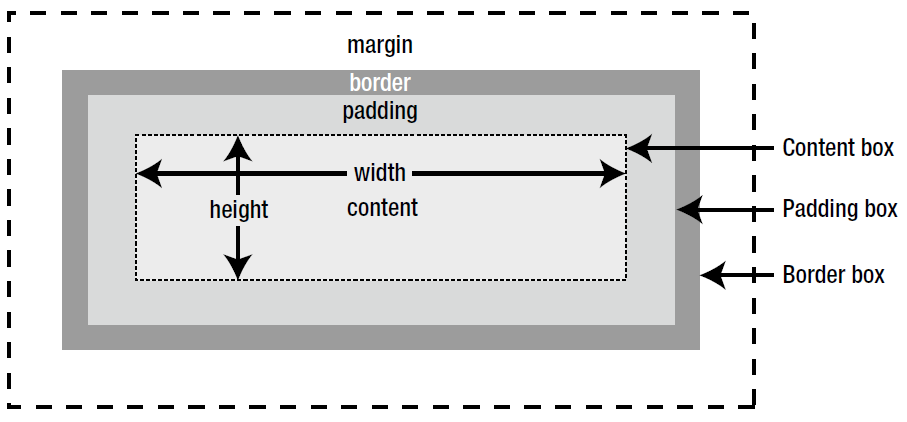

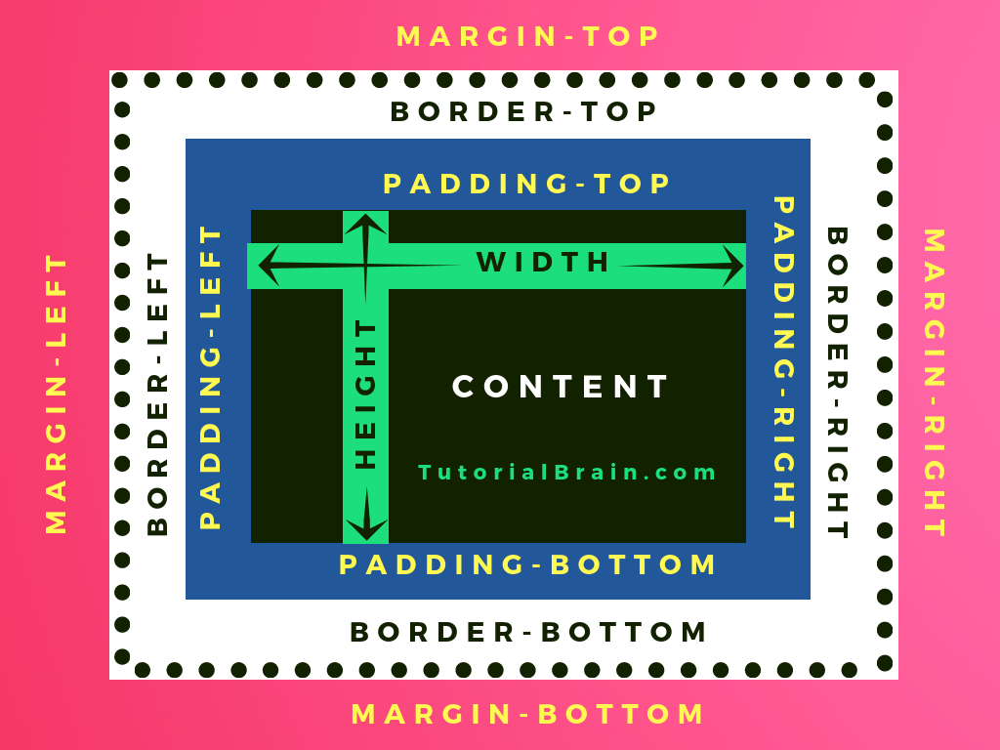

**Conteúdo ↓**

O elemento em si, no box model seu espaço ocupado é definido pelos seus valores de altura e largura.

```css
main {
  width: 500px;
  height: 350px;
}
```

**Preenchimento ↓**

É a área de preenchimento entre o conteúdo e a borda. Funciona como a extensão do conteúdo.

O preenchimento é transparente.

Pode ser controlado por 4 propriedades separadas, uma para cada lado de preenchimento, ou por uma propriedade shorthand. A ordem segue o sentido horário: cima, direita, baixo, esquerda.

```css
main {
  padding-top: 50px;
  padding-right: 30px;
  padding-bottom: 50px;
  padding-left: 80px;
}

div { /* top | right | bottom | left */
  padding: 50px 30px 50px 80px;
}

section { /* top | right/left | bottom */
  padding: 75px 64px 15px;
}

p { /* top/bottom | right/left */
  padding: 10px 25px;
}

img { /* all sides have the same value */
  padding: 90px;
}
```

**Borda ↓**

É a borda que envolve o preenchimento e conteúdo, age como uma barreira entre ambos e a margem. A área de borda estende a área de preenchimento para a área que contém as bordas. Ela é visível e pode ser estilizada.

```css
p {
  border: 5px solid red;
}
```

**Margem ↓**

Controla o espaço entre a borda do elemento e os elementos envolta. A área de margem estende a área de borda com um espaço vazio utilizado para separar o elemento dos elementos vizinhos. É transparente.

Pode ser controlado por 4 propriedades separadas, uma para cada lado de preenchimento, ou por uma propriedade shorthand. A ordem segue o sentido horário: cima, direita, baixo, esquerda.

```css
main {
  margin-top: 100px;
  margin-right: 150px;
  margin-bottom: 100px;
  margin-left: 80px;
}

div { /* top | right | bottom | left */
  margin: 100px 150px 100px 80px;
}

section { /* top | right/left | bottom */
  margin: 75px 64px 15px;
}

p { /* top/bottom | right/left */
  margin: 10px 25px;
}

img { /* all sides have the same value */
  margin: 90px;
}
```

É possível também usar margens negativas, tendo então o efeito contrário: aumentando a borda e diminuindo espaço entre outros elementos.

```css
main {
  margin: -20px;
}
```

#### Box Sizing

Embora sejam somente preenchimento e borda, e só o `width` e `height` trabalhem diretamente com o tamanho do elemento, o `padding` e `border` podem sim afetar a largura e altura total do elemento.

Isso acontecem porque o CSS automaticamente faz o seguinte cálculo:

```
Total element width = width + left padding + right padding + left border + right border

Total element height = height + top padding + bottom padding + top border + bottom border
```

```
  320px (width of content area)
+ 20px (left padding + right padding)
+ 10px (left border + right border)
= 350px (total width)

  50px (height of content area)
+ 20px (top padding + bottom padding)
+ 10px (top border + bottom border)
= 80px (total height)
```

> A margem também afeta o espaço total em que a caixa vai ocupar, mas não é incluído no cálculo do tamanho total dela. Seu tamanho total para largura e altura para na borda. 


A propriedade `box-sizing` resolve esse problema, pois permite definir se preenchimentos e bordas vão ou não ser levados em consideração ao calcular a largura e altura de um elemento.

```css
.div1 {
  width: 300px;
  height: 100px;
  border: 1px solid blue;
  box-sizing: border-box;
}

.div2 {
  width: 300px;
  height: 100px;
  padding: 50px;
  border: 1px solid red;
  box-sizing: border-box;
}
```

#### Exemplo Visual

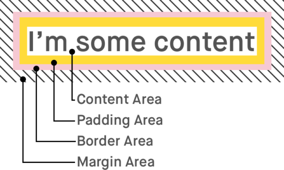

```css
.box {
  border-style: solid;
  border-color: black;
  border-width: 5px;
  text-align: center;
}

.yellow-box {
  background-color: yellow;
  padding: 10px;
  }

.red-box {
  background-color: crimson;
  color: #fff;
  padding: 20px;
  margin: 20px;
}

.blue-box {
  background-color: blue;
  color: #fff;
  padding: 20px;
  margin: 20px;
}
```

Ambas as caixas, vermelha e azul, estão aninhadas dentro da caixa amarela. Se a caixa vermelha tiver uma margem maior que a azul, terá a aparência de ser menor.

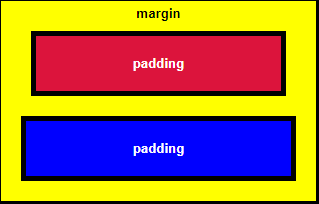

Se a margem da caixa azul aumentar, a distância entre sua borda e os elementos envolta também aumentará.

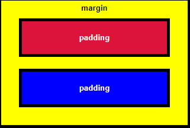

Aqui a caixa vermelha tem mais preenchimento que a azul, fazendo com que ela apareça maior em comparação.

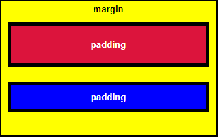

Se o preenchimento da caixa azul aumentar, a distância entre o texto e a borda também aumentará.

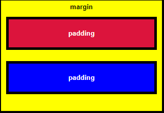

```css
.red-box {
  background-color: crimson;
  color: #fff;
  padding: 20px;
  margin: -15px;
}

.blue-box {
  background-color: blue;
  color: #fff;
  padding: 20px;
  margin: 20px;
}
```

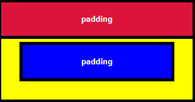

```css
.blue-box {
  background-color: blue;
  color: #fff;
  padding: 20px;
  margin: -15px;
}
```

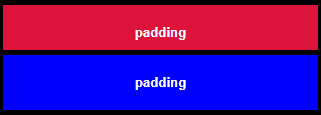

### Cores

O CSS aceita alguns formatos diferentes como valores para cores: nomes pré-definidos, RGB, RGBA, HEX, HSL e HSLA.

**Nomes Pré-Definidos ↓**

São nomes das cores que o CSS reconhece. Todos são nomes em inglês e há uma maior limitação de cores e tons.

```css
* {
  color: white;
  background-color: mediumseagreen;
  border: 3px solid slateblue;
}
```

**RBA & RGBA ↓**

RGB representa o valor da cor em 3 parâmetros (RED, GREEN, BLUE), sendo cada parâmetro um número entre 0 e 255 que define a intensidade da cor.

```
blue → rgb(0, 0, 255)
white → rgb(255, 255, 255)
black → rgb(0, 0, 0)
```

Tons de cinza são definidos por valores iguais em todos os 3 parâmetros.

O RGBA segue a mesma lógica, mas adiciona um 4º parâmetro, o alpha, que especifica a opacidade da cor.

O opacidade é definida entre 0.0 | 0% (totalmente transparente) e 1.0 | 100% (sem qualquer transparência). 

```
rgb(0, 0, 255, 0.5)
rgb(255, 255, 255, 75%)
rgb(0, 0, 0, 0.3)
```

**HEX ↓**

Uma cor hexadecimal é especificada com #RRGGBB, onde RR (red), GG (green) e BB (blue) são os valores que compõem a cor. 

Os valores vão de 00 (menor intensidade) a ff (maior intensidade), a mesma lógica do decimal 0-255.

```
blue → #0000ff
white → #fff
black → #000
```

Se os valores são iguais para todos os componentes, é possível usar o código hex de 3 dígitos.

```
#fc9 → #ffcc99 
#f0f → #ff00ff
#b58 → #bb5588
```

Novamente, tons de cinza são representados por valores iguais em todos os parâmetros.

**HSL & HSLA**

HSL representa os 3 componentes: hue, saturation e lightness. 

Hue é o valor da cor correspondente no círculo de cores de 0 a 360. 0 é red, 120 é green, 240 é blue.

Saturação é a intensidade da cor, um valor em porcentagem. 0% significa um tom de cinza, 100% é a cor em sua totalidade.

Lightness também é uma porcentagem. 0% é black, 50% é nem escuro nem claro, 100% é branco.

```
blue → hsl(240, 100%, 50%)
white → hsl(0, 100%, 100%)
black → hsl(0, 100%, 0)
```

Aqui tons de cinza são definidos por (0, 0%, x), a quantidade de luz que define se é um tom mais claro ou escuro.

O HSLA é uma extensão do HSL com a adição do alpha - o que especifica a opacidade da cor. 0.0 | 0% (totalmente transparente) e 1.0 | 100% (sem qualquer transparência). 

```
hsla(240, 100%, 1)
hsla(0, 100%, 50%)
hsla(0, 100%, 0, 0.3)
```

### Variáveis

Com sintaxe simple, uma variável guarda um valor que pode ser passado para uma propriedade correspondente, ou seja, se a variável guarda um cor, pode ser usada como valor para todas as propriedades que aceitam cores.

```css
selector {
  --var-name: value;
}

/* --- */

selector {
  property: var(--var-name [, fallback])
}
```

```css
:root {
  --strong-color: cyan;
}

body {
  color: var(--strong-color, cyan);
}
```

O valor de uma variável pode ser alterado dentro de um seletor mais abaixo ou em outra folha, é só redeclará-la com o novo valor, mas tudo que usar essa variável abaixo da alteração vai ter o valor alterado, não o original.

```css
main {
  --strong-color: red;
  color: var(--strong-color)
}

p { /* will be red, not cyan */
  color: var(--strong-color)
}
```

Variáveis dentro do CSS são usadas por alguns motivos: reusabilidade, clean code, manutenção e refatoração, entre outros. 

Como exemplo, se for necessário trocar a fonte da página, é mais fácil trocar o valor da uma variável do que precisar alterar todos os elementos que usam aquela fonte, um por um.

### Responsividade

Um design responsivo é aquele que interage com o usuário e adapta seu layout de acordo com o espaço que o conteúdo tem para ocupar, geralmente sendo definido pelo tamanho da tela.

A ideia é que o design não seja estático, ou seja, não seja igual para todos os dispositivos, pois isso comumente ocasiona erros, quebra de layout, entre outros problemas.

Um dos aspectos mais importantes para Web Designers é a escalabilidade e adaptabilidade de um layout, ou seja, a medida em que as unidades aumentam de uma maneira previsível e razoável, seu layout deve ser capaz de se adequar a essas mudanças.

É preciso também pensar em um design que respeite as preferências do usuário, como tamanhos de fontes e modo escuro/claro.

O mais recomendado é usar o design mobile-first, ou seja, começar o layout focando primeiramente nas telas mobile, e usando media queries para adaptar para as telas maiores.

#### Unidades de Medidas

No CSS as unidades de medida são dividas em 2 categorias: absolutas e relativas.

> https://dev.to/lixeletto/entendendo-unidades-css-e-quando-utiliza-las-3ecc

**Unidades Absolutas ↓**

Sãs medidas que, como o nome indica, não dependem de um valor de referência. São unidades definidas pela física, sendo a de uso mais comum dentro do CSS o pixel (px). 

Elas são fixas e não mudam de acordo com as especificações do dispositivo. Seu uso é recomendado - de forma generalizada - para elementos e medidas que não irão mudar, independente do contexto ou tamanho de viewport.

Um exemplo são as bordas ou box-shadows.

```css
.box {
  border: 5px solid black;
  border-radius: 15px;
}
```

**Unidades Relativas ↓**

Sã medidas calculadas usando outra unidade de medida como referência. Devido ao fato de que essas medidas são calculadas pelo browser baseando-se em outra unidade, elas tendem a ser bastante flexíveis.

Isso as tornam a melhor opção para responsividade, adaptabilidade e até acessibilidade.

As mais usadas no CSS são em, rem, porcentagem e viewport (vh, vw, vmin e vmax).

O `rem` usa o root font-size como referência, ou seja, 1rem é igual ao tamanho total do `font-size` do elemento raiz e, na ausência desse, o tamanho inicial da propriedade `font-size`.

Ambos valores serão 16px a não ser que o usuário personalize o tamanho da fonte do sistema ou utilize zoom, ou outro tamanho seja definido como padrão pelo desenvolvedor (o que não é recomendado).

Para facilitar a conversão de `px` para `rem` é possível fazer o seguinte "hack":

```css
html {
  /* 62.5% of 16px = 10px */
  font-size: 62.5%;
}

body {
  /* 16px */
  font-size: 1.6rem;
}
```

Dessa forma, a fonte é definida como 10px para que a conversão seja na base 10, mas o `font-size` é redefinido novamente para o padrão de 16px para não afetar a acessibilidade e as preferências do usuário de acordo com zoom e outras opções.

Outra ideia é criar uma variável com valor base e usar a função `calc()` para que o CSS faça estes cálculos automaticamente.

```css
:root {
  --custom-f-size: 62.5%;
}

h1 {
  font-size: calc(var(--custom-f-size)) * ...;
}
```

O `em` funciona de forma parecida com o `rem`, porém trabalha com a referência do `font-size` do elemento pai. Se o `font-size` não for declarado no elemento pai, o cálculo será realizado com o `font-size` do elemento herdado acima, e assim por diante até o elemento raiz.

Seu uso é interessante para ícones e elementos que precisam escalar junto com o texto, como botões e inputs. Mas contraindicado para elementos aninhados.

As porcentagem são quase sempre relativas às medidas do elemento pai delas. Por exemplo, a declaração de um elemento com x% de `width` é igual dizer que a largura dele será x% da largura do elemento pai.

- Um `line-height` de 150% é o 1.5x maior que o valor de `line-height` base, mesma coisa com o `font-size`. Com base eu me refiro valores padrão de cada propriedade CSS, essas propriedades possuem um valor inicial próprio, definido pelo browser (user agent) ou pré-definidos pelo usuário (root).

- Um `transform: translateX(-100%);` significa que o elemento irá se movimentar para esquerda uma quantia relativa ao seu próprio tamanho, então se o elemento tiver 15px, ele se movimentará 15px para a esquerda.

Um de seus usos mais recomendados é para a altura e largura de elementos aninhados, ou seja, que o pai não seja o `body`. Isso porque quase todos elementos que estão dentro de um pai não podem ter largura ou altura maiores que a do pai, facilitando muito na criação de elementos responsivos. 

O viewport é o tamanho da janela do navegado, e a referência do viewport vai depender do seu tipo, mas todos são 1% de sua referência.

```
vw → relative to 1% of the width of the viewport
vh → relative to 1% of the height of the viewport
vmin → relative to 1% of viewport's smaller dimension
vmax → relative to 1% of viewport's larger dimension
```

#### Media Queries

É um recurso do CSS3 que possibilita estabelecer um escopo de estilos que só funciona se obedecer a condição repassada.

```css
@media media-type and (condition: value) {
  /* styles */
}
```

**Tipos de Mídia ↓**

Se não for especificado, a regra de @media selecionará todos os tipos de dispositivo por padrão. Há diversos tipos, mas os principais são?

- all → para todos os tipos de mídia
- print → para impressoras
- screen → para telas de computador, tablets e smartphones
- speech → para leitores de tela

**Breakpoints ↓**

Um breakpoint é uma chave para determinar o momento de mudar o layout e adaptá-lo às novas regras dentro das media queries. É o valor usado para a regra do condicional.

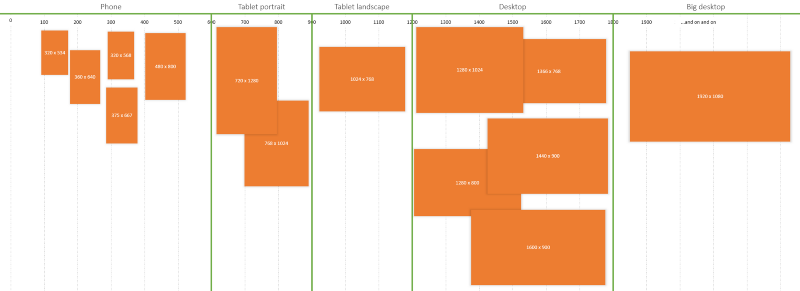

```css
/* Extra small devices (phones, 600px and down) */
@media only screen and (max-width: 600px) {...}

/* Small devices (portrait tablets and large phones, 600px and up) */
@media only screen and (min-width: 600px) {...}

/* Medium devices (landscape tablets, 768px and up) */
@media only screen and (min-width: 768px) {...}

/* Large devices (laptops/desktops, 992px and up) */
@media only screen and (min-width: 992px) {...}

/* Extra large devices (large laptops and desktops, 1200px and up) */
@media only screen and (min-width: 1200px) {...}
```

### Display

É a propriedade que define como o conteúdo é exibido no layout.

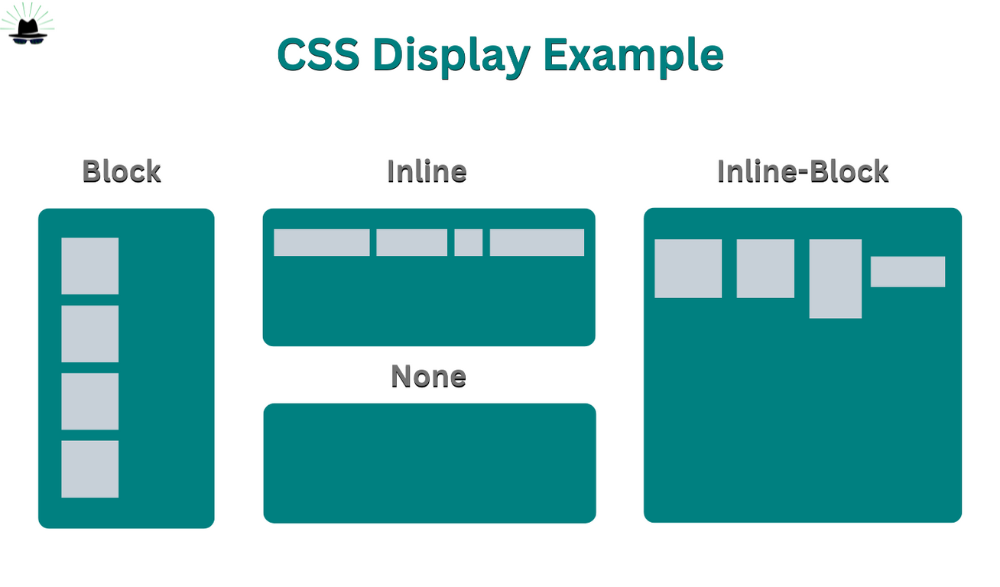

```css
display: none; /* disable the element exhibition, without affecting the layout. all the child elements are also disable, the document renders like the element doesn't exist */

display: inline; /* elements in a line, like <span>. the properties height e width don't affect them */

display: block; /* elements in a block, like <p>. they start a new line, and take all the width */

display: list-item; /* generates a block box for the content and a separate inline list item box */

display: inline-block; /* generates a block element box that will flow as if it were a single inline box. the element itself will behave like inline, but can receive values from height and width */

display: flex; /* element behaves like a block element and presents its contents according to the flexbox template */

display: inline-flex; /* element behaves like an inline element and presents its content according to the flexbox template */

display: grid; /* element behaves like a block element and presents its contents according to the grid template */

display: inline-grid; /* element behaves like an inline element and presents its content according to the grid template */

display: contents; /* makes the box disappear, make the elements child of the next element above the DOM */
```

### Reset e Normalize

Cada navegador tem uma apresentação/estilo padrão e esse comportamento individualizado pode gerar conflitos de layout diante de projetos web. 

Isto era um problema enfrentado por programadores front-end. Apesar de ser uma técnica simples, chegar em consenso sobre como “forçar” todos os navegadores a terem o mesmo comportamento, não foi fácil.

#### Reset

Em 2007, Eric Meyer levantou a discussão de como lidar com essas inconsistências dos navegadores e gerou um grande debate. 

Essas inconsistências que os navegadores apresentam no momento de exibir ou renderizar elementos, podem ser sutis ou mais grosseiras, como, por exemplo, medidas diferentes para o margin superior e inferior em títulos ou a altura da linha padrão, o que poderá afetar profundamente as alturas dos elementos e alinhamentos

**Com Reset.css ↓**

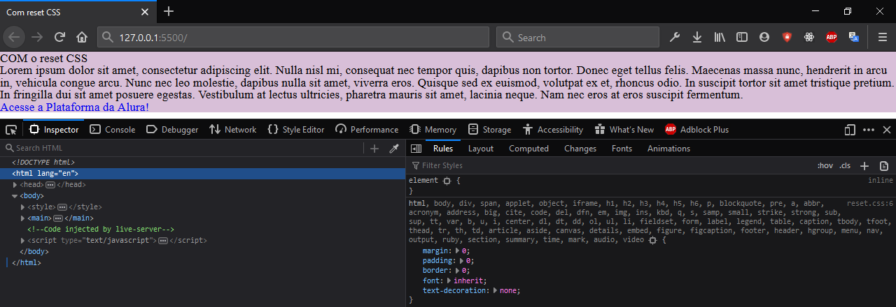

**Sem Reset.css ↓**

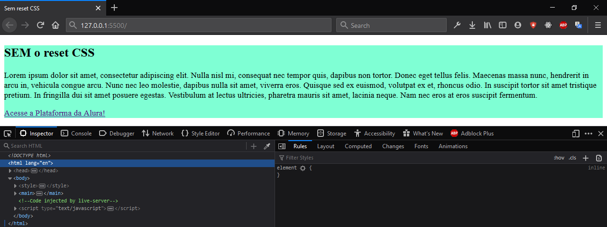

```css
/* http://meyerweb.com/eric/tools/css/reset/ 
   v2.0 | 20110126
   License: none (public domain)
*/

html, body, div, span, applet, object, iframe,
h1, h2, h3, h4, h5, h6, p, blockquote, pre,
a, abbr, acronym, address, big, cite, code,
del, dfn, em, img, ins, kbd, q, s, samp,
small, strike, strong, sub, sup, tt, var,
b, u, i, center,
dl, dt, dd, ol, ul, li,
fieldset, form, label, legend,
table, caption, tbody, tfoot, thead, tr, th, td,
article, aside, canvas, details, embed, 
figure, figcaption, footer, header, hgroup, 
menu, nav, output, ruby, section, summary,
time, mark, audio, video {
    margin: 0;
    padding: 0;
    border: 0;
    font-size: 100%;
    font: inherit;
    vertical-align: baseline;
}
/* HTML5 display-role reset for older browsers */
article, aside, details, figcaption, figure, 
footer, header, hgroup, menu, nav, section {
    display: block;
}
body {
    line-height: 1;
}
ol, ul {
    list-style: none;
}
blockquote, q {
    quotes: none;
}
blockquote:before, blockquote:after,
q:before, q:after {
    content: '';
    content: none;
}
table {
    border-collapse: collapse;
    border-spacing: 0;
}
```

#### Normalize

Ideia semelhante ao reset, mas possui algumas diferenças importantes na hora de usar. O principal objetivo do normalize é deixar consistente a estilização padrão entre os navegadores. 

Algumas estilizações padrões dos navegadores que são úteis para o desenvolvimento de páginas são mantidas, alguns bugs comuns entre os navegadores são corrigidos, algumas melhorias de usabilidade e também todo o código do mesmo é comentado e com uma documentação sobre as modificações.

**Diferenças ↓**

- o reset limpa todos os padrões dos navegadores. É uma forma agressiva de “limpeza”, enquanto o normalize mantêm padrões que são úteis
- Normalize corrige alguns bugs que existem nas estilizações padrões dos navegadores
- Normalize é modular. O código todo é separado por seções específicas, então se pode procurar por mudanças de forma mais direta
- Normalize tem uma documentação detalhada sobre o uso e justificativas das mudanças feitas por ele