# HTTP: Entendendo a Web por Baixo dos Panos

- [HTTP: Entendendo a Web por Baixo dos Panos](#http-entendendo-a-web-por-baixo-dos-panos)
  - [Contextualizando](#contextualizando)
    - [Componentes](#componentes)
    - [Aspectos Básicos](#aspectos-básicos)
    - [O Que Pode Ser Controlado?](#o-que-pode-ser-controlado)
  - [Fluxo HTTP](#fluxo-http)
      - [HTTP/2](#http2)
    - [Mensagens](#mensagens)
  - [Recursos, URLs e URIs](#recursos-urls-e-uris)
    - [Media Types](#media-types)
  - [Status](#status)
  - [HTTPS](#https)
    - [O Que É](#o-que-é)
    - [Como Funciona](#como-funciona)
    - [Vantagens](#vantagens)
  - [Cookies](#cookies)
    - [O Que é e Suas Funções](#o-que-é-e-suas-funções)
    - [Como Funcionam](#como-funcionam)
      - [Riscos](#riscos)
    - [First-Party e Third-Party](#first-party-e-third-party)
          - [Refs](#refs)

## Contextualizando

O Hypertext Transfer Protocol é um protocolo de comunicação utilizado para transferir dados (páginas HTML, scripts, imagens, etc) na web. Funciona como uma conversa entre cliente e servidor.

A internet é compreendia em camadas que se conectam de forma linear (podendo ir e voltar), dentre essas camadas temos: física, enlace, rede, transporte e aplicação. O HTTP se encontra no topo da camada de aplicação.

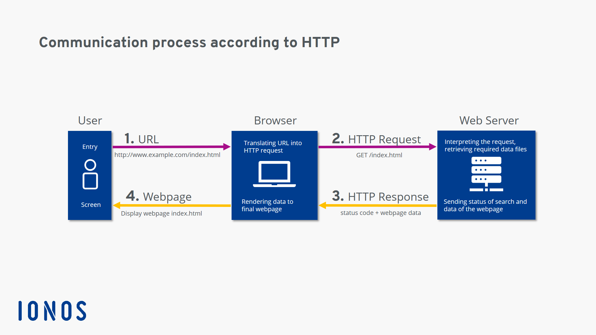

Sempre deve haver duas entidades dialogando, sendo elas um cliente e um servidor, com a conversa sendo sempre iniciada pelo cliente (ou um proxy em nome dele). Após a requisição do cliente, o servidor envia uma resposta com o que foi solicitado. O protocolo HTTP é baseado uma linguagem de marcação que segue uma estrutura específica.

O HTTP roda na camada TCP - Transmission Control Protocol - essa sendo a camada de transporte, relevante para garantir que as mensagens HTTP cheguem ao seu destino com sucesso. Com isso, nenhuma das duas entidades ficará sem resposta.

De modo geral, dispositivos que se conectam à internet possivelmente utilizarão o protocolo HTTP, como notebooks, desktops, servidores, etc.

A grande maioria das arquiteturas de conexão cliente-servidor usa o protocolo HTTP no topo. Ele garante a conectividade, ou seja, o protocolo HTTP funciona em todos os lugares, sem ter problemas com firewalls e outras regras de segurança.

### Componentes

Por funcionar em uma modelo cliente-servidor, temos como seus componentes 3 entidades: o agente-usuário, o servidor e as proxies.

A maior parte do tempo, o agente-usuário é um navegador da Web, mas pode ser qualquer coisa, como por exemplo um robô que varre a Web para preencher e manter um índice de mecanismo de pesquisa e coletar informações.

Cada requisição individual é enviada para um servidor, que irá lidar com isso e fornecer um resultado, chamado de resposta. Entre a solicitação e a resposta existem várias entidades, designadas coletivamente como proxies, que executam operações diferentes e atuam como gateways (intermediários) ou caches, por exemplo.


**Cliente ↓**

O agente-usuário é qualquer ferramenta que age em nome do usuário. Essa função é predominantemente realizada pelo navegador Web; algumas poucas exceções são programas usados por engenheiros e desenvolvedores Web para debugar as suas aplicações.

É sempre a entidade que inicia as requisições, nunca o lado do servidor.

O cliente pode, por exemplo, enviar a requisição de documento HTML da página que está querendo acessar. Ele então realiza uma análise sintática desse arquivo, buscando requisições adicionais correspondentes a scripts de execução, informações de layout (CSS) para apresentação e subrecursos contidos na página (geralmente imagens e vídeos).

Depois o navegador interpreta esses recursos para mostrar ao usuário a página completa. Existem scripts executados pelo navegador que buscam mais recursos em fases subsequentes e conforme o uso da página e o navegador atualiza a página de acordo.

O navegador traduz o que for necessário em requisições HTTP e depois interpreta as respostas HTTP para mostrar ao usuário uma resposta transparente.

**Servidor ↓**

Do outro lado do canal de comunicação está o servidor que serve o documento requisitado pelo usuário. 

Um servidor se apresenta virtualmente apenas como uma máquina, isto porque o servidor pode ser uma coleção de servidores dividindo a carga (através do balanceamento de carga) ou também como um programa complexo que acessa outros servidores (como um cache, um banco de dados, servidores de e-commerce, etc.), gerando toda ou parte do documento solicitado.

Um servidor não é necessáriamente apenas uma máquina, mas vários servidores podem estar hospedados na mesma máquina. Com o HTTP/1.1 e o cabeçalho `Host`, eles podem até compartilhar o mesmo endereço IP.

**Proxy ↓**

Entre o navegador Web e o servidor, vários computadores e máquinas transmitem as mensagens HTTP.

Devido a estrutura em camadas da pilha Web, a maioria dessas máquinas operam em alguma das camadas: de transporte, de rede ou física, sendo transparente na camada da aplicação HTTP, e potencialmente exercendo um grande impacto na performance.

Essas máquinas que operam na camada de aplicação são normalmente conhecidas como proxies (ou representantes, procuradores, etc). Eles podem ser transparentes ou não (alterações nas requisições não passam por eles), e podem desempenhar várias funções:

- Cacheamento (o cache pode ser público ou privado, como o cache dos navegadores)
- Filtragem (como um scanner de antivírus, controle de acesso, etc)
- Balanceamento de carga (para permitir que vários servidores possam responder a diferentes requisições)
- Autenticação (para controlar quem tem acesso aos recursos)
- Autorização (para controlar quem tem acesso a determinada informação)
- Registro de informação (permite o armazenamento de informações de histórico)

### Aspectos Básicos

**É simples**

Foi projetado para ser simples e legível às pessoas.

**É extensível**

Os cabeçalhos HTTP fazem com que seja fácil para estender e usá-lo para experimentos.

**Não tem estado, mas tem sessões**

Não existe uma relação entre duas requisições sendo feitas através da mesma conexão; isso traz um problema imediato para usuários que interagem com algumas páginas de forma coerente, por exemplo, usando um carrinho de compras de e-commerces.

Uma sessão HTTP nada mais é que um tempo que o cliente permanece ativo no sistema. Mas como o fundamento básico do HTTP é não manter estados, cookies HTTP permitem que as sessões tenham estados.

Usando a extensibilidade dos cabeçalhos, os cookies são adicionados ao fluxo do HTTP, permitindo que a criação de sessão em cada requisição HTTP compartilhem o mesmo contexto, ou o mesmo estado.

**Conexões**

São controladas na camada de transporte, e portanto fundamentalmente fora do controle do HTTP. Entretanto o HTTP não requer que o protocolo de transporte utilizado seja baseado em conexões, só requer que seja confiável ou não perca mensagens.

Dentre os dois protocolos de transporte mais comuns na internet, o TCP é confiável e o UDP não; portanto, o HTTP utiliza o padrão TCP, que é baseado em conexão, mesmo que nem sempre seja obrigatório o uso da mesma.

O HTTP/2.0 multiplexa várias mensagens através de uma única conexão, ajudando a manter a conexão mais quente, e mais eficiente.

### O Que Pode Ser Controlado?

Sua natureza extensível permite mais controle e funcionalidade para a internet, ao longo do tempo. Cache e autenticação são funcionalidades suportadas desde o início da história do HTTP. A habilidade de relaxar as restrições na origem, em contraste, foi adicionada nos anos 2010s.

Dentre suas funcionalidades, as mais comuns são:

**Cache ↓**

A forma como documentos são cacheados pode ser controlada pelo HTTP. O servidor pode instruir proxies e clientes, sobre o que cachear e por quanto tempo. O cliente pode instruir proxies de cache intermediários a ignorar o documento armazenado.

**Relaxamento das restrições na origem ↓**

Para prevenir bisbilhoteiros e outros invasores de privacidade, os navegadores reforçam estritamente a separação dos sites Web. Somente páginas de mesma origem podem acessar todas as informações de uma página Web. 

Apesar dessa restrição ser um fardo grande aos servidores, os cabeçalhos HTTP podem relaxar essa separação estrita no lado dos servidores, permitindo que um documento seja composto por várias fontes de informação em outros domínios (e pode até ter razões específicas de segurança para se fazer isso), como um tecido de retalhos.

**Autenticação ↓**

Algumas páginas podem ser protegidas para que apenas usuários específicos possam acessá-la. Autenticação básica pode ser fornecida pelo HTTP, usando tanto o cabeçalho `WWW-Authenticate` e similares, quanto configurando uma sessão específica usando cookies HTTP.

**Proxy e tunelamento ↓**

Servidores e/ou clientes estão frequentemente localizados em intranets e escondem seu verdadeiro endereço IP aos outros. Requisições HTTP recorrem aos proxies para contornar essa barreira na rede. 

Mas nem todos os proxies são proxies HTTP. O protocolo SOCKS, por exemplo, opera em um nível mais baixo. Outros protocolos, como ftp, podem ser tratados por esses proxies.

**Sessões ↓**

Usando os cookies HTTP, permite você vincular requisições com o estado do servidor. Isso cria as sessões, apesar do protocolo HTTP básico não manter estado. Isso é útil não só para os carrinhos de compras de e-commerces, mas também para qualquer site que permita customização das respostas a nível de usuário.

## Fluxo HTTP

1. Abre uma conexão TCP:

A conexão será usada para enviar uma requisição, ou várias, e receber uma resposta. O cliente pode abrir uma nova conexão, reusar uma conexão existente, ou abrir várias conexões aos servidores.

2. Envia uma mensagem HTTP:

Mensagens HTTP (antes do HTTP/2.0) são legíveis às pessoas. 

Com o HTTP/2.0, essas mensagens simples são encapsuladas dentro de quadros (frames), tornando-as impossíveis de ler diretamente, mas o princípio se mantém o mesmo.

```http
GET / HTTP/1.1
Host: developer.mozilla.org
Accept-Language: en
```

3. Lê a resposta do servidor:

```http
HTTP/1.1 200 OK
Date: Sat, 09 Oct 2010 14:28:02 GMT
Server: Apache
Last-Modified: Tue, 01 Dec 2009 20:18:22 GMT
ETag: "51142bc1-7449-479b075b2891b"
Accept-Ranges: bytes
Content-Length: 29769
Content-Type: text/html

<!DOCTYPE html... (here comes the 29769 bytes of the requested web page)
```

4. Fecha ou reutiliza a conexão para requisições futuras.

Se a linha de montagem (pipelining) estiver ativada, várias requisições podem ser enviadas sem que a primeira resposta seja totalmente recebida. A linha de montagem HTTP se provou difícil de ser implementada nas redes existentes, onde peças antigas de software coexistem com versões modernas. A linha de montagem HTTP tem sido substituída no HTTP/2.0 com multiplexação mais robusta de requisições dentro de um quadro (frame).


#### HTTP/2

**Multiplexado ↓**

Com ele é possível fazer várias requisições ao mesmo tempo dentro de um (ou pelo menos uma quantidade menor) de conexões TCP, ao contrário do HTTP/1, que cria conexões paralelas para executar cada requisição.

**Cabeçalho Compacto ↓**

Possui o mecanismo de compactação de cabeçalho, em que o que era legível em formato de texto passa por um algoritmo de compressão e se torna um cabeçalho binário que pode ser enviado pela rede e economizar recursos.

**Server Push ↓**

É possível configurar o HTTP para que o servidor fique mais "inteligente" e envie dados necessários para o funcionamento da página antes que o cliente precise fazer a requisição, assim melhorando a performance.

### Mensagens

HTTP/1.1 e mensagens mais antigas HTTP são legíveis às pessoas. No HTTP/2.0, essas mensagens são embutidas numa nova estrutura binária, um quadro, permitindo otimizações como compressão de cabeçalhos e multiplexação. 

Mesmo se somente parte da mensagem HTTP original for enviada nessa versão do HTTP, a semântica de cada mensagem permanece inalterada e o cliente reconstitui (virtualmente) a requisição HTTP/1.1 original.

Existem dois tipos de mensagens, requisições e respostas, cada uma com seu próprio formato.

**Requisições ↓**


Consistem nos seguintes elementos:

Um método HTTP, geralmente é um verbo como `GET`, `POST`, `DELETE`, `PUT`, entre outros, ou um substantivo como `OPTIONS` e `HEAD` que definem a operação que o cliente quer executar. Usualmente, o cliente quer pegar quer pegar um recurso (usando GET) ou publicar dados de um formulário HTML (usando POST), embora mais operações podem ser necessárias em outros casos.


O caminho do recurso a ser buscado; a URL do recurso sem os elementos que são de contexto, por exemplo sem o protocolo `(http://)`, o domínio (como `developer.mozilla.org`), ou a porta TCP (como 80, que é ocultado por ser o número da porta padrão).

A versão do protocolo HTTP.

Cabeçalhos opcionais que contém informações adicionais para os servidores.

Ou um corpo de dados, para alguns métodos como `POST`, similares aos corpos das respostas, que contém o recurso requisitado.

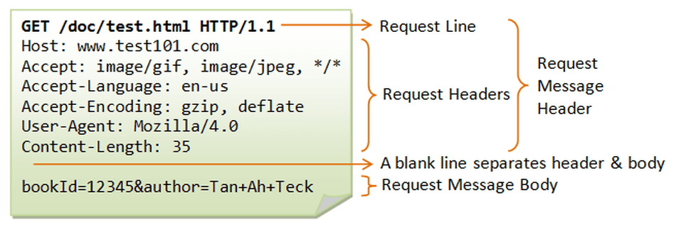

**Respostas ↓**


Consistem nos seguintes elementos:

- A versão do protocolo HTTP que elas seguem.
- Um código de status, indicando se a requisição foi bem sucedida, ou não, e por quê.
- Uma mensagem de status, uma pequena descrição informal sobre o código de status.
- Cabeçalhos HTTP, como os das requisições.
- Opcionalmente, um corpo com dados do recurso requisitado.


## Recursos, URLs e URIs

O endereço de um site é o que se entende como Uniform Resource Locator. Ela representa um recurso específico na web, estes recursos sendo elementos com os quais se quer interagir, tais como: imagens, páginas, arquivos, e vídeos.

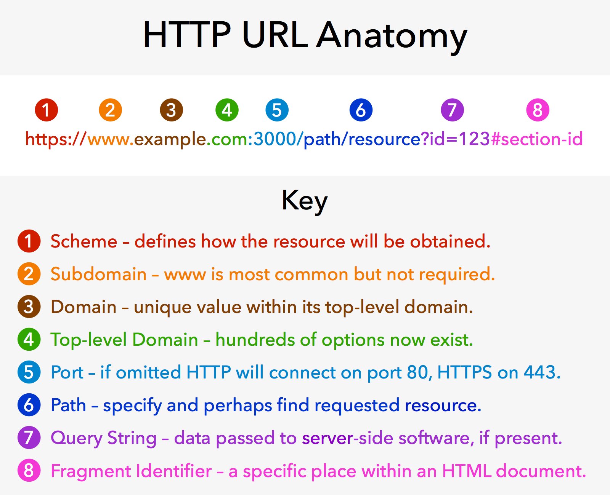

Uma URL pode ser quebrada em 3 partes:

**URL Scheme ↓**

`http`, a parte antes de "://" é o que se entende como esquema da URL. Ele descreve como acessar um recurso em particular, sendo nesse caso, o que está falando para o navegador usar o protocolo HTTP.

Existem outros esquemas, tais como: https, TCP, FTP, mailto. Tudo que vier depois de "://" é específico do protocolo que estiver sendo utilizado.

**Host ↓**

O domínio é o nome do host (servidor), que seria o nome do computador que armazena os recursos. O navegador vai realizar um processo conhecido como DNS Lookup para traduzir o domínio em um endereço de rede e vai enviar a requisição para esse endereço.

**URL Path ↓**

O que vem após o domínio é chamado de caminho da URL. O servidor irá identificar qual é o recurso específico que deve devolver para este caminho quando a requisição chegar, que pode ser um arquivo físico diretamente ou não.

Nesse caso, provavelmente o que vai acontecer é: uma aplicação desenvolvida em alguma tecnologia como ASP.NET, PHP, Rails, Java irá tratar a requisição no servidor, fará uma consulta em um banco de dados e o recurso que será devolvido vai ser construído dinamicamente por esta aplicação.

Outros componentes que podem fazer parte de uma URL são:

**Números de Porta ↓**

Esse número 80 representa o número da porta que o servidor está usando para “ouvir” requisições HTTP. A porta 80 é a padrão e é opcional no caso do uso do endereço em um navegador, então, normalmente não se vê esse 80 nas URLs. O mesmo vale para o 443, que é padrão do `https`.

É mais comum que a porta seja especificada quando o projeto está em fase de teste ou desenvolvimento.

As portas de 0 a 1023 são reservadas para serviços padronizados. De 1023 a 65535 são de uso livre, o que possibilita a execução de mais de um servidor no mesmo computador simultaneamente, algo que pode ser necessário em um ambiente de desenvolvimento.

**Query Strings ↓**

Tudo o que vem depois da “?” é chamado de query string. Geralmente é colocado na query string informações que serão interpretadas de alguma forma pela aplicação que é executada no servidor. Não existe uma regra formal de como as query strings são montadas, mas a forma mais comum de utilização é através de pares chave-valor, separados por “&”.

**Fragmento ↓**

Não é interpretado pelo servidor, mas sim pelo navegador do usuário. Depois de carregar o recurso que é especificado através dessa URL, o navegador irá procurar na página um elemento com o id correspondente ao que está na URL e irá posicionar a barra de rolagem a partir do início dele.

Resumidamente, uma url pode ser quebrada então no seguinte formato:

```
{esquema]://[servidor]:[porta]/[caminho]?[querystring]#[fragmento]
```

### Media Types

Um recurso pode ser várias coisas diferentes: imagens, arquivos HTML, XML, vídeos e muitos mais. Para que um servidor possa servir um recurso e para o cliente poder consumi-lo apropriadamente, as partes envolvidas (cliente e servidor) têm de ser específicas e precisas quanto ao tipo do recurso.

Quando um servidor responde uma requisição HTTP, ele devolve o recurso e o seu tipo - chamado de Content-Type (também conhecido como media type). Para especificar tipos de recurso, o HTTP usa outro protocolo (que inicialmente foi feito para comunicação através de e-mail) chamado MIME: Multipurpose Internet Mail Extensions.

O content-type tem duas partes: tipo e subtipo. Por exemplo:

- Um servidor pode devolver uma imagem no formato png. O content-type da resposta viria como image/png;
- Se fosse um jpg, o content-type seria image/jpg;
- E se fosse um arquivo html? text/html;
- E um json? text/json.

O navegador olha o Media Type para saber o que fazer com um arquivo.

Quando um mesmo recurso tem formatos diferentes, o servidor usa o mecanismo content negotiation especificado pelo protocolo HTTP: quando um cliente faz uma requisição, ele pode especificar quais Media Types ele aceita.

Desta forma, aplicações diferentes podem solicitar o mesmo recurso - mas em formatos diferentes.

## Status

Por ser um protocolo, o HTTP segue algumas regras, estas definidos no [RFC 7231](https://www.rfc-editor.org/rfc/rfc7231).

Nele se encontram sintaxe, recursos, métodos, códigos de status, considerações de segurança, entre mais todas as outras regras definidas para o protocolo.

| Status | Description   |
| ------ | ------------- |
| 1xx    | Informational |
| 2xx    | Successful    |
| 3xx    | Redirection   |
| 4xx    | Client Error  |
| 5xx    | Server Error  |

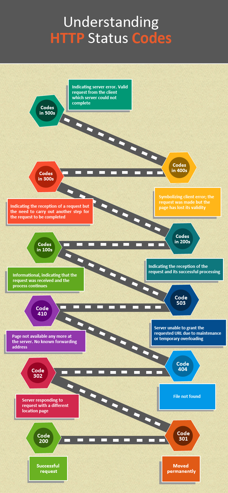

## HTTPS

Por ser simples e de fácil compreensão, o protocolo HTTP apresenta grandes falhas de segurança, pois se uma requisição e suas respostas forem acessadas com motivação criminosa os dados de comunicação entre cliente-servidor serão de fácil acesso e compreensão.

Para proteger a comunicação entre esses sistemas, foi criado o protocolo Hyper Text Transfer Protocol Secure. É considerado a versão segura do HTTP. Ele permite o trânsito de dados sensíveis e informações confidenciais, como credenciais de login e informações bancárias.

Sites que não usam o HTTPS costumam ter uma classificação mais baixa em mecanismos de busca e aparecem com o aviso do navegador de site inseguro.

### O Que É

É um tipo de protocolo de camada de aplicativo que facilita a comunicação de dados entre cliente e servidor, tornando quase impossível para que agentes fora desse escopo tenham acesso a comunicação entre eles.

Para isso o HTTPS utiliza uma criptografia de chave pública muito forte, esta que criptografa a conexão. Qualquer site, especialmente os que exigem login ou trocam informações sensíveis, devem usar o HTTPS.

Em alguns navegadores os sites que não usam este protocolo são sinalizados. A URL de alguns sites pode omitir o `https` de seus endereços, mas é possível saber se o site é seguro verificando se há um ícone de cadeado na barra de URL, geralmente a esquerda do endereço do site.


### Como Funciona

Utiliza um certificado criptografado entre o navegador e o servidor. O certificado usa protocolos Secure Socket Layer (SSL) ou Transport Layer Security (TLS), por isso ele é conhecido como “certificado ssl” ou “certificado digital”.

O SSL é a tecnologia de segurança padrão para estabelecer um link criptografado entre os dois sistemas. Essa conexão pode ocorrer entre navegador e servidor, entre servidores ou entre cliente e servidor.

De modo geral, o SLL é quem assegura a transferência de dados entre os dois sistemas. Assim, a transferência de arquivos permanece criptografada e privada.

Os dois computadores passam por um processo chamado handshake SSL / TLS, que é uma série de comunicações de ida e volta usadas para estabelecer uma conexão segura. 

O certificado protocolo HTTPS incorpora criptografia ao protocolo HTTP. Para isso, ele utiliza um protocolo de encapsulamento, o protocolo SSL. Por meio da criptografia, todas as mensagens trocadas entre um cliente e um servidor podem ser consideradas seguras em ambas as direções.

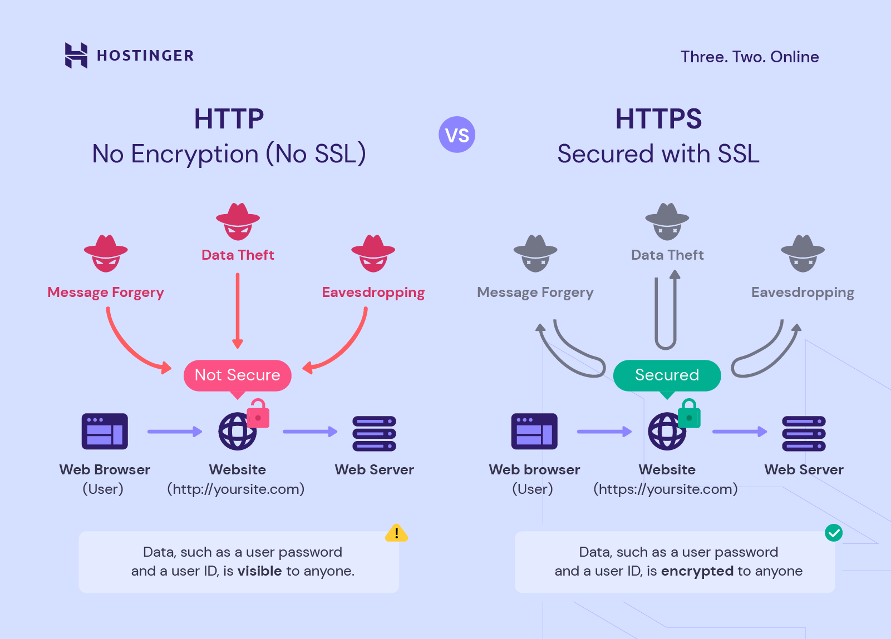

A criptografia dos dados incluem os seguintes:

- URL solicitada pelo cliente
- Conteúdo do site
- Cabeçalhos
- Cookies
- Parâmetros de consulta

Além de usar o SSL para encapsulamento, também o utiliza para autenticação. Para isso, cada par de chaves possui uma chave privada. A primeira deve ser mantida em segurança e a segunda pode ser distribuída.

A partir desses recursos, qualquer pessoa que tenha a chave pública (a segunda) pode usá-la para enviar mensagens. No entanto, apenas o possuidor da chave privada poderá utilizar a criptografia para decifrar a mensagem e confirmar se ela foi assinada digitalmente pela chave privada correspondente.

As chaves estão ligadas matematicamente, o que foi cifrado pela chave pública só pode ser decifrado pela chave privada. Isso garante que os dados cifrados pelo navegador (chave pública) só podem ser lidos pelo servidor (chave privada).

Esse método de criptografia é chamado de criptografia assimétrica. No entanto, a criptografia assimétrica tem um problema, ela é lenta. Por outro lado, temos a criptografia simétrica, que usa a mesma chave para cifrar e decifrar os dados, ele é menos segura, porém é mais rápida.

O interessante é que o HTTPS usa ambos os métodos de criptografia, assimétrica e simétrica. Ele começa com criptografia assimétrica para depois mudar para criptografia simétrica. Essa chave simétrica será gerada no início da comunicação e será reaproveitada nas requisições seguintes. 

### Vantagens

**Encriptação ↓**

Ao incluir a criptografia SSL/TLS, o protocolo HTTPS evita que os dados enviados pela internet sejam interceptados e lidos por terceiros. Na prática, essa encriptação “embaralha” os dados de forma que mesmo que haja interceptação, não seja possível compreender a informação.

**Autenticação ↓**

Ao contrário do HTTP, o HTTPS inclui autenticação robusta por meio do protocolo SSL/TLS. Os sites https precisam de uma chave pública para confirmar que os documentos enviados por meio deles aos servidores são assinados digitalmente. Em outras palavras, por alguém que possua a chave privada correspondente àquela chave pública. 

**Confiança e Integridade ↓**

Do ponto de vista do usuário, o uso de HTTPS gera confiança pois num site que possui o https no domínio, as chances são de que as informações sejam protegidas. 

Cada documento enviado a um navegador por um servidor HTTPS da web inclui uma assinatura digital que um navegador da web pode usar para determinar se o documento não foi alterado por terceiros ou caso contrário, corrompido durante o trânsito.

**Melhoria no SEO ↓**

Mecanismos de busca dão maior classificação para sites que possuem um certificado de segurança. Utilizar HTTPS ajuda a preservar dados de referência, que são um aspecto importante para estratégias de SEO.

O tráfego de referência consiste em qualquer visita que um site recebe de outras fontes que não o tráfego direto. Habilitar o protocolo HTTPS significa que se pode identificar as fontes de tráfego do site que possuem mais qualidade por meio do painel de análise de dados.

**Compatibilidade ↓**

As alterações atuais do navegador estão levando o HTTP cada vez mais perto da incompatibilidade. O Mozilla Firefox anunciou um modo opcional somente HTTPS, enquanto o Google Chrome está se movendo continuamente para bloquear conteúdo misto (recursos HTTP vinculados a páginas HTTPS).

**Velocidade e Desempenho ↓**

Outro benefício de utilizar o HTTPS comparado ao HTTP é que os sites carregam relativamente mais rápido com o protocolo seguro, especialmente quando ele é utilizado com um servidor que suporta HTTP/2.

O HTTP/2 suporta a criptografia HTTPS e ainda complementa seus protocolos de segurança. Além de outras funcionalidades, o HTTP/2 reduz a latência, pois possui um baixo consumo de recursos e maximiza a eficiência da banda larga.

De modo geral o HTTPS também é a melhor opção quando sites são acessados em dispositivos móveis, especialmente em casos de AMPs (Accelerated Mobile Pages). Ao carregar os conteúdos de um site muito mais rápido, uma AMP facilita e melhora a experiência do usuário.

Uma conexão segura e criptografada é necessária para que a versão AMP de um site apareça nos mecanismos de busca.

## Cookies

Cookie HTTP ou Cookie web é um pequeno arquivo de texto, normalmente criado pela aplicação web, para guardar algumas informações sobre o usuário no navegador. Quais são essas informações depende um pouco da aplicação, mas podem ser preferências, dados de acesso, histórico de interações com a aplicação, etc.

Um cookie pode ser manipulado e até apagado pelo navegador e, quando for salvo no navegador, fica associado com um domínio; além disso, um site pode ter vários cookies.

### O Que é e Suas Funções

Em essência, é um pedaço de dado que:

- Enviado pelo servidor web para navegador do usuário
- Dados em um cookie é um simples dado textual; não é um dado binário
- Cookies são armazenados pelo navegador no computador do usuário (em disco)
- Um site só pode ler seu próprio cookie. Não pode ler o cookie de outros domínios. Isso é uma medida de segurança assegurada pelo navegador
- Os cookies não são compartilhados entre diferentes navegadores. Ou seja, um navegador não pode ler cookies armazenados por outro navegador, mesmo que seja do mesmo domínio
- Pelo protocolo HTTP, o cookie não pode exceder 4KB
- O número de cookies enviados pelo servidor web por um domínio específico não pode ser ilimitado. A restrição é colocada pelo navegador para evitar o consumo de espaço em disco. São em volta de 20-25 cookies por domínio

**Por que são necessários?**

Existem 3 motivos principais para sua utilização: autenticação (gerenciamento de sessão), rastreamento de usuários, 

- Autenticação (Gerenciamento de Sessão)
  - Logins, status de visualização de um vídeo, manter itens em um carrinho de compras de lojas online, buscas realizadas
- Rastreamento de Usuário
  - Salva informações sobre o comportamento de quem acessa determinada página web, como sua frequência de cliques ou localização
- Personalização de Preferências
  - Preferência de idioma, temas de cores ou acessibilidade

Em um e-commerce, os cookies podem manter os itens selecionados no seu carrinho de compras. Já em páginas web que solicitam login e senha, os dados encriptados de acesso podem ser armazenados em um cookie, sustentando sua sessão e permitindo que suas credenciais de login permaneçam válidas por mais tempo.

Como o HTTP não possui estado, a necessidade de cookies e sessões se fez presente. 

### Como Funcionam

Quando um usuário acessa um website, o servidor web envia um cookie junto ao documento HTML. O navegador então envia este cookie em toda a requisição subsequente para o servidor web e cria um tipo de sessão entre o usuário e o website.


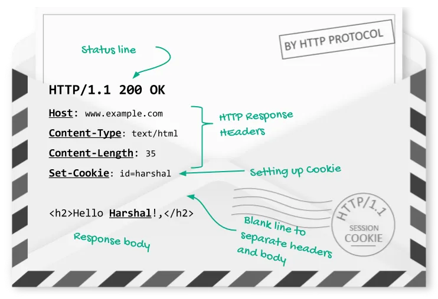

**Configurando**

Para setar um cookie, o servidor deve usar o `Set-Cookie` no cabeçalho.

```http
Set-Cookie: <cookie-name>=<cookie-value>
```

```http
Set-Cookie: id=Harshal
```

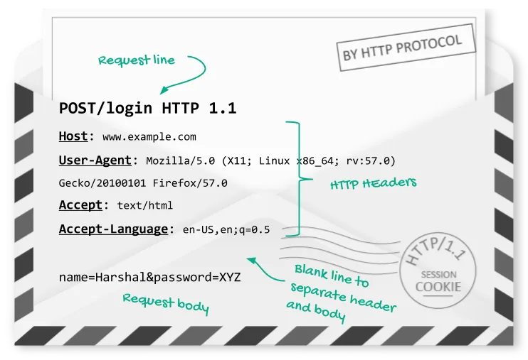

Ele segue o seguinte formato: `key:value`.

| Chave           | Valor                               |
| --------------- | ----------------------------------- |
| nome do cookie  | indica a função do cookie           |
| valor do cookie | informações que carrega (em string) |

É possível enviar um ou múltiplos atributos via `et-Cookie` para armazenar outros tipos de informações, a escolha depende do tipo de aplicação e pode estar atrelada a um único domínio.

```http
Set-Cookie: <cookie-name>=<cookie-value>; Domain=<domain-value>; Secure; HttpOnly
```

Existem 2 tipos de cookies:

- Cookies de sessão
  - Também conhecidos como cookies temporários ou não persistentes
- Cookies permanentes

Por padrão, o cookie tem o tempo de vida da janela do navegador. Quando o navegador é fechado, o cookie "morre". É deletado. Cookies deste tipo são chamados de cookies de sessão. é possível criar um cookie permanente especificando quando irá expirar, com uma data especifica com o `Expires`, ou após um intervalo de tempo (em segundos), com o `Max-Age`.

```http
Set-Cookie: id=1234; Expires: Sat Jun 2024;
```

```http
Set-Cookie: id=a3fWa; Max-Age=2592000
```

**Escopo**

É possível também criar um escopo para os cookies. Como `Expires`, existem diretivas de `Domain` e `Path`. Por padrão, navegadores setam o domínio do cookie para o host do documento atual, ou seja, o domínio que está no barra de endereço do navegador.

`Path` significa o caminho da URL - que, por padrão, tem o valor do caminho da URL que envia o cabeçalho `Set-Cookie`. Outros caminhos dentro do website não recebem o cookie. Se pode setar o diretivo do `Path` manualmente.

```http
Set-Cookie: id=123; Path=/custom-path
```

**Entendendo Domínios e Subdomínios**

Como mencionado, navegadores setam por padrão o domínio do cookie para o host do documento atual. O diretivo `Domain` pode ser usado para indicar um ou mais domínios onde os cookies podem ser enviados.

Quando é usado o valor padrão, o navegador não envia os cookies para nenhum dos subdomínios daquele domínio padrão. Agora, se o servidor explicita o domínio, o navegador envia para qualquer subdomínio dele.

O navegador performa uma comparação do valor e do nome do host de onde o request é enviado (começando pelo final da string) e envia o cabeçalho do cookie correspondente quando há match.

> Parent domain can set cookies for Sub-domain and Sub-domain can also set cookies for Parent domain.

[Stack Overflow: Cookies, Domains & Subdomains](https://stackoverflow.com/questions/18492576/share-cookies-between-subdomain-and-domain/23086139#23086139)

#### Riscos

Os cookies podem apresentar riscos e causar algumas preocupações, como a obtenção de informações pessoais por invasores, o monitoramento indesejado e a possibilidade de vazamento de dados.

Dentre suas possíveis falhas, cookies podem sofrer 3 ataques maiores:

1. Man-in-middle
2. XSS — Cross-site scripting
3. CSRF — Cross-site request forgery

**Main In Middle**

É mais uma falha no HTTP/HTTPS do que de cookies. Toda requisição HTTP passa por múltiplos roteadores, servidor antes que chegue ao destino. As entidades no meio podem simplesmente ler os cookies. Se um "homem no meio" lê este cookie - e ele tem informações de identificação - qualquer um que o lê pode se passar por este usuário.

Isso é verdade para qualquer outro dato transmitido via HTTP. A solução mais simples é implementar o HTTPS, especialmente se dados sensíveis estão sendo transmitidos. Com HTTPS, essa falha se torna mais difícil, se não impossível.

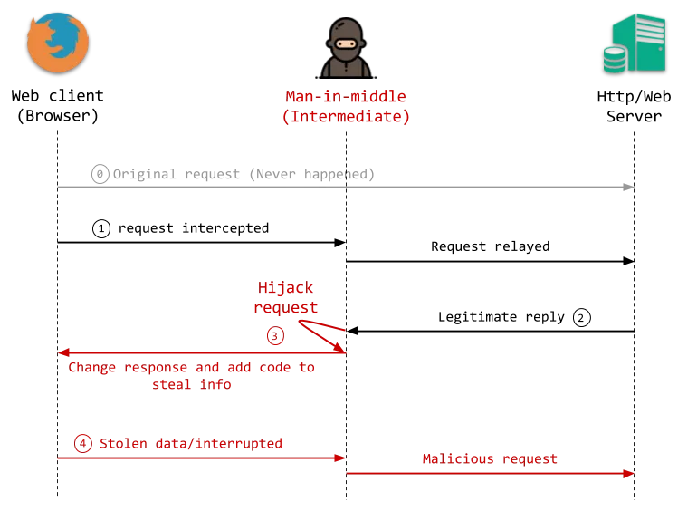

Outra coisa importante é que quando o HTTPS é usado, muitos sites automaticamente redirecionam o usuário para o HTTPS se ele tenta usar o HTTP. Agora, se o usuário já estava logado e tenta usar o HTTP, há uma possibilidade de que nessa única requisição essa falha aconteça.

Para que cookies só sejam transmitidos em conexões HTTPS, se pode setar da seguinte maneira:

```http
Set-Cookie: id=123; Secure;
```

**XSS - Cross Site Scripting**

CDN (content delivery network) é usado o tempo todo, então mesmo que o cookie não seja enviado quando se está recuperando arquivos JS de CDN, todo código JS para a página é considerado em execução no mesmo domínio e isso significa que o script carregado de um outro domínio terá acesso aos cookies do website pela leitra com `documento.cookie`.

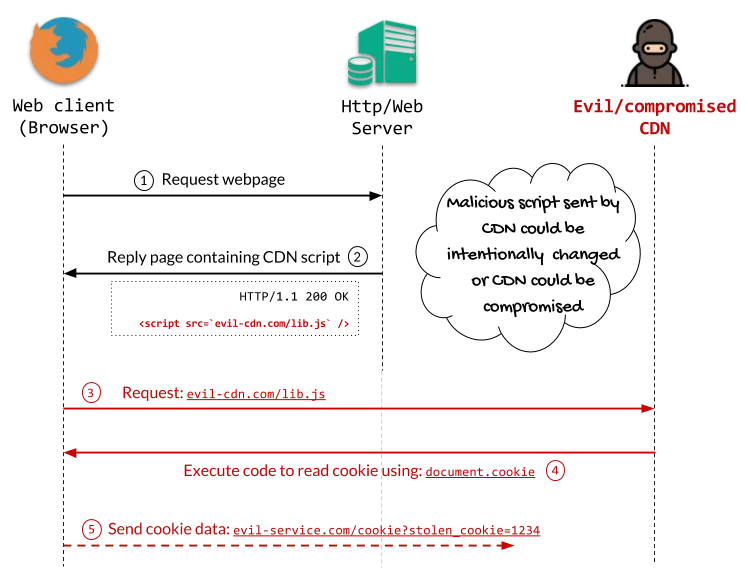

É possível também que estes dados sejam roubados por injeção XSS, que é similar a injeção SQL. Usar o `HttpOnly` impede que cookies sejam acessíveis por `document.cookie`, fazendo que eles sejam somente enviados para o servidor.

```http
Set-Cookie: id=1234 HttpOnly
```

Importante notar que, ao fazer isso, seus próprios scripts não poderão ler os cookies.

**CSRF - Cross Site Request Forgery**

Aqui o ataque se baseia no simples fato que os cookies são enviados para o server em cada e toda a requisição.

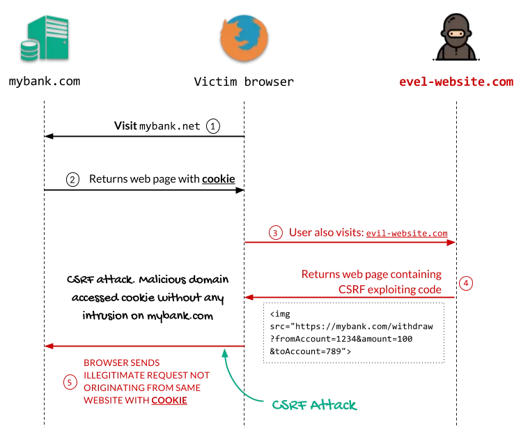

De forma resumida, o navegador envia o cookie para o domínio confiável, mesmo que aquela requisição tenha sido emitida por outro website. Ou seja, o site do ataque faz uma requisição cross-site para o outro domínio com a intenção de causar dano.

Ataques CSRF são silenciosos e envolvem visitas em múltiplos websites ao mesmo tempo; o que torna algo muito difícil de rastrear.

Uma solução simples para esse ataque é usar o cabeçalho `Referer`; ele diz ao servidor de onde se origina a requisição.

### First-Party e Third-Party

Ser um cookie de sessão ou permanente, em geral, não é o real problema para uma pessoa que acessa um site pela primeira vez, ou para uma pessoa desenvolvedora. O maior conflito está relacionado ao compartilhamento de informações, principalmente de dados sensíveis, algo que é envolve a LGPD, pois essa questão faz referência ao escopo dos cookies First-party (Cookie primário) e Third-party (Cookie de terceiros).

- Cookie First-Party
  - É criado por sites que um usuário visita
  - Ele é usado para salvar dados, como itens de carrinho de compras e credenciais de entrada
  - Ex. cookies de autenticação e outras análises
- Cookie Second-Party
  - É tecnicamente o mesmo que um cookie primário
  - A diferença é que os dados são compartilhados com outra parte por meio de um contrato de parceria de dados
  - Ex. Análise e relatórios do Microsoft Teams
- Cookie Third-Party
  - É instalado por um domínio diferente do que o usuário visitou explicitamente e, é usado para acompanhamento
  - Ex. os botões: curtir, serviço de anúncios e chats ao vivo

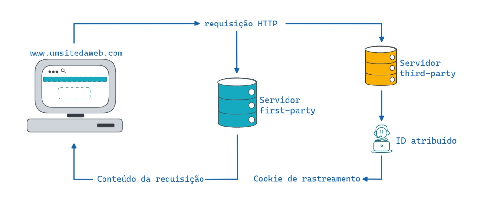

Os Cookies Primários são enviados diretamente pelo servidor responsável pelo domínio. Esse tipo de cookie é utilizado para melhorar a experiência do usuário no site específico.

Já os cookies de terceiros são oriundos de uma terceira parte , ou seja, de outro servidor. São os botões de curtir de mídias sociais, banners com propagandas (e nem é preciso clicar nas propagandas, os cookies de terceiros já são armazenados pelo navegador) e imagens originadas diretamente de outros sites.

Os Cookies de Terceiros podem ser nocivos em relação à segurança e uso das informações, pois como o nome sugere, há um terceiro elemento responsável pelas diretivas de cookies e rastreamento dos dados.

###### Refs

[Ultimate Guide to HTTP Cookies](https://blog.webf.zone/ultimate-guide-to-http-cookies-2aa3e083dbae)