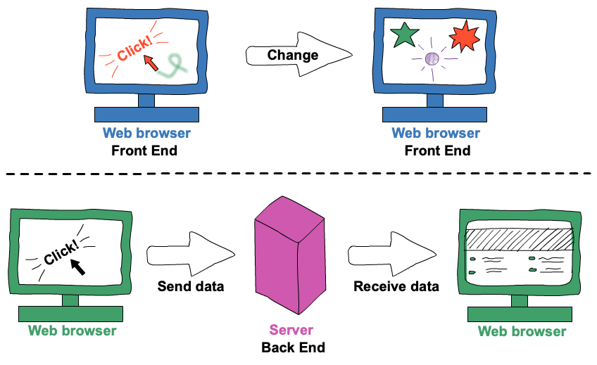

# JavaScript

- [JavaScript](#javascript)
  - [O Que é JavaScript?](#o-que-é-javascript)
  - [Variáveis](#variáveis)
    - [Datatype](#datatype)
      - [NaN](#nan)
      - [Template String](#template-string)
    - [Hoisting](#hoisting)
  - [Operadores](#operadores)
  - [Funções](#funções)
  - [Condicionais](#condicionais)
  - [Loops](#loops)
    - [Break e Continue](#break-e-continue)
  - [Arrays](#arrays)
    - [Declarando e Acessando](#declarando-e-acessando)
    - [Métodos](#métodos)
    - [Iterações](#iterações)
    - [Spread Operator](#spread-operator)
  - [Objetos](#objetos)
    - [Acessando e Manipulando](#acessando-e-manipulando)
    - [This](#this)
    - [Objeto Literal e Referências](#objeto-literal-e-referências)
    - [Getters e Setters](#getters-e-setters)
    - [JSON](#json)
  - [Desestruturação de Listas e Objetos](#desestruturação-de-listas-e-objetos)
  - [DOM](#dom)
  - [Tratamento de Erros](#tratamento-de-erros)
  - [Melhores Práticas](#melhores-práticas)

## O Que é JavaScript?

É uma linguagem de scripting, comumente definida por permitir ao programador o controle de uma ou mais aplicações de terceiros. No caso do JavaScript, é possível controlar comportamentos dos navegadores e suas páginas através de códigos enviados ao HTML.

Outra característica comum nas linguagens de scripting é que normalmente são linguagens interpretadas, ou seja, não dependem de compilação para serem executadas. O JS é interpretado e executado conforme é lido pelo navegador, linha a linha, assim como o HTML.

Também possui uma boa tolerância a erros, uma vez que conversões automáticas são realizadas durante as operações. Porém, nem sempre essas conversões resultam em algo esperado, o que pode ser fonte de bugs.

O script é enviado com o HTML para o navegador, sendo ele envolvido pela tag `<script>` como código direto no HTML ou caminho de um arquivo JS externo.

Pode ser declarado tanto no início, quanto ao final do HTML, mas é de melhor prática declara-lo no final (antes do fechamento do `body`) para auxiliar no melhor processamento da página, o que também impacta a performance.

```html
<body>
  <!-- ... -->
  <script type="text/javascript" src="script.js"></script>
</body>
</html>
```

Um dos principais pontos sobre o JavaScript é que se trata de uma linguagem de programação multiparadigma, o que significa que a linguagem não está restrita a uma única forma de fazer as coisas. É possível utilizar diferentes paradigmas de programação, como orientado a objetos, funcional ou procedural.

**Sintaxe ↓**

Como a maioria das linguagens, sua base de código são variáveis, objetos, keywords, operados, condicionais, expressões, classes, funções e métodos.

O JavaScript trabalha com 2 tipos de valores:

- Literals
  - Valores fixos
    - 10.50 | 1001 → números
    - "text" | 'text' → strings
- Variables
  - Valores variáveis
    - `var` | `let` | `const` → armazenam valores 

Keywords são palavras-chave/reservadas, ou seja, são usadas para identificar ações dentro do JavaScript, como a criação de uma variável ou o retorno de uma função.

Como o nome diz, são reservadas, ou seja, não podem e não devem ser usadas como nomes de variáveis, objetos, métodos, funções, etc.

É recomendado também evitar usar nomes de objetos built-in, propriedades, métodos, palavras reservadas de outras linguagens e aplicações, e event handlers como nomes dentro do seu código.

É uma linguagem case sensitive, ou seja, variáveis de mesmo nome, mas com diferença de maiúscula e minúscula em sua grafia, são tratadas como variáveis distintas.

```js
var lastName, lastname;

lastName = 'Ventura';
lastname = 'Lopez';

console.log(lastName, lastname);
```

O mesmo vale para as palavras-chave/reservadas da linguagem. JavaScript não interpreta `LET` e `Let` (ou outras variações) como a keyword `let`.

Enquanto ao seus identificadores/nomes (usados para nomear variáveis, keywords, funções, etc), seguem as mesmas regras que a maioria das linguagens de programação:

Um nome deve começar com:

- Uma letra
  - A - Z | a - z
- Sinal de dólar
  - $
- Underscore
  - _

Quaisquer caracteres subsequentes podem ser letras, dígitos, underscores ou sinas de dólar. Números não podem ser o primeiro caractere de um nome.

É de uso comum no JavaScript o prática de nomeação camelCase.

```
camelCase → firstSecond
```

Usa o charset Unicode, que possui quase todos os caracteres, pontuações e símbolos. 

Por fim, o uso de ponto e vírgula no final de uma declaração não é obrigatório, mas fortemente recomendado. A omissão funciona no JS devido ao mecanismo chamado automatic semicolon insertion (asi).

Comentários no código:

```js
// this is a single line comment

/* 
this is
a multi-line
comment
*/
```

**Back-end vs. Front-end ↓**

O JavaScript desde sua criação em meados dos anos 1990, serviu ao propósito de dar interação a páginas web. Porém, com o desenvolvimento do Node.js em 2009, a partir da engine V8 do Chrome, foi possível adaptar o JavaScript para, entre outras funcionalidades, aplicações back-end.

Front-end refere-se a tudo onde há tela envolvida, ou seja, a interface onde o usuário interage com a aplicação. O JavaScript voltado para front-end se preocupa com a responsividade da interface, com as interações e tudo o que acontece no navegador.

Exemplos são: botões clicáveis, preferências de estilização da página e formulários.

Já o back-end é tudo aquilo que acontece em uma aplicação ou site para além da interface gráfica. O JavaScript de back-end tem como atribuição o que acontece com as informações que saem da tela, como isso é armazenado no banco de dados, etc.

Ao final, tanto para front como para back, é a mesma linguagem, porém, as ferramentas que o JavaScript utiliza no front-end e no back-end são diferentes.

Por exemplo, o código JS interpretado pelo navegador em conjunto com o HTML e CSS (front), e o código JS interpretado pelo Node.js e exibido no terminal (back).



## Variáveis

São containers que armazenam valores. Dependendo de como for declarada (qual keyword foi usada), pode ser declarada com ou sem atribuição de valor é também pode ter seu valor alterado quando redeclarada ou por operações e atribuições com sintaxe compacta.

```js
variableKeyword variableName = value or type
```

- Automaticamente
  - Seu uso não é recomendado
  - O JS cria como `var` de forma implícita

```js
x = 5;
y = 6;
z = x + y;
```

É considerado melhor prática sempre declarar variáveis, ou seja, usar uma das keywords, não confiar na forma automática.

```js
x = 13; // not recommended
let y = 51; // recommended
```

- `var`
  - usada em todos os códigos js desde 1995
  - Escopo global
  - Seu uso é recomendado somente para browsers antigos
  - Hosting e inicialização undefined
  - Pode ser redeclarada

```js
var age = 20; // undefined
age = 21;
age // 21
```

```js
var age = 13;
age += 9;
age // 22
```

Além de poder ser içada, é automaticamente inicializada com o valor undefined. Por ter um escopo global, pode causar complicações no código. Assim, as outras keywords são preferidas sobre `var`.

- `let`
  - adicionado em 2015
  - Escopo de bloco
  - Usar nas situações onde não se pode usar `const`
  - Sem hosting
  - Não pode ser redeclarada no mesmo escopo, mas pode ser alterada

```js
let color = 'blue';
color = 'stealblue';
```

Variável com escopo de bloco. Não pode ser acessada fora do seu escopo, a tentativa causa o erro `Uncaught ReferenceError: letName is not defined`. Ainda existe a possibilidade dela ser undefined.

```js
let x = 10;
// Here x is 10

{
let x = 2;
// Here x is 2
}

// Here x is 10
```

- `const`
  - adicionado em 2015
  - Escopo de bloco
  - Sempre usar quando o valor não deve ser alterado
  - Sem hosting e undefined
  - Não pode ser redeclarada nem alterada

```js
const name = 'oliver';
```

Não pode ser inicializada sem valor, além disso, só é possível atribuir o valor na sua inicialização, pois não permite que seja alterado ou reatribuído.

Tentar alterar seu valor causa o erro `Uncaught TypeError: Assignment to constant variable`. Mas, como tem escopo de bloco, o mesmo nome pode ser usado para variáveis em diferentes blocos.

```js
const x = 10;
// Here x is 10

{
const x = 2;
// Here x is 2
}

// Here x is 10
```

O seu nome pode ser um pouco enganoso, não é necessariamente para definir um valor constante, mas sim para definir uma referência constate para um valor. Ou seja, não se pode reatribuir um valor, array ou objeto constante, mas se pode mudar os elementos do array constante e as propriedades do objeto constante.

```js
// creating
const cars = ['Saab', 'BMW', 'Impala'];

// changing an element
cars[0] = 'Toyota';

// adding a new element
cars.push('Audi');
```

```js
// creating
const car = {type:"Fiat", model:"500", color:"white"};

// changing a property:
car.color = "red";

// adding a new property:
car.owner = "Johnson";
```

**Diferenças Principais Entre var, let e const ↓**

|         | scope | redeclare | reassign | hoisted | binds this |
| ------- | ----- | --------- | -------- | ------- | ---------- |
| `var`   | no    | yes       | yes      | yes     | yes        |
| `let`   | yes   | no        | yes      | no      | no         |
| `const` | yes   | no        | no       | no      | no         |

### Datatype

O JavaScript tem 8 tipos de dados e suas variáveis podem receber qualquer tipo de dados:

- String
  - textos e caracteres
  - `'this is a string'` | `"C"` | `''`
- Number
  - números inteiros, decimais, hexadecimais, octais ...
  - são sempre um tipo: double (64-bit floating point)
  - `21` | `27.05` | `123e5` | `123e-5` | `0xA` | `0o10`
- Bigint
  - Um datatype recente, usado para armazenar valores inteiros muito extensos para serem representados por um número normal do JS
  - `BigInt("123456789012345678901234567890")`
- Boolean
  - `true` | `false` 
- Undefined
  - variáveis sem valor recebem o valor `undefined`, que também é seu datatype
- Null
  - valor nulo
  - `null`
- Symbol
  - representa um identificador único e imutável
  - são frequentemente utilizados para criar propriedades de objeto que são únicas e não interferem com outras propriedades existentes
  - `Symbol()`
- Object
  - pode conter: um objeto, array ou data
  - `{color: 'steelblue', hex: '#4682B4', likes: 1973}`
  - `[ 'steelblue', 'cyan']` | `[176, 196, 222]` | `['name', 23]`
  - `new Date("2024-03-10")`

O datatype das variáveis pode ser verificado por `typeof`, exceto do tipo Null, que retorna `object`, como ele é necessário usar o comparador `===`.

#### NaN

Na maior parte dos casos, NaN é o valor retornado como resultado de uma operação aritmética mal formada, ou seja, uma expressão entre sting e número que não pode ser convertida de forma implícita:

```js
console.log(5 * 'a');
```

Existem 5 tipos de operações que podem retornar NaN:

- Tentativas de converter para números valores que não podem ser convertidos, como `parseInt(‘texto’)` ou `Number(undefined)`
  - Os valores booleanos `true` e `false` podem ser convertidos para 1 e 0 usando `Number()`, porém retornarão NaN caso a tentativa de conversão seja feita com `parseInt()`
- Operações matemáticas que não resultam em números reais
  - `Math.sqrt(-1)`
- Operações onde um dos valores é `NaN` ou pode ser convertido para `NaN`
  - `5 * 'a'` | `5 + NaN`
- Formatos indeterminados como `Infinity / Infinity`, `Infinity - Infinity`
  - O valor `Infinity` existe no JS como uma representação do infinito
  - É maior que qualquer outro número
- Outros casos onde um valor não pode ser representado como um número

**Comparação ↓**

Ao contrário de outros valores, `NaN` não pode ser comparado com os operadores de comparação comuns. Para saber se algo é `NaN` ou não, se usa: `Number.isNaN()` ou `isNaN()`.

```js
const name = 'oliwer';
let age = '22';
```

```js
// with Number.isNaN
Number.isNaN(number) // false
Number.isNaN(name) // false
Number.isNaN(NaN) // false

// with isNaN
isNaN(23) // false
isNaN(name) // true
isNaN(NaN) // true
```

```js
NaN === NaN; // false
Number.NaN === NaN; // false
isNaN(Number.NaN); // true
Number.isNaN(NaN); // true
```

A diferença é que `Number.isNaN()` retorna `true` apenas se o valor for efetivamente `NaN`, enquanto `isNaN()` irá retornar `true` inclusive para casos em que o valor pode ser avaliado como NaN se tentar ser convertido para número.

#### Template String

Uma string criada com crase no lugar das aspas. Permite o uso de aspas simples e duplas ao mesmo tempo, múltiplas strings e interpolação com variáveis e expressões em strings.

```js
let text = `He's often called "Danny"`;

let text =
`The quick
brown fox
jumps over
the lazy dog`;
```

```js
let firstName = "Oliwer";
let middleName = "Daniel";

let text = `Welcome ${firstName}, ${lastName}!`;
/* ... */
let price = 10;
let VAT = 0.25;

let total = `Total: ${(price * (1 + VAT)).toFixed(2)}`;
```

Possibilita também usar HTML dentro do JS.

```js
let header = "Template Strings";
let tags = ["template strings", "javascript", "es6"];

let html = `<h2>${header}</h2><ul>`;
for (const x of tags) {
  html += `<li>${x}</li>`;
}

html += `</ul>`;
```

### Hoisting

Uma função pode ser chamada antes mesmo de ter sido declarada.

Hoisting permite a execução de funções antes das suas declarações. Na prática, inicialmente as declarações de funções são colocadas na memória durante a fase de compilação e, mesmo assim, permanecem no mesmo lugar que estão digitadas. A razão pela qual o código funciona é que os mecanismos JavaScript movem a função para o início do escopo.

```js
console.log(sum(2, 5)); // 7
function sum(a, b) {
  return a + b;
}

/*=
function sum(a,b){
    return a + b
}
console.log(sum(2,5))
*/
```

A utilização de hoisting em `var` não é indicada, pois a variável criada é elevada para o escopo, mas sem o seu valor, assim retornando o valor `undefined`. O comportamento é parecido também ao usar var dentro de uma `function`.

```js
console.log(alura) // undefined
var alura = ‘cursos’;
```

Hoisting também não é indicado utilizando `let`, pois acontece outro tipo de comportamento não desejado. É reconhecido que o let existe, porém, não se consegue acessar sua declaração. Esse comportamento de Hoisting com `let` é o mesmo ao utilizar `const`.

````js
console.log(alura)
let alura = ‘cursos’;
// script.js:1 Uncaught ReferenceError: Cannot access 'alura' before initialization```
````

## Operadores

O JavaScript tem os seguintes operadores:

- Aritméticos
  
| operator | description    | examples |
| -------- | -------------- | -------- |
| +        | addition       | `x + y`  |
| -        | subtraction    | `x - y`  |
| *        | multiplication | `x * y`  |
| **       | exponentiation | `x ** y` |
| /        | division       | `x / y`  |
| %        | modulus        | `x % y`  |
| ++       | increment      | `i++`    |
| --       | decrement      | `i--`    |
  
- De atribuição

| operator | examples    | same as        |
| -------- | ----------- | -------------- |
| =        | `x = y`     | `x = y`        |
| +=       | `x += y`    | `x = x + y`    |
| -=       | `x -= y`    | `x = x - y`    |
| *=       | `x *= y`    | `x = x * y`    |
| /=       | `x /= y`    | `x = x / y`    |
| %=       | `x %= y`    | `x = x % y`    |
| **=      | `x **= y`   | `x = x ** y`   |
| <<=      | `x <<= y`   | `x = << y`     |
| >>=      | `x >>= y`   | `x = >> y`     |
| >>>=     | `x >>>= y`  | `x = x >>> y`  |
| &=       | `x &= y`    | `x = x & y`    |
| ^=       | `x ^= y`    | `x = x ^ y`    |
| \|=      | `x \|= y`   | `x = x \| y`   |
| &&=      | `x &&= y`   | `x = x && y`   |
| \|\|=    | `x \|\|= y` | `x = x \|\| y` |
| ??       | `x ??= y`   | `x = x ?? y`   |

- De comparação

| operator | description                | examples    |
| -------- | -------------------------- | ----------- |
| ==       | equal to                   | `x == y`    |
| ===      | equal in value and type    | `x === y`   |
| !=       | not equal to               | `x != y`    |
| !=       | not equal in value or type | `x !== y`   |
| !==      | `x /= y`                   | `x = x / y` |
| >        | greater than               | `x > y`     |
| <        | less than                  | `x < y`     |
| >=       | greater than or equal to   | `x >= y`    |
| <=       | less than or equal to      | `x <= y`    |
| ?        | ternary operator           |             |

- Ternário

É um operador que atribui um valor a uma variável baseado em uma condição.

```
variableName = (condition) ? value1:value2
```

```js
let voteable = (age < 18) ? "Too young":"Old enough";
```

- De string

Os operadores de comparações podem ser usados em strings, lembrando que strings são comparadas alfabeticamente.

Já os operadores `+` e `+=` funcionam como concatenadores.

```js
let text1 = "John";
let text2 = "Doe";
let text3 = text1 + " " + text2;
```

```js
let text1 = "What a very ";
text1 += "nice day";
```

Adicionar um número e uma string retorna uma concatenação que será uma nova string, a não ser que a string possa ter seu tipo alterado para um número.

- Lógicos

| operator | description | examples              |
| -------- | ----------- | --------------------- |
| &&       | logical and | `(x < 10 && y > 1)`   |
| \|\|     | logical or  | (x == 5 \|\| y == 5)` |
| !        | logical not | `!(x == y)`           |

- Coalescência nula

O operador `??` retorna o primeiro argumento se não é nullish (`null` ou `undefined`). Se for nullish, retorna o segundo argumento.

```js
let name = null;
let text = "missing";
let result = name ?? text;
```

- Optional chaining

O operador `?.` retorna `undefined` se o objeto for `undefined` ou `null` (ao invés de gerar um erro).

```js
// Create an object:
const car = {type:"Fiat", model:"500", color:"white"};
// Ask for car name:
document.getElementById("demo").innerHTML = car?.name;
```

- Bitwise

| operator | description          | examples  | result | decimal |
| -------- | -------------------- | --------- | ------ | ------- |
| &        | AND                  | `5 & 1`   | 0001   | 1       |
| \|       | OR                   | `5 \| 1`  | 0101   | 5       |
| ~        | NOT                  | `~ 5`     | 1010   | 10      |
| ^        | XOR                  | `5 ^ 1`   | 0100   | 4       |
| <<       | left shift           | `5 << 1`  | 1010   | 10      |
| >>       | right shift          | `5 >> 1`  | 0010   | 2       |
| >>>      | unsigned right shift | `5 >>> 1` | 0010   | 2       |

- Outros

| operator    | description                                                         |
| ----------- | ------------------------------------------------------------------- |
| `typeof`    | returns the type of a variable                                      |
| `instaceof` | returns `true` if an object is an instance of an object type        |
| `in`        | returns `true` if the specified property is in the specified object |

## Funções

Um conjunto de códigos que pode ser chamado para executar uma ação ou retornar um valor. No JavaScript existem 3 tipos de funções:

- Declarada | Nomeada (Declaração de Função)

```js
// can be called multiple times
function example([parameter]) {
  // code here
}

// calling
example()
```

- Anônima

```js
// is only executed at that single moment
element.addEventListener('click', function() {
	// code here
})
```

- Arrow

```js
// anonymous function, is only executed at that single moment
element.addEventListener('click', () => {
	// code here
})
```

A diferença da função anônima para a declarada é que a declara pode ser chamada mais vezes por ter um nome. Uma função anônima só pode ser executada uma única vez, quando um gatilho for disparado.

Funções anônimas não devem ser usadas como métodos, não possuem seu próprio binding, não podem ser usadas como construtores, não podem usar `yield` dentro do seu corpo (exceto quando permitido dentro de funções aninhadas dentro delas), o que significa que não podem ser usadas como geradoras (generators).

Todas as funções podem ou não receber parâmetros. É possível passar qualquer quantidade de parâmetros a uma função, separados por vírgula. 

```js
function myFunction(x, y, z) {/* ...*/}
```

Os parâmetros devem ser passados para a função no momento de execução, na ordem em que estão declarados, e o valores podem ser definidos na declaração da função para agirem como padrão caso um parâmetro não seja passado em sua invocação.

```js
function myFunction(x = 3, y = 2) {
  return x + y;
}

myFunction(4, 6); // 10
myFunction(); // 5
```

Para garantir que uma função retorne um valor é necessário usar a keyword `return`, seguido do valor desejado. Se o valor não for informado, retornará `undefined`.

A linha do retorno deve sempre ser a última linha do bloco. Nem todas as funções retornam valores; dependendo do caso, uma função pode executar diversas instruções sem a necessidade de retornar nenhum valor no final.

É possível também atribuir o retorno de uma função a uma variável: 

```js
const result = example([value]);
```

## Condicionais 

Expressões condicionais são usadas para executar diferentes ações com base em diferentes condições. No JavaScript há 4 declarações condicionais:

- `if` 
  - É usado para especificar o bloco de código que será executado caso uma condição seja verdadeira
- `else`
  - É usado para especificar o bloco de código que será executado caso a mesma condição seja falsa
- `else if`
  - É usado para especificar o bloco de código que será executado caso a primeira condição seja falsa, mas essa mesma seja verdadeira
- `switch`
  - É usado para especificar vários blocos alternativos de código que serão executados dependendo da condição de cada um

**If, Else if e Else ↓**

```js
if (condition) {
  // code executed when the if condition is true
} else if (condition) {
  // code executed when the if condition is false, but the else if is true
} else {
  // code executed when all the conditions are false
}
```

- Uma declaração `if` pode ser usada sozinha, sem `else` ou `else if`
- Uma declaração `else` sempre acompanha um `if`, não pode ser usado sozinho ou acompanhar um `else if` sem `if`
- Uma declaração `else if` sempre acompanha um `if`, não pode ser usado sozinho e pode ser usado junto de um `else`, mas sempre ao lado do `if`

**Switch Case ↓**

```js
switch (expression) {
  case x:
    // code
    break; // breaks out of the switch block
  case y:
    // code
    break;
  default: // can be use as the first case, but only with a break
  // code
  // the last case doesn't need a break, because the switch execution will be stopped anyway 
}
```

- A expressão `switch` é avaliada uma vez
- O valor da expressão é comparado com os valores de cada caso
- Se há um match, o bloco de código associado ao caso será executado
  - Casos `switch` usam comparações estritas (===), ou seja, comparações de valor e datatype. O valor deve ser do mesmo tipo para que haja match.
- Se não há match, o bloco de código do caso padrão será executado
- Se o `break` for omitido, o próximo caso será executado mesmo que não dê match
- Se múltiplos casos derem match, só o primero será executado
- Se o caso padrão for omitido, o programa continuará para a próxima declaração após o `switch`


## Loops

Podem executar um bloco de código por um número n de vezes. São muito úteis quando se quer executar um bloco de código de novo e de novo, com valores diferentes cada vez.

O JavaScript suporta 5 tipos diferentes de loop:

- `for` percorre por um bloco de código um número x de vezes
- `for/in` percorre pelas propriedades de um objeto
- `for/of` percorre pelos valores de um objeto iterável
- `while` percorre por um bloco de código enquanto uma condição for verdadeira
- `do/while` também percorre por um bloco de código enquanto uma condição for verdadeira

**For ↓**

```js
for (variable; conditional; increment/decrement operation) {
  // code
}
```

A primeira expressão é executada somente uma vez e geralmente inicializa variáveis usadas dentro do loop, como uma variável de controle. É opcional caso a variável tenha sido declarada antes do loop.

A segunda expressão define a condição para a execução do bloco de código. Geralmente é usada para avaliar a condição da variável inicial. É opcional, porém, é necessário adicionar um `break` dentro do loop para que não seja infinito.

Se retornar `true`, o loop começará de novo. Se retornar `false`, o loop terminará.

Por fim, a última expressão é executada toda vez após a execução do bloco de código. Normalmente incrementa o valor da variável inicial. É opcional, pode ser omitido, como por exemplo, caso os valores sejam incrementados dentro do loop.

**For In ↓**

```js
for (key in object) {
  // code
}
```

Percorre as propriedades de um objeto ou array.

Não é recomendado usar o `for in` em um array se a order do índice é importante. A ordem é dependente da implementação, os valores acessados podem não ser na ordem esperada. 

É melhor usar um `for` loop, `for of` loop ou um `Array.forEach()` quando a ordem é importante.

**For Of ↓**

A declaração `for of` percorre pelos valores de um objeto iterável, ou seja, percorre sobre uma estrutura de dados iterável como: Arrays, Strings, Maps, NodeLists, e outras:

```js
for (variable of iterable) {
  // code
}
```

**While ↓**

A declaração `while` percorre por um bloco de código enquanto uma condição for verdadeira:

```js
while (condition) {
  // code
}
```

**Do While ↓**

Variação do loop `while`. Irá executar o bloco de código uma vez, antes de se checar se a condição é verdadeira, então irá repetir enquanto a condição retornar `true`.

```js
do {
  // code
} while (condition);
```

### Break e Continue

A declaração `break` "pula para fora" do loop, seguindo para a próxima declaração após o loop:

```js
for (let i = 0; i < 10; i++) {
  if (i === 3) {
    break;
  } // jumps out of the loop when i === 3
  text += "The number is " + i + "<br>";
}
```

A declaração `continue` "pula sobre" uma iteração do loop, seguindo para a próxima iteração no loop:

```js
for (let i = 0; i < 10; i++) {
  if (i === 3) {
    continue;
  } // jumps to the next iteration when i === 3
  texto += "O número é " + i + "<br>";
}
```

## Arrays

Lista ordenada, funciona como uma variável/referência que guarda mais de um valor. É uma estrutura de dados que serve para guardar e organizar elementos em um mesmo espaço de memória. Esses elementos podem ser acessados por um tipo de indicação, que chamamos de índice - [0][1][2]...

No JavaScript, os arrays se comportam como uma lista de itens, sendo que esta lista começa a contar a partir do índice zero.

```js
const arrayName = [];
const arrayName = [item, item, item, ...];
```

```js
const colors = ["Blue", "Red", "Black", "Purple", "White", "Gray"];
```

Cada item é um elemento, cada elemento possui e é acessado por um índice, cada índice pode ter um item que possui mais de um elemento, ou seja, um array pode ter outro array como item.

Um array pode ter seus itens acessados, modificados, deletados e novos acrescentados à vontade. Mesmo não sendo boa prática, arrays no JS também aceitam itens com valores de tipos diferentes na mesma referência.

```js
const person = ['Oliwer', 22, true, null];
```

No JavaScript, arrays são considerados do tipo objeto, e podem conter objetos como seus itens.

### Declarando e Acessando

Cada item da lista é separado por vírgula e ocupa uma posição do array iniciando no índice zero. Essa forma é chamada de método literal de array.

Podemos acessar um elemento de um array usando o nome da variável seguido de colchetes e seu índice → `arrayName[0]`. É o array notion.

```js
const colors = ["Blue", "Red", "Black", "Purple", "White", "Gray"];

const firstItem = colors[0]; // Blue
const secondItem = colors[1]; // Red
const thirdItem = colors[2]; // Black
const lastItem = colors[colors.length - 1]; // Gray
```

Outra forma de acessar os elementos de um array é iterando dentro dele, ou seja, percorrendo todos os seus itens através de laços de repetição como: `while`, `for`, `for in`, `for of` e métodos como o `forEach()`.

**Length ↓**

Esta propriedade especifica o tamanho de um array, ou melhor, o número de elementos.

```js
const colors = ["Blue", "Red", "Black", "Purple", "White", "Gray"];
colors.length; // 6
```

**Matriz ↓**

Matriz, array de n (pode ter 2, 3, ...) dimensões ou lista de listas são algumas das formas que usam para descrever arrays que tem itens compostos por outro array.

```js
const arrayName = [[item, item, ...], [item, item, ...], [item, item, ...]]
```

```js
const listas = [[1, 2, 3], [4, 5, 6] , [7, 8, 9]]
listas[0]; // [1, 2, 3]
listas[1][2]; // 6
```

### Métodos

`indexOf()` → retorna o índice da primeira ocorrência do valor especificado. Recebe o item como parâmetro.

- Retorna sempre um número
- Retorna `-1` se o valor não for encontrado
- Começa pelo índice especificado e procura da esquerda para a direita
- Por padrão, a procura começa no primeiro elemento e e termina no último

```js
arrayName.indexOf(item, start); // item - required, start - optional

const colors = ["Blue", "Red", "Black", "Purple", "White", "Gray"];
let search = indexOf("Black", 4); // -1
let search = indexOf("Black"); // 2
```

`push()` → adiciona um item ao final do array. Recebe o(s) novo(s) item(s) como parâmetro.

- Adiciona n itens para o final do array
- Modifica o tamanho do array
- Retorna um número, o novo tamanho do array

```js
arrayName.push(item1, item2... itemN);
```

```js
colors.push('SteelBlue', 'Brown'); // 7
colors; // ["Blue", "Red", "Black", "Purple", "White", "Gray", "SteelBlue", "Brown"]
```

`unshift` → adiciona um item ao início do array. Recebe o(s) novo(s) item(s) como parâmetro.

- Adiciona n items ao início do array
- Modifica o tamanho do array
- Retorna um número, o novo tamanho do array

```js
arrayName.unshift(item1, item2... itemN);
```

```js
colors.unshift('Cyan', 'Violet'); // 9
colors; // ["Cyan", "Violet", "Blue", "Red", "Black", "Purple", "White", "Gray", "SteelBlue", "Brown"]
```

`pop` → remove o último item do array.

- Modifica o array original
- Retorna o elemento removido

```js
arrayName.pop();
```

```js
colors.pop(); // 'Brown'
colors; // ["Cyan", "Violet", "Blue", "Red", "Black", "Purple", "White", "Gray", "SteelBlue"]
```

`shift` → remove o primeiro item do array.

- Modifica o array original
- Retorna o elemento removido

```js
arrayName.shift();
```

```js
colors.shift(); // 'Cyan'
colors; // ["Violet", "Blue", "Red", "Black", "Purple", "White", "Gray", "SteelBlue"]
```

`slice` → remove items de uma posição a outra e retorna um novo array com os itens removidos. Recebe como parâmetros opcionais a posição inicial e final.

- Retorna os itens especificados como um novo array
- Seleciona de um começo especificado até (não incluso) um final especificado
- Se o final for especificado, ele só vai até o item do índice anterior ao final
- Não modifica o array original

```js
arrayName.slice(start, end); // start - required, end - optional
```

```js
colors.slice(1, 4); // ["Blue", "Red", "Black"]
```

`splice` → altera o array, podendo remover e adicionar itens.

- Altera o array
- Adiciona itens de acordo com a posição e itens repassados
- Remove itens a partir da posição inicial repassada e com o número do itens especificado

```js
arrayName.splice(start, n, newItem);

// start - defines the position where new elements should be added
// n - defines how many elements should be removed
// newItem - define the new elements to be added
```

```js
const ages = [21, 15, 33, 10, 59, 67];

ages.splice(0, 1, 22); // [22] | [22, 15, 33, 10, 59, 67]
ages.splice(0, 0); // [] | [22, 15, 33, 10, 59, 67]
ages.splice(0, 2); // [22, 15] | [33, 10, 59, 67]
ages.splice(2, 0, 45); // [] | [33, 10, 45, 59, 67]
```

`concat()` → concatena arrays, retornando um novo array.

- Não modifica os arrays originais
- Sempre retorna um novo array
- Pode receber n argumentos

```js
arrayName.concat(otherArray);
```

```js
const countToFive = [1, 2, 3, 4, 5];
const countToTen = [6, 7, 8, 9, 10];

const count = countToFive.concat(countToTen);
count // [1, 2, 3, 4, 5, 6, 7, 8, 9, 10]
```

Alguns outros métodos comuns são: `find()`, `findIndex()`, `lastIndex()`, `indexOf()`, `reduceRight()`, `includes()`, `reverse()` e `sort()`.

### Iterações

**For ↓**

O de uso mais comum e tradicional. Sua implementação é mais flexível, permitindo percorrer o array de formas diferentes (todo, metade, de trás para frente, etc) e incrementar ou decrementar a variável inicial a vontade.

```js
const arrayName = [value, value, value, ...];

for (let i = 0; i <= arrayName.length; i++) {
  // code here
}
```

**For Of ↓**

Mais conciso, mas também menos flexível; aqui a lógica que já existe no `for` tem seu processo mais automatizado, o que impede incrementos e condições manuais. 

Se a ideia for percorrer o array de forma mais direta (todo o array, começando sempre do primeiro elemento), ele é recomendado.

```js
const arrayName = [value, value, value, ...];

for (let value of arrayName) {
  // code here
}
```

Sua maior vantagem é que se pode selecionar diretamente o valor de cada elemento da lista.

**For Each ↓**

Método que percorre o array e invoca uma função (callback function) para cada elemento no array.

```js
const arrayName = [value, value, value, ...];

arrayName.forEach(functionName);

/* arrow function */
arrayName.forEach(() => {
  // code here
});

/* anonymous function */
arrayName.forEach(function () {
  // code here
});
```

É possível passar como parâmetro da função os elementos do array percorrido, sendo a seguinte ordem: `value`, `index`, `array`.

```js
const arrayName = [value, value, value, ...];

arrayName.forEach((value) => {
  console.log(value);
})
```

```js
const count = [1, 2, 3, 4, 5];

count.forEach((number) => {
  console.log(number); // 1 2 3 4 5
})
```

**Map ↓**

Semelhante ao `forEach`, esse método também percorre um array e invoca uma função, porém ele cria um novo array ao executar a função em cada elemento do array original. 

Não executa a função para elementos do array sem valor; não modifica o array original. Como o método anterior, é possível passar como parâmetro da função os elementos do array percorrido, sendo a seguinte ordem: `value`, `index`, `array`.

```js
const arrayName = [value, value, value, ...];

arrayName.map(functionName);

/* arrow function */
arrayName.map((value) => {
  // code here
});

/* anonymous function */
arrayName.map(function (value) {
  // code here
});
```

```js
const count = [1, 2, 3, 4, 5];

const newCount = count.map((value, index) => {
  return value = index; // [0, 1, 2, 3, 4]
});
```

```js
const names = ['oliwer', 'daniel', 'james', 'damien'];

const standardizedNames = names.map((name) => name.toUpperCase());
```

**Filter ↓**

Recebe como parâmetro uma função, percorre o array e retorna um novo array baseado em uma condicional. Os valores que retornam `true` são adicionados a este novo array.

Funciona de forma semelhante ao `map`, porém com o adicional de criar o novo array baseado em um teste condicional. Não modifica o array original; não executa funções para elementos vazios.

Também segue a mesma ordem de `forEach` e `map` para os parâmetros da função.

```js
const arrayName = [value, value, value, ...];

const newArray = arrayName.filter(functionName);

const newArray = arrayName.filter((value) => {
  // code here
});
```

```js
const ages = [21, 15, 33, 10, 59, 67];

const canDrink = ages.filter((_, index) => ages(index) >= 18);
```

**Reduce ↓**

Executa uma função ao percorrer cada elemento do array para reduzir em um valor único. Funciona da esquerda para direita (ao contrário do `reduceRight`, que faz o mesmo processo, só que da direita para esquerda).

Não modifica o array original. 

Recebe parâmetros da função na seguinte ordem: `acc`, `value`, `index`, `array`. O primeiro parâmetro é um valor inicial ou que foi repassado previamente, e este pode ter seu valor declarado no segundo parâmetro do método. 

```js
const arrayName = [value, value, value, ...];

const newArray = arrayName.reduce(functionName, 0);

const newArray = arrayName.reduce((acc, value) => {
  // code here
}, 0);
```

```js
const ages = [21, 15, 33, 10, 59, 67];

const sumAge = ages.reduce((acc, age) => acc + age, 0);

const averageAge = (sumAge / ages.length).toFixed(2);

console.log(averageAge); // 34.17
```

### Spread Operator

É um operador usado em tipos iteráveis (como arrays e strings) para expandir onde zero ou mais argumento e elementos são esperados. 

Possibilita copiar todo ou partes de um array em outro, o que é necessário já o JavaScript trata arrays atribuídos a outros como o mesmo array, ocupante do mesmo espaço em memória.

Fazendo a atribuição dessa forma, qualquer alteração feita em um array, também vai ocorrer no outro:

```js
const arrayName = [value, value, value, ...];
const otherArray = arrayName;
```

Isso ocorre porque essa atribuição é uma atribuição por referência, pois nela é passada a referência do array em si, e não uma cópia de seu valor. É o contrário do que acontece com os tipos primitivos, que usam a atribuição por valor, que é uma cópia do valor de outra variável, mas não de sua referência.

Com o `...` (spread) é como copiar o conteúdo e colar na outra referência. A modificação feite em uma, não acontecerá na outra:

```js
const arrayName = [value, value, value, ...];
const otherArray = [...arrayName];
```

Outra forma de usar este operador é para copiar valores de um tipo iterável para outro, como um `array` para `set`:

```js
const names = ['oliwer', 'daniel', 'james', 'damien', 'james', 'daniel'];
const updatedNames = [...new Set(names)]; 
// ['oliwer', 'daniel', 'james', 'damien']
```

Pode ser usado com objetos também:

```js
const myVehicle = {
  brand: 'Ford',
  model: 'Mustang',
  color: 'red'
};

const updateMyVehicle = {
  type: 'car',
  year: 2021,
  color: 'yellow'
};

const myUpdatedVehicle = {...myVehicle, ...updateMyVehicle};
```

Pode ser usado não só para criar novos arrays e objetos, mas sua forma de copiar o conteúdo também é útil para quando se é necessário passar os valores como parâmetros de uma função ou método.

```js
const client = {
  // code here
  cellphone: ['53999999999', '53888888888'].
};

function callClient (comercialCellphone, residentialCellphone) {
  console.log(`calling ${comercialCellphone}`);
  console.log(`calling ${residentialCellphone}`);
}

callClient(...client.cellphone);
```

Vale notar que, caso a sintaxe de espalhamento seja usada em objetos que tenham chaves/propriedades com o mesmo nome, o JavaScript vai sobrescrever o valor destas propriedades à medida que encontra novos valores com o mesmo nome de chave.

Apesar de prático, o uso da sintaxe de espalhamento pode gerar bastante processamento, então deve ser usado com cuidado em caso de loops ou funções recursivas.

## Objetos

Um estrutura que pode ser definida como uma coleção de dados. Para criar objetos no JavaScript é preciso utilizar as chaves {}, dentro delas são inseridos pares de propriedade e valor separados por vírgula.

Assim como em um livro físico, os pares se dão seguindo o exemplo `propriedade: valor` → `titulo: Senhor dos Anéis`. Esses pares são chamados de pares chave e valor.

É considerado uma coleção desordenada, já que a ordem dentro dela não importa, por ter seus valores acessados pela chave e não posição.

A maioria dos livros tem as mesmas propriedades, mas os valores das propriedades diferem de um livro para o outro. É possível inserir dados dos tipos: `string` , `number`, `array`, `object` e até mesmo declarar funções.

```js
const book = {
  title: 'Crush',
  author: 'Richard Siken',
  genre: 'Poetry',
  publisher: 'Yale University Press',
  price: 31.5,
};

book.title; // Crush
book['title']; // Crush
```

### Acessando e Manipulando

É possível acessar a propriedade de um objeto usando dot notation ou array notation. Ambos inicializam com o nome do objeto para o acesso, seguido de: ponto para o dot notion e colchetes para o array notion, seguido do item que se quer acessar - pode ser o nome da propriedade, item de um array, ou uma chamada para um método do objeto.

```js
book.author; // 'Richard Siken'
book["author"]; // 'Richard Siken'
book.author.substring(0, 7); // Richard
```

Dot notation é preferível sobre array notation por ser mais sucinto e fácil de ler, porém, há casos onde é necessário usar os colchetes. Por exemplo, se o nome de uma propriedade de um objeto esta em uma variável, não se pode usar o dot notation para acessa-lo, mas se pode acessar com o array notation.

Outro momento onde é necessário é quando se tem uma listas de objetos ou quando não se sabe exatamente quais campos serão acessados.

```js
const books = [
  {
    title: 'Crush',
    author: 'Richard Siken',
    genre: 'Poetry',
    publisher: 'Yale University Press',
    price: 31.5,
  },
  {
    title: '1222',
    author: 'Anne Holt',
    genre: 'Crime Suspense, Mystery, Thriller',
    publisher: 'Scribner',
    price: 29.9,
  },
  {
    title: 'White is for Witching',
    author: 'Helen Oyeyemi',
    genre: 'Gothic Horror',
    publisher: 'Picador',
    price: 50.97,
  },
];


books[2].genre; // Gothic Horror
books[0].title; // Crush
books[1].price; // 29.9
```

```js
const book = {
    title: 'Crush',
    author: 'Richard Siken',
    genre: 'Poetry',
    publisher: 'Yale University Press',
    price: 31.5,
};

const keys = ['title', 'author', 'genre', 'publisher', 'price', 'ratings'];

keys.forEach((key) => {
    return console.log(`The key ${key} has the value ${book[key]}`);
});

// The key title has the value Crush
// The key author has the value Richard Siken
// The key genre has the value Poetry
// The key publisher has the value Yale University Press
// The key price has the value 31.5
// The key ratings has the value undefined
```

Ao acessar uma propriedade que não existe, não retorna erro e não vai quebrar o código, mas o campo é devolvido com o valor undefined.

**Manipulação ↓**

```js
const book = {
    title: 'Crush',
    author: 'Richard Siken',
    genre: 'Poetry',
    publisher: 'Yale University Press',
    price: 31.5,
};

// add
book.ratings = 4.7;
book.stock = 53;
book.sale = 25.30;

// modify
book.author = 'Siken, Richard';

// remove
delete book.sale; 
```

Com uma lista de objetos é possível usar dos métodos de arrays para manipular os dados, como `filter`.

**For In ↓**

Percorre as propriedades de um objeto.

```js
const objectName = {
  key: value,
  key: value,
  key: value,
  ...
};

for (key in objectName) {
  // code here
}
```

```js
const objectName = {
  key: value,
  key: value,
  key: value,
  key: [
    {
      key: value,
      key: value,
      key: value,
      ...
    },
  ];
  ...
};

for (let key in objectName) {
  let varName = typeof objectName[key];
  if (varName !== 'object' && varName !== 'function')
    console.log(`the key ${key} has the value: ${objectName[key]}`);
}
```

### This

É uma palavra reservada que se refere a um objeto. Qual objeto é depende de como o `this` está sendo invocado (usado ou chamado).

- Em um método de objeto, se refere ao objeto
- Sozinho, se refere ao objeto global
- Em uma função, se refere ao objeto global
- Em uma função, em modo restrito, é `undefined`
- Em um evento, se refere ao elemento que receberá o evento
- Métodos como `call()`, `apply()` e `bind()` pode referir `this` para qualquer objeto

Em funções regulares, o `this` representa o objeto que chama a função, pode ser `window`, o documento, um botão, etc. Em uma arrow function o `this` sempre representa o objeto que define a função.

Representa quem chama:
```js
// Regular Function:
hello = function() {
  document.getElementById("demo").innerHTML += this;
}

// The window object calls the function:
window.addEventListener("load", hello);

// A button object calls the function:
document.getElementById("btn").addEventListener("click", hello);
```

Representa o "dono":
```js
// Arrow Function:
hello = () => {
  document.getElementById("demo").innerHTML += this;
}

// The window object calls the function:
window.addEventListener("load", hello);

// A button object calls the function:
document.getElementById("btn").addEventListener("click", hello);
```

o `window` representa uma janela que contém o elemento DOM da página acessada. No objeto `window` é definida todas variáveis globais e funções que são executadas em um navegador.

Quando utilizado no escopo global, o `this` tem valor do objeto `window`.

```js
var book = {
  title: 'White is for Witching',
  author: 'Helen Oyeyemi',
  genre: 'Gothic Horror',
  publisher: 'Picador',
  price: 50.97,
  fullName : function() {
    return this.titulo + " by " + this.autor;
}
```

Nesse exemplo, `this` se refere ao objeto book, ou seja `this.titulo` significa a propriedade `titulo` de `this`/`book`.

### Objeto Literal e Referências

Um objeto literal é um objeto criado com a notação literal, ou seja: uma lista de chave e valores dentro de chaves{ }, que é atribuída a uma variável para que o valor possa ser acessado depois.

```js
const objectName = {
  key: value,
  key: value,
  key: value,
  ...
};
```

Funcionam bem como um objeto único, com seus próprios dados. Isso porque um objeto literal sempre aponta para um mesmo local na memória, mesmo em cópias. Este mesmo comportamento acontece com arrays.

```js
const objectName = {
  key: value,
  key: value,
  key: value,
  ...
};

const otherObject = objectName; 
```

Ao invés de fazer uma cópia, a nova variável se comporta como uma referência para o objeto original.

Há diferentes formas de contornam essa situação, como: copiar com o spread operator ou usar o método `Object.create()`, que cria um novo objeto utilizando como protótipo o objeto passado via parâmetro.

```js
const otherObject = Object.create(objectName);
```

Por serem um tipo de referência, dois objetos distintos nunca são iguais, mesmo que tenham as mesmas propriedades. Apenas comparando o mesmo objeto de referência com ele mesmo produz verdadeiro.

```js
let fruit = { name: "apple" };
let fruitbear = { name: "apple" };

fruit == fruitbear; // return false
fruit === fruitbear; // return false
```

```js
let fruit = { name: "apple" };
let fruitbear = fruit; // assign fruit object reference to fruitbear

// Here fruit and fruitbear are pointing to same object
fruit == fruitbear; // return true
fruit === fruitbear; // return true
```

### Getters e Setters

São métodos usados para obter — `get` — e definir — `set` — o valor de uma propriedade específica. Podem ser declarados em qualquer objeto de núcleo pré-definido ou objeto definido pelo usuário que suporte adição de novas propriedades.

A sintaxe para sua declaração é a sintaxe literal do objeto.

```js
const objectName = {
  key: value,
  get key() {
    // code here
  },
  set key(parameter) {
    // code here
  },
};
```

Getters e setters podem:

- Ser definidos usando objetos inicializadores
- Adicionados posteriormente para qualquer objeto a qualquer tempo usando um método getter ou setter adicionado

Ao definir getters e setters usando objetos inicializadores tudo o que é necessário é prefixar um método getter com `get` e um método setter com `set`. Claro, o método getter não deve esperar um parâmetro, enquanto o método setter espera exatamente um parâmetro (novo valor para definir).

```js
let o = {
  a: 7,
  get b() {
    return this.a + 1;
  },
  set c(x) {
    this.a = x / 2;
  },
};

console.log(o.a); // 7
console.log(o.b); // 8
o.c = 50;
console.log(o.a); // 25
```

Getters e setters podem também ser adicionados em um objeto a qualquer hora depois da criação usando o método `Object.defineProperties`. 

```js
let objectName = {key: value};

Object.defineProperties(objectName, {
  key: {
    get: // getter code here
  },
  key: {
    set: // setter code here
  },
});
```

O primeiro parâmetro deste método é o objeto no qual se quer definir o getter ou setter. O segundo parâmetro é um objeto cujos nomes das propriedades são os nomes getter ou setter, e cujo valores das propriedades são objetos para definição de funções getter ou setter.

```js
let o = { a: 0 };

Object.defineProperties(o, {
  b: {
    get: function () {
      return this.a + 1;
    },
  },
  c: {
    set: function (x) {
      this.a = x / 2;
    },
  },
});

o.c = 10; // a = 5
console.log(o.b); // yields a + 1 or 6
```

### JSON

JavaScrip Object Notation, ou JSON, é um formato para armazenar e transportar dados. É muito usado para nos envios de dados de um servidor a uma página web.

É um formato de intercâmbio de dados leve, que é independente de linguagem. Sua sintaxe deriva do JavaScript, mas é um formato text only, ou seja, códigos para leitura e geração de seus dados podem ser escritos em qualquer linguagem.

Regras de sintaxe: 

- Dados em pares de nome/valor
- Sem variáveis
- Chaves das propriedades sempre com ""
- Dados separados por vírgulas
- Proibido trailing comma (vírgula no último item do bloco)

```json
"name":"value"
```

- Chaves para envolver objetos

```json
{
  "name":"value",
  "name":"value",
  "name":"value"
}
```
- Colchetes para envolver arrays


```json
"arrayName": [
  {
  "name":"value",
  "name":"value",
  "name":"value"
  }
]
```

- Funções e comentários não são permitidos
- Suporta, além de arrays e objetos, apenas tipos primitivos

Em sintaxe, é idêntico a criação de um objeto em JS. Por causa disso, um programa em JavaScript pode facilmente converter JSON em objetos JS nativos.

## Desestruturação de Listas e Objetos

Desestruturação em JavaScript é o ato de extrair elementos de um array ou objeto. Mas não só isso, permite também manipular e alterar os elementos extraídos dependendo do tipo de operação executada.

**Arrays ↓**

Sua declaração é semelhante a declaração de um array em si, tendo agora as variáveis declaradas em formato de lista.

```js
const [var, var, var, ...] = arrayName;
```

```js
const count = [1, 2, 3, 4, 5, 6, 7, 8, 9, 10];
const [first, second, third] = count;
console.log(first, second, third); // 1 2 3
/* ... */
const teams = [['anne', 'helios', 'altair'], ['mark', 'pablo', 'luz'], ['finn', 'dex', 'trevor']];
const [teamEagle, teamWolf, teamShark] = teams;
teamEagle; // ['anne', 'helios', 'altair']
```

Com a desestruturação é possível alterar os valores das variáveis declaradas, trocando estes valores entre si:

```js
const arrayName = [value, value, value, ...];

let [var1, var2, ...] = arrayName;
[var1, var2] = [var2, var1] 
```

```js
const groceries = ['chicken', 'beef', 'rice', 'cereal', 'grapes', 'bread'];

let [lunch, dinner] = groceries; // 'chicken' 'beef'
[lunch, dinner] = [dinner, lunch] // 'beef' 'chicken'
```

Esse método permite somente trocar os valores entre as variáveis, não altera o array original.

No entanto, a desestruturação também pode ser usada para manipular um array, com uma lógica parecida com a troca de variáveis, mas aqui se usa do array e das posições de cada item.

```js
const arrayName = [value, value, value, ...];
[arrayName[0], arrayName[1]] = [arrayName[1], arrayName[0]];
```

```js
const groceries = ['chicken', 'beef', 'rice', 'cereal', 'grapes', 'bread'];
[groceries[2], groceries[4]] = [groceries[4], groceries[2]];
console.log(groceries) // ['chicken', 'beef', 'grapes', 'cereal', 'rice', 'bread']
```

**Objetos ↓**

Segue uma sintaxe semelhante a declaração anterior, porém com as chaves que são associados aos objetos, e ao contrário da desestruturação de array (que permite nomear as variáveis livremente), a desestruturação de objetos só permite que se use o nome já usado nas propriedades do objeto.

```js
const objectName = {
  propertyName: value,
  propertyName: value,
  propertyName: value,
  ...
}

const {propertyName, propertyName, propertyName, ...} = objectName;
```

```js
const languages = {
  frontend: "React",
  backend: "Node",
  database: "MongoDB",
};

const { frontend, backend } = languages;
console.log(frontend, backend); // "React", "Node"
```

Porém, é possível manipular e atribuir o nome de uma variável para cada propriedade, de uma forma similar a declaração de um objeto, aqui a propriedade vai receber o nome da variável como se fosse seu par de valor.

```js
const objectName = {
  propertyName: value,
  propertyName: value,
  propertyName: value,
  ...
}

const {propertyName: var, propertyName: var, propertyName: var, ...} = objectName;
```

```js
const languages = {
  frontend: "React",
  backend: "Node",
  database: "MongoDB",
};

const { frontend: courseOne, backend: courseTwo } = languages;
console.log(courseOne, courseTwo); // "React", "Node"
```

## DOM

Document Object Model (DOM), é o documento HTML transformado em objeto para ser manipulado pelo JavaScript. o DOM modifica dinamicamente a estrutura do HTML, sem precisar atualiza-lo, pode:

- Adicionar | modificar | remover
  - tags
  - textos
  - imagens
  - qualquer outro elemento
- Alterar estilos CSS
- Criar novos eventos
- Modificar | receber | mandar valores


O termo “documento” é frequentemente utilizado em referências à página, documento e página são sinônimos.

```js
// selects an element by their id
document.getElementById(#id)
// selects an element by their class name
document.getElementByClassName(.class)
// selects an element by their name
document.getElementByTagName(name) 
// selects the first element by their id, class or name
document.querySelector("name")
// selects all the elements by their id, class or name
document.querySelectorAll("name[attr=val]")
```

## Tratamento de Erros

## Melhores Práticas

- Evitar variáveis globais
  - usar `let` ou `const`

- Inicializar as variáveis no momento que são declaradas

```js
let names = [];
```

- Evitar usar `new` na declaração de objetos
  - usar `""` no lugar de `new String()`
  - usar `0` no lugar de `new Number()`
  - usar `false` no lugar de `new Boolean()`
  - usar `{}` no lugar de `new Object()`
  - usar `[]` no lugar de `new Array()`
  - usar `/()/` no lugar de `new RegExp()`
  - usar `function (){}` no lugar de `new Function()`

```js
let x1 = "";             // new primitive string
let x2 = 0;              // new primitive number
let x3 = false;          // new primitive boolean
const x4 = {};           // new object
const x5 = [];           // new array object
const x6 = /()/;         // new regexp object
const x7 = function(){}; // new function object
```

- Sempre declarar variáveis locais
- Declarações sempre ao topo do script ou função

```js
// Declare at the beginning
let firstName, lastName, price, discount, fullPrice;

// Use later
firstName = "John";
lastName = "Doe";

price = 19.90;
discount = 0.10;

fullPrice = price - discount;
```

- Declarar objetos e arrays com `const`
- Tomar cuidado com conversões de tipo automáticas
- Usar o comparador `===`
- Usar parâmetros com valores default

```js
function myFunction(x, y) {
  if (y === undefined) {
    y = 0;
  }
}
```

- Fechar switches com default

```js
switch (new Date().getDay()) {
  case 0:
    day = "Sunday";
    break;
  case 1:
    day = "Monday";
    break;
  case 2:
    day = "Tuesday";
    break;
  case 3:
    day = "Wednesday";
    break;
  case 4:
    day = "Thursday";
    break;
  case 5:
    day = "Friday";
    break;
  case 6:
    day = "Saturday";
    break;
  default:
    day = "Unknown";
}
```

- Evitar números, strings e booleans como objetos

```js
let x = "John";             
let y = new String("John");
(x === y) // is false because x is a string and y is an object.

let x = new String("John");             
let y = new String("John");
(x == y) // is false because you cannot compare objects.
```

- Evitar o uso de `eval()`