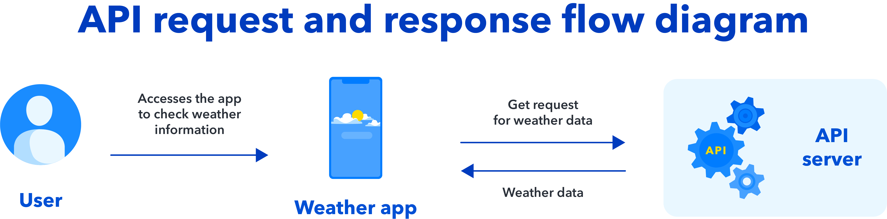
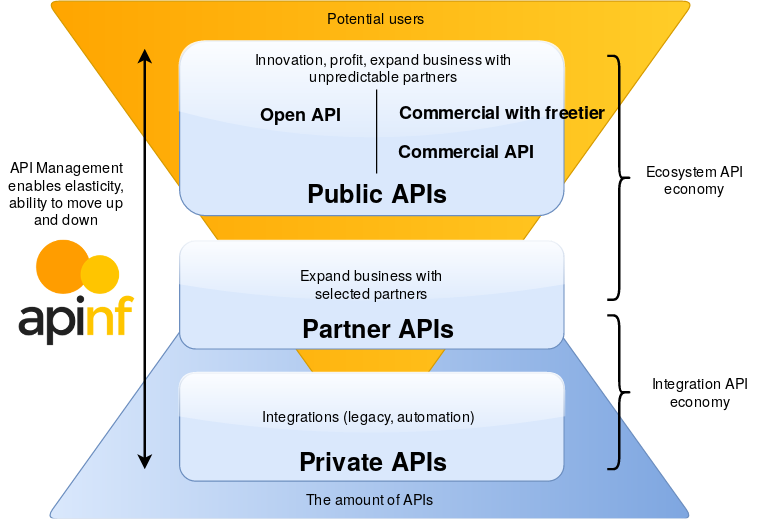
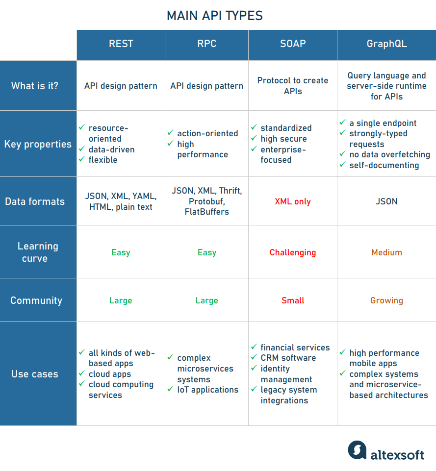
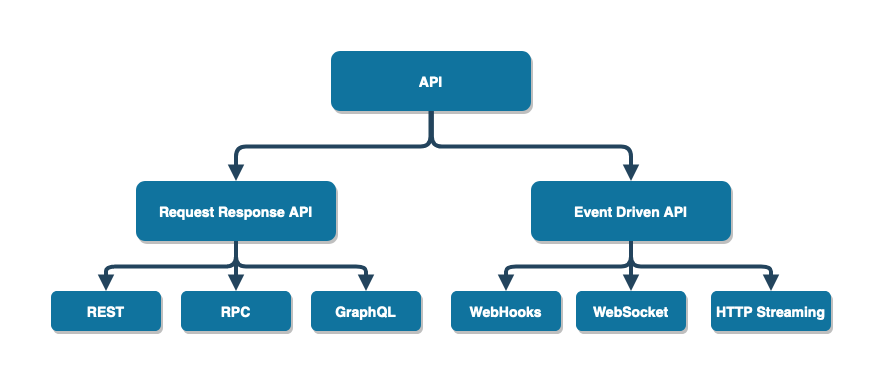
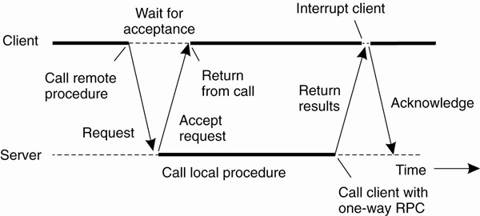
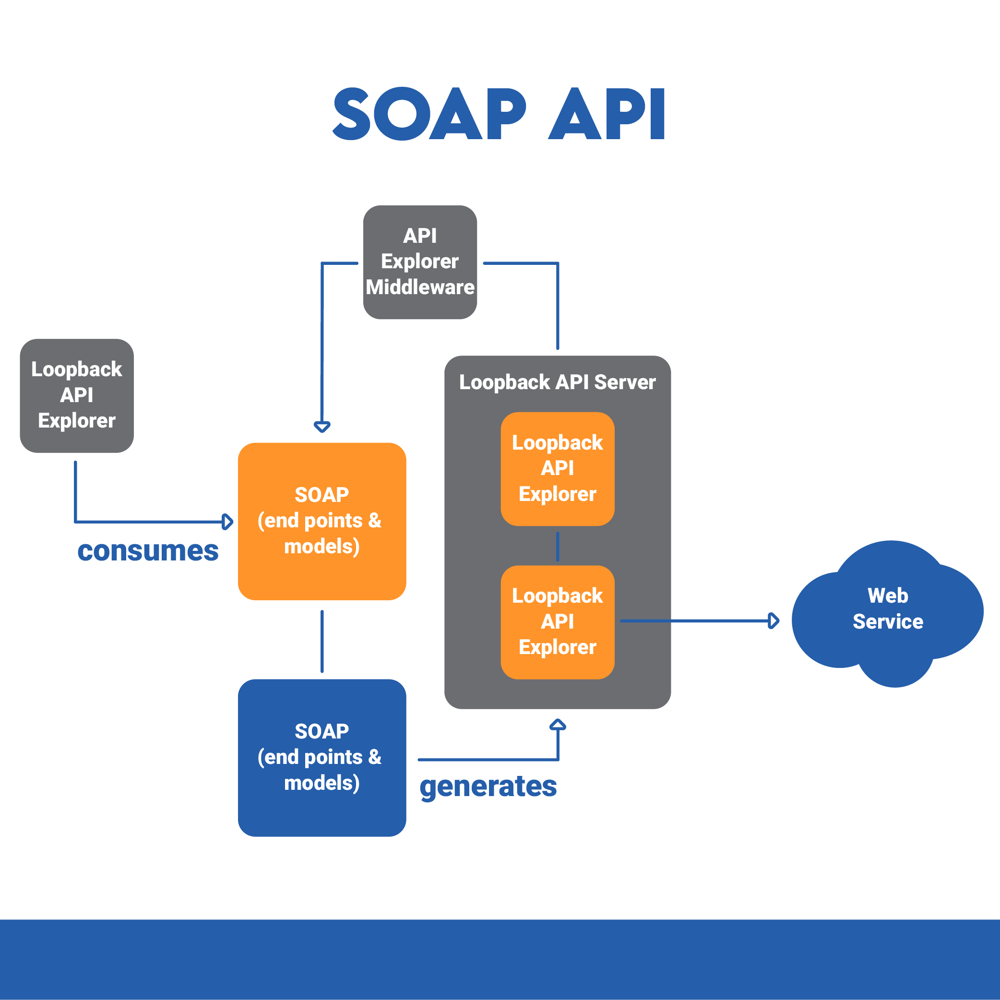
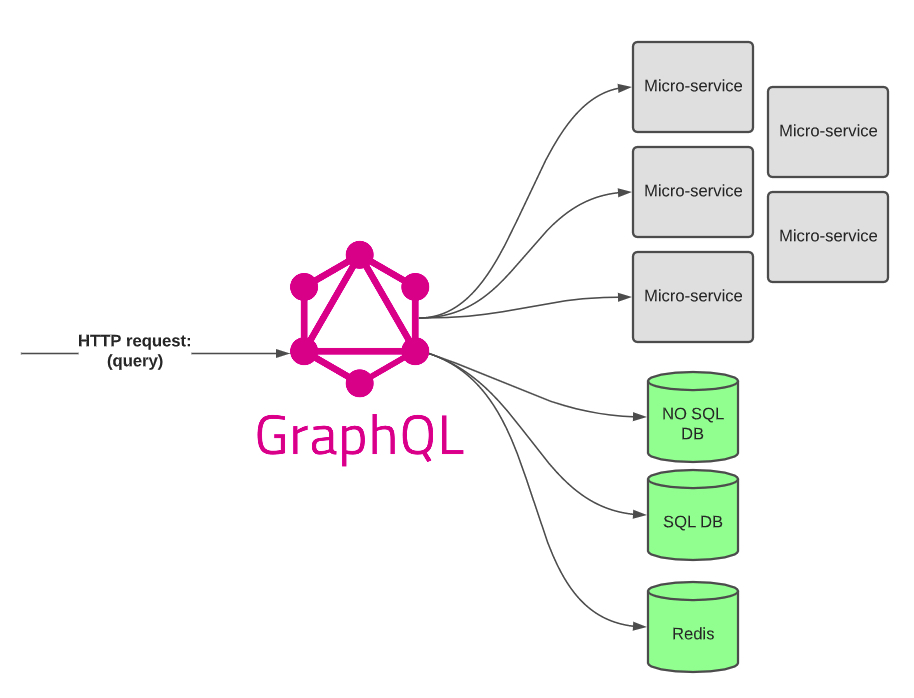

# JavaScript: Consumindo APIs

- [JavaScript: Consumindo APIs](#javascript-consumindo-apis)
  - [O Que é uma API?](#o-que-é-uma-api)
    - [Tipos de APIs - Escopos](#tipos-de-apis---escopos)
    - [Tipos de APIs - Arquiteturas e Protocolos](#tipos-de-apis---arquiteturas-e-protocolos)
  - [Mock](#mock)

## O Que é uma API?

API é o acrônimo para Application Programming Interface (Interface de Programação de Aplicações). Através delas que se pode conectar diversas partes de um sistema, e controlar o acesso a cada uma delas.

Uma API pode, por exemplo, ser construída para consumir de forma segura uma base de dados que o projeto necessita. Dessa forma, seria dividido, de forma grosseira, a arquitetura do projeto entre Front-end (com as views, modelos e requisições à API) e Back-end (com uma base de dados, e uma API para consumir e manipular esses dados).

Podem ser usadas para retornar dados de uma fonte externa, enviar dados para serviços externos, ou executar várias outros ações. É como uma ponte de comunicação entres sistemas.



### Tipos de APIs - Escopos

Dentre os tipos de APIs, e neste caso "tipo" se refere ao seu escopo, existem: Public, Partner, Internal (Private) e Composite. Mas antes de explicar cada um, é necessário entender o que é o padrão OpenAPI para evitar confusões.



**OpenAPI Standard ↓**

Muitas APIs públicas seguem este padrão, previamente conhecido como Swagger, é uma especificação de como escrever uma API pública, com guidelines para detalhes como nomeação de endpoints, formatos de dados, e mensagens de erros.

Os padrões necessários para o OpenAPI e sua automação de algumas tarefas facilita para os desenvolvedores começarem a trabalhar com uma API sem precisar ler uma base complexa de código. 

Para produtores de APIs, oferece uma ampla variedade de ferramentas baseadas no padrão. Times de API podem usar essas ferramentas para rapidamente subirem servidores mock e criar documentação de alta qualidade, entre outras coisas.

Às vezes, uma API pública pode aparecer como "open API", o que pode causar confusão, já que nem todas as APIs públicas seguem este padrão, ainda mais as que foram criadas antes de sua existência; além disso, uma API privada pode aderir ao padrão OpenAPI sem ser de acesso público.

**Public ↓**

Também conhecidas como external ou open APIs, elas estão disponíveis para qualquer um com poucas ou sem restrições, porém, podem pedir um registro/inscrição e autenticação, geralmente via uma API key.

Costumam ser de fácil acesso, já que são de uso público e planejadas para encorajar novos cases e integrações. Pode ser necessário aceitar um termo de condições de uso ou pode ter imposto um limite nas requisições de uma conta gratuita.

**Internal (Private) ↓**

São projetados para uso interno de um grupo fechado, como companhias ou instituições. Para interagir com os dados de uma API deste tipo, o desenvolvedor geralmente precisa ter o acesso permitido ativamente, porque os dados e funcionalidades disponíveis pela API são de propriedade da empresa.

Geralmente são programadas com logs extensivos e capacidades load-balancing porque devem ter uma maior tolerância para falhas e segurança do que APIs públicas. Também não seguem o padrão OpenAPI de forma tão consistente.

Como produtores e consumidores desse tipo trabalham de forma mais conectada, formatos de dados podem ser negociados dependendo de cada caso.

**Partner ↓**

Existem em alguma lugar entre público e privado. Geralmente funcionam para compartilhar dados entre 2 companhias ou organizações para um objetivo específico, enquanto asseguram a estrita proteção de privacidade.

Como exemplo, uma aplicação pode verificar dados x de uma API, mas não seria possível conectar um site pessoal a esta mesma API, por ela não alcançar os padrões necessários de um parceiro institucional aprovado.

É possível autorizar que 2 empresas compartilhem informações das duas contas via partners API.

**Composite ↓**

Este tipo combina diferentes dados e serviços de APIs. É uma sequência de tarefas que rodam de forma simultânea como resultado de sua execução, e não da requisição de uma tarefa. Seu uso principal é para acelerar o processo de execuções e aprimorar a performance de listeners em interfaces web.

Pode também ser definido como a combinação de 2 ou mais APIs pra criar uma sequência, relacionada ou interdependente, de operações. São vantajosas para comportamentos de APIs complexos ou fortemente relacionados.

### Tipos de APIs - Arquiteturas e Protocolos

APIs trocam comandos e dados, isso faz necessário o uso de protocolos e arquiteturas claros - as regras, estruturas e restrições que governam a operação de uma API. Elas definem como a API se conecta a internet e como comunica informação. 

O protocolo escolhido determina como será o design e construção da API, assim como o que será preciso para sua manutenção.



Entre elas, as principais são: REST, RPC, SOAP e GraphQL.



**REST ↓**

Representational State Transfer (REST ou RESTful) é provavelmente o mais conhecido, é uma coleção de princípios de arquitetura. Um serviço REST precisa ter certas características, incluindo interfaces simples, onde recursos são identificados facilmente dentro da requisição e manipulação de recursos usado a interface.


Separa front e back da API e oferece uma flexibilidade considerável em seu desenvolvimento e implementação. Suas características são:

- Sem estado
  - É, por natureza, uma arquitetura cliente-servidor sem estado
- Interface uniforme
  - Um cliente e servidor devem se comunicar um com o outro via HTTP usando convenções URIs, CRUD e JSON
- Cliente-servidor
  - O cliente e o servidor dem ser independentes um do outro
  - As mudanças feitas em uma não devem afetar o outro
- Cache
  - O cliente deve cachear as respostas, já que melhora a experiência do usuário, pois as deixa mais rápidas e eficientes
- Camadas
  - A API deve suportar uma arquitetura em camadas, com cada camada contribuindo para uma hierarquia clara
  - Cada camada deve ser fracamente acoplada e permitir o encapsulamento

**RPC ↓**

Remote Procedural Call é um dos protocolos mais simples e antigos, sendo seu objetivo que o cliente consiga executar código em um servidor. Pode retornar respostas XML ou JSON.

Como o nome sugere, este protocolo chama um método ao invés de um recurso de dados. Sua resposta é a confirmação de que uma função foi invocada, ou um erro indicando o porquê falhou em rodar. Em outras palavras, trabalha com ações.

APIs RPC são raramente públicas; invocar métodos em um servidor remoto não é algo que muitas empresas querem permitir para o usuário geral. Chamar um server RPC na verdade muda o estado do server, então vai além de diferenças com estado/sem estado.

É necessário ter um alto nível de segurança e confiança entre produtores e consumidores, por isso a maioria é de APIs internas. Sendo assim, performance e confiabilidade são mais importantes.



**SOAP ↓**

O Simple Object Access Protocol é outro grande protocolo de API, e é formatado somente em arquivos XML. Suporte uma ampla gama de  protocolos de comunicação, como HTTP, SMTP e TCP/IP.

Ele é extensível e independente de estilo, o que permite ser desenvolvido de várias formas, com fácil inserção de features e funcionalidades. Define como a mensagem é processada, features e módulos inclusos, o protocolo de comunicação suportado e a construção das mensagens.

É fortemente estruturado, estritamente regrado, claramente definido e, em algumas situações, muito intensivo em recursos.



O seu formato padronizado assegurado que não importando o que recebe a mensagem do outro lado, a requisição será executada. Além disso, vem com um error handling nativo. Um de seus casos de uso mais forte é sua alta segurança de transmissão de dados em situações onde 2 partes aceitaram um contrato legal especifico.

Por outro lado, seu formato pode ser muito formal e verboso. Toda mensagem deve incluir um envelope tag no início e final, um corpo que incluí a requisição, um cabeçalho para informação específica e requerimentos adicionais, assim como quaisquer falhas que podem acontecer durante o processo (para o tratamento de erros).

**GraphQL**

Não é estritamente um protocolo API, mas oferece um jeito poderoso para clientes interagirem com dados armazenados em um server ou database. Diferente de REST APIs tradicionais que são limitadas a endpoints pré-definidos, O GraphQL permite que os clientes consultem e recuperem precisamente os dados de que precisam, em uma única solicitação, usando uma sintaxe flexível e intuitiva.

Em sua essência, é uma linguagem de consulta que permite aos clientes descrever a estrutura de dados necessários, e o servidor responde exatamente com esses dados. Essa abordagem fornece aos clientes uma compreensão completa dos dados disponíveis e permite que eles busquem dados relacionados em uma única solicitação, reduzindo os problemas de busca excessiva e sub-busca comumente encontrados com REST APIs.

Um de seus pontos fortes é sua habilidade de sobrepor bancos de dados inteiros, permitindo que os clientes acessam uma ampla gama de dados com consultas específicas. Isso o torna particularmente adequado para aplicações com requisitos de dados complexos, como painéis com uso intensivo de dados ou redes sociais.

Além disso, sua linguagem simples o torna mais fácil até para não desenvolvedores escreverem e entenderem consultas, sua consultas são transparentes e bem documentadas, oferece resultados precisos, mensagens de erros detalhadas e permissões flexíveis.



No entanto, as APIs do GraphQL devem ser construídas com muito cuidado para garantir o control de acesso adequado e evitar que os clientes acessem dados confidenciais ou desnecessários.

Performance também pode sofrer se há muitos campos aninhados em uma única requisição. Também não reusa a semântica de cache HTTP padrão, então requer esforços personalizados para obter o cache adequado.

Tudo isso o torna difícil de usar sem muito treinamento ou experiência.

## Mock

É comum que APIs REST sejam consumidas em front-ends, eventualmente pode ser necessário desenvolver o front antes ou em paralelo com o back. Quando isso acontece, é preciso simular de alguma forma os dados enviados pelo back, ou seja, trabalhar com mocks ou, como se diz, "mockando" o backend.

Mock nada mais é que o nome dado para um conteúdo inventado e utilizado apenas como um marcador de posição. Existem várias formas de fazer isso, uma delas sendo pelo `json-server`. Resumidamente, o `json-server` vai simular uma API REST, com todos os endpoints de um recurso: `GET`, `POST`, `PUT` e `DELETE`. Assim, o frontend consome essa API simulada, possibilitando a criação de toda a camada HTTP da aplicação.

Uma maneira de utilizar uma API fake é seguindo os seguintes passos:

**1. Instalar o Node.js**

**2. Instalar o JSON Server**

- No terminal ou prompt de comando
- Para instalar globalmente, é necessário digitar este comando:

```shell
npm install -g json-server
```

**3. Permitir a Política de Execução de Scripts (Windows)**

Caso seja utilizado no WIndows, é necessário mudar política de execução antes de executar o JSON Server.

- No PowerShell (como administrador), execute o seguinte comando:

```shell
Get-ExecutionPolicy
```

Se o retorno for `Restricted`, que é o padrão, é necessário mudar a política para permitir a execução de scripts.

- Para permitir, basta executar o comando:

```shell
Set-ExecutionPolicy RemoteSigned
```

O PowerShell pode solicitar confirmação para realizar a operação. Pressione "S" (Sim) ou "Y" (Yes) dependendo da linguagem do seu terminal.

- Ao finalizar o teste ou desenvolvimento do projeto, é uma boa prática reverter a política de execução de scripts para o valor original para garantir a segurança do sistema. Para isso é só executar:

```shell
Set-ExecutionPolicy Restricted
```

Mas caso você queira utilizar o JSON Server novamente, será necessário alterar a política de execução para "RemoteSigned" mais uma vez.

**4. Criar um Arquivo JSON com o Conteúdo do Mock**

Para o uso durante desenvolvimento e testes, é necessário criar um arquivo JSON que irá representar o backend esperado paro o projeto. Pode ser uma estrutura simples.

```json
{
  "arrayName": [
    {
      "key": value,
      "key": "value"
    },
    {
      "key": value,
      "key": "value"
    }
  ],
  "arrayName": [
    {
      "key": value,
      "key": "value",
      "key": {
        "key": value,
        "key": "value"
      }
    },
    {
      "key": "value",
      "key": {
        "key": value,
        "key": "value"
      },
      "key": value
    }
  ]
}
```

**5. Inicializar o JSON Server**

- Abrir o terminal integrado da sua IDE, ou outro terminal, mas com o cuidado que esteja executando dentro da pasta do projeto
- Executar o seguinte comando:

```shell
json-server --watch backend/fileName.json
```