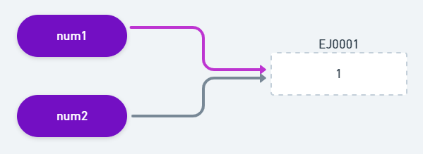

# JavaScript: Clonagem e Imutabilidade

- [JavaScript: Clonagem e Imutabilidade](#javascript-clonagem-e-imutabilidade)
  - [Contextualizando](#contextualizando)
  - [Datatype: Armazenamento na Memória](#datatype-armazenamento-na-memória)
  - [Construindo uma Função de Checagem de Tipos](#construindo-uma-função-de-checagem-de-tipos)
  - [Construindo uma Função de Clonagem Profunda](#construindo-uma-função-de-clonagem-profunda)
    - [De Arrays](#de-arrays)
    - [De Objetos](#de-objetos)
    - [Construindo uma Função para Ambos](#construindo-uma-função-para-ambos)
  - [Tornando os Dados Imutáveis](#tornando-os-dados-imutáveis)

## Contextualizando

O princípio da imutabilidade prega que nenhum dado/estado deve ser alterado, mas sim evoluído e transformado. 

Este princípio garante a consistência de uma informação, que pode ser acessada e lida por diversos pontos de um software, mas que nenhum destes pontos podem alterá-la, causando uma violação. Somente um único ponto isolado pode evoluir essa informação e disponibilizá-la para o restante do software consumir.

É possível construir uma informação imutável, que mesmo se for replicada, seus clones não poderão causar impacto na informação original, pois estes clones, internamente, correspondem a novos endereços de memória.

Existem bibliotecas, como Lodash, que possuem funções capazes de criar clones em profundidades de estruturas complexas, mas é importante entender o funcionamento dessas estruturas e clones.

**Conceitos ↓**

Existem diversas maneiras de se clonar uma estrutura de dados, porém, apenas há 2 tipos de clonagens:

- Shadow Clone
  - Copia somente a superfície de uma estrutura alvo para um outro endereço de memória, e mantém suas propriedades apontando para o mesmo endereço de memória da estrutura original.
  - Qualquer alteração nas propriedades internas da cópia afetará a estrutura original, e vice-versa.
- Deep Clone
  - Copia a estrutura alvo e todas as suas propriedades internas para novos endereços de memória.
  - Ou seja, gera uma nova estrutura idêntica e desconectada da estrutura original, em que qualquer alteração nesta estrutura não refletirá na estrutura original.

Cada técnica tem sua utilidade em contextos diferentes. Quando se trabalha com estruturas constituídas de tipos primitivos, não há necessidade da criação de mecanismos complexos e custosos para clonagem. Porém, ao trabalhar com estruturas de dados complexas e aninhadas, o Deep Clone é a melhor alternativa.

## Datatype: Armazenamento na Memória

O JS possui dois grupos de tipos de dados: os tipos primitivos — Boolean, Null, Undefined, BigInt, String, Number e Symbol — e os tipos não primitivos.

Os tipos primitivos são imutáveis por natureza. Ao realizar qualquer alteração em um tipo primitivo, o próprio interpretador do Javascript, em tempo de execução, se encarregará de alocar um novo endereço de memória para o resultado transformado:

```js
let original = 0; // num1
let copy = original; // num2

copy++;

console.log(original); // 0
console.log(copy); // 1
```

No exemplo, a variável de tipo primitivo `number` foi criada, o interpretador do Javascript criou um identificador único para ela. Alocou um endereço na memória e armazenou o valor "1" no endereço alocado.


Quando a segunda variável teve sua atribuição com o valor definido como a variável `original`, o JavaScript fez o seguinte: 

- Definiu um identificador único para a variável: `copy`
- Apontou o identificador para o mesmo endereço de memória da variável `original`



No entanto, no momento em que o valor de `copy` foi incrementado, o JS alocou uma nova unidade de memória, armazenou o valor da expressão: `"copy++"` e apontou o identificador da variável `copy` para este novo endereço de memória.


Este comportamento é diferente se for realizado com objetos e arrays, que são considerados tipos não primitivos.

Estas estruturas de dados são armazenadas em outra região dentro da arquitetura da linguagem, que chama-se `Heap`, e ela é capaz de armazenar dados não ordenados que podem crescer e diminuir dinamicamente como objetos e arrays.

```js
const person = {};
```

No exemplo acima, foi declarado uma variável `person` e nela foi atribuído um tipo não primitivo como um objeto vazio. Nessa caso o JavaScript fez o seguinte: 

- Um identificador é criado com o nome `'person'`
- Um endereço de memória é alocado em tempo de execução na Stack
- É armazenado neste endereço criado na stack, uma referência para um endereço de memória alocado na Heap
- O endereço de memória na Heap armazenará o valor que foi atribuído a `'person'`, neste caso um objeto vazio

A partir deste ponto, qualquer alteração feita no objeto acontecerá na Heap, e todas as variáveis que apontam para o mesmo endereço de memória de `'person'`, serão afetadas pela mudança.

```js
const person = {}
const clonedPerson = person
person.name = 'John Shepard'

console.log(person.name) // 'John Shepard'
console.log(person.clonedPerson) // 'John Shepard'
```

Este comportamento é nativo do JavaScript na hora de lidar com a memória. Isso acontece justamente para economizar memória e ganhar performance.

Em certos casos, principalmente quando se trabalha seguindo o princípio de imutabilidade, um dos pilares do paradigma funcional, se quer um comportamento diferente. Copiar todos os valores que estão contidos dentro de endereços de memória, para novos endereços de memória. 

Esta prática livra do efeito colateral presente na concorrência de acesso a dados: Se dois locais distintos da aplicação concorrem para acessarem e subscreverem um mesmo recurso, no mesmo instante de tempo, um dos locais que espera receber uma "bola", pode obter um "quadrado" devido a atualização que o outro local fez anteriormente.

## Construindo uma Função de Checagem de Tipos

Essa função é capaz de checar o tipo de qualquer variável, isso auxiliará a testar o tipo de estruturas arrays e objetos.

```js
const typeCheck = (type) => {
  const typeString = Reflect.apply(Object.prototype.toString, type, [])
  return typeString.slice(
    typeString.indexOf(' ') + 1,
    typeString.indexOf(']')
  ).toLowerCase()
}
```

Basicamente: 

- A função `typeCheck` recebe um valor
- Em cima deste valor é executado a chamada do método `toString` no prototype dos objetos com auxílio da API Reflect, que assegura a devida execução do método
- O seu retorno será uma string envolvida por colchetes como a seguinte representação: 
  - `[object String]`
- Por fim, com auxílio das funções `slice`, `indexOf` e `toLowerCase` presentes nas strings, é possível manipular o resultado e devolver uma string que representa o valor passado como parâmetro da função

Por que não usar o operador typeof do próprio Javascript ao invés de criar uma função como essa? O typeof não sabe diferenciar um null de um object.

```js
console.log(typeof null === typeof {}) // true
```

Resultados da função:

```js
console.log(typeCheck([])) // array
console.log(typeCheck(null)) // null
console.log(typeCheck({})) // object
console.log(typeCheck('teste')) // string
console.log(typeCheck(123)) // number  
```

## Construindo uma Função de Clonagem Profunda

### De Arrays

Para clonar profundamente uma estrutura de array, é preciso adentrar em cada posição e testá-la. E se cada posição do array for um array, adentrar neste e teste-lo.

E assim recursivamente até chegar na condição de parada, neste caso, qualquer valor diferente de um array.

```js
const cloneArray = (element) => {
  const clonedArray = []
  for (const item of element) {
    if (typeCheck(item) === 'array') clonedArray.push(cloneArray(item))
    else clonedArray.push(item)
  }
  return clonedArray
} 
```

O resultado é uma função estruturada e imperativa. Com alguns ajustes, ela pode ficar ainda mais enxuta e declarativa, é a programação funcional:

```js
const cloneArray = (element) => {
  if (typeCheck(element) !== 'array') return element
  return element.map(cloneArray)
}
```

O resultado do funcionamento da função é o seguinte:

```js
const numbers = [1, 2, 3]
const numbersCopy = numbers
console.log(numbers === numbersCopy) // true
console.log(numbers === cloneArray(numbers)) // false
```

### De Objetos

Seguindo a mesma lógica da função anterior, o objetivo é percorrer as propriedades de um objeto e copiá-las para um novo objeto. 

Novamente é necessário usar a técnica de recursividade, pois não se tem um limite pré-definido de profundidade, enquanto houver uma propriedade que seja do tipo "object", entre nela e percorra-a também retornando um novo objeto.

```js
const cloneObject = (element) => {
  if (typeCheck(element) !== 'object') return element
  // implementation
}
```

Primeiro é necessário testar o tipo de dado recebido por argumento, no caso a variável `'element'`. Se o tipo de `element` for diferente de `object`, retorna o elemento. Senão, prossegue para o restante da implementação.

A função construtora de objetos `Object` possui um método estático chamado `fromEntries`. Este método retorna um novo objeto a partir de uma estrutura de dados que se assemelha a um array bidimensional: `[['chave', 'valor'], ...]`.

```js
console.log(Object.fromEntries([['name', 'oliwer'], ['age', 22]]))
// { name: 'oliwer', age: 22 }
```

Partindo deste ponto, é possível obter as chaves de propriedades de `element` por meio de um array, com o método `Object.keys` e, em cima deste array, mapear um novo array bidimensional, onde cada valor de propriedade será passada recursivamente para a função `cloneObject`.

```js
const cloneObject = (element) => {
  if (typeCheck(element) !== 'object') return element
  return Object.fromEntries(
    Object.keys(element).map((key) =>
      [key, cloneObject(element[key])]
    )
  )
}
```

Testando a função, é retornado o seguinte resultado:

```js
const user = { name: 'oliwer', address: {country: 'Brazil', state: 'RS'} }
const clonedUser = user
console.log(user.address === clonedUser.address) // true
console.log(user.address === cloneObject(user).address) // false
```

### Construindo uma Função para Ambos

Agora que se entende o funcionamento da clonagem de arrays e objetos, é possível juntar essa implementação em uma só função.

```js
const deepClone = (element) => {
  switch (typeCheck(element)) {
    case 'array':
      return cloneArray(element);
      break;
    case 'object':
      return cloneObject(element);
      break;
    default:
      return element;
  }
}
```

A função avaliará o `element`, se ele for do tipo array, irá executar o `cloneArray`, agora se for do tipo object, irá executar o `cloneObject`.

Caso não entre em nenhuma dessas condições, apenas retorna seu valor original.

O próximo passo é ajustar em cada função de clonagem, para que elas chame o `deepClone` recursivamente:

```js
const cloneArray = (element) => {
  if (typeCheck(element) !== 'array') return element
  return element.map(deepClone)
}

/* ... */

const cloneObject = (element) => {
  if (typeCheck(element) !== 'object') return element
  return Object.fromEntries(
    Object.keys(element).map((key) => [key, deepClone(element[key])])
  )
} 
```

Em um teste final:

```js
const person = {
  name: 'oliwer',
  age: 22,
  hobbies: [
    'movie',
    'music',
    'books'
  ]
}

console.log(deepClone(person).hobbies === person.hobbies) // false
console.log(deepClone(person) === person) // false
```

## Tornando os Dados Imutáveis

Com as funções anteriores, é possível clonar qualquer estrutura de objeto e array, mas ainda assim não se escapa do comportamento natural do Javascript.

Se algo forma alterado no clone, esta alteração é refletida em todas as variáveis que apontam para a mesma referência.

Essas estruturas clonadas são mutáveis:

```js
const person = {
  name: 'oliwer',
  age: 22,
  hobbies: [
    'movie',
    'music',
    'books'
  ]
}
const clonedPerson = deepClone(person)
console.log(clonedPerson === person) // false
console.log(clonedPerson.name) // oliwer

const newClonedPerson = clonedPerson
newClonedPerson.name = 'daniel'

console.log(newClonedPerson.name) // daniel
console.log(clonedPerson.name) // daniel
```

Mas isso pode ser resolvido com uma simples função:

```js
const freeze = (data) => Object.freeze(data);
```

A função construtora Object em Javascript, disponibiliza um método estático capaz de congelar objetos. Este congelamento impede qualquer alteração, inserção ou remoção de dados dentro da estrutura congelada. 

Entretanto, esse congelamento é realizado em nível superficial. Isso significa que a estrutura de dados interna do objeto congelado não será congelada e a mesma estará suscetível a mudanças. 

Aqui se traz de volta a recursão; uma simples mudança na função `deepClone` é necessária:

```js
const deepClone = (element) => {
  switch (typeCheck(element)) {
    case 'array':
      return freeze(cloneArray(element));
      break;
    case 'object':
      return freeze(cloneObject(element));
      break;
    default:
      return element
  }
}
```

Resultado:

```js
const person = {
  name: 'oliwer',
  age: 22,
  hobbies: [
    'movie',
    'music',
    'books'
  ]
}
const clonedPerson = deepClone(person)
console.log(clonedPerson === person) // false
console.log(clonedPerson.name) // oliwer

const newClonedPerson = clonedPerson
newClonedPerson.name = 'daniel'

console.log(newClonedPerson.name) // oliwer
console.log(clonedPerson.name) // oliwer
```

Com isso é possível observar que as estruturas `person` e `clonedPerson`, apesar de possuírem os mesmos valores, apontam para endereços de memória diferentes.

 E sobre a estrutura resultante (`clonedPerson`), se tentar reescrever alguma de suas propriedades, a mudança não acontecerá, pois a estrutura é imutável.