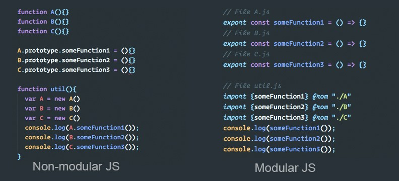

# JavaScript: Módulos

- [JavaScript: Módulos](#javascript-módulos)
  - [Contextualizando](#contextualizando)
  - [.mjs VS .js](#mjs-vs-js)
  - [Acessando Recursos](#acessando-recursos)
    - [Exportando](#exportando)
    - [Importando](#importando)
    - [Agregação](#agregação)
    - [Aplicando ao HTML](#aplicando-ao-html)
  - [Diferenças Entre Módulos e Scripts](#diferenças-entre-módulos-e-scripts)
  - [Módulos e Classes](#módulos-e-classes)
  - [Carregamento Dinâmico](#carregamento-dinâmico)

## Contextualizando

Os programas JavaScript começaram muito pequenos - a maior parte do seu uso era para executar tarefas isoladas de script, fornecendo um pouco de interatividade às páginas da Web sempre que necessário, de modo que scripts grandes geralmente não eram comuns.

Com o avanço da linguagem e sua divisão de foco para serviços mais complexos, agora se tem aplicativos completos sendo executados em navegadores com muito JavaScript, além de ser usado em outros contextos.

Foi necessário começar a pensar em fornecer mecanismos para dividir programas JS em módulos separados que podem ser importados quando necessário. 

Node.js possui essa capacidade há muito tempo e existem várias bibliotecas e estruturas JavaScript que permitem o uso do módulo.



**Exemplo de uma Estrutura Básica  ↓**

```
index.html
main.js
modules/
    file.js
    file.js
```

## .mjs VS .js

A extensão comum `.js` pode ser tranquilamente usada para os arquivos de módulos, mas em outros recursos se pode observar a extensão `.mjs` — a documentação da V8 recomenda ela.

Os motivos sã0:

- Maior clareza, ou seja, deixa claro quais arquivos são módulos e quais são JavaScript regulares.
- Garante que os arquivos de módulo sejam analisados como um módulo por runtimes, como Node.js, e build tools, como Babel.

É importante ressaltar que para que os módulos com a extensão `.mjs` funcionem corretamente nos browsers, o server deve servir um header `Content-Type` que contenha um tipo MIME JavaScript, como `text/javascript`.

Caso contrário, retornará um erro estrito de verificação do tipo MIME, de acordo com as linhas "O servidor respondeu com um tipo MIME não JavaScript" e o navegador não executará o código. A maioria dos servidores já define o tipo correto para arquivos `.js`, mas ainda não para arquivos `.mjs`.

É possível configurar o servidor para definir a configuração correta, no entanto, isso pode causar confusão se você não controlar o servidor do qual está servindo arquivos ou publicar arquivos para uso público.

No moment, para portabilidade, a extensão `.js` é mais interessante.

Também é importante notar que:

- Algumas ferramentas podem nunca suportar `.mjs`, como TypeScript
- O atributo `<script type="module">` é usado para indicar quando um módulo está sendo apontado

## Acessando Recursos

### Exportando

A primeira coisa que se precisa fazer para obter acesso aos recursos do módulo é exportá-los. Isso é feito usando a declaração `export`.

```js
export const varName = value;

export function fName(parameter) {
    // code here
}
```

É possível exportar funções, variáveis e classes. Eles precisam ser itens de nível superior; não se pode exportar algo dentro de uma função, por exemplo.

Uma maneira mais conveniente de exportar todos os itens desejados é usar uma única instrução de exportação no final do arquivo do módulo, seguido da lista separado por vírgula dos recurso que serão exportados envoltos em chaves.

```js
export {varName, fName, ...}
```

**Default vs. Nomeados ↓**

Exportações nomeadas são quando cada item (seja uma função, const, etc.) é referido  por seu nome na exportação e esse nome também foi usado para se referir a ele na importação.

Há também um tipo de exportação chamada default export, projetada para facilitar a função fornecida por um módulo e também ajuda os módulos JavaScript a interoperar com os sistemas de módulos `CommonJS` e `AMD` existentes.

Para fazer isso é só escrever na parte inferior do arquivo:

```js
export default resourceName;
```

Ou também acrescentar diretamente no recurso:

```js
export default function() {/* ... */};
```

**Alias ↓**

Os recursos podem ser renomados na exportação, recebendo um alias que pode ser usado nas interações com o recurso dentro do arquivo em que for importado.

```js
export {resourceName as resourceAlias, ...}
```

Às vezes os usos de alias são necessários quando há a possibilidade de conflito de nomenclatura entre módulos importados em um mesmo arquivo.

### Importando

Depois de exportar alguns recursos do módulo, é necessário importá-los para o script para poder usá-los. A maneira mais simples de fazer isso é a seguinte:

```js
import {varName, fName, ...} from './modules/file.js';
```

A declaração do `import` seguido or uma lista separada por vírgula dos recursos importados grupados em chaves, seguidos pela palavra-chave `from`, seguida pelo caminho para o arquivo do módulo - um caminho relativo à raiz do site.

Depois de importar os recursos para o seu script, é possível usá-los exatamente como eles foram definidos no mesmo arquivo.

Os recursos podem ser renomados na importação, recebendo um alias que pode ser usado nas interações com o recurso dentro do arquivo em que foi importado.

```js
import resourceName as resourceAlias from './modules/file.js';
```

A importação de recursos de exportações padrão pode ser feita de duas maneiras:

```js
import resourceName from './modules/file.js';
// or
import {default as resourceAlias} from './modules/file.js';
```

É possível também importar os recursos do módulo dentro de um objeto de módulo. Isso captura todas as exportações do módulo importado e as deixa disponíveis como membros de um objeto, sendo acessados pelo dot notation:

```js
import * as moduleName from './modules/file.js';

moduleName.resourceName();
```

### Agregação

Haverão momentos onde será desejados ou necessário agregar módulos. 

Os `import` e `export` só podem ser usados em módulos, não scripts regulares. É possível ter vários níveis de dependências, nos quais deseja simplificar as coisas, combinando vários submódulos em um módulo pai.

```
modules/
  canvas.js
  aggregated-modules.js
  individual-modules/
    file.js
    file.js
    file.js
```

Em cada submódulo a exportação será feita de forma normal:

```js
export {resourceName};
```

Em seguida, entra a parte de agregação, onde os módulos que já foram exportados nos arquivos individuais, serão exportados novamente; eles capturam as exportações dos submódulos individuais e os disponibilizam efetivamente no módulo de agregação.

```js
export {resourceName} from './individual-modules/file.js';
export {resourceName} from './individual-modules/file.js';
export {resourceName} from './individual-modules/file.js';
```

Por fim, é só obter acesso aos recursos dos módulos com o import único do módulo agregado:

```js
import {resourceName, resourceName, resourceName, ...} from './individual-modules/file.js'
```

### Aplicando ao HTML

É muito semelhante ao modo de aplicação de um script regular a uma página, com algumas diferenças.

```html
<script type='module' src='file.js'></script>
```

O script onde foi importado os recursos do módulo atua basicamente como o módulo de nível superior. Se for omitido, o Firefox, por exemplo, exibirá um erro `"SyntaxError: as declarações de importação podem aparecer apenas no nível superior de um módulo"`.

## Diferenças Entre Módulos e Scripts

- É preciso tomar cuidado nos testes locais
  - Se tentar carregar o arquivo HTML localmente (i.e. com um arquivo:// URL), serão encontrados erros do CORS devido a requisitos de segurança do módulo JavaScript.
  - É preciso fazer os testes através de um servidor.
- Além disso, se pode obter um comportamento diferente das seções de script definidas dentro dos módulos e não nos scripts padrão. 
  - Isso ocorre porque os módulos usam strict mode automaticamente.
- Não há necessidade de usar o atributo `defer` ao carregar um script de módulo. 
  - Módulos são adiados automaticamente.
 Os módulos são executados apenas uma vez, mesmo que tenham sido referenciados em várias tags `<script>`.
- Por último, mas não menos importante: 
  - Os recursos do módulo são importados para o escopo de um único script - eles não estão disponíveis no escopo global. 
  - Portanto, podem ser acessados apenas os recursos importados no script para o qual eles foram importados e não podem ser acessados no console JavaScript, por exemplo. 
  - Ainda serão recebidos erros de sintaxe mostrados no DevTools, mas não se pode usar algumas das técnicas de depuração esperadas.

## Módulos e Classes

Outra forma de exportar e importar de uma maneira que evite conflitos no código (é útil para a programação orientada a objetos) e o uso de classes nos módulos.

Uma classe não é um objeto, mas sim um template para objetos JavaScript. Toda classe deve ter um método construtor, o qual o nome deve ser exatamente `constructor`, que será executado automaticamente quando um novo objeto for criado e é usado para inicializar as propriedades do objeto. 

A classe pode conter os métodos que serão os recursos exportados para o novo arquivo. Os métodos tem a mesma sintaxe de métodos de objetos.

```js
class ClassName {
  constructor(parameter, ...) { /* ... */ }

  methodName(parameter, ...) { /* ... */ }
}
```

O módulo pode conter todas as funcionalidades em uma classe, que será exportada e importada das seguintes maneiras:

```js
export { className };
/* */
import { className } from './modules/file.js';
```

Para usar os métodos da classe, é só criar um novo objeto dela e acessar os mesmo com dot notation.

```js
let myObject = new className(parameter);
myObject.methodName();
```

## Carregamento Dinâmico

A funcionalidade mais recente a estar disponível nos navegadores é o carregamento dinâmico de módulos. Ela permite que os módulos sejam carregados dinamicamente, ou seja, somente quando eles forem necessários, ao invés de carregar tudo antecipadamente; trazendo grande vantagem de desempenho.

Essa funcionalidade permite que o import seja ligado a uma função, passando o caminho para o módulo como parâmetro. 

Retorna um `Promise` — representa a eventual conclusão (ou falha) de uma operação assíncrona e seu valor resultante — que cumpre com um objeto de módulo dando acesso às exportações desse objeto.

```js
import("./modules/myModule.js").then((module) => {
  // Do something with the module.
});
```

Um exemplo de como usar os módulos dessa forma dinâmica é anexando este importa a um `eventListener`.