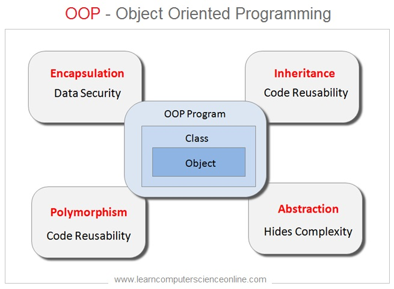
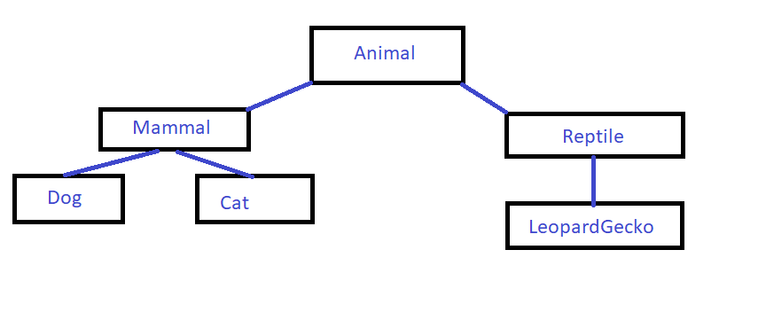
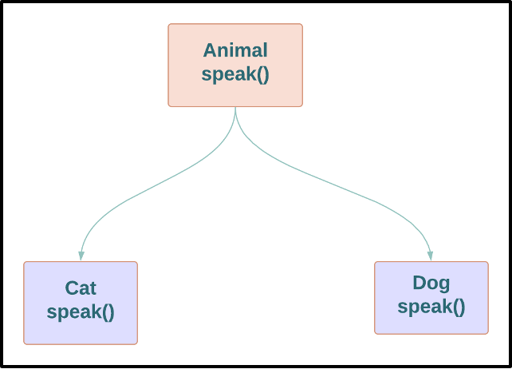
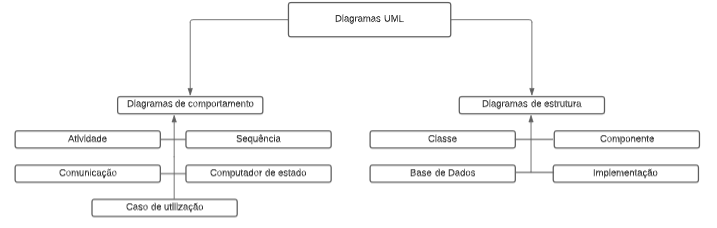
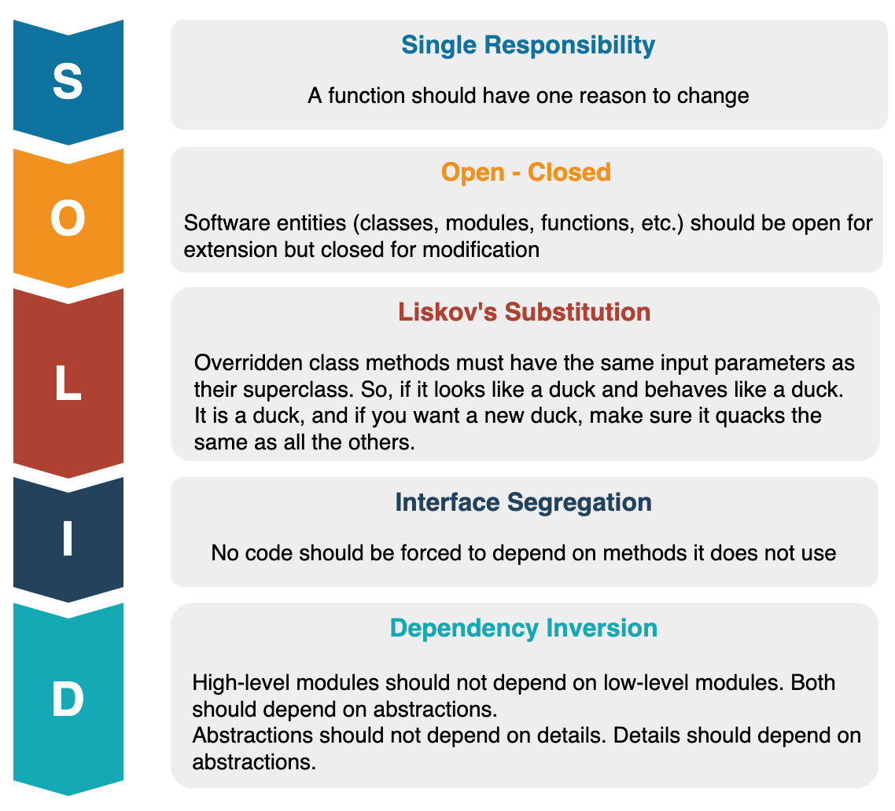

# JavaScript: Programação Orientada a Objetos

- [JavaScript: Programação Orientada a Objetos](#javascript-programação-orientada-a-objetos)
  - [Conceito](#conceito)
    - [Princípios de OOP](#princípios-de-oop)
    - [UML](#uml)
  - [Classes e Protótipos](#classes-e-protótipos)
    - [Protótipo](#protótipo)
    - [Classe](#classe)
    - [New vs Object.create](#new-vs-objectcreate)
  - [Componentes Privados](#componentes-privados)
  - [SOLID](#solid)

## Conceito

Os paradigmas de programação são abordagens de como resolver problemas de programação, baseados em uma teoria ou conjunto de princípios definidos. Cada um cobre a forma como os dados são tratados, a organização do sistema, a forma como o código é escrito, a arquitetura, entre outros aspectos.

Existem mais de 20 paradigmas de programação — como o imperativo, relacional e declarativo — e eles funcionam de forma isolada ou combinados. Alguns são quase como guarda-chuvas.

Os paradigmas imperativos são aqueles que usam afirmações para alterar o estado de um programa, se preocupam com o “como” uma tarefa vai ser executada, o seu passo-a-passo e a sequência dessas etapas.

```js
function doubles(vector){
    let result = [];
    for (let i = 0; i < vector.length ; i++){
        result.push(vector[i] * 2);
    }
    return result;
}
```

Paradigmas que se encaixam nessa categoria são: estrutural, procedural e orientado a objetos.

Os paradigmas declarativos expressam a lógica de um processo sem descrever o seu controle de fluxo. Ou seja, é associado ao “o quê” uma tarefa vai resultar ou retornar. Um paradigma que se encaixa nessa categoria é o funcional.

```js
function doubles(vector){
    return vector.map((item) => item * 2);
}
```

O JavaScript e algumas outras linguagens são consideradas multiparadigma, e isso traz alguns benefícios, pois permite perfis diferentes de desenvolvedores e sistemas utilizarem uma linguagem em comum.

Qual é o melhor paradigma vai de caso a caso, dependendo das circunstâncias se pode utilizar um que seja mais otimizado para determinada aplicação. 

Algumas funcionalidades precisam alterar o estado de uma aplicação, não podendo ser escritas de forma declarativa, assim como os códigos declarativos utilizados podem ter uma implementação imperativa por baixo dos panos.

**Orientação a Objetos ↓**

Espelha o mundo "real" através de uma estrutura de objetos com características (propriedades) e comportamentos (métodos), que interagem entre si.

A sua estrutura central são as classes; a classe não é um objeto, mas sim um template, um molde para objetos.

As propriedades de uma classe são, geralmente, o que descreve aquele objeto, por isso se diz que são suas características. Os valores dessas propriedades são dados literais. 

Já os métodos são ações atreladas aquele objeto, possíveis ações que ele pode fazer. Estes são determinados através de funções; elas são executadas dentro do contexto desse objeto.



A partir destes modelos é que os objetos são criados, é o que é chamado de instância. Seria a ação de instanciar um novo objeto, criar uma nova instância de uma classe.

### Princípios de OOP

**Encapsulamento ↓**

É o conceito de agrupar dados, variáveis, propriedades e métodos relacionados em uma só classe. Seu objetivo principal é restringir o acesso direto de alguns dos elementos da estrutura.

Um atributo ou método que não é visível de fora do próprio objeto é chamado de "privado" e quando é visível, é chamado de "público".

Ler ou alterar um atributo encapsulado pode ser feito a partir de getters e setters (colocar referência).


Esse encapsulamento de atributos e métodos impede o chamado vazamento de escopo, onde um atributo ou método é visível por alguém que não deveria vê-lo, como outro objeto ou classe. Também impede que seja modificado por algo que não deveria.

**Herança ↓**

Quando se diz que uma classe N é um tipo de classe M, significa que esta primeira herda propriedades e atributos da segunda, estabelecendo uma relação mãe-filha de herança entre elas.


Mesmo que a classe filha herde tudo da classe mãe, ainda pode ter atributos e métodos diferentes, por isso são classes separadas.



**Polimorfismo ↓**

É o conceito onde um mesmo método é implementado de formas diferentes, ou seja, um método possui várias formas, várias implementações diferentes em classes diferentes, mas que ainda realiza a mesma ação.



É a mesma propriedade/método, que representa a mesma coisa, só que de formas diferentes.

**Interface ↓**

Quando duas (ou mais) classes possuem comportamentos comuns que podem ser separados em uma outra classe, é interessante a criação de uma interface, que pode ser "herdada" pelas outras classes. 

Ela não é exatamente uma classe, mas sim um conjunto de métodos que todas as classes que herdarem dela devem possuir (implementar) - portanto, uma interface não é "herdada" por uma classe, mas sim implementada.

Na programação, as interfaces são vistas como contratos: uma classe que implementa uma interface deve fornecer uma implementação a todos os métodos que a ela define, e em compensação, a classe pode dizer que ela é do tipo da interface.

Memos que uma interface só possa ser implementada, ela ainda pode herdar de outra interface, criando assim uma hierarquia de interfaces.

### UML

Unified Modeling Language, consiste na padronização de algumas notações para facilitar o entendimento entre os times de desenvolvimento que eventualmente irão lidar com um determinado sistema.

Desta forma, a UML é uma linguagem padrão para visualização, especificação, construção e documentação de um aplicativo ou projeto de software, servindo como uma planta e plano de ação para o projeto.

Ela disponibiliza — através de conceitos, objetos, símbolos e diagramas — uma forma simples, mas objetiva e funcional, de documentação e entendimento de um sistema; e independe da ferramenta em que o aplicativo será desenvolvido.



A UML implementa uma modelagem com uma visão orientada a objetos, mas pode ser utilizada para outros tipos de implementações.

Os elementos principais na UML podem se dividir em: estruturais (classes, interfaces e componentes), comportamentais (interações) e grupos de elementos (pacotes).

E em alguns dos seus tipos de relacionamentos entre entidades se encontram: associação, dependência, generalização e realização.

## Classes e Protótipos

Retomando, a classe é um modelo para um objeto. Elas foram introduzidas ao JavaScript no ECMAScript 2015 (ES6). Antes disso eram usadas somente funções para trabalhar com a orientação de objetos.

Desta particularidade do JS, há também o conceito de herança de protótipo que, ao contrário da herança de classes, foi a forma original da linguagem de pensar sobre o modelo de objetos, de passar propriedades de um objeto para outro.

Nesta linha, todos os objetos devem ter essas propriedades, para executarem essas funções.

No JavaScript é em cima dessa herança de protótipo que o conceito das classes foi implementado.

### Protótipo

Não são apenas uma forma de herança, mas também uma parte integrante da natureza dinâmica da linguagem. Eles permitem que objetos compartilhem propriedades e métodos, facilitando a reutilização de código.

```js
let animal = {
  type: 'Animal',
  showType: function() {
    console.log(this.type);
  }
};

let cat = Object.create(animal);
cat.showType(); // Animal

// Adicionando uma nova propriedade ao protótipo
animal.speak = function(sound) {
  console.log(sound);
};

cat.speak('Meow'); // Meow 
```

Cada objeto tem um protótipo; esse também é um objeto e tem seu próprio protótipo, criando uma "cadeia de protótipos". Quando uma propriedade é acessada em um objeto, a busca ocorre ao longo dessa cadeia até que a propriedade seja encontrada ou a cadeia termine.

Os métodos e propriedades não são copiados de um objeto para outro na cadeia de protótipos - eles são acessados pelo interpretador ao percorrer a cadeia e os métodos executados de acordo com o `this`, ou seja, o contexto em que o método foi executado.

As funções construturas são o meio tradicional de criar objetos e implementar herança em JS.

```js
function Animal(name) {
  this.name = name;
}

Animal.prototype.speak = function() {
  console.log(`${this.name} makes a sound.`);
};

function Dog(name) {
  Animal.call(this, name);
}

Dog.prototype = Object.create(Animal.prototype);
Dog.prototype.constructor = Dog;

let myDog = new Dog('Rex');
myDog.speak(); // Rex makes a sound.
```

Quando objetos e funções são usados para trabalhar com orientação a objetos em JavaScript, os objetos criados não são instâncias diferentes (ou seja, cópias do objeto-base) e sim referências a um mesmo objeto que está sendo delegado aos objetos que o usam como protótipo.

> `__proto__` é uma propriedade que todos os objetos têm e que aponta para o protótipo que foi definido para aquele objeto

> `prototype` é uma propriedade da função que é definida como protótipo quando se usa `new` para criar novos objetos

Praticamente todos os dados criados em JavaScript (objetos, arrays, etc) têm um protótipo, porém apenas alguns deles têm a propriedade `prototype`. 

Não é recomendável alterar diretamente o `prototype`, pois alterar diretamente as regras de herança de qualquer objeto afeta a performance do código em qualquer interpretador. Também não é uma boa prática criar longas cadeias de protótipos, pois percorrer uma cadeia longa afeta a performance do código.

**This ↓**

A keyword `this` se refere a um objeto, muitas vezes ao seu "dono". O `this` existe dentro de um contexto, e seu funcionamento correto depende de estar atrelado ao mesmo.

```js
const user = {
  name = 'Oliwer',
  email = 'olwr@mail.com',
  showInfo: function() {
    console.log(this.name, this.email)
  }
};

// with context
user.showInfo(); // Oliwer olwr@mail.com

// lost context
const show = user.showInfo;
show(); // undefined undefined

/* is the same as:
const show = function() {
  console.log(this.name, this.email)
} */
```

O método `bind()` pode ser usado para ligar o `this` a um determinado contexto:

```js
const printInfo = show.bind(user);
printInfo(); // Oliwer olwr@mail.com
```

Além dele existem outros dois métodos para manipular o contexto de `this`: `call` e `apply`.

O método `call()` executa a função passando valores e parâmetros específicos para serem usados como contexto do `this`. Ou seja, é possível atribuir um `this` diferente do contexto atual ao executar a função, ao até mesmo vincular outros dados ao contexto atual.

O método `apply()` funciona de forma semelhante ao `call()`, porém recebe a lista de argumentos em um array.

### Classe

São criadas a partir da keyword `class` e devem sempre possuir um método construtor `constructor`, este sendo conhecido como construtor de classe.

```js
class ClassName {
  constructor() {/* ... */}
}
```

O método `constructor` é um método especial e segue a seguinte estrutura:

- Deve sempre ter o exato nome `constructor`
- É executado automaticamente quando um novo objeto é criado
- É usado para inicializar propriedades de objetos

```js
class Cat {
  constructor(name, age) {
    this.name = name;
    this.age = age;
  }
}
```

Se ele não for definido, o JavaScript irá adicioná-lo como um método vazio.

A classe pode conter métodos, este com a mesma sintaxe de métodos de objetos.

```js
class ClassName {
  constructor() {/* ... */}
  methodName() {/* ... */}
  methodName() {/* ... */}
  methodName() {/* ... */}
}
```

É possível também adicionar métodos estáticos, ou seja, métodos que não são inicializados junto a uma nova instância, mas sim a partir da própria classe.

Métodos não estáticos não só podem ser a partir de uma instância da classe; já os métodos estáticos só podem ser executados a partir da classe.

```js
class ClassName {
  constructor(param) {/* ... */}
  methodName(param) {/* ... */}
  static methodName(param) {/* ... */}
}
```

Classes não podem ser içadas, ou seja, declarações que usam as classes acima das mesmas não funciona. As classes também funcionam a base do strict mode.

O modo estrito do JavaScript serve para impedir que alguns comportamentos do JavaScript causem “falhas silenciosas” (transformando em erros que são lançados pelo interpretador) e corrigir alguns outros que podem induzir a bugs potenciais e comportamentos inesperados.

Um desses comportamentos é sar uma variável sem antes declará-la.

**Herança ↓**

Pode ser implementada em classes de forma bem simples, basta usar o `extends` para declarar que uma classe irá herdar os componentes (propriedades e métodos) de outra.

```js
class ClassName { // super class
  constructor(param) {
    this.param = param;
  }
}

class OtherClasse extends ClassName { // sub class
  constructor(param, param2) {
    super(param);
    this.param2 = param;
  }
}
```

O método `super()` se refere a classe mãe, sua invocação permite acessar as partes necessárias da classe herdada.

### New vs Object.create

A palavra-chave `new` serve para criar instâncias de objetos; a criação é feita através de uma função construtora, que é equivalente as classes em JavaScript. Só pode ser usado com funções e classes.

```js
function User(name) {
  // this = {};  (implicitly)

  // add properties to this
  this.name = name;
  this.isAdmin = false;

  // return this;  (implicitly)
}
```

```js
function User(name) {
  this.name = name;
  this.isAdmin = false;
}

let user = new User("Jack");

console.log(user.name); // Jack
console.log(user.isAdmin); // false
```

O uso de `__proto__` já é considerado ultrapassado e está no processo de ser descontinuado; em seu lugar existem 3 métodos, que são considerados as formas modernas de se trabalhar com protótipos:

- `Object.getPrototypeOf(obj)`
- `Object.setPrototypeOf(obj, proto)`
- `Object.create(proto[, descriptors])`

```js
let animal = {
  eats: true
};

// create a new object with animal as a prototype
let rabbit = Object.create(animal); // same as {__proto__: animal}

alert(rabbit.eats); // true

alert(Object.getPrototypeOf(rabbit) === animal); // true

Object.setPrototypeOf(rabbit, {}); // change the prototype of rabbit to {}
```

O `Object.create` é mais flexível. Seu primeiro parâmetro é obrigatório e será usado como protótipo do novo objeto; o segundo é um mapa de propriedades com as quais objeto já "nasce".

```js
let animal = {
  eats: true
};

let rabbit = Object.create(animal, {
  jumps: {
    value: true
  }
});

alert(rabbit.jumps); // true
```

## Componentes Privados

Seguindo o conceito de encasulamento, para evitar confusão e uso malicioso, o JavaScript adotou a implementação de propriedades privadas, sendo elas indicadas por '#'.

```js
class ClassName {
  #varName;
  
  constructor(param) {
    this.#varName = param;
  };

  methodName(param) {/* ... */};
}
```

Métodos também podem ser privados, eles existem principalmente para proteger lógicas internas da classe, entre outras coisas.

```js
class ClassName {
  #varName;
  
  constructor(param) {
    this.#varName = param;
  };

  #methodName(param) {/* ... */};
}
```

**Accessors (Getters e Setters) ↓**

No momento em que se tornam privados, o único modo de acessar e modificar estes atributos é por meio de getters, setters e métodos que emulam ambos.

A palavra-chave `get` permite a criação de um método especial, somente de leitura desses atributos, e não aceita o uso de parâmetros; já o `set` permite a modificação do mesmo, e o parâmetro que será usado para essa alteração.

```js
class ClassName {
  #varName;
  
  constructor(param) {
    this.#varName = param;
  };

  get atrName() {
    return this.#varName;
  };

  set atrName(param) {
    this.#varName = param;
  }
}
```

Com eles esses atributos são acessados como propriedades, não como funções. Por este motivo, getters e setters sempre recebem como nome o mesmo da propriedade que estão acessando.

Eles podem ser usados também para atributos públicos, e é até algo recomendo, por terem uma sintaxe simples, bom manejo de dados e ser útil para interações no código.

## SOLID

- Single Responsibility Principle
  - Entidades só devem ter um motivo para mudar, para sofrer alterações, para executar código
  - Ser responsável somente por uma entidade ou uma tarefa
- Open-Closed Principle
  - Objetos deve estar disponíveis para extensão, mas fechados para modificação
  - Deve ser possível adicionar funcionalidades em uma classe, mas não alterar métodos de uma classe que já existem e que já estão em funcionamento ou alterar essas classes mesmo
- Liskov Substitution Principle
  - Uma subclasse deve ser substituível por sua superclasse
  - Se uma classe tem um atributo, a subclasse dela também tem que ter, se algo funciona na superclasse, tem que funcionar na subclasse também
  - Ou seja, uma subclasse não pode quebrar contratos feitos pela superclasse
- Interface Segregation Principle
  - Uma classe não deve ser obrigada a implementar métodos e interfaces que não serão utilizadas
  - Não se deve impor a implementação de algo desnecessário
- Dependency Inversion Principle
  - Dependa de abstrações e não de implementações
  - Algo que está um nível mais acima da hierarquia, não pode depender de nada que está abaixo
  - Também nada pode depender de implementações, e sim abstrações

