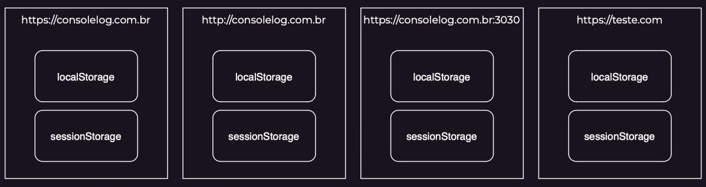

# JavaScript: DOM e Páginas Dinâmicas

- [JavaScript: DOM e Páginas Dinâmicas](#javascript-dom-e-páginas-dinâmicas)
  - [DOM](#dom)
    - [Eventos e Método `addEventListener`](#eventos-e-método-addeventlistener)
    - [Métodos de Atributos](#métodos-de-atributos)
    - [Propriedades](#propriedades)
      - [innerHTML, innerText e textContent](#innerhtml-innertext-e-textcontent)
      - [classList](#classlist)
    - [Manipulando Elementos](#manipulando-elementos)
  - [localStorage](#localstorage)
    - [Como Funciona](#como-funciona)
    - [localStorage vs sessionStorage](#localstorage-vs-sessionstorage)
    - [localStorage vs Cookies](#localstorage-vs-cookies)
    - [Técnicas Avançadas para Manipulação de Dados](#técnicas-avançadas-para-manipulação-de-dados)

## DOM

Document Object Model (DOM), é uma forma padronizada de representar e interagir com objetos em documentos HTML e XML. O DOM representa a estrutura de um documento através de uma árvore de objetos, onde cada objeto representa uma parte do documento. 

Ele modifica dinamicamente essas estruturas, sem precisar atualiza-las, pode:

- Adicionar | modificar | remover
  - tags
  - textos
  - imagens
  - qualquer outro elemento
- Alterar estilos CSS
- Criar novos eventos
- Modificar | receber | mandar valores


O termo “documento” é frequentemente utilizado em referências à página, documento e página são sinônimos.

Há vários métodos que retornam os elementos do documento no JavaScript, tornando possível codar as alterações e interações da página. Dentre eles:

```js
// selects an element by their id
document.getElementById(#id)
// selects an element by their class name
document.getElementByClassName('.class')
// selects an element by their tag name
document.getElementByTagName('name') 
// selects a list of elements with the given tag name belonging to the given namespace
document.getElementByTagNameNS('ns', 'name') 
// selects a NodeList collection of elements with a given name attribute
document.getElementByName('name')
// selects the first element by their id, class or name
document.querySelector('selector')
// selects all the elements by their id, class or name
document.querySelectorAll('name[attr=val]')
// selects the topmost element at the specified coordinates (relative to the viewport)
document.elementFromPoint(x, y)
// selects all the elements at the specified coordinates (relative to the viewport)
document.elementsFromPoint(x, y)
```

Os métodos que podem retornar mais um elemento, retornam valores como `HTMLCollection` ou `NodeList`, que funcionam de forma similar a um array.

**Seletores Query ↓**

Os métodos `querySelector` e `querySelectorAll` retornam, respectivamente, o primeiro elemento e uma lista de todos os elementos do seletor especificado. Diferente de outros métodos, aqui é necessário pontuar qual seletor será usado para achar o elemento no documento.

Da mesma forma que o CSS, os seletores seguem da seguinte maneira:

- Nome da Tag
  - Sem marcação, é o nome da tag HTML no documento
  - `body` | `button` | `form`
- Nome da Classe
  - Marcada com o ponto, é o nome dado a classe do elemento
  - `.main-container` | `.blue-btn` | `.login-form`
- Nome do ID
  - Marcada com a hashtag, é o nome do id do elemento
  - `#header-menu` | `#submit-btn` | `#form-input`

**Elemento por Tag ↓**

O método `getElementByTagName` retorna uma lista de todos os elementos com o nome da tag passada. Já o método `getElementByTagNameNS` retorna uma lista com todos os elementos daquele namespace e tag.

**Elemento por Classe**

O método `getElementClassName` retorna uma lista de todos os elementos com o nome da tag passada.

```js
document.getElementsByClassName("test");
document.getElementsByClassName("red test");
document.getElementById("main").getElementsByClassName("test");
document.getElementsByClassName("test")[0];
```

**Elemento por ID**

O método `getElementId` retorna um objeto representando o elemento que combina com o id passado. Um id deve sempre ser único dentro de um documento, se há 2 ou mais elementos em um documento com o mesmo id, o método retornará somente o primeiro.

```js
getElementById(id);
```

**Elemento por Atributo Nome ↓**

O método `getElementClassName` retorna uma coleção `NodeList` de todos os elementos com o mesmo atributo nome repassado.

```js
getElementsByName(name);
```

**Elementos por Posição ↓**

Os métodos `elementFromPoint` e `elementsFromPoint` retornam, respectivamente, o primeiro elemento mais acima da coordenada especificada e uma lista de todos os elementos na coordenada especificada.

Elementos com `pointer-events` serão ignorados. Se o elemento a coordenada especificada estiver fora dos limites do documento ou a coordenada é negativa, o retorno será `null`.

```js
elementFromPoint(x, y);
elementsFromPoint(x, y);
```

`Document.caretPositionFromPoint` é útil para descobrir a posição especifica dentro do documento.

### Eventos e Método `addEventListener`

Eventos são como sinais que o navegador envia quando algo acontece; é a comunicação entre documento e script quando há alguma interação ou mudança no documento.

O método `addEventListener` (da interface `EventTarget`) seta uma função que será chamada quando o evento especificado ocorrer. Alvos comuns são `Element`, seus filhos, `Document` e `Window`, mas pode ser qualquer um que tem suporte para eventos.

```js
addEventListener(type, listener);
addEventListener(type, listener, options);
addEventListener(type, listener, useCapture);
```

```js
element.addEventListener(event, callback);
```

Alguns eventos:

```
> input → quando um elemento input tem seu valor modificado
> click → quando ocorre um click com o mouse
> dblclick → quando ocorre dois clicks com o mouse
> mousemove → quando mexe o mouse
> mousedown → quando aperta o botão do mouse
> mouseup → quando solta o botão do mouse (útil com os dois acima para gerenciar drag'n'drop)
> keypress → quando pressiar e soltar uma tecla
> keydown → quando pressiar uma tecla
> keyup → quando soltar uma tecla
> blur → quando um elemento perde foco
> focus → quando um elemento ganha foco
> change → quando um input, select ou textarea tem seu valor alterado
> load → quando a página é carregada
> unload → quando a página é fechada
> submit → disparado antes de submeter o formulário (útil para realizar validações)
```

### Métodos de Atributos

Um elemento HTML é geralmente constituído de tag, atributo, valor e conteúdo. Atributos são propriedades dadas há um elemento em sua tag de abertura/única, como `src` e `disabled`, e costumam ter um valor que os acompanha.

Dentre os métodos de manipulação de DOM, estes 4 são muito úteis e comuns: `getAttribute`, `setAttribute`, `hasAttribute` e `removeAttribute`.

**getAttribute ↓**

Obtêm o valor de um atributo específico do elemento selecionado.

```js
const element = document.querySelector(selector);
const elementAttrValue = element.getAttribute('attr-name');
console.log(elementAttrValue); // attribute value
```

**setAttribute ↓**

Define ou modifica o valor de um atributo específico do elemento selecionado. Ele aceita dois argumentos: o nome do atributo e o valor deste atributo, respectivamente. Se o atributo já existir, o método setAttribute irá sobrescrevê-lo; caso contrário, ele criará um novo atributo.

```js
const element = document.querySelector(selector);
element.setAttribute('attr-name', 'attr-value');
```

**hasAttribute ↓**

Verifica se o elemento selecionado tem o atributo específico. Ele recebe um argumento, que é o nome do atributo a ser verificado. É um método booleano.

```js
const element = document.querySelector(selector);
const elementHasAttr = element.hasAttribute('attr-name');
console.log(elementHasAttr); // true or false
```

**removeAttribute ↓**

Remove um atributo específico do elemento selecionado. Ele recebe um argumento, que é o nome do atributo a ser removido.

```js
const element = document.querySelector(selector);
element.removeAttribute('attr-name');
```

### Propriedades

Há muitas propriedades importantes para acessar e manipular elementos no DOM, dentre elas:

- `parentNode`
  - Acessa o nó pai de um elemento
- `childNode`
  - Acessa todos os nós filhos de um elemento
- `nextElementSibling`
  - Acessa o próximo irmão (nó adjacente) de um elemento
- `previousElementSibling`
  - Acessa o irmão anterior (nó adjacente) de um elemento

Existem também propriedades que lidam com algo específico do elemento, como conteúdo textual ou classes.

#### innerHTML, innerText e textContent

Novamente, um elemento possui tag, atributo, valor e conteúdo. Para adicionar, manipular e retornar o conteúdo de um elemento temos 3 métodos principais, `innerHTML`, `innerText` e `textContent`, cada um com seu caso de uso específico.

**InnerHTML ↓**

Altera e retorna todo HTML do elemento especificado, ou seja, pode ser usado para manipular e incluir HTML no documento por meio do JS, por exemplo criar um botão ou alterar um texto, como também pode retornar todo o HTML "cru" daquele elemento.

Simplificando: recupera e define o conteúdo em formato HTML.

```js
const element = documento.querySelector(selector);
element.innerHTML = '<button>Click me</button>';
```

Ele pode ser usado para inserção de tags, textos e imagens em uma página web, gerando um risco de segurança. Parecido com um cross-site scripting, mas inofensivo, pois o HTML5 especifica que uma tag `<script>` inserida via `innerHTML` em uma página web não deve ser executada. 

Entretanto, existem formas de executar JavaScript sem usar `<script>`, fazendo com que ainda exista um risco de segurança ao utilizar o `innerHTML`. Sendo assim, recomenda-se não utilizar ele para user input.

**InnerText ↓**

Retorna e insere apenas texto puro, sem formatação HTML, ou seja, representa o conteúdo textual "renderizado" de um nó e seus descendentes. Usada como getter, retorna de maneira aproximada o texto que o usuário obteria caso tivesse selecionado o conteúdo e copiado para a área de transferência.

Simplificando: recupera e define o conteúdo da tag como texto simples.

```js
const element = documento.querySelector(selector);
element.innerText = 'Click me';
```

**textContent ↓**

Funciona de forma similar ao anterior, porém retorna todo o conteúdo textual do elemento, incluindo o que não está visível ao usuário, como estilizações CSS, scripts, espaços e quebras de linha.

```js
const element = documento.querySelector(selector);
console.log(element.textContent);
```

#### classList

É uma propriedade do JavaScript que representa uma lista de classes CSS. Ele fornece métodos que facilitam a adição, remoção e verificação de classes, tornando a manipulação de classes CSS mais eficiente e menos suscetível a erros de programação.

**add ↓**

Este método adiciona uma classe a um elemento. Ele aceita o nome da classe como argumento e adiciona a classe ao elemento, se ela ainda não estiver presente.

```js
const element = document.getElementById('selector');
element.classList.add('myClass');
```

**remove ↓**

Este método remove uma classe a um elemento. Ele aceita o nome da classe como argumento e remove a classe ao elemento, se ela estiver presente.

```js
const element = document.getElementById('selector');
element.classList.remove('myClass');
```

**toggle ↓**

Este método permite alternar uma classe em um elemento. Se a classe já estiver presente no elemento, o método a remove; caso contrário, ele a adiciona.

```js
const element = document.getElementById('selector');
element.classList.toggle('myClass');
```

**contains ↓**

Este método verifica se uma classe específica está associada a um elemento.

```js
const element = document.getElementById('selector');
if (element.classList.contains('myClass')) {
  // code here
};
```

### Manipulando Elementos

Além de permitir a manipulação de elementos existentes por seus atributos, classes e com as propriedades `innerText` e `textContent`, e a manipulação e criação de elementos com `innerHTML`, o DOM também possui métodos e propriedades próprias que criam, inserem, deletam, alteram e estilizam elementos.

**createElement ↓**

Permite criar elementos HTML de forma dinâmica. Recebe um parâmetro, que é o nome da tag HTML do elemento desejado, e retorna um novo nó com o tipo do elemento.

```js
const element = document.createElement(htmlTag);
```

**append ↓**

Esse método permite inserir múltiplos nós ao final de um elemento. Se uma string for passada, o método a trata como um texto e a adiciona diretamente.

```js
parentNode.append(...nodes);
parentNode.append(...DOMStrings);
```

Esse método não tem valor de retorno, ou seja, implicitamente retorna `undefined`.

**appendChild ↓**

É um método da interface `Node`, permite inserir um nó ao final de uma lista de child-nodes de um específico parent-node. Recebe um parâmetro, o nó filho que se deseja inserir, e retornar este mesmo nó.

```js
parentNode.appendChild(childNode);
```

Se o `childNode` é uma referência a um nó existente no documento, então o método move este nó de sua posição atual para a nova posição.

Diferentemente do `append()`, o `appendChild()` não aceita strings diretamente.

**prepend ↓**

Funciona da mesma forma que o `append`, porém insere os nós antes do primeiro filho daquele parent-node.

```js
parentNode.prepend(...nodes);
parentNode.prepend(...DOMStrings);
```

**replaceChild ↓**

Neste método, o elemento selecionado substituí um nó-filho por outro, sendo ambos passados como parâmetros, novo e antigo, respectivamente.

```js
parentNode.replaceChild(newChild, oldChild);
```

**removeChild ↓**

Remove um nó-filho de um elemento, recebe como parâmetro o nó que se deseja remover. Retorna o nó removido do DOM, mas o matem em memória, o que pode ser usado posteriormente (isso se armazenado em uma variável).

```js
parentNode.removeChild(childNode);
```

Se o `childNode` não é um nó-filho do `parentNode` o método joga uma exceção.

**cloneNode ↓**

É um método da interface `Node` que permite clonar um elemento. Aceita o parâmetro opcional `deep`: se for `true`, o nó original e todos seus descendentes serão clonados, se for `false`, somente o nó original será clonado.

Se omitido, `deep` retorna `false`.


```js
const clonedNode = originalNode.cloneNode(deep);
```

Além da estrutura DOM, este método copia todos os atributos e listeners inline do nó original, entretanto, não copia os eventos adicionados no script por `addEventListener` ou por propriedades como `originalNode.onclick = eventHandler()`.

**after ↓**

É um método da interface `Element`, permite inserir um ou mais nós após o elemento.

```js
element.after(node);
element.after(node, node, node... nodeN);
```

Também aceita strings, tal como o `append`, e as trata como nós de texto.

```js
element.after(str);
element.after(str, str, str... strN);
```

Retorna `undefined`, se um nó não puder ser inserido, joga uma exceção `HierarchyRequestError`.

**insertBefore ↓**

Insere um nó-filho antes de um outro nó-filho existente especificado dentro do um parent-node, sendo ambos passados como parâmetros, novo e existente, respectivamente.

```js
parentNode.insertBefore(newNode, existingNode);
```

Se o `existingNode` for nulo, o `newNode` será inserido ao final dos nós de `parentNode`.

**insertAdjacentElement, insertAdjacentHTML e insertAdjacentText ↓**

São métodos da interface `Element` que oferecem mais controle sobre onde inserir um elemento, fragmento HTML ou texto, em um elemento existente.

```js
element.insertAdjacentHTML(positionName, text);
```

O primeiro parâmetro, `positionName`, aceita um destes 4 valores:

- `beforebegin`
  - Antes do elemento
- `afterbegin`
  - Depois do primeiro filho do elemento
- `beforeend`
  - Depois do último filho do elemento
- `afterend`
  - Depois do elemento

Os valores `beforebegin` e `afterbegin` só são relevantes se o elemento estiver na árvore DOM e tiver um elemento pai.


## localStorage

O `localStorage` faz parte de uma API JavaScript chamada `Web Storage`. Sendo uma ótima ferramenta para armazenar pares de chave|valor, em formato string, no computador do usuário, já que ele armazena informações sem data de validade -  os dados são mantidos até que o usuário, ou aplicativo web, limpe o cache do navegador.

Ele tem uma capacidade generosa de armazenamento (cerca de 5-10MB, dependendo do navegador), entretanto, é específico do domínio. Funciona de forma similar aos cookies, mas ao contrário deles, os dados do armazenados só podem ser acessados pelo navegador (client-side).

Nele é seguro guardar informações não sensíveis, como preferências do usuário ou um carrinho de compras.

Uma outra característica importante é que os navegadores separam os dados armazenados no `localStorage` de acordo com a origem. Ela é definida pelo protocolo, domínio e porta, tendo cada origem em sua própria área isolada de outras, deixando os dados completamente separados e inacessíveis à outras origens. 

Por exemplo, se um script em uma página acessa o `localStorage` usando a chave `minhaChave` em `http://teste.com.br`, outro script em uma página diferente que também esteja em `http://teste.com.br` terá acesso a essa chave. Mas se uma das páginas estiver usando HTTPS ou uma porta diferente, o navegador considerará as duas páginas como de origens diferentes e não permitirá o acesso ao `localStorage` entre elas.



Resumindo:

- Armazena dados em formato string como par de chave-valor
- Não tem um tempo de expiração no navegador
- São compartilhados com abas/janelas que estão acessando a mesma origem

```js
localStorage.setItem('username', 'consolelog');

const username = localStorage.getItem('username');
console.log(username); // Output: "consolelog"

localStorage.removeItem('username');
```

### Como Funciona

Dentro do JS já está pronto para uso através de uma instância disponível globalmente. É a partir dela que os métodos necessários são chamados, dentre eles:

**setItem ↓**

Adiciona um par de chave-valor ao `localStorage`. É possível também atualizar um valor com este método, é só passar uma chave de item existente e o novo valor.

Recebe 2 parâmetros, a chave e o seu valor, respectivamente.

```js
localStorage.setItem(key, value);
```

Para armazenar arrays ou objetos, é necessário os converter a strings com o método `stringify` do JSON.

```js
const userArray = [value, value, value...];
localStorage.setItem('user', JSON.stringify(userArray));
```

**getItem ↓**

Retorna itens armazenados no `localStorage` do navegador. Esse método aceita só um parâmetro, que é a chave, e retorna seu valor como string.

```js
localStorage.getItem(key);
```

Se a chave especificada não existir, ele retornará `null`. No caso de arrays e objetos, é preciso usar o método `parse` do JSON, que converte uma string JSON em uma objeto JavaScript.

```js
JSON.parse(localStorage.getItem(key));
```

**removeItem ↓**

Remove um item do `localStorage`. Recebe a chave, se o item com a chave especificada existir ele é removido, se não houver item com essa chave, nada acontece.

```js
localStorage.removeItem(key);
```

**clear ↓**

Limpa todos os dados armazenados no `localStorage` daquele domínio. Não recebe parâmetros.

```js
localStorage.clear();
```

**key ↓**

Retorna a chave de um item no `localStorage`. É muito útil para quando se precisa iterar por chaves, sendo o único parâmetro que recebe o índice.

```js
localStorage.key(index);
```

### localStorage vs sessionStorage

Ambos mantêm um armazenamento separado para cada origem disponível durante a sessão da página. Sua principal diferença é que `sessionStorage` só mantêm uma área de armazenamento enquanto o navegador estiver aberto (incluindo reloads, refresh e restores), já o `localStorage` continua armazenando os dados mesmo após o navegador ser fechado.

O `sessionStorage` armazena dados para uma única sessão. Geralmente tem um limite de armazenamento menor, alguns megabytes por origem, o tornando mais interessante para uso quando é necessário armazenar dados temporários durante a sessão de um usuário, isso sem consumir recursos excessivos do navegador.

> https://consolelog.com.br/como-utilizar-e-quais-as-diferencas-entre-sessionstorage-e-localstorage/

### localStorage vs Cookies

Ambos armazenam dados ao lado do cliente, tendo como grande diferença o limite máximo de dados. Cookies são automaticamente enviados para o servidor com cada requisição HTTP, já o `localStorage` permanece localmente no dispositivo do usuário. Isso pode melhorar a performance web e não aumenta o tráfico de rede.

Cookies podem ser setados para expirar após um certo período de tempo ou quando o navegador for fechado. São usados para guardar dados como preferências do usuário e login, estes dados sendo acessíveis entre todas as abas e janelas do navegador, enquanto o `localStorage` só guarda dados que ficam acessíveis para aquele protocolo ou domínio específico.

### Técnicas Avançadas para Manipulação de Dados

**Remoção de Chave Eficiente ↓**

Remover chaves de forma eficiente de objetos armazenados no `localStorage` é necessário para otimizar o espaço de armazenamento, especialmente se é uma aplicação onde os dados são frequentemente atualizados ou deletados.

Deletar chaves desnecessárias ajuda a prevenir que o espaço fique abarrotado com dados inúteis.

Para fazer isso de forma eficiente se pode: recuperar o objeto com a chave, remover a propriedade deseja e, então, inserir o objeto atualizado de volta ao `localStorage`.

```js
// Example of efficient key removal
let storedData = JSON.parse(localStorage.getItem('key'));
delete storedData.propertyToRemove;
localStorage.setItem('key', JSON.stringify(storedData));
```

**Armazenando e Setando Objetos ↓**

Os métodos `parse` e `stringify` são técnicas poderosas para manipular estruturas de dados complexas quando se está armazenando e recuperando dados no `localStorage`. Eles possibilitam uma conversão simples entre objetos JS e strings JSON, o que permite manutenção e manipulação de dados de forma eficiente.

```js
// Storing an object in LocalStorage
let dataObject = { key: 'value' };
localStorage.setItem('objectKey', JSON.stringify(dataObject));

// Retrieving and parsing the object from LocalStorage
let retrievedObject = JSON.parse(localStorage.getItem('objectKey'));
```

Quando se está lidando com objetos ou arrays aninhados, é necessário garantir que todos os objeto aninhados também passem por estes métodos para manter a integridade da estrutura de dados.

```js
// Storing and retrieving nested objects in LocalStorage
let nestedObject = { key1: 'value1', key2: { nestedKey: 'nestedValue' } };
localStorage.setItem('nestedObject', JSON.stringify(nestedObject));

let retrievedNestedObject = JSON.parse(localStorage.getItem('nestedObject'));
```