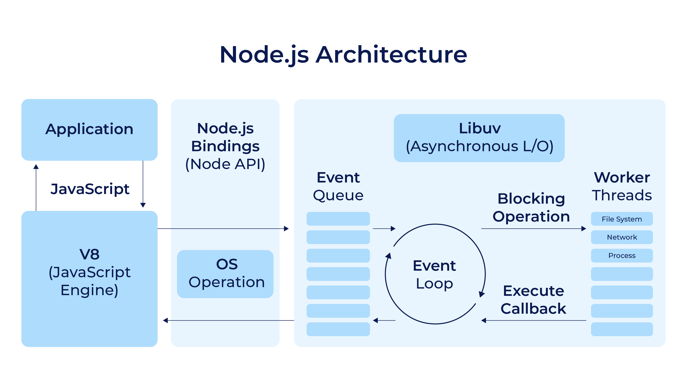

# Node.js

- [Node.js](#nodejs)
  - [O que é?](#o-que-é)
  - [Arquitetura Baseada em Eventos](#arquitetura-baseada-em-eventos)
    - [Event Emitters e Listeners](#event-emitters-e-listeners)
    - [Componentes: Processos e Threads](#componentes-processos-e-threads)
      - [Motor V8](#motor-v8)
    - [Funcionamento: Call Stack, Task Queue e Loop](#funcionamento-call-stack-task-queue-e-loop)
    - [Loop de Eventos](#loop-de-eventos)
  - [Erros](#erros)

## O que é?

É um ambiente de execução de código JavaScript no lado do servidor, ou runtime, que funciona fora do navegador. Ele usa a engine V8 do Google Chrome para executar o código e oferece diversas funcionalidades para criação de aplicativos web e servidores.

Algumas de suas características são:

- Suporte a bibliotecas e frameworks variados
- Uso do NPM para gerenciamento de pacotes
- Arquitetura baseada em eventos e assíncrona
- Popular para construção de servidores web e APIs.


Outros interpretadores que estão chamando a atenção são: Deno, do mesmo desenvolvedor do Node.js, e Bun, o mais recente interpretador que lançou sua primeira versão em setembro 2023.

**Características ↓**

- Escalabilidade:
  - foi pensando desde o início para entregar soluções para arquiteturas escaláveis, por isso sua adoção por grandes empresas de tecnologias

- Multiplataforma: 
  - Se pode criar desde soluções web a aplicações desktop

- Open Source: 
  - Tem seu código aberto, o que possibilita a contribuição com o projeto e até mesmo realizar customizações

- Multi-paradigma: 
  - Com o JavaScript se pode adotar várias formas de codificar usando paradigmas como a orientação a objetos, o funcional e o orientado a eventos

## Arquitetura Baseada em Eventos

Primeiramente é preciso definir o que é um evento: no JavaScript, em evento é um acontecimento, uma ação executada em determinado momento. 

No navegador, os eventos estão muitas vezes relacionados a ações do usuário, como por exemplo um clique em um botão, preenchimento de um input ou qualquer outro tipo de interação; são eventos disparados por elementos HTML, por objetos globais do navegador como `window` e etc.

Falando especificamente sobre o Node.js, eventos podem ser definidos em contextos como leitura e escrita de arquivos, manejo de requisições HTTP e funções timer como `setTimeout()`. Estes processos emitem eventos quando o processamento é finalizado; algo como um “aviso” para o programa que o processamento foi concluído e o resultado (retorno) pode ser utilizado.



Estes eventos são passados para o event loop, que vai chamar as funções callback que estão associadas a cada um destes eventos.

```js
setTimeout(() => {
 console.log('Wait at least a second');
}, 1000)
```

A arquitetura baseada em eventos trabalha com duas partes principais: os event emitters e os event listeners.

### Event Emitters e Listeners

Event Emitters emitem eventos em situações determinadas, normalmente quando acontece algo no programa - como uma requisição HTTP. Uma vez emitidos, são "escutados" por Events Listeners, estes que disparam funções callback relacionadas a cada listener.

```js
const server = http.createServer(); // instance of an event listener
// listens to the first parameter (request), executes the (function) second parameter
server.on('request', (req, res) => {
  console.log('request receive');
  res.end('request receive');
});
```


### Componentes: Processos e Threads
O Node.js é composto por algumas bibliotecas e partes separadas. 


- Core API
  - Responsável pela implementação do Node.js em alto nível
- C++ bindings
  - Responsáveis por englobar e expor bibliotecas e métodos em C++ que são utilizadas através do Node.js
- V8
  - Engine que faz com que o Node.js consiga compreender o código em JavaScript
  - Escrito em C++, V8 recebe uma string de código em JS, interpreta e executa
  - É onde encontra-se a implementação da maior parte das funções e métodos JS
- libuv
  - Um de seus componentes principais
  - É uma biblioteca em C++ que faz a parte de manipulação de eventos e o manejo de processos assíncronos como timers e funções
  - Dá acesso do Node.js ao sistema operacional, ao sistema de arquivos, conexões, etc; também delega a execução de algumas partes do programa ao SO, caso seja necessário
  - Implementa duas funcionalidades muito importantes:
    - Loop de eventos
    - Thread pool
- Outras APIs
  - Como `http-parser`, `zlib`, `openSSL` e `c-ares`
  - Fazem parte do ambiente Node.js, mas não da V8

A maior parte do processamento do código é resolvida pelo loop de eventos, como executar callbacks e processos de rede. A thread pool é responsável por tarefas que exigem mais processamento, como acesso, processamento e conversão de arquivos. 

O Node.js age como um controlador, “amarrando” juntos V8 e libuv e fornecendo a API para que se possa acessar todas as funcionalidades acima usando JavaScript.

**Processos ↓**

Execução ou processamento de um conjunto to de instruções de um programa. Normalmente, um computador tem vários processos sendo executados ao mesmo tempo e cada processo utiliza um espaço reservado de memória.

No caso de programas executados pelo Node.js, os processos são responsáveis por “escutar” eventos e responder de acordo.


**Threads ↓**

Os threads de execução são a menor unidade de processamento de um programa; são a forma como as instruções de um programa são separadas e “agendadas” para serem processadas pelo computador.

A quantidade disponível para ser utilizada por um programa depende de alguns fatores: como o programa é escrito, como é processado e também da capacidade da CPU do computador de processar (ou não) uma determinada quantidade de threads ao mesmo tempo.

Podem funcionar como componentes de um processo (parent process) e compartilhar espaços de memória entre si para executarem diferentes tarefas de um mesmo processo, assim melhorando a performance.

Como uma thread de execução só pode executar uma instrução por vez (por exemplo, um laço de repetição), dividir um processo em mais de uma thread é uma estratégia para que o programa não fique “bloqueado” enquanto determinada parte dele é processada.


**Single Thread ↓**

Todos os códigos JS executados por um programa - inclusive o código fonte do Node.js, o V8, o loop de eventos e métodos síncronos em C++ - são executados na mesma thread, chamada de main thread. 

No entanto, alguns métodos e módulos assíncronos em C++, que são utilizados pelo Node.js, podem não ser executados na main thread, como por exemplo o módulo crypto, que utiliza muito processamento da CPU e precisa fazer muitos cálculos matemáticos.

Nestes casos o C++ vai executar métodos assíncronos, por baixo dos panos, utilizando mais de uma thread se for necessário, a chamada “execução em paralelo”.

O Node.js utiliza a libuv para operações assíncronas; rla também é utilizada, junto com parte da lógica interna do Node.js para manejar a chamada thread pool, que são quatro threads pré-alocadas por padrão e usadas para delegar operações muito “pesadas” para serem colocadas no loop de eventos.


Por isso é dito que o Node.js é single-threaded, porque algumas de suas partes essenciais - entre elas o loop de eventos - são trabalhadas de forma single thread.

Porém, partes do processamento de um programa podem ser trabalhadas de forma multi-thread pela libuv, utilizando a thread pool, além de métodos em C++ que podem ser delegados ao sistema operacional para o processamento adicional de tarefas mais complexas.


#### Motor V8

- A engine acessa o código JavaScript, que veio da leitura da tag `script` de um arquivo HTML ou por meio do download de um arquivo JS
- Executa o `Parser`, processo de análise e conversão
- Monta a AST (Árvore de Sintaxe Abstrata), um mapeamento que identifica o que cada parte do código está fazendo
- E, por fim, interpreta a AST. Nesta etapa, ao interpretar a AST, a engine V8 gera os bytecodes a serem executados pela máquina. Neste processo, ainda existe um estágio de otimização do código gerado

```js
function soma(num1,num2) {
  return num1 + num2;
}
```


### Funcionamento: Call Stack, Task Queue e Loop

```js
function calculaQuadrado(num) {
 const resultadoSoma = soma(num);
 return resultadoSoma * resultadoSoma;
}

function soma(num) {
 return num + num;
}

function imprimeValor(valor) {
 const resultado = calculaQuadrado(valor)
 console.log(`o resultado é ${resultado}`);
}

imprimeValor(3); // ‘o resultado é 36’
```


**Call stack ↓**

Estrutura de dados do tipo stack, sua característica principal é o conceito de LIFO (last in, first out), ou seja, o último item colocado na pilha é o primeiro.

A call stack, no caso do Node.js, é parte do motor V8; pode-se dizer que é a estrutura que o V8 usa para monitorar as chamadas de funções feitas por um programa. Sempre que uma função é chamada, é enviada para a call stack.


> Call stack existe em qualquer linguagem de programação, seguindo basicamente o mesmo conceito de “pilha de chamadas”.

O Node.JS trabalha de forma single-thread na execução, o que significa que há apenas uma call stack, esta que serve para registrar em que ponto o programa se encontra em determinado momento e a ordem de execução do código.

Quando o programa chama uma função ela entra na pilha, e quando a função retorna, sai do topo; assim sucessivamente até que a pilha fique vazia.


**Task Queue ↓**

```js
console.log('início do programa');

setTimeout(() => console.log('aguardando 5 segundos'), 5000);

console.log('fim do programa');
```

Este trecho segue da seguinte maneira:

- Momento 1
  - `main()` inicia a stack, `console.log(início do programa)` entra na stack, executa e sai (é síncrono)
  
- Momento 2
  - A função `setTimeout()` recebe como parâmetro uma função callback que será chamada de volta para ser executada a partir de um determinado evento - no caso, a finalização da contagem de 5 segundos (5000 milissegundos)


  
- Momento 3
  - o callback do `setTimeout` é colocado na fila de timers que vai gerenciar a pausa. A chamada do `setTimeout()` em si já está finalizada, e ela sai da stack
  - Também é executado a última instrução do programa, `console.log(‘fim do programa’)`, que já é exibida no terminal. Esta chamada vai para a call stack, é executada e já retirada da pilha em seguida


  
- Momento 4
  - Finalmente chega no loop de eventos
  - O timer de 5 segundos está finalizado e a API “empurra” o callback para a task queue, ou fila de tarefas
  - Ao contrário da pilha, que segue o conceito LIFO (last in, first out), as filas são estruturas de dados que seguem o conceito FIFO (first in, first out), ou seja, o primeiro item a entrar é o primeiro a sair
  - Uma vez que o callback foi enviado para a task queue, entra em cena o loop de eventos


**Loop de Eventos ↓**

- Momento 5
  - A única tarefa restante é olhar a stack e a queue
  - Se a stack estiver vazia, o primeiro callback que estiver na queue (lembrando do princípio LIFO) é empurrado para a stack, o que efetivamente faz com que o callback seja executado (no caso, `console.log(‘aguardando 5 segundos’)`)


- Momento 6
  - O programa encerra (process.exit()) quando não há eventos na fila para serem chamados pelo loop de eventos e quando não há processamentos pendentes na pilha de chamadas


### Loop de Eventos

É iniciado junto com a aplicação e cada loop é composto pelas seguintes fases de execução:

- Callbacks dos timers expirados
  - São os primeiros a serem executados assim que possível - ou seja, quando a call stack se encontra vazia
- I/O polling
  - Eventos de I/O que estão prontos para serem processados, como acesso a arquivos, tarefas de rede, etc) - a maior parte dos callbacks é referente a este tipo de operação e ocorre nesta fase
- `setImmediate()`
  - Timer especial que quando se quer que um callback seja processado imediatamente (casos de uso mais avançados)
- Eventos de encerramento
  - Métodos para fechar conexões abertas, como conexões com bancos ou sockets


Além disso, o loop de eventos ainda conta com duas outras filas, mais relacionadas a casos avançados de uso:

- `process.nexttick()`
  - Resolução de promessas
  - Ocorre logo após a fase de encerramento de cada loop, ao invés de esperar passar por todos os outros callbacks que podem estar no loop
- Outras microtasks diversas

Internamente o loop de eventos gerencia estas fases através de “sub-filas” de acordo com o tipo de processamento.


Como o Node.js sabe se o loop deve continuar no próximo tick ou se o programa deve ser encerrado? Checando se ainda existem timers ou tarefas I/O pendentes.

- Se não existem, vai finalizar a aplicação
- Se existem, continua no loop. Por exemplo, se existem conexões abertas que mantêm o programa rodando

**Resumindo ↓**

- O loop de eventos recebe eventos externos e os converte em chamadas de callbacks para serem processados, além de executar sub-tasks que estejam em fila
- O loop acessa callbacks de eventos que estão na task queue (que também é chamada de event queue) e empurra os callbacks para a call stack
- O loop de eventos executa tarefas começando da mais antiga, ou que chegou primeiro à fila - princípio FIFO
- É parte de um panorama maior da arquitetura do node, que envolve o V8 e outras APIs. `setTimeout()`, por exemplo, não faz parte do V8, e sim das APIs do ecossistema
- O loop de eventos também não faz parte do código do V8, e sim da biblioteca libuv

**Funcionalidades ↓**

- É um loop infinito, que aguarda tarefas, as executa e então entra em espera até o recebimento de novas tarefas
- O loop pega e executa tarefas da task queue APENAS quando a call stack está vazia. Ou seja, quando não há tarefas em andamento (funções sendo executadas pela pilha)


**Bloqueios ↓**

Uma das características mais importantes de todo esse modelo do loop de eventos era fazer com que operações que bloqueiam a execução do programa, como operações I/O, se tornassem não-bloqueantes e assíncronas. 

Porém é sim possível bloquear a execução de um programa em JavaScript, e normalmente isso é causado por problemas na implementação do código e não por bugs internos do Node.js.

Por isso, para evitar que um programa seja implementado de forma a bloquear a thread do loop de eventos, algumas precauções podem ser tomadas:

- Evitar versões sync de APIs do node como fs, crypto e zlib, a não ser em casos muito específicos. 
  - Um caso de uso síncrono de funções de fs é a biblioteca dotenv, que utiliza a versão sync, pois ela precisa garantir que as variáveis de ambiente estão configuradas antes de liberar a execução do programa
- Evitar que cálculos com números grandes sejam enviados para a thread do loop
- Evitar o processamento de JSONs muito grandes
- Evitar expressões regulares muito complexas

O motivo para evitar cálculos e processamentos muito grandes é justamente o fato do loop de eventos ser single-thread; o que faz com que ele seja muito eficiente para operações assíncronas, mas não consegue evitar que o loop “trave” se tivermos uma operação que exija muito processamento ocupando a pilha de chamadas.

Claro que sempre haverá outras situações similares, que envolvem normalmente muito processamento síncrono. Para esse tipo de caso é possível usar processos-filho (child processes) ou mover os processos para novas threads de forma manual, instruindo o programa a criar threads específicas.

## Erros

> referência para anotações futuras
> https://www.alura.com.br/artigos/lidando-com-erros-node-js?_gl=1*t7hpaa*_ga*MjgwODEyMDg2LjE3MDI4MzkzNjQ.*_ga_1EPWSW3PCS*MTcxMDQ1MDE5MS4yNzQuMS4xNzEwNDUyMjIyLjAuMC4w*_fplc*Z1lQUldiMFQ2T1ZoN1c4a1pSTWxDQ1dwaVhkZDd0JTJCVDdjMVdxdHRaczVFOXFuRzdDbEdua0JwZWNXVkhJWWpFMWVqUSUyRlFFaGtmajlDb0slMkZwVlhHd0M5RyUyQm1kZHdBJTJCU3gxS2tJTjNuV3NWZUhKMnVLeUJNajZPdDNJJTJCbjNnJTNEJTNE