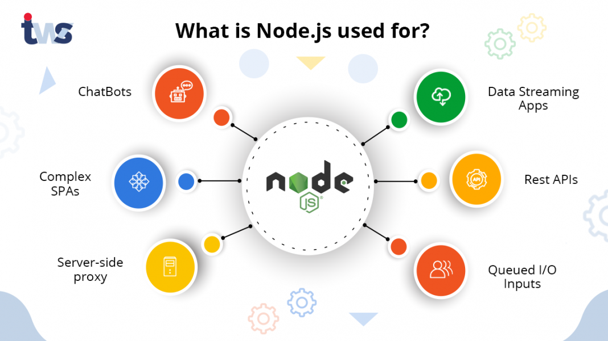
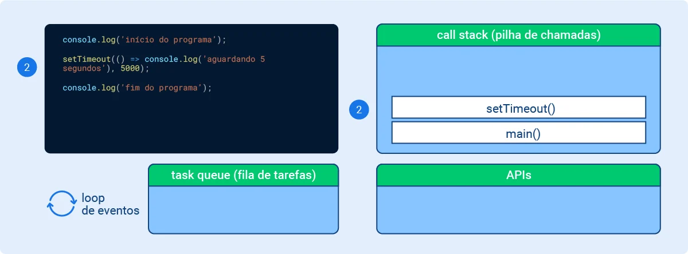
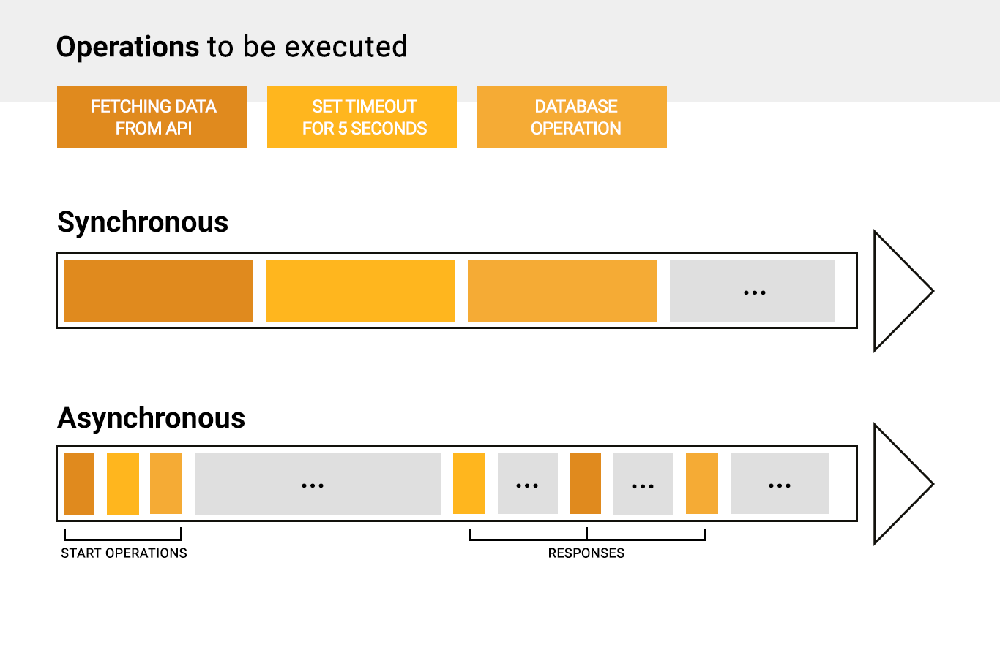

# Node.js

- [Node.js](#nodejs)
  - [O que é?](#o-que-é)
    - [NVM](#nvm)
  - [NPM e YARN](#npm-e-yarn)
  - [Package.json](#packagejson)
    - [Propriedades Básicas](#propriedades-básicas)
      - [Versões](#versões)
  - [Arquitetura Baseada em Eventos](#arquitetura-baseada-em-eventos)
    - [Event Emitters e Listeners](#event-emitters-e-listeners)
    - [Componentes: Processos e Threads](#componentes-processos-e-threads)
      - [Motor V8](#motor-v8)
    - [Funcionamento: Call Stack, Task Queue e Loop](#funcionamento-call-stack-task-queue-e-loop)
    - [Loop de Eventos](#loop-de-eventos)
  - [Erros](#erros)
  - [Promessas](#promessas)
    - [Como Usar](#como-usar)

## O que é?

É um ambiente de execução de código JavaScript no lado do servidor, ou runtime, que funciona fora do navegador. Ele usa a engine V8 do Google Chrome para executar o código e oferece diversas funcionalidades para criação de aplicativos web e servidores.

Algumas de suas características são:

- Suporte a bibliotecas e frameworks variados
- Uso do NPM para gerenciamento de pacotes
- Arquitetura baseada em eventos e assíncrona
- Popular para construção de servidores web e APIs.



Outros interpretadores que estão chamando a atenção são: Deno, do mesmo desenvolvedor do Node.js, e Bun, o mais recente interpretador que lançou sua primeira versão em setembro 2023.

**Características ↓**

- Escalabilidade:
  - foi pensando desde o início para entregar soluções para arquiteturas escaláveis, por isso sua adoção por grandes empresas de tecnologias

- Multiplataforma: 
  - Se pode criar desde soluções web a aplicações desktop

- Open Source: 
  - Tem seu código aberto, o que possibilita a contribuição com o projeto e até mesmo realizar customizações

- Multi-paradigma: 
  - Com o JavaScript se pode adotar várias formas de codificar usando paradigmas como a orientação a objetos, o funcional e o orientado a eventos

### NVM

Como o Node trabalha com atualizações consistentes, há grandes diferenças entre suas versões. Por exemplo, algo que pode ser feito na versão 18, pode não ser possível na versão 16.

Quando se trabalha com o Node, alterar entre versões pode ser um obstáculo, mas existem duas formas de facilitar esse processo, o Node Version Manager (NVM) e o Docker.

O NVM é um gerenciador de versões do Node.JS, responsável por gerenciar as versões instaladas na máquina de desenvolvimento, bem como instalar novas versões. Foi criado como “instalado por usuário e invocado por shell”, ou seja, funciona de forma total no terminal do sistema.

Instalação: 

```bash
curl -o- https://raw.githubusercontent.com/nvm-sh/nvm/v0.39.7/install.sh | bash
```

```bash
export NVM_DIR="$([ -z "${XDG_CONFIG_HOME-}" ] && printf %s "${HOME}/.nvm" || printf %s "${XDG_CONFIG_HOME}/nvm")"
[ -s "$NVM_DIR/nvm.sh" ] && \. "$NVM_DIR/nvm.sh" # This loads nvm
```

O comando `nvm ls-remote` lista todas as ver~soe s do Node.JS, e para fazer download de uma ver~so específica é só usar o comando `nvm instal`. O comando `nvm use` é o que altera entre as versões de forma simples.

```bash
$ nvm use 16
Now using node v16.9.1 (npm v7.21.1)
$ node -v
v16.9.1
$ nvm use 14
Now using node v14.18.0 (npm v6.14.15)
$ node -v
v14.18.0
$ nvm install 12
Now using node v12.22.6 (npm v6.14.5)
$ node -v
v12.22.6
```

**Por que não o Docker?**

Com o Docker seria necessário executar um container para cada versão diferente do Node.JS, fora o tamanho das imagens de downloads necessários que seriam armazenados na máquina.

## NPM e YARN

Ambos são gerenciadores de pacotes, sendo que NPM é acrônimo de Node Package Manager. Gerenciadores de pacotes são repositórios de código aberto nos quais devs disponibilizam soluções para o uso da comunidade. 

O NPM e o YARN têm algumas pequenas diferenças nos comandos e na forma como lidam com os pacotes.

Eles nada mais são do que programas que outros desenvolvem e podem ser usados para ganhar tempo no desenvolvimento do código, e vão desde libs pequenas e específicas até frameworks com vários recursos prontos.

Um pacote é como o conjunto do código dessas libs e frameworks são chamados.

**Instalação Local vs. Global ↓**

Esses pacotes podem ser instalados localmente, estando disponíveis somente para o projeto no qual foi instalado através da pasta `node_modules`, e globalmente, sendo instalados em um diretório geral do NPM e ficando disponíveis para todos os projetos no computador, sem a necessidade de instalar separadamente em cada projeto.

Na maioria dos casos, a opção local faz mais sentido, sendo instaladas com os comandos `npm install` ou `yarn add`, pois facilita o gerenciamento de versão das libs e geralmente, um pacote instalado “puxa” um ou vários outros pacotes auxiliares que ele precisa para funcionar. 

O ideal é não poluir o diretório global com libs que poderão ser utilizadas em somente um projeto. No entanto, algumas libs e frameworks mais complexas vão solicitar que a instalação seja feita globalmente para funcionar.

Sempre vale a pena consultar a documentação de cada uma. Para fazer uma instalação global de pacotes, utilizamos os comandos `npm install -g` ou `yarn add global`.

A recomendação é preferir a instalação local, usar a global só me casos específicos.

## Package.json

O `package.json` é um elemento-chave em muitas aplicações do ecossistema Node.js. Ele serve como uma espécie de manifesto do projeto, podendo fazer várias coisas, complemente não relacionadas.

Ele é, por exemplo, um repositório central de configurações de ferramentas. Também armazena os nomes e versões dos pacotes instalados.

**Estrutura ↓**

Não existem exigências fixas do que se deve ter em um arquivo `package.json`, somente que respeite o formato JSON. Ou seja, segue a sintaxe e só pode receber os valores válidos de JSON.

```json
{
    "name": "test-project",
    "version": "1.0.0",
    "description": "A Node.js project",
    "main": "src/index.js",
    "private": true,
    "scripts": {
        "dev": "nodemon ./src/index",
        "start": "node ./src/index",
        "test": "jest",
        "compile": "tsc"
    },
    "dependencies": {
        "axios": "^0.21.1",
        "cors": "^2.8.5",
        "dotenv": "^8.2.0",
        "express": "^4.17.1",
        "joi": "^17.3.0",
        "pg": "^8.5.1",
        "sequelize": "^6.4.0",
        "uuid": "^8.3.2",
        "winston": "^3.3.3"
    },
    "devDependencies": {
        "jest": "^26.6.3",
        "nock": "^13.0.5",
        "nodemon": "^2.0.6",
        "sequelize-mock-v5": "^1.2.0"
    },
    "engines": {
        "node": ">= 6.0.0",
        "npm": ">= 3.0.0"
    }
}
```

Existem muitas coisas acontecendo aqui:

- `name` define o nome da aplicação ou pacote;
- `version` indica a versão atual;
- `description` é um resumo da aplicação/pacote;
- `main` define o ponto de entrada da aplicação (o que vai ser retornado se alguém der um `require` no pacote);
- `private` (true) previne a aplicação de ser publicada acidentalmente no npm;
- `scripts` define um conjunto de scripts Node para serem executados;
- `dependencies` define uma lista de pacotes npm instalados como dependências de produção;
- `devDependencies` define uma lista de pacotes npm instalados como dependências de desenvolvimento;
- `engines` define quais versões de Node este pacote/aplicação funciona;

### Propriedades Básicas

**Identificando Metadados ↓**

- `name`
  - define o nome do pacote
  - deve ser menor que 214 caracteres, não pode ter espaços e somente pode conter letras minúsculas, hífens (-) ou underscore (_)
  - caso o pacote seja publicado, ele ganha sua URL baseado nesta propriedade

```json
"name": "test-project"
```

- `author`
  -  exibe o nome do autor do pacote

```json
{ "author": "Oliwer <contato@oliwer.com.br> (www.site.com.br)" }
```

```json
{
    "author": {
        "name": "Oliwer",
        "email": "contato@oliwer.com.br",
        "url": "www.site.com.br"
    }
}
```

- `contributors`
  - o projeto pode ter um ou mais contribuidores
  - como o autor, é um array ou lista

```json
{ "contributors": "Oliwer <contato@oliwer.com.br> (www.site.com.br)" }
```

```json
{
    "contributors": {
        "name": "Oliwer",
        "email": "contato@oliwer.com.br",
        "url": "www.site.com.br"
    }
}
```

- `bug`
  - links para o issue tracker do pacote, geralmente uma página de issues no GitHub

```json
{
  "bugs": "github.com/oliwer/package/issues"
}
```

- `version`
  - indica a versão atual do pacote
  - segue a notação semântica de versionamento (semver), o que significa que a versão é sempre expressada com três números: x.x.x.

```json
"version": "1.0.0"
```

- `license`
  - indica a licença do pacote

```json
"license": "MIT"
```

- `description`
  - contém um resumo/descrição do pacote
  - especialmente útil se o pacote for publicado/compartilhado

```json
"description": "A package to work with strings"
```

- `keywords`
  - esta propriedade contém um array de palavras-chave associados com o que pacote faz

```json
"keywords": [
  "email",
  "automation",
  "ai"
]
```

**Metadados Funcionas ↓**

- `main`
  - define o ponto de entrada do pacote
  - quando o pacote é importado, é essa aplicação que será buscada pelo `module.exports`

```json
"main": "src/main.js"
```

- `private`
  - se definido como `true`, previne que a aplicação/pacote seja acidentalmente publicada

```json
"private": true
```

- `repository`
  - especifica onde o repositório do pacote está localizado
  - tipicamente aparece em projetos open source, é um array com o tipo do controle de versão e a url do repositório em si
  - importante dizer que é a url completa do controle de versão, não só de onde o repo pode ser acessado

```json
 "repository": { 
  "type": "git", 
  "url": "github.com/teste/testing.git" 
} 
```

- `script`
  - define um conjunto de scripts node que podem ser executados
  - são frequentemente usados para testar, build e streamline de comandos necessários pra trabalhar com o módulo

```json
"scripts": {
  "dev": "webpack-dev-server --inline --progress --config build/webpack.dev.conf.js",
  "start": "npm run dev",
  "unit": "jest --config test/unit/jest.conf.js --coverage",
  "test": "npm run unit",
  "lint": "eslint --ext .js,.vue src test/unit",
  "build": "node build/build.js"
}
```

```bash
npm run dev
```

- `dependencies`
  - define uma lista de pacotes npm instalados como dependências
  - quando um pacote é instalado com `npm`, ele é automaticamente inserido na lista

```bash
npm install &lt;PACKAGENAME&gt;
```

```json
"dependencies": {
  "vue": "^2.5.2"
}
```

```json
"dependencies": { 
    "async": "^0.2.10", 
   "npm2es": "~0.4.2", 
   "optimist": "~0.6.0", 
   "request": "~2.30.0",
   "skateboard": "^1.5.1",
   "split": "^0.3.0",
   "weld": "^0.2.2"
}
```

- `devdependencies`
  - define uma lista de pacotes npm instalados como dependências de desenvolvimento
  - se diferem de dependencies porque eles serão instalados somente em máquinas de desenvolvimento
  - não são necessárias para executar o código em produção

```bash
npm install --dev &lt;PACKAGENAME&gt;
```

```json
"devDependencies": {
  "autoprefixer": "^7.1.2",
  "babel-core": "^6.22.1"
}
```

```json
"devDependencies": {
   "escape-html": "^1.0.3", 
   "lucene-query-parser": "^1.0.1" 
}
```

#### Versões

É expressada em 3 números, `x.x.x`. O primeiro número é a versão principal, o segundo é a versão secundária e o terceiro é a versão do patch. 

Existe um significado nestes números: 

- uma release que somente corrija bugs é uma release patch
- uma release que introduza mudanças na compatibilidade retroativa é uma release secundária
- uma release principal é aquela que pode quebrar compatibilidade.


É muito comum que aparecem símbolos juntos da versões, como o circunflexo `^` e o til `~`.

- O til garante que o pacote seja sempre carregado  respeitando o número do meio da versão
  - geralmente garante que correções de bugs sejam atualizados no pacote

```json
"version": "~1.2.3" // pega o pacote mais recente da versão 1.2.x, mas não vai atualizar para 1.3
```

- O circunflexo garante que o pacote seja sempre carregado respeitando o primeiro número da versão
  - garante que bugs e novas funcionalidades do seu pacote sejam atualizados, mas não novas versões “major” dele

```json
"version": "^1.2.3" //  pega o pacote mais recente da versão 1.x, mas não vai atualizar para 2.0
```

Outros símbolos incluem:

- `>`, `>=`, `<`, `<=` 1.0: a versão deve ser superior, superior ou igual, inferior, inferior ou igual à 1.0, respectivamente
- 1.2.x: equivalente a `˜1.2.0`
- `*`: qualquer versão do pacote
- `latest`: a versão mais recente do pacote

## Arquitetura Baseada em Eventos

Primeiramente é preciso definir o que é um evento: no JavaScript, em evento é um acontecimento, uma ação executada em determinado momento. 

No navegador, os eventos estão muitas vezes relacionados a ações do usuário, como por exemplo um clique em um botão, preenchimento de um input ou qualquer outro tipo de interação; são eventos disparados por elementos HTML, por objetos globais do navegador como `window` e etc.

Falando especificamente sobre o Node.js, eventos podem ser definidos em contextos como leitura e escrita de arquivos, manejo de requisições HTTP e funções timer como `setTimeout()`. Estes processos emitem eventos quando o processamento é finalizado; algo como um “aviso” para o programa que o processamento foi concluído e o resultado (retorno) pode ser utilizado.


Estes eventos são passados para o event loop, que vai chamar as funções callback que estão associadas a cada um destes eventos.

```js
setTimeout(() => {
 console.log('Wait at least a second');
}, 1000)
```

A arquitetura baseada em eventos trabalha com duas partes principais: os event emitters e os event listeners.

### Event Emitters e Listeners

Event Emitters emitem eventos em situações determinadas, normalmente quando acontece algo no programa - como uma requisição HTTP. Uma vez emitidos, são "escutados" por Events Listeners, estes que disparam funções callback relacionadas a cada listener.

```js
const server = http.createServer(); // instance of an event listener
// listens to the first parameter (request), executes the (function) second parameter
server.on('request', (req, res) => {
  console.log('request receive');
  res.end('request receive');
});
```


### Componentes: Processos e Threads
O Node.js é composto por algumas bibliotecas e partes separadas. 


- Core API
  - Responsável pela implementação do Node.js em alto nível
- C++ bindings
  - Responsáveis por englobar e expor bibliotecas e métodos em C++ que são utilizadas através do Node.js
- V8
  - Engine que faz com que o Node.js consiga compreender o código em JavaScript
  - Escrito em C++, V8 recebe uma string de código em JS, interpreta e executa
  - É onde encontra-se a implementação da maior parte das funções e métodos JS
- libuv
  - Um de seus componentes principais
  - É uma biblioteca em C++ que faz a parte de manipulação de eventos e o manejo de processos assíncronos como timers e funções
  - Dá acesso do Node.js ao sistema operacional, ao sistema de arquivos, conexões, etc; também delega a execução de algumas partes do programa ao SO, caso seja necessário
  - Implementa duas funcionalidades muito importantes:
    - Loop de eventos
    - Thread pool
- Outras APIs
  - Como `http-parser`, `zlib`, `openSSL` e `c-ares`
  - Fazem parte do ambiente Node.js, mas não da V8

A maior parte do processamento do código é resolvida pelo loop de eventos, como executar callbacks e processos de rede. A thread pool é responsável por tarefas que exigem mais processamento, como acesso, processamento e conversão de arquivos. 

O Node.js age como um controlador, “amarrando” juntos V8 e libuv e fornecendo a API para que se possa acessar todas as funcionalidades acima usando JavaScript.

**Processos ↓**

Execução ou processamento de um conjunto to de instruções de um programa. Normalmente, um computador tem vários processos sendo executados ao mesmo tempo e cada processo utiliza um espaço reservado de memória.

No caso de programas executados pelo Node.js, os processos são responsáveis por “escutar” eventos e responder de acordo.


**Threads ↓**

Os threads de execução são a menor unidade de processamento de um programa; são a forma como as instruções de um programa são separadas e “agendadas” para serem processadas pelo computador.

A quantidade disponível para ser utilizada por um programa depende de alguns fatores: como o programa é escrito, como é processado e também da capacidade da CPU do computador de processar (ou não) uma determinada quantidade de threads ao mesmo tempo.

Podem funcionar como componentes de um processo (parent process) e compartilhar espaços de memória entre si para executarem diferentes tarefas de um mesmo processo, assim melhorando a performance.

Como uma thread de execução só pode executar uma instrução por vez (por exemplo, um laço de repetição), dividir um processo em mais de uma thread é uma estratégia para que o programa não fique “bloqueado” enquanto determinada parte dele é processada.


**Single Thread ↓**

Todos os códigos JS executados por um programa - inclusive o código fonte do Node.js, o V8, o loop de eventos e métodos síncronos em C++ - são executados na mesma thread, chamada de main thread. 

No entanto, alguns métodos e módulos assíncronos em C++, que são utilizados pelo Node.js, podem não ser executados na main thread, como por exemplo o módulo crypto, que utiliza muito processamento da CPU e precisa fazer muitos cálculos matemáticos.

Nestes casos o C++ vai executar métodos assíncronos, por baixo dos panos, utilizando mais de uma thread se for necessário, a chamada “execução em paralelo”.

O Node.js utiliza a libuv para operações assíncronas; rla também é utilizada, junto com parte da lógica interna do Node.js para manejar a chamada thread pool, que são quatro threads pré-alocadas por padrão e usadas para delegar operações muito “pesadas” para serem colocadas no loop de eventos.


Por isso é dito que o Node.js é single-threaded, porque algumas de suas partes essenciais - entre elas o loop de eventos - são trabalhadas de forma single thread.

Porém, partes do processamento de um programa podem ser trabalhadas de forma multi-thread pela libuv, utilizando a thread pool, além de métodos em C++ que podem ser delegados ao sistema operacional para o processamento adicional de tarefas mais complexas.


#### Motor V8

- A engine acessa o código JavaScript, que veio da leitura da tag `script` de um arquivo HTML ou por meio do download de um arquivo JS
- Executa o `Parser`, processo de análise e conversão
- Monta a AST (Árvore de Sintaxe Abstrata), um mapeamento que identifica o que cada parte do código está fazendo
- E, por fim, interpreta a AST. Nesta etapa, ao interpretar a AST, a engine V8 gera os bytecodes a serem executados pela máquina. Neste processo, ainda existe um estágio de otimização do código gerado

```js
function soma(num1,num2) {
  return num1 + num2;
}
```


### Funcionamento: Call Stack, Task Queue e Loop

```js
function calculaQuadrado(num) {
 const resultadoSoma = soma(num);
 return resultadoSoma * resultadoSoma;
}

function soma(num) {
 return num + num;
}

function imprimeValor(valor) {
 const resultado = calculaQuadrado(valor)
 console.log(`o resultado é ${resultado}`);
}

imprimeValor(3); // ‘o resultado é 36’
```


**Call stack ↓**

Estrutura de dados do tipo stack, sua característica principal é o conceito de LIFO (last in, first out), ou seja, o último item colocado na pilha é o primeiro.

A call stack, no caso do Node.js, é parte do motor V8; pode-se dizer que é a estrutura que o V8 usa para monitorar as chamadas de funções feitas por um programa. Sempre que uma função é chamada, é enviada para a call stack.


> Call stack existe em qualquer linguagem de programação, seguindo basicamente o mesmo conceito de “pilha de chamadas”.

O Node.JS trabalha de forma single-thread na execução, o que significa que há apenas uma call stack, esta que serve para registrar em que ponto o programa se encontra em determinado momento e a ordem de execução do código.

Quando o programa chama uma função ela entra na pilha, e quando a função retorna, sai do topo; assim sucessivamente até que a pilha fique vazia.


**Task Queue ↓**

```js
console.log('início do programa');

setTimeout(() => console.log('aguardando 5 segundos'), 5000);

console.log('fim do programa');
```

Este trecho segue da seguinte maneira:

- Momento 1
  - `main()` inicia a stack, `console.log(início do programa)` entra na stack, executa e sai (é síncrono)
  
- Momento 2
  - A função `setTimeout()` recebe como parâmetro uma função callback que será chamada de volta para ser executada a partir de um determinado evento - no caso, a finalização da contagem de 5 segundos (5000 milissegundos)


  
- Momento 3
  - o callback do `setTimeout` é colocado na fila de timers que vai gerenciar a pausa. A chamada do `setTimeout()` em si já está finalizada, e ela sai da stack
  - Também é executado a última instrução do programa, `console.log(‘fim do programa’)`, que já é exibida no terminal. Esta chamada vai para a call stack, é executada e já retirada da pilha em seguida


  
- Momento 4
  - Finalmente chega no loop de eventos
  - O timer de 5 segundos está finalizado e a API “empurra” o callback para a task queue, ou fila de tarefas
  - Ao contrário da pilha, que segue o conceito LIFO (last in, first out), as filas são estruturas de dados que seguem o conceito FIFO (first in, first out), ou seja, o primeiro item a entrar é o primeiro a sair
  - Uma vez que o callback foi enviado para a task queue, entra em cena o loop de eventos


**Loop de Eventos ↓**

- Momento 5
  - A única tarefa restante é olhar a stack e a queue
  - Se a stack estiver vazia, o primeiro callback que estiver na queue (lembrando do princípio LIFO) é empurrado para a stack, o que efetivamente faz com que o callback seja executado (no caso, `console.log(‘aguardando 5 segundos’)`)


- Momento 6
  - O programa encerra (process.exit()) quando não há eventos na fila para serem chamados pelo loop de eventos e quando não há processamentos pendentes na pilha de chamadas


### Loop de Eventos

É iniciado junto com a aplicação e cada loop é composto pelas seguintes fases de execução:

- Callbacks dos timers expirados
  - São os primeiros a serem executados assim que possível - ou seja, quando a call stack se encontra vazia
- I/O polling
  - Eventos de I/O que estão prontos para serem processados, como acesso a arquivos, tarefas de rede, etc) - a maior parte dos callbacks é referente a este tipo de operação e ocorre nesta fase
- `setImmediate()`
  - Timer especial que quando se quer que um callback seja processado imediatamente (casos de uso mais avançados)
- Eventos de encerramento
  - Métodos para fechar conexões abertas, como conexões com bancos ou sockets


Além disso, o loop de eventos ainda conta com duas outras filas, mais relacionadas a casos avançados de uso:

- `process.nexttick()`
  - Resolução de promessas
  - Ocorre logo após a fase de encerramento de cada loop, ao invés de esperar passar por todos os outros callbacks que podem estar no loop
- Outras microtasks diversas

Internamente o loop de eventos gerencia estas fases através de “sub-filas” de acordo com o tipo de processamento.


Como o Node.js sabe se o loop deve continuar no próximo tick ou se o programa deve ser encerrado? Checando se ainda existem timers ou tarefas I/O pendentes.

- Se não existem, vai finalizar a aplicação
- Se existem, continua no loop. Por exemplo, se existem conexões abertas que mantêm o programa rodando

**Resumindo ↓**

- O loop de eventos recebe eventos externos e os converte em chamadas de callbacks para serem processados, além de executar sub-tasks que estejam em fila
- O loop acessa callbacks de eventos que estão na task queue (que também é chamada de event queue) e empurra os callbacks para a call stack
- O loop de eventos executa tarefas começando da mais antiga, ou que chegou primeiro à fila - princípio FIFO
- É parte de um panorama maior da arquitetura do node, que envolve o V8 e outras APIs. `setTimeout()`, por exemplo, não faz parte do V8, e sim das APIs do ecossistema
- O loop de eventos também não faz parte do código do V8, e sim da biblioteca libuv

**Funcionalidades ↓**

- É um loop infinito, que aguarda tarefas, as executa e então entra em espera até o recebimento de novas tarefas
- O loop pega e executa tarefas da task queue APENAS quando a call stack está vazia. Ou seja, quando não há tarefas em andamento (funções sendo executadas pela pilha)


**Bloqueios ↓**

Uma das características mais importantes de todo esse modelo do loop de eventos era fazer com que operações que bloqueiam a execução do programa, como operações I/O, se tornassem não-bloqueantes e assíncronas. 

Porém é sim possível bloquear a execução de um programa em JavaScript, e normalmente isso é causado por problemas na implementação do código e não por bugs internos do Node.js.

Por isso, para evitar que um programa seja implementado de forma a bloquear a thread do loop de eventos, algumas precauções podem ser tomadas:

- Evitar versões sync de APIs do node como fs, crypto e zlib, a não ser em casos muito específicos. 
  - Um caso de uso síncrono de funções de fs é a biblioteca dotenv, que utiliza a versão sync, pois ela precisa garantir que as variáveis de ambiente estão configuradas antes de liberar a execução do programa
- Evitar que cálculos com números grandes sejam enviados para a thread do loop
- Evitar o processamento de JSONs muito grandes
- Evitar expressões regulares muito complexas

O motivo para evitar cálculos e processamentos muito grandes é justamente o fato do loop de eventos ser single-thread; o que faz com que ele seja muito eficiente para operações assíncronas, mas não consegue evitar que o loop “trave” se tivermos uma operação que exija muito processamento ocupando a pilha de chamadas.

Claro que sempre haverá outras situações similares, que envolvem normalmente muito processamento síncrono. Para esse tipo de caso é possível usar processos-filho (child processes) ou mover os processos para novas threads de forma manual, instruindo o programa a criar threads específicas.

## Erros

> referência para anotações futuras
> https://www.alura.com.br/artigos/lidando-com-erros-node-js?_gl=1*t7hpaa*_ga*MjgwODEyMDg2LjE3MDI4MzkzNjQ.*_ga_1EPWSW3PCS*MTcxMDQ1MDE5MS4yNzQuMS4xNzEwNDUyMjIyLjAuMC4w*_fplc*Z1lQUldiMFQ2T1ZoN1c4a1pSTWxDQ1dwaVhkZDd0JTJCVDdjMVdxdHRaczVFOXFuRzdDbEdua0JwZWNXVkhJWWpFMWVqUSUyRlFFaGtmajlDb0slMkZwVlhHd0M5RyUyQm1kZHdBJTJCU3gxS2tJTjNuV3NWZUhKMnVLeUJNajZPdDNJJTJCbjNnJTNEJTNE

## Promessas

Código síncrono é executado em sequência, uma instrução após a outra; código assíncrono não espera a finalização de uma tarefa para iniciar a seguinte, aguarda a finalização da tarefa para retornar o resultado.

É chamado de programação assíncrona o ato de executar uma tarefa em segundo plano, sem controle direto do programador. Sem explicitamente trabalhar com threads e coordená-las.


É importante realçar o comportamento do JS de executar uma coisa por vez; ele irá separar o código em duas partes: coisas que rodam agora, coisas que vão rodar depois de algo acontecer.

Quando uma função assíncrona é chamada, ela retorna uma `Promise`. O sentido de Promise em JavaScript é similar ao literal, ou seja, a promessa de que quando uma ação for executada, irá retornar algo, o que nem sempre é cumprido.

Se ela retorna um valor, a `Promise` será resolvida com o valor retornado; se ela lança uma exceção ou algum valor, a `Promise` será rejeitada com o valor lançado.

Por exemplo, quando enviar uma requisição de dados a uma API, se tem uma promessa de que estes dados irão chegar, mas enquanto isso não acontece, o sistema deve continuar rodando. Se o servidor estiver caído, essa promessa de dados pode não se cumprir, e deve se que lidar com isso.

É possível escrever promessas do zero com o construtor `Promise()`.



**Estados de uma Promessa ↓**

- Podem ser concluídas de duas formas: fulfilled ou rejected, o que equivale a duas situações possíveis, ou a promessa se concretizou (retornou os dados ou executou o código que deveria) ou não
- Promessas que não estão fulfilled nem rejected estão pending. Ou seja, ainda não é possível saber o resultado final porque o processamento ainda não foi concluído.
- Após a finalização do processamento, a promessa passa para o estado de settled, independente do resultado.
- Uma vez que a promessa está settled seu resultado não se altera mais. Ou seja, uma promessa que se concluiu como rejected não muda mais para o estado de fulfilled e vice-versa.

| state       | result          |
| ----------- | --------------- |
| `pending`   | undefined       |
| `fulfilled` | a result value  |
| `rejected`  | an error object |


### Como Usar

Existem algumas formas de se trabalhar com processamento assíncrono em JavaScript: utilizando o método `.then()`, as palavras-chave `async` e `await` ou o objeto `Promise` e seus métodos.

**Then ↓**

É um método que recebe uma função callback e retorna um "objeto-promessa". Não é um retorno dos dados, é a promessa do retorno destes dados.

```js
myPromise.then(
  function(value) { /* code if successful */ },
  function(error) { /* code if some error */ }
);

/* ... */

promise.then(fulfilled(), rejected())
```

Dessa forma, se pode escrever o código do que irá acontecer em seguida, com os dados recebidos pela `Promise`, e o JavaScript vai aguardar a resolução da `Promise` sem pausar o fluxo do programa.

```js
function fetchFile(path) {
    const encoding = 'utf-8';
    fs.promises
        .readFile(path, encoding)
        .then((text) => console.log(text)
        .catch((errorHandling))
};
```

O resultado pode ou não estar pronto ainda, e não há forma de pegar o valor de uma `Promise` de modo síncrono; Só é possível requisitar à `Promise` que execute uma função quando o resultado estiver disponível.


Uma cadeia de funções não significa que há múltiplas funções callbacks sendo usadas com o mesmo objeto de resposta, e sim que cada instância de `.then()` retorna, por sua vez, um `new Promise()`. 

Toda a cadeia é lida de forma síncrona na primeira execução, e em seguida executada de forma assíncrona.

Não há como utilizar o `try/catch` quando se o `.then()`, pois a computação só será efetuada após o retorno do objeto-Promise. Então se deve passar funções que executem as alternativas, para o caso de sucesso ou falha da operação.

O método `.catch()` retorna no caso de rejeição. Além disso, o último método, .`finally()`, é chamado independente de sucesso ou falha da promessa e a função callback deste método é sempre executada por último.

O finally pode ser usado, por exemplo, para fechar uma conexão ou dar algum aviso de fim de carregamento.

**Async | Await ↓**

Introduzidas a partir do ES2017, são uma sintaxe que simplifica a programação assíncrona, facilitando o fluxo de escrita e leitura do código; assim é possível escrever código que funciona de forma assíncrona, porém é lido e estruturado de forma síncrona.

Também trabalham com promessas, porém escondem as promessas para que a leitura e a escrita seja mais fluídas.

O `async` define uma função como assíncrona.

```js
async function nome([param[, param[, ... param]]]) {
   // code here
}
```

Uma função assíncrona pode conter uma expressão `await`, que pausa a execução da função assíncrona e espera pela resolução da `Promise` passada, e depois retoma a execução da função assíncrona e retorna o valor resolvido.

Só é possível usar `await` em funções declaradas com a palavra-chave `async`. Uma função declarada como `async` significa que o valor de retorno da função será, "por baixo dos panos", uma `Promise`. 

Se a `Promise` se resolver normalmente, o objeto-Promise retornará o valor. Caso lance uma exceção, é possível usar o try/catch da mesma forma que em programas síncronos.

```js
async function fetchFile(path) {
    try {
        const encoding = 'utf-8';
        const text = await fs.promises.readFile(path, encoding);
        console.log(linksExtraction(text))
    } catch (err) {
        errorHandling(err)
    } finally {
        console.log('operation completed');
    }
};
```

**Promise.all ↓**

No caso que é necessário resolver várias promessas, pode-se utilizar o `Promise.all`:

```js
const endpoints = [
 "https://api.com/api/user/1",
 "https://api.com/api/user/2",
 "https://api.com/api/user/3",
 "https://api.com/api/user/4"
]

const promises = endpoints.map(url => fetch(url).then(res => res.json()))

Promise.all(promises)
 .then(body => console.log(body.name))
```

É possível usar também em conjunto com o `async/await`:

```js
async function getUser(userId) {
 let response = await fetch(`https://api.com/api/user/${userId}`);
 let userData = await response.json();
 return userData;
}

let [user1, user2] = await Promise.all([getUser(1), getUser(2)])
```

**Há Diferenças?**

Em termos de sintaxe, o método `.then()` traz uma sintaxe que faz mais sentido para o JavaScript de forma funcional, enquanto o fluxo das declarações com `async/await` fazem sentido ao serem utilizadas em métodos de classes.

O `async/await` surgiu como uma opção mais "legível" ao `.then()`, e é possível usar os dois métodos em um mesmo código; além disso, a partir da versão 10 do Node.js, ambas as formas são equivalentes em termos de performance. 

O `async/await` simplifica a escrita e a interpretação do código, mas não é tão flexível e só funciona com uma `Promise` por vez.

Caso seja necessário, é possível usar o `Promise.all` com os dois.