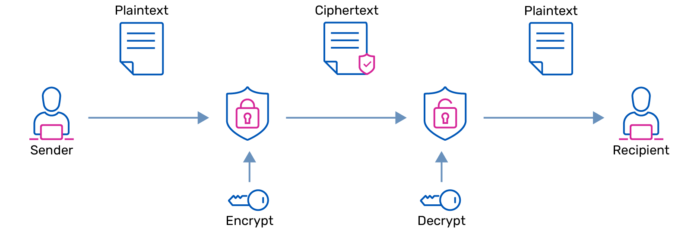
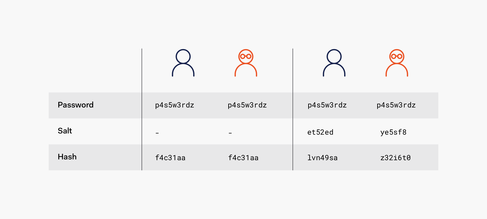
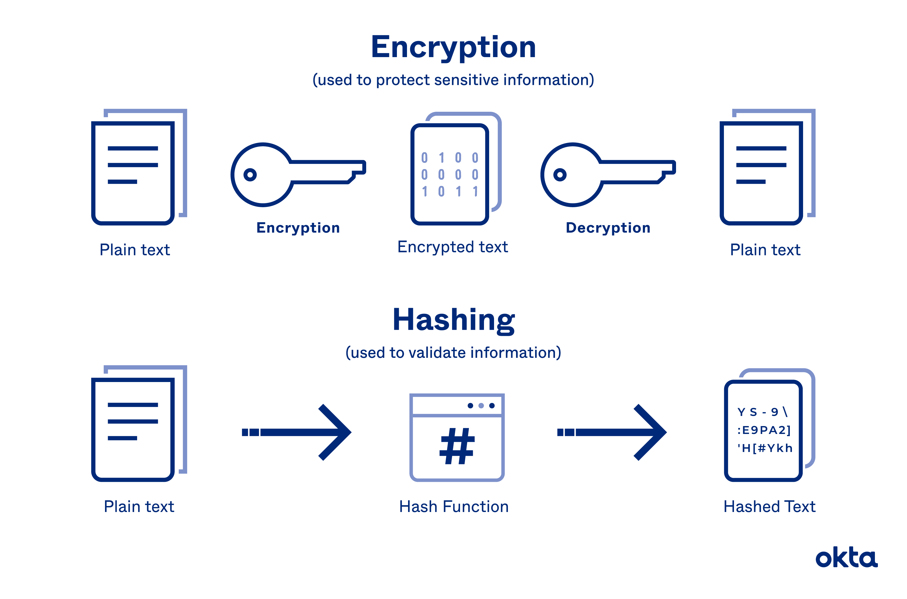
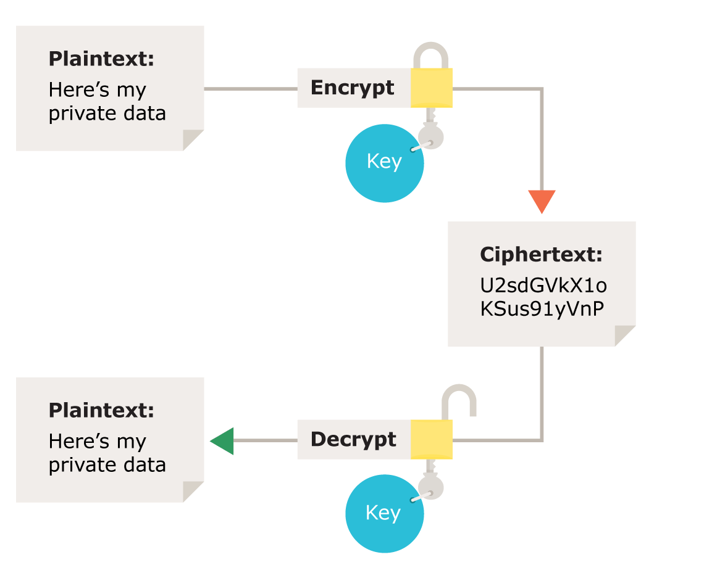
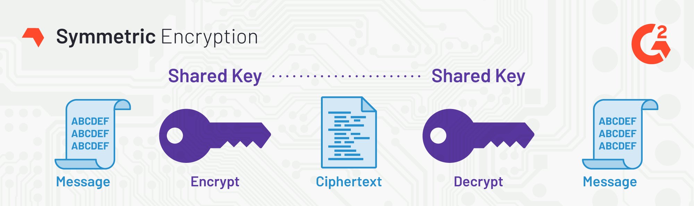
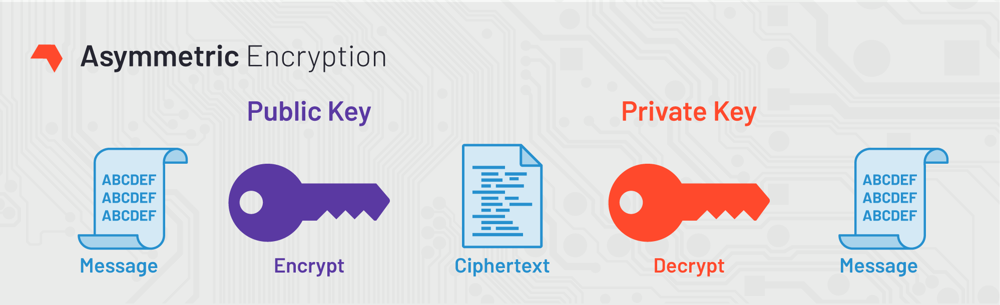
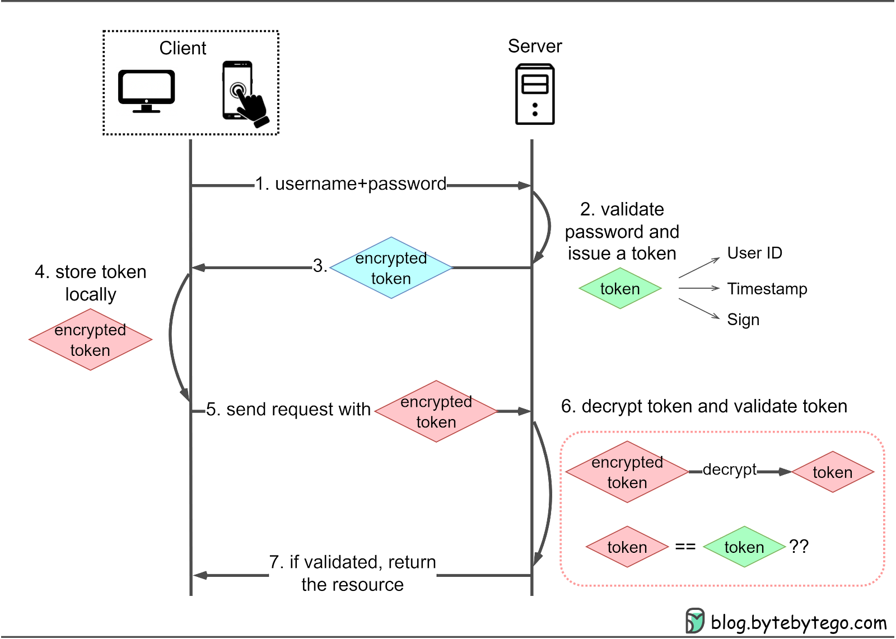
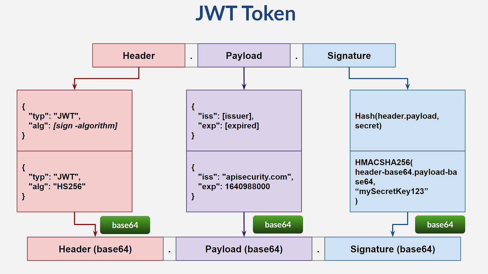
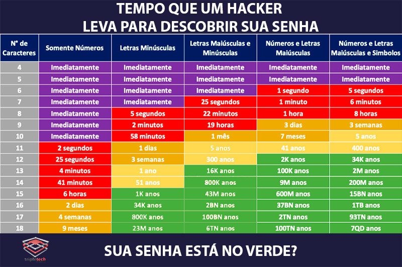

# Segurança com Node

- [Segurança com Node](#segurança-com-node)
  - [Conceituando Criptografia](#conceituando-criptografia)
    - [Tipos de Cifras](#tipos-de-cifras)
  - [Autorização e Autenticação](#autorização-e-autenticação)
    - [Funções Hash](#funções-hash)
    - [Tipos de Algoritmos de Hash](#tipos-de-algoritmos-de-hash)
  - [Transmitindo Informações](#transmitindo-informações)
    - [PGP](#pgp)
  - [Módulo Crypto](#módulo-crypto)
  - [Assinatura e Token JWT](#assinatura-e-token-jwt)
  - [Segurança de Aplicações](#segurança-de-aplicações)
    - [Ataques](#ataques)
    - [Fator Humano](#fator-humano)
      - [Criação de Senhas: Boas Práticas](#criação-de-senhas-boas-práticas)

## Conceituando Criptografia

> https://www.hostinger.com.br/tutoriais/o-que-e-criptografia

> https://www.alura.com.br/artigos/o-que-e-ciberseguranca-praticas-equipes-de-seguranca

(hashes, encriptação simétrica e assimétrica, assinaturas)

A criptografia (kryptós = escondido, gráphein = escrita), geralmente, se refere à construção e análise de protocolos que impedem que terceiros, ou o público, tenham acesso a informações privadas. Muitos aspectos em segurança da informação, como confidencialidade, integridade de dados, autenticação e não-repúdio, são centrais à criptografia moderna.

A maioria dos sites e aplicativos utiliza a criptografia com o propósito de ocultar dados sensíveis, impedindo que usuários não autorizados acessem ou roubem as informações; além disso, protege a transmissão de dados na internet. Entre estes dados, temos: mensagens, senhas, dados bancários, localização e outras informações pessoais.

### Tipos de Cifras

## Autorização e Autenticação

O conceito de autorização é a ideia que algo tenha seu acesso controlado por uma identificação, permissão ou licença, o que casa com a autenticação, que nada mais é que o conceito de se provar que é quem ou o que alega ser, ou seja, o autorizado.

(tipos de autenticação)

> https://www.alura.com.br/artigos/tipos-de-autenticacao

### Funções Hash

> https://www.alura.com.br/artigos/como-armazenar-senhas-no-banco-de-dados-de-forma-segura

São usadas para criptografar uma mensagem, sem que haja uma maneira de reverter a codificação. A hash, geralmente, é armazenada em uma tabela para que seja possível autenticação por meio de comparações.

Propriedades:

- Sem colisões
- Tamanho fixo
- Demore um pouco para ser executado

**Vulnerabilidades e Salt ↓**

Ao usar hashes simples, é possível que alguém pré-calcule os valores das senha mais comuns e, quando tiver acesso a base de dados comprometida, compare os valores dessa lista com os salvos no banco. Isso tipo de ataque é chamado de Rainbow Table.

Na criptografia, "sal" é um dado aleatório alimentado como input adicional de uma função unilateral que faz hash de dados, senha ou palavra de acesso. Adicionar sal ajuda a defender contra ataques de tabelas pré-computadas, pela forma em que aumenta o tamanho da tabela necessária para um ataque bem-sucedido. Ele também ajuda a proteger senhas que se repetem em um banco de dados, pois um novo salt é usado em cada instância. 

Além disso, salgar hashes não afeta os usuários.

### Tipos de Algoritmos de Hash

Hashes do mesmo conteúdo podem ter resultados diferentes em algoritmos diferentes, principalmente levando em consideração as suas especifidades próprias em colisões e tamanhos fixos.

## Transmitindo Informações

As funções hash são ótimas para autenticação, mas como só cifra e compara, não é uma opção interessante para a transmissão de informações, já que o objetivo da comunicação é do receptor receber uma mensagem que seja compreensível. Dessa forma, se é necessário entrar no conceito de encriptação e desencriptação para fazer essas transmissões.

Encriptação é o processo de transformar informações de uma maneira que, idealmente, somente pessoal autorizado pode decodificar. Este processo converte a representação original de uma informação, conhecida como plaintext, em um formato alternativo conhecido como ciphertext. 

Apesar de seu objetivo, a encriptação não previne, de forma própria, a interferência entre as transmissões, mas nega o conteúdo compreensível ao possível interceptor.

**Encriptação Simétrica ↓**

(chave compartilhada, mesma chave codifica e decodifica.)

**Encriptação Assimétrica ↓**

(chaves diferentes, uma chave pública para a codificação e a outra privada para decodificar. São sempre geradas em pares e só funcionam como conjunto)

### PGP

## Módulo Crypto

## Assinatura e Token JWT

(assinatura)

É uma forma de validar a autoria de um documento ou informação, prevenindo que informações sejam interceptadas e substituídas por outras falsas. A chave privada cria a assinatura digital do documento, e a chave pública se junta a assinatura para gerar um novo documento, este que deve ser igual ao original para ser verificado.

(sessão e tokens)

Neste caso, uma sessão é a quantidade de tempo em que o usuário está autenticado e conectado a um serviço ou sistema. Ou seja, o tempo em que está identificado até ter que se autenticar novamente. Uma sessão pode ser autenticada ao gerar e armazenar um identificar único (id), este também sendo enviado ao usuário, onde serpa guardado por cookies ou local storage, e as requisições que ele for realizar dali para frente, vai precisar mandar esse ID para o servidor.

Dessa forma, não é preciso informar toda vez para o servidor a senha e login, com o mesmo processo de autenticação, durante um determinado tempo. É possível apenas receber o identificador e o servidor entender que determinado ID está associado àquele usuário.

Essa estratégia funciona para a maioria dos casos. Porém, há aplicações que dependem de escala, que possuem bastantes bancos de dados, centros de distribuições ou dependendo da arquitetura do sistema, buscar por esse ID pode não ser uma tarefa tão simples, pode ser custosa. Outro cenário menos comum é um terceiro obter o identificador e se passar pelo usuário.

Como alternativa, foram criados os tokens, em que ao invés do servidor gerar um valor, armazenar e ficar se comunicando com o usuário, é gerado como se fosse uma hash de uma determinada informação e enviado de volta para o usuário. O usuário, então, guarda este token que, não consegue ler e não possui capacidade de utilizar, como se fosse uma assinatura.

Quando ele for fazer uma requisição, vai mandar esse token de volta e, ao invés do servidor pesquisar e localizar esse ID, ele simplesmente valida o token, ou seja, vai decifrar a informação.

(jwt)

> https://www.alura.com.br/artigos/o-que-e-json-web-tokens

JSON Web Token é um token que usa a anotação do JSON para armazenar as informações e guarda o dado de forma parecida com os Objetos no JavaScript. É definido como: um padrão aberto que define uma forma segura de transmitir informação entre duas partes como um objeto JSON. Essa informação pode ser verificada e confiada, pois foi assinada digitalmente.

É composto por 3 partes:

- Header
- Payload (dados)
- Assinatura

Algo muito importante de se pontuar é que, não necessariamente, todos os tokens são criptografados. O cabeçalho e payload de um Token JWT comum passa apenas por uma codificação em base64, ou seja, ele é reescrito em um formato mais compacto, mas que pode ser facilmente retornado ao seu conteúdo original.

Dessa forma, a assinatura nesse contexto apenas contribui para verificar a autenticidade e integridade do token. Por isso a chave secreta deve ser guardada para que outras pessoas não possam assinar os tokens, e não para que não seja possível ler o conteúdo em si.

Porém, existem variações de tokens que utilizam sim a criptografia.

> https://www.brunobrito.net.br/jose-jwt-jws-jwe-jwa-jwk-jwks/ 
>

(armazenando tokens)

As maneiras mais fáceis de armazenar um token JWT no lado do cliente são o `localStorage` e o `sessionStorage`.

A maioria das pessoas tende a armazenar seus JWTs no `localStorage` do navegador web, porém essa tática deixa seus aplicativos abertos a um ataque chamado XSS. Nesse tipo de ataque, um invasor aproveita o fato de que o armazenamento local é acessível por qualquer código JavaScript executado no mesmo domínio da aplicação. Assim, por exemplo, se o invasor encontrar uma maneira de injetar código JavaScript mal-intencionado em seu aplicativo, seu token JWT estará imediatamente disponível para eles. Portanto, se deseja segurança em suas aplicações, não armazene um JWT no `localStorage`.

Mas e no `sessionStorage`? Assim como o `localStorage`, o armazenamento de sessão é acessível por qualquer código JavaScript executado no mesmo domínio em que o seu aplicativo está hospedado. Portanto, a única diferença entre os dois é que no `sessionStorage`, quando um usuário fecha o navegador, o JWT desaparecerá e o usuário terá que fazer login novamente em sua próxima visita ao aplicativo web. Portanto, evite também armazenar um JWT no `sessionStorage`.

A forma mais segura, se bem implementada, é utilizar cookie `httpOnly` para armazenar tokens JWT. Este é um tipo especial de cookie que é enviado apenas em solicitações HTTP para o servidor. Nunca é acessível (tanto para leitura quanto para escrita) a partir do JavaScript em execução no navegador e pode ter uma data de expiração definida.

Por estes motivos, é recomendável utilizar cookies` httpOnly` para manter tokens JWT seguros.

## Segurança de Aplicações

O vazamento de autenticações não está relacionado somente a quantidade de caracteres presentes na senha escolhida, mas o comportamento do usuário também influencia no processo de crack (quebra). Como exemplo, ocorre a identificação de padrões via dados pessoais da pessoas ou de pessoas próximas, devido ao uso de data de nascimento ou CPF próprio como senha, assim como a prática de utilização da mesma senha em diferentes locais, ou mesmo manter a mesma senha por longos períodos.

Além disso, é preciso entender que a tecnologia voltada para a quebra de segurança também se relaciona com a capacidade de hardware, ou seja,  os processadores, GPU e CPU, evoluíram muito para melhorar a segurança, por outro lado, isso tornou mais acessível o processo de descriptografia. Conjuntamente, os algoritmos também foram melhorados a fim de otimizar ambos os processos.

Resumindo, hardware, software e lógica estão associados a quebra de seguranças das aplicações. Tendo isso em mente, é preciso ter precaução nestes 3 pontos na criação de uma autenticação mais segura.

Essas estimativas da tabela, claro, levam em consideração um contexto raso, esperando que a senha mais completa seja, também, complexa em significado, ou seja, não venha de uma informação pessoal, algo relacionado ao sistema ou esteja entre as mais comuns. Apesar da combinação “Senha123456” estar listada como demorando 41 anos, provavelmente seria descoberta em segundos por um ataque um pouco mais elaborado.

As formas mais comuns de mitigar ataques a segurança são: limitar o número de tentativas de autenticação, checar qual é o IP ou posição de quem está realizando a tentativa e ter uma política de senha diferente — não permitindo senhas comuns ou avisando do risco de senhas fracas.

### Ataques

(ataque de força bruta)

É um ataque relativamente simples, onde tentativas exaustivas de se acertar uma autenticação são dadas a partir de informações inicias rasas, como o usuário de uma conta e o tamanho de sua senha, combinando todos os números (e, se relevante, caracteres) possíveis. É mais utilizado para senhas que são somente combinações numéricas.

Como há um número finito de combinações, é possível percorrer numericamente todos e eventualmente uma delas seria a combinação escolhida pelo usuário. Mas quando a senha é aumentada em tamanho (e em caracteres permitidos) as possibilidades de combinações aumentam, tornando o processo muito mais custoso.

(dicionário)

Este é mais utilizado em cenários que possuem uma senha que é um campo de texto ou algo um pouco mais genérico. Da mesma forma que o anterior, este ataque parte do conhecimento de alguma credencial - como o e-mail ou usuário - e segue com tentativas de autenticação por meio de uma lista, não de todas as possibilidades possíveis, mas sim das possibilidades mais comuns.

Isto é, listas que tenham senhas consideradas fracas e comuns, para que se verifique uma por com o objetivo de se autenticar no sistema.

(rainbow table)

Este ataque consiste em uma tabela pré-calculada de hashes gerados por senhas simples sem salt e, em seguida, ao ocorrer um vazamento de dados, é só comparar as hashes comprometidas com a tabela pré-calculada.

### Fator Humano

De pouco adiante o desenvolvimento de uma aplicação com segurança em primeiro plano se o usuário (ou até mesmo colaboradores de aplicação) não conhecem ou seguem algumas boas práticas que visam prevenir uma quebra de segurança.

Entre essas práticas, temos processos definidos que visam diminuir a incidência destes eventos de riscos a processos para descobrir qual a causa de quebras eventuais.

Seguindo essa ideia, algumas práticas indevidas são o compartilhamento de senhas, autenticações que sejam feitas por mais de uma pessoa com a mesma senha, anotar credencias em lugares que terceiros tenham acesso, ou até práticas que tornem algo inviável, como uma política de trocar senhas toda semana.

É preciso ter um equilíbrio entre segurança e conveniência.

Outro ponto relevanto são as técnicas chamadas de engenharia social. Nem sempre é necessário “invadir sistemas” via ataques virtuais como nos filmes e séries - elas se utilizam justamente do fator humano. Essas pessoas, muitas vezes, usam truques para fazer com que os próprios usuários divulguem voluntariamente informações sigilosas, cliquem em links suspeitos ou instalem malwares em seus computadores/celulares.

Elas não estão restritas ao universo de logins e senhas na internet, mas podem ser utilizadas 100% na vida real para conseguir acesso a locais restritos, informações secretas e/ou privilegiadas, para espionagem industrial e tudo o mais que envolva sigilo ou privacidade.

**Determinando Requisitos ↓**

Quando se tem sistemas que possuem muitos agentes e usuários com tipos de autorizações diferentes ou credenciais, é preciso fazer um equilíbrio. É necessário usar as práticas de segurança, mas de forma que não seja inconveniente para o usuário para ele não ter um incentivo de burlar uma parte desses processos.

É preciso aplicar práticas mais transparentes e que não prejudiquem o cotidiano e a função do usuário ao executar as tarefas.

- Requisitos de senhas
  - Seguir boas práticas de senha, como requisitos de tamanhos e complexidade
- Múltiplos fatores
  - Autenticar um acesso por mais de um meio para garantir a identidade de quem está acessando
- Bibliotecas
  - As bibliotecas facilitando o desenvolvimento dessas implementações seguras, mas essas dependências podem trazer questão de vulnerabilidade própria e retrocompatibilidade
  - Uma falha na dependência pode afetar milhares de projetos
- É realmente necessário ter uma senha?
  - Nem tudo precisa de uma senha, a autentificação pode ser feita de outras maneiras

Outros pontos a se pensar são: opções seguras de acesso para esquecimento de senha, perguntas secretas e indicação de gerenciadores de senhas.

#### Criação de Senhas: Boas Práticas

> https://www.alura.com.br/artigos/como-criar-uma-boa-senha