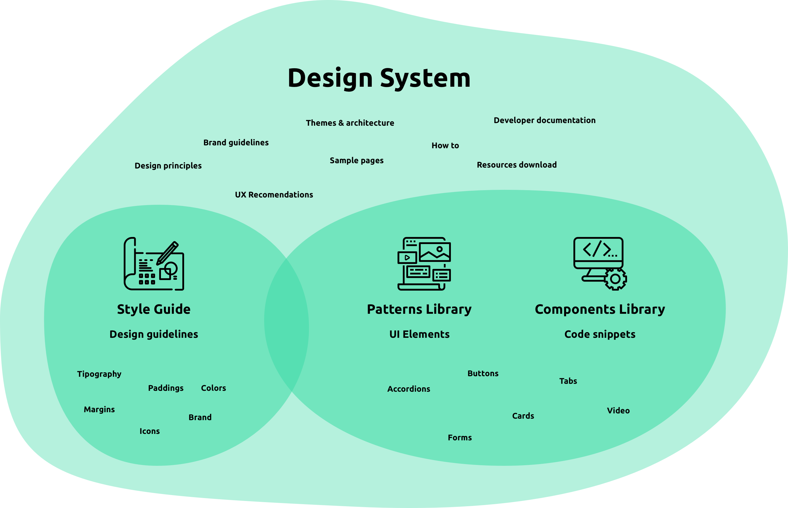
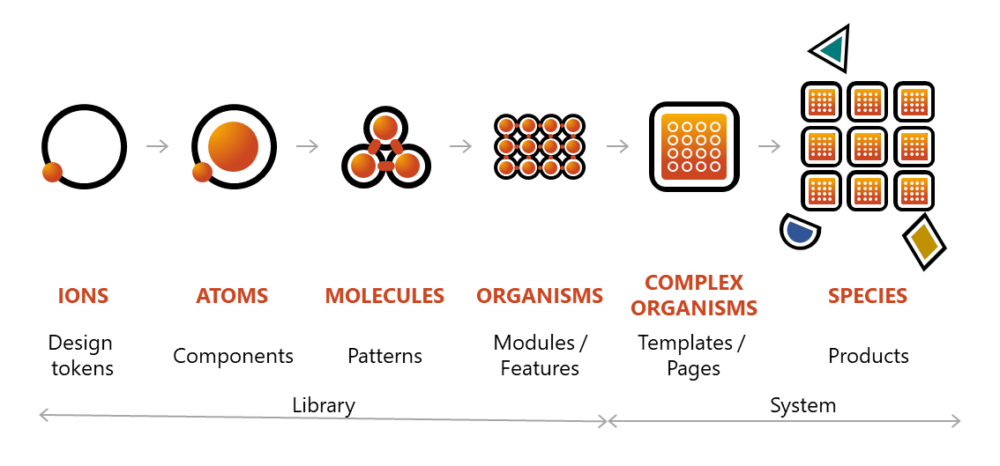
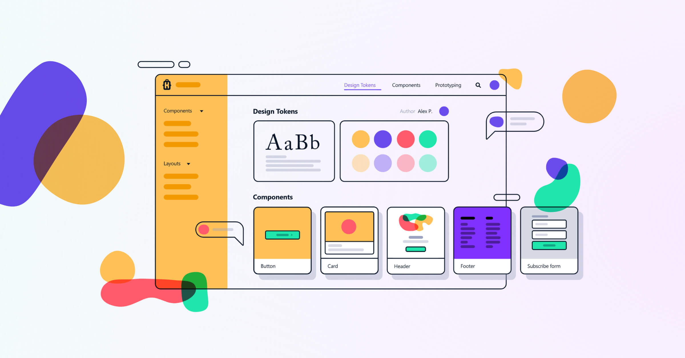
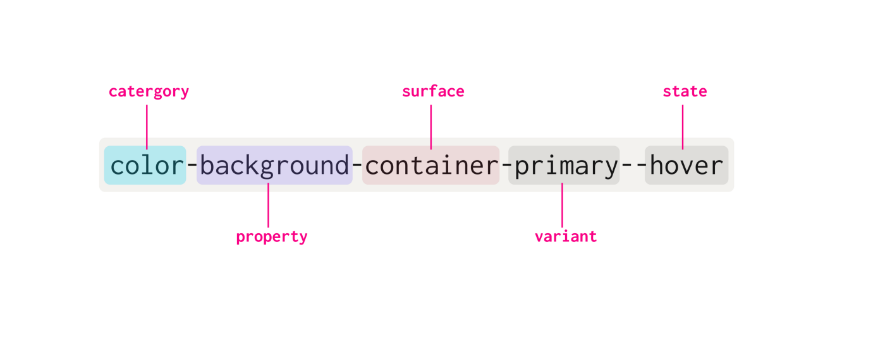
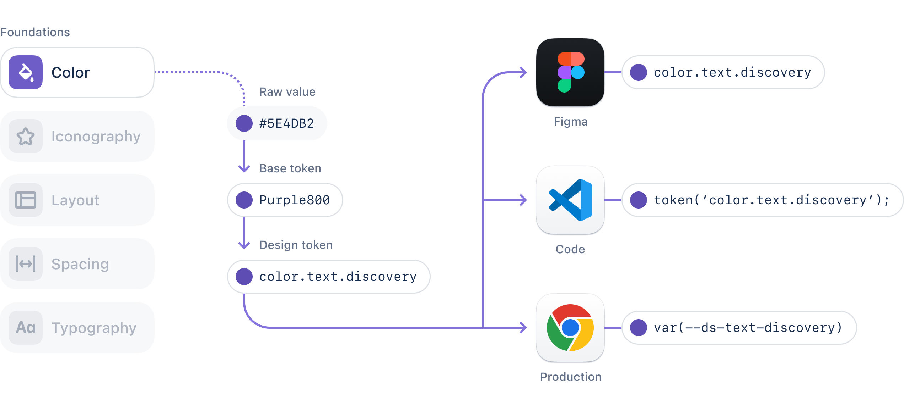
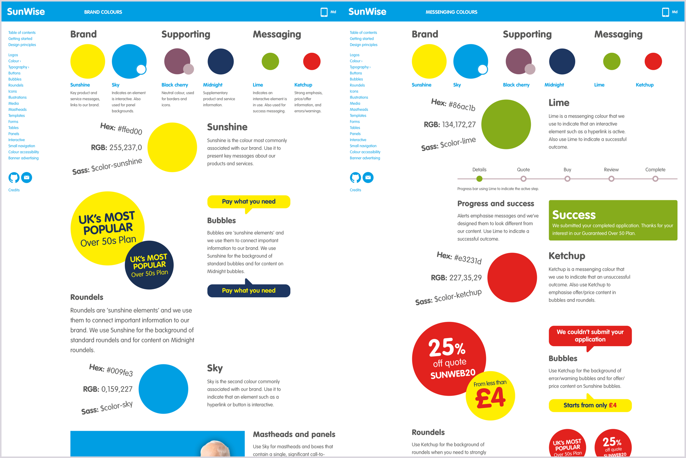
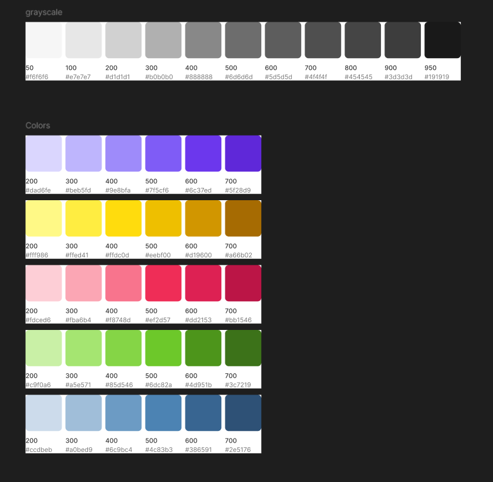
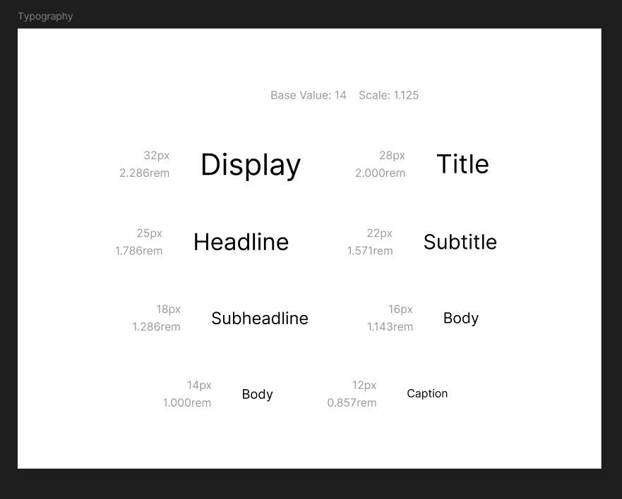
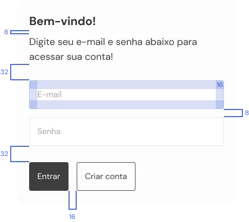
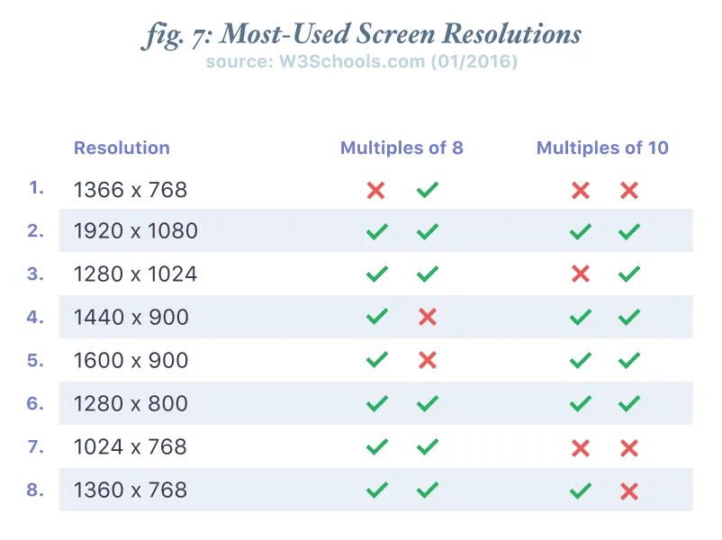

# Design System

- [Design System](#design-system)
  - [O Que É?](#o-que-é)
    - [Atomic Design](#atomic-design)
    - [Style Guide e Design Tokens](#style-guide-e-design-tokens)
    - [Documentação](#documentação)
    - [Problemas que o Design System Resolve](#problemas-que-o-design-system-resolve)
    - [Exemplo: SunWise Style Guide](#exemplo-sunwise-style-guide)
  - [Inventário de Interface](#inventário-de-interface)
    - [Organizando](#organizando)

## O Que É?

É um produto escalável que serve outros produtos, sendo ele uma biblioteca de padrões e diretrizes de uso de uma equipe para a criação dos produtos com mais facilidade e agilidade. Ele evoluí constantemente, tornado sempre atual a sua base para o desenvolvimento do produtos.

O design system unifica a linguagem de um determinado produto, sendo a base para a construção de interfaces eficientes, consistentes e altamente funcionais.

### Atomic Design

Sua abordagem casa muito bem com outra conhecida como Atomic Design. Como seu nome indica, utiliza de uma analogia entre elementos e componentes de um projeto de design com o comportamento dos átomos, moléculas e organismos para criar design systems mais consistentes e padronizados dentro do desenvolvimento de uma interface. 

Seguindo ele, tudo começa com os componentes, lidando de forma crescente até chegar ao produto final. Portanto temos dentro dessa ordem os átomos, moléculas, organismos, templates e páginas. A teoria parte da ideia de que os átomos formam moléculas quando se unem. As moléculas, por sua vez, são capazes de criar organismos complexos a partir da junção de componentes.

- Átomos
  - São os próprios componentes básicos necessários para a criação da interface
  - Ícones, botões, cores, imagens, tipografia, etiqueta, ou outros elementos que sozinhos não fazem muitas coisas
  - Eles são a base para o desenvolvimento de um sistema complexo e bem estruturado, e portanto, são indispensáveis para o processo
  - Para cada componente, é importante criar as variações dele para cada estado de interação
- Moléculas
  - A junção destes componentes que forma uma unidade; é um grupo de elementos base que, quando combinados, criam componentes mais claros em um sistema, como uma funcionalidade
  - Menu, card, navbar, etc
- Organismos
  - Junção das moléculas em um sistema - átomos, moléculas ou até outros organismo
  - Header, aside, footer, sections, etc
  - Aqui, a estrutura começa a ficar mais complexa e inclui diversos elementos que a interface deve ter
- Templates
  - Integração de todos os elementos anteriores a uma mesma página, mas sem de fato colocar para rodar as funcionalidades ou adicionar dados reais do projeto
  - É importante para a visualização dos componentes em uma interface, focando mais no design e no layout
- Páginas
  - Adicionam conteúdos e funcionalidades mais próximas do real e do resultado final do produto ou plataforma digital
  - Ideal para realizar testes de experiência com o uso do sistema e revisá-lo caso precise de ajustes antes de realmente finalizar o produto

### Style Guide e Design Tokens

Voltando ao design system, dentro dela existem diversas ferramentas, sendo essencial: objetivos e valores, style guide, biblioteca de componentes e valores, e códigos. 

O style guide contém os elementos e componentes, suas interações e modo de uso. Tipografia, fontes, tamanhos, paleta de cores, ícones, marca, etc.

Ele serve como um sistema de organização menor e mais restrito para a parte visual. Dessa forma, é responsável pela identidade e características visuais do produto, funcionando como uma fatia do que compõem um design system.

Junto dele se trabalha com o design token, que são variáveis as quais representam todo tipo de característica de um design system. Eles representam uma peça-chave na disseminação consistente de estilos em todo o ecossistema de design e desenvolvimento.

São unidades abstratas que encapsulam valores específicos, como cores, tipografia e espaçamentos. A associação estreita entre design tokens e estilos é fundamental para a flexibilidade e manutenção do sistema.

Ao adota-los, os estilos tornam-se modularizados e gerenciáveis de maneira centralizada. Essa abordagem modular simplifica as alterações, pois uma única modificação no token reflete automaticamente em todos os lugares onde ele é usado.

A consistência gerada por eles é crucial para garantir uma experiência do usuário uniforme em diversos dispositivos e contextos. Ao invés de depender de valores diretamente codificados em componentes, os desenvolvedores referenciam design tokens, permitindo uma sincronização eficiente de estilos em todas as instâncias.

### Documentação

Desemprenha um papel vital em um design system, atuando como um guia abrangente que define padrões, diretrizes e instruções para o uso consistente e eficaz dos elementos do sistema.

É uma ferramenta fundamental para garantir a compreensão e adoção bem-sucedida dos padrões determinados pelo sistema por parte das equipes de design e desenvolvimento. Sua utilidade se faz presente na comunicação clara e na transferência de conhecimento. Ela fornece informações detalhadas sobre os princípios de design, estilos visuais, comportamentos interativos, estrutura de componentes, regras de utilização e a motivação  e objetivos por trás das escolhas.

Isso permite criar uma linguagem comum entre os membros da equipe, garantindo que todos compartilhem uma compreensão coesa sobre como aplicar e expandir o sistema de design.

Não só isso, a documentação serve também como um recurso educacional principalmente para novos membros da equipe, facilitando a integração e acelerando o processo de aprendizado sobre as práticas de design e desenvolvimento adotadas pelo design system. É algo especialmente valioso em ambientes dinâmicos.

A importância da documentação também se estende à manutenção contínua do design system. À medida que o sistema evolui, a documentação precisa ser atualizada para refletir as mudanças. Isso garante que todas as partes interessadas estejam cientes das atualizações e possam implementá-las conforme necessário, promovendo a coesão e a consistência contínuas.

### Problemas que o Design System Resolve

O design system é um produto pensado para resolver uma série de problemas significativos. Não é somente um projeto paralelo e temporário que uma empresa adota, mas sim todo design system parte de uma necessidade.

Alguns problemas que ele resolve ↓

- **Falta de consistência visual:** 
  - Garante que todos os elementos de interface tenham uma aparência consistente, criando uma identidade visual unificada para a marca.
- **Desperdício de tempo:** 
  - Economiza tempo dos designers e desenvolvedores, evitando a duplicação de esforços na criação de componentes e estilos.
- **Atrasos no desenvolvimento:** 
  - Agiliza o processo de desenvolvimento, uma vez que os componentes prontos para uso podem ser facilmente implementados.
- **Manutenção trabalhosa:** 
  - Facilita a manutenção contínua, uma vez que as atualizações de design podem ser aplicadas centralmente e refletidas em todos os produtos.
- **Problemas de escalabilidade:** 
  - Ajuda a manter a consistência à medida que produtos e equipes crescem.
- **Dificuldade na colaboração:** 
  - Facilita a colaboração entre designers e desenvolvedores, pois todos trabalham com um conjunto comum de recursos.
- **Problemas de acessibilidade:** 
  - Pode incluir diretrizes de acessibilidade, tornando mais fácil criar produtos acessíveis desde o início.
- **Desafios de integração:** 
  - Garante uma integração mais suave entre sistemas e aplicativos, pois os componentes são projetados para funcionar juntos.
- **Comunicação ineficaz:** 
  - Fornece uma linguagem comum para discutir design, evitando mal-entendidos.
- **Má qualidade visual:** 
  - Mantém a qualidade visual dos produtos, uma vez que os componentes são projetados com atenção aos detalhes.
- **Falhas de usabilidade:** 
  - Ajuda a criar produtos mais fáceis de usar, seguindo padrões de usabilidade testados.
- **Desperdício de recursos:** 
  - Reduz o desperdício de recursos financeiros e temporais no desenvolvimento de produtos.
- **Mudanças constantes de design:** 
  - Permite que as equipes de design experimentem e inovem dentro dos parâmetros do design system, mantendo a consistência.
- **Custos elevados de treinamento:** 
  - Simplifica o treinamento de novos membros da equipe, pois eles podem seguir as diretrizes do design system.
- **Problemas de governança:** 
  - Ajuda a manter um controle mais rígido sobre os ativos de design e como eles são usados.

### Exemplo: SunWise Style Guide

> https://brasil.uxdesign.cc/ui-design-guia-de-sites-para-te-ajudar-a-montar-interfaces-2782c31b6560

## Inventário de Interface

É similar a um inventário de conteúdo, porém, ao invés de examinar e categorizar conteúdo, se examina e categoriza os componentes que constituem uma página. Ou seja, um inventário de interface é uma coleção compreensiva dos pedações que formam uma interface.

Uma forma de começar a criar um inventário é juntando e dispondo screenshots das interfaces do produto, para então ter a disposição em elementos em sua totalidade. Com isso feito, é o momento de destrinchar cada tela a fim de separar os componentes que as compõem e outras informações relevantes.

Isso tratá um mapeamento de estilos de texto, todos os tamanhos da fonte, as alturas de linha, os espaçamentos entre os caracteres e entre os componentes, todas as cores e estilos de sombra, todos os estilos de borda, e assim por diante.

### Organizando

Uma vez que o inventário for finalizado, é a hora de organizar as informações e começar a definir o que realmente entrará no design system.

Para a paleta de cores, é interessante que tenha diferentes tonalidades da mesma cor, informações de acessibilidade sobre contraste e siga uma nomenclatura clara para a utilidade de cada cor e sua tonalidade.

Um prática comum de nomenclatura é brand, danger, info, success e warning para cor, e numeração de 100 a 900 (pulando de centena em centena ou meia centena) para as tonalidades. É importante definir também a grayscale.

A melhor forma de definir a tipografia é por meio de uma escala modular. Definindo o tamanho da fonte do corpo como base, a possível usar ferramentas para gerar uma escala que apresenta valores que fazem sentido para o uso de todo sistema.

É interessante que se defina, pelo menos, 2 tamanhos diferentes de line heights, sendo recomendado 1.5 para a maioria dos textos. O importante é que seja um espaçamento acessível para a leitura, com bom respiro e facilidade de acompanhar as quebras de linha.

Outra definição comum é o peso e estilo do texto, e a sinalização de quando deve ser usado cada um.

Quando trabalhamos com espaçamento, uma regra interessante de se aplicar é o 8-point grid. A ideia é dispor os elementos e o espaço entre eles usando valores que são múltiplos de 8.

Isso vem da percepção que as resoluções mais comuns hoje, em pixels, são divisíveis por 8. A maioria dos casos envolve a largura, que é a parte com maior relevância, mas algumas alturas também são incluídas.

Existem muitas pessoas que acabam criando uma sub-regra para trabalhar com múltiplos de 4, o que também funciona muito bem. Não cria um espaço excessivo e não gera problema. Portanto, também poderíamos trabalhar com 4, 8, 12, 16, e assim por diante.

Essa regra pode ser aplicada a outras coisas também, como ao tamanho das fontes e sombras.