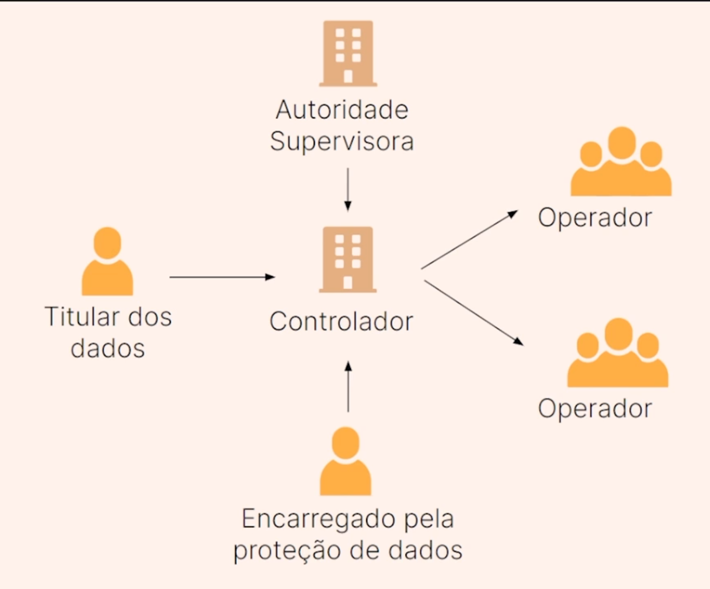

# LGPD: Diretos e Responsabilidades

- [LGPD: Diretos e Responsabilidades](#lgpd-diretos-e-responsabilidades)
  - [Princípios](#princípios)
    - [Proteção de Dados](#proteção-de-dados)
    - [Proteção da Privacidade](#proteção-da-privacidade)
    - [Princípios da CIDA](#princípios-da-cida)
  - [Funções e Conceitos](#funções-e-conceitos)
    - [Esquematizando Conceitos](#esquematizando-conceitos)
      - [Nomenclaturas Gerais](#nomenclaturas-gerais)
    - [Coletas de Dados](#coletas-de-dados)
  - [Impactos da Lei](#impactos-da-lei)
    - [Penalidades](#penalidades)
    - [Benefícios](#benefícios)
  - [Gestão de Riscos](#gestão-de-riscos)
    - [LGPD vs. Segurança da Informação](#lgpd-vs-segurança-da-informação)
    - [Fundamento Jurídico](#fundamento-jurídico)

## Princípios

A lei geral de proteção de dados se estabelece como uma regulamentação tanto de proteção, quanto de responsabilidades voltada a coleta, armazenamento, processamento, transporte e eliminação de dados. A sigla LGPD foi inspirada em regulamentações internacionais de proteção de dados. Na Europa, por exemplo, temos a GDPR, que é uma regulamentação geral de dados.

> Protege a privacidade e os direitos dos cidadãos brasileiros em relação ao tratamento de suas informações pessoais

A relevância desse aspecto reside no fato de que a LGPD, apresenta implicações significativas. Por exemplo, ao ter interações com empresas estrangeiras, mesmo que eu não seja um cidadão europeu, é necessário consentir, pois a empresa europeia planejava divulgar os dados.

### Proteção de Dados

O conceito de proteção de dados envolve a implementação de medidas, políticas e regulamentações para assegurar o tratamento seguro, legal e transparente dos dados pessoais de indivíduos.

Antes, a preocupação com dados era exclusiva de empresas confiáveis e maiores. Porém, em algum momento, a quantidade de dados tornou-se uma moeda de troca. Agora, ter dados significa ter valor e poder, possibilitando a venda ou uso estratégico para obter vantagens. Com o passar do tempo, ficou, sim, necessário alguma regulamentação sobre isso.

**Pontos-chaves ↓**

- Privacidade

O ponto inicial a ser considerado é a questão da privacidade. Qual é o nível de privacidade que o indivíduo possui? Quem tem acesso aos dados? Para que e como eles são utilizados? O indivíduo tem acesso a essas respostas de forma clara e fácil?

- Conformidade Legal

Não é exatamente sobre proteger os dados ou não, indiscriminadamente, mas, sim, sobre saber o que a lei diz que você pode ou não fazer, que a empresa pode ou não fazer ou que você, como pessoa consumidora, tem ou não de direitos.

Resumindo, os direitos do consumidor e responsabilidades, de ambos consumidor e empresa, parente o âmbito legal.

- Redução de Riscos

A lei abrange diversas áreas, enfocando principalmente a redução de riscos. Essa diminuição de riscos se aplica tanto à proteção individual quanto à preservação da empresa e de sua marca.

Portanto, é possível afirmar que a marca e a empresa obtêm benefícios ao aderirem à LGPD, pois isso não apenas gera maior confiança por parte do cliente, mas também proporciona vantagens ao operar de maneira ética com as informações de cada indivíduo. Esse compromisso adequado resulta em uma reputação positiva para a marca.

**Proteção x Privacidade ↓**

Inicialmente, é crucial compreender que há uma distinção entre esses dois termos.

Portanto, não é necessário aguardar um vazamento de dados para se preocupar com a privacidade; de fato, os próprios funcionários da empresa devem zelar pela confidencialidade dos dados. Este é um ponto fundamental a ser considerado.

Outra coisa é a proteção de dados. Então, precisamos proteger esses dados para que não seja feita nenhuma utilização indevida sem o consentimento, nem o meu, nesse caso estou falando, porque eu tenho que dar o consentimento para a empresa de como ela vai usar os dados e tudo mais.

> nada de mim, sem mim

Mas um vazamento significa que alguém vai utilizar os dados e provavelmente não vai seguir a LGPD porque conseguiu acesso a esses dados. Então, também temos que cuidar de quem tem acesso a esses dados.

É neste ponto que também se faz presente a necessidade de se preocupar com a segurança da informação, que é o conjunto de medidas e práticas que visam proteger as informações e sistemas de uma organização ou indivíduo contra acesso, uso, divulgação, interrupção ou destruição não autorizados.

### Proteção da Privacidade

O princípio subjacente é assegurar aos cidadãos brasileiros um direito fundamental à proteção da privacidade.

- Proteger a privacidade dos cidadãos brasileiros, esse é um direito fundamental
  - É importante compreender que a intenção é proteger a privacidade dos cidadãos brasileiros, independentemente das transações comerciais que realizem
- Garante que seus dados pessoais estejam seguros e conforme a finalidade que foram coletados
  - Nesse contexto, emerge a compreensão de que a lei visa informar ao cidadão sobre o uso de seus dados
- Estabelece princípios e direitos para os titulares de dados
  - Quem detém os dados? Quem os guarda? Quem possui a titularidade desses dados?

**Regulamentação abrangente ↓**

> Esta Lei regula o tratamento de dados pessoais, abrangendo meios digitais, por pessoas naturais ou jurídicas, públicas ou privadas, com o propósito de salvaguardar os direitos fundamentais de liberdade, privacidade e o desenvolvimento pessoal

Essa norma abrange um amplo espectro, incluindo empresas públicas, empresas privadas e indivíduos, com o intuito de proteger os direitos fundamentais de liberdade, privacidade e desenvolvimento pessoal.

É evidente que as legislações surgem de necessidades específicas. Era imperativo começar a considerar esse cenário devido à crescente exposição a golpes, fraudes, erros contratuais e até mesmo ameaças à segurança pessoal. A ausência de uma legislação que protegesse a privacidade e o uso adequado dos dados nos deixava vulneráveis a tais situações. A importância desse aspecto tornou-se cada vez mais evidente em um mundo globalizado e digitalizado.

**Alinhamento Internacional ↓**

- A LGPD se alinha com regulamentações internacionais de proteção de dados, em especial com o Regulamento Geral de Proteção de Dados (GDPR) da União Europeia
- Importante: as empresas brasileiras que desejem fazer negócios fora do Brasil estejam atentas às leis de proteção de dados internacionais

A LGPD pode ser considerada quase uma extensão da GDPR, pois esta última, como uma legislação inovadora, já exercia influência na vida dos brasileiros sempre que estes realizavam transações comerciais com empresas europeias. A LGPD, de certa forma, não apenas se alinhou, mas também se inspirou na GDPR.

Empresas brasileiras que buscam realizar transações fora do país devem estar atentas às normas internacionais de proteção de dados. Ao contrário das leis nacionais de proteção, a Lei Geral de Proteção de Dados do Brasil, assim como a GDPR para os cidadãos europeus, tem como objetivo salvaguardar as informações dos cidadãos brasileiros e regular o modo como suas informações são tratadas.

Quando uma empresa brasileira realiza vendas para o exterior, é crucial considerar essas questões.

**Transferência internacional de dados ↓**

Somente é permitida nos seguintes casos:

- Países ou organismos internacionais que proporcionem grau de proteção de dados
- Quando o controlador oferecer e comprovar garantias de cumprimento dos princípios, dos direitos do titular e do regime de proteção de dados previstos na Lei

Essa transferência é autorizada apenas em duas situações: quando envolve países ou organizações internacionais que asseguram um nível adequado de proteção de dados e quando o responsável pelo tratamento oferece e comprova garantias de adesão aos princípios, direitos do titular e ao regime de proteção de dados estabelecidos na legislação.

Se a conformidade com a LGPD está alinhada à GDPR e uma empresa europeia declara estar seguindo todas as diretrizes da GDPR, então é possível afirmar que a LGPD não é uma preocupação, pois a GDPR já abrange todas as necessidades. Nesse sentido, a responsabilidade é transferida ao cumprir a GDPR.

Considerando um cenário em que um banco de dados está localizado dentro de uma empresa na Alemanha, onde os dados são protegidos pela GDPR e todas as diretrizes são mantidas, a LGPD pode ser considerada como atendida, indicando que tudo está em conformidade.

### Princípios da CIDA

_É importante recordar que a LGPD estabelece distinções com base no tamanho do agente envolvido. Empresas grandes possuem responsabilidades adicionais em comparação com suas contrapartes menores._

Ou princípios da segurança da informação, sendo eles os seguintes 4 princípios:

**Confidencialidade ↓**

> A confidencialidade se refere à capacidade de garantir que as informações sejam acessadas somente por pessoas autorizadas e que permaneçam ocultas para aqueles que não têm permissão de acesso

A confidencialidade implica restringir as informações apenas às pessoas autorizadas. Além disso, é essencial responsabilizar aqueles que realizam tais acessos, sendo necessário o controle e registros de cada acesso.

Este princípio é vital para proteger informações sensíveis

**Integridade ↓**

> A integridade diz respeito à garantia de que as informações não foram alteradas ou corrompidas de forma não autorizada durante o seu ciclo de vida, desde a criação até o armazenamento e a transmissão

Manter a integridade é fundamental para prevenir a manipulação indevida de dados.

**Disponibilidade ↓**

> A disponibilidade refere-se à capacidade de garantir que as informações estejam sempre disponíveis e acessíveis para aqueles que têm permissão de acessá-las, quando necessário

É essencial ter a facilidade de consultar dados, principalmente quando se refere ao indivíduo aos quais aqueles dados pertencem.

**Autenticidade ↓**

> A autenticidade envolve a verificação da identidade de uma pessoa usuária ou da origem das informações. Isso garante que as informações provenham de fontes confiáveis e que os usuários sejam quem afirmam ser

A LGPD está sendo regulamentada constantemente. Por exemplo, atualmente é possível criar um perfil em uma rede social sem comprovar a identidade, o que pode levar a golpes.

Mas isso está mudando dentro das empresas, que estão adotando métodos como biometria para comprovar a autenticidade dos dados fornecidos. A autenticidade é um mecanismo importante e aceito como comprovante, tanto em empresas quanto em órgãos governamentais.

Esses mecanismos não são infalíveis e podem ser manipulados para fins criminosos, mas eles caracterizam um crime e a lei está cumprindo sua função ao estabelecer esses procedimentos. As redes sociais ainda estão se adequando a essas normas, e há uma discussão sobre responsabilização e regulamentação de como essas informações devem ser utilizadas.

É crucial para prevenir a falsificação de informações

## Funções e Conceitos

Para entender melhor a regulamentação, seu contexto, o que está sendo protegido e a quem afeta, é necessários conceituar seus componentes principais.

**Dados Pessoais ↓**

São informações relacionadas a uma pessoa, identificada ou identificável. Por isso, existe o conceito de anonimização de dados. Ou seja, os dados que não são de uma pessoa identificada ou identificável têm um tratamento diferente. A proteção de dados de pessoas identificadas ou identificáveis inclui informações como nome, endereço, número do telefone, endereço de e-mail, CPF e outros dados que podem ser sensíveis.

**Tratamento de Dados ↓**

Conforme o senso comum, é modificar os dados de alguma forma. Porém, tratamento de dados, na lei, é qualquer operação realizada com dados pessoais. Por exemplo, coletar dados de alguém já é um tratamento de dados, assim como armazenamento, uso, processamento e compartilhamento. Então, ter as informações de alguém e compartilhar ou mesmo excluir são tratamentos de dados.

**Titular de Dados ↓**

Se refere à pessoa a quem pertencem as informações que estão sendo coletadas, armazenadas, processadas ou utilizadas de alguma forma, ou seja, as informações tratadas.

**Controlador de Dados ↓**

É a entidade, empresa ou pessoa que possui esses dados e que vai tratar esses dados. O controlador de dados é a pessoa ou organização que toma decisões sobre como e por que os dados pessoais são tratados.

O controlador de dados, ou seja, a empresa que coletou os dados e os está controlando, determina a finalidade e os meios de processamento de dados pessoais. Ela tem que determinar o que vai fazer com os seus dados, definindo as possibilidades de uso desses dados.

Em seguida, ela tem que coletar o consentimento informado e livre dos titulares dos dados. É aquela informação que recebemos de estarmos cientes que nossos dados podem ser usados para diversas finalidades, e que não lemos às vezes. Esse contrato assegura que nossos direitos sejam respeitados, portanto, precisa descrever todas as transações que podem ser feitas com nossos dados.

Isso é muito importante, porque estamos falando da finalidade. Essa palavra vai ser muito importante na LGPD, porque, a partir do momento que você determina a finalidade, você pode ou não fazer alguma coisa com esses dados. Por exemplo, eu tenho consentimento para usar os dados para fins de comunicação nos meios de telefonia X, Y ou Z. Eu talvez não tenha esse consentimento para fornecer seus dados a um terceiro mandar, por exemplo, uma propaganda ou qualquer coisa, como te oferecer um cartão de crédito.

O controlador de dados tem que determinar a finalidade e coletar o consentimento da pessoa titular dos dados. Depois tem que garantir a conformidade com as leis de proteção de dados para definir políticas internas para isso, notificando as autoridades em caso de violação de dados. Então, ela tem que proteger os dados, precisando de um operador de dados treinado, sabendo o que está fazendo. Essa é uma série de funções do controlador de dados, que nesse nosso exemplo é, por exemplo, a empresa de telefonia.

**Operador de Dados ↓**

_Conforme o documento Lei Geral da Proteção de Dados - Agentes de tratamento, podemos constatar que o operador pode ser uma entidade separada que processa dados pessoais para o controlador, e não necessariamente um funcionário da controladora._

O operador de dados, também chamado de processador de dados, é a pessoa ou organização que realiza o tratamento de dados em nome do controlador de dados. 

Portanto, operador, ou processador, de dados, é a pessoa ou organização que realiza o tratamento de dados em nome do controlador de dados. Quando uma pessoa funcionária da empresa de telefonia está tratando os dados, seja coletando ou analisando, ela é uma operadora de dados.

Nosso controlador de dados tem um funcionário que terá acesso para fazer alguma das coisas dentro dessa cadeia de tratamento de dados, que é o operador de dados. Ele tem algumas funções, como processar os dados pessoais conforme as instruções do controlador.

Então, a pessoa funcionária da empresa de telefonia tem que seguir todas as instruções da empresa de telefonia, informando a pessoa titular sobre possíveis violações de dados. A pessoa operadora de dados tem uma função de ter conhecimento do que pode ser uma violação da LGPD, e ela tem que informar às estruturas responsáveis por isso dentro da empresa controladora de dados.

A pessoa operadora de dados também precisa implementar medidas de segurança adequadas para proteger os dados. Quando ela estiver fazendo esse tratamento dos dados, precisa fazer da forma que seja o mais seguro possível. E ela também tem uma função de auxiliar o controlador no cumprimento das obrigações legais, como a resposta a solicitações de titulares de dados.

Vamos supor que a pessoa funcionária tenha informações e orientação, mas deixe de prestar alguma informação para a pessoa titular. Essa funcionária está violando a LGPD, porque ela tem a função de auxiliar o controlador no cumprimento das obrigações legais.

**Encarregado da Proteção de Dados ↓**

É um papel específico que as empresas de grande porte precisam ter, que é alguém que vai "vigiar", entre aspas, se a LGPD está sendo cumprida. Então, o encarregado de dados, ou DPO (Data Protection Officer), é uma pessoa ou equipe designada pelo controlador de dados para supervisionar o cumprimento da LGPD.

Dentre as pessoas funcionárias, provavelmente uma pessoa ou uma equipe com uma função especial: a de encarregado de proteção de dados. Quem ocupa essa função tem as seguintes obrigações:

Informar e aconselhar a organização sobre suas obrigações de proteção de dados.
Atuar como ponto de contato entre a organização, os titulares de dados e as autoridades de proteção de dados.
Realizar auditorias internas e treinar funcionários em questões relacionadas à proteção de dados.
Então que se encarrega pela proteção dos dados tem que conhecer quais são as suas obrigações e tem que funcionar como uma pessoa consultora da LGPD. Essa pessoa, ou equipe, que é certificada e conhece a LGPD, tem que estar se atualizando sempre e tem que atuar como uma ponte entre a organização, a pessoa titular dos dados, que são principalmente clientes, e a autoridade de proteção de dados, que pode ser a Autoridade Nacional de Proteção de Dados ou pode ser alguma autoridade específica para aquele ramo ou para aquela região específica.

Além disso, a pessoa encarregada de dados também tem a função de realizar auditorias internas e treinar as pessoas funcionárias em questões relacionadas à proteção de dados. Não podem agir como se não soubessem da legislação, precisam ter um plano de auditoria e de treinamento para cada uma das funções que vão ter contato com o tratamento de dados. Lembrando que a simples coleta ou armazenamento já é tratamento de dados.

**Autoridade Supervisora ↓**

É um órgão que foi criado recentemente, a ANPD (Autoridade Nacional de Proteção de Dados). A autoridade supervisora é uma entidade ou agência governamental designada para supervisionar e fazer cumprir as leis e regulamentações de proteção de dados em uma jurisdição específica. A ANPD foi criada depois da LGPD, então, fez-se necessário essa criação, mas, nesse momento, ela ainda está se ajustando a esse papel.

**Usuários Finais ↓**

- Seguir as políticas e procedimentos de proteção de dados estabelecidos pela organização.
- Participar de treinamentos e atividades de conscientização para entender a importância da proteção de dados.
- Respeitar os direitos dos titulares de dados, como o direito à privacidade e ao acesso aos seus próprios dados pessoais.

Em usuários finais, podemos falar, por exemplo, de alguém dentro da cadeia que utilizará esta informação para alguma coisa, ou em um produto qualquer do próprio cliente que está disponibilizando os seus dados. Então, em alguns momentos, vamos ser titular dos dados e o usuário final também, em outros, seremos somente o usuário final, porque em alguns momentos teremos acesso a dados de outras pessoas.

Quanto às políticas e procedimentos de proteção de dados, sempre me vem à cabeça as redes sociais, que provavelmente ainda estão se adequando a essa lei geral de proteção de dados. Porém, ocorre em outros lugares, por exemplo, em um site no qual você está fazendo um curso e tem outras pessoas dentro da mesma turma.

Então você fornece seus dados para a empresa que está criando esse curso, mas você também terá acesso a dados de outras pessoas que vão, por exemplo, formar um grupo de trabalho com você. Nesse caso, você também é o usuário e tem que seguir as políticas e procedimentos que foram determinados para aquele determinado produto, empresa ou curso.

Participar de treinamentos e atividades de conscientização para entender a importância da proteção de dados e respeitar os direitos dos titulares também é muito importante, porque todo mundo tem essa responsabilidade de respeitar os direitos das pessoas titulares de dados.

### Esquematizando Conceitos

Vamos observar um esquema sobre esses conceitos. Eu forneci meus dados para a empresa de telefonia quando decidi ter uma linha telefônica, então sou o titular dos dados. Esta empresa é um controlador de dados, então ela vai controlar os meus dados, que serão tratados, mesmo que seja uma simples coleta e armazenamento.

Esse tratamento de dados será feito pelos operadores, que são funcionários da empresa de telefonia. Algum funcionário ou equipe terá que ser o encarregado pela proteção de dados, que é alguém que conhece a LGPD e que supervisiona se tudo está sendo seguido.

Além disso, a empresa será supervisionada pela autoridade supervisora, que tem aquela determinada jurisdição. Então, começa na ANPD e desce hierarquicamente, se houver necessidade, para criar para um ramo específico ou região específica. Então as autoridades supervisoras vão sendo distribuídas.

#### Nomenclaturas Gerais

Conforme dispõe o artigo 5º, da LGPD:

dado pessoal: informação relacionada a pessoa natural identificada ou identificável;

dado pessoal sensível: dado pessoal sobre origem racial ou étnica, convicção religiosa, opinião política, filiação a sindicato ou a organização de caráter religioso, filosófico ou político, dado referente à saúde ou à vida sexual, dado genético ou biométrico, quando vinculado a uma pessoa natural;

dado anonimizado: dado relativo a titular que não possa ser identificado, considerando a utilização de meios técnicos razoáveis e disponíveis na ocasião de seu tratamento;

banco de dados: conjunto estruturado de dados pessoais, estabelecido em um ou em vários locais, em suporte eletrônico ou físico;

titular: pessoa natural a quem se referem os dados pessoais que são objeto de tratamento;

controlador: pessoa natural ou jurídica, de direito público ou privado, a quem competem as decisões referentes ao tratamento de dados pessoais;

operador: pessoa natural ou jurídica, de direito público ou privado, que realiza o tratamento de dados pessoais em nome do controlador;

encarregado: pessoa indicada pelo controlador para atuar como canal de comunicação entre o controlador, os titulares dos dados e a Autoridade Nacional de Proteção de Dados;

agentes de tratamento: o controlador e o operador;

tratamento: toda operação realizada com dados pessoais, como as que se referem a coleta, produção, recepção, classificação, utilização, acesso, reprodução, transmissão, distribuição, processamento, arquivamento, armazenamento, eliminação, avaliação ou controle da informação, modificação, comunicação, transferência, difusão ou extração;

anonimização: utilização de meios técnicos razoáveis e disponíveis no momento do tratamento, por meio dos quais um dado perde a possibilidade de associação, direta ou indireta, a um indivíduo;

consentimento: manifestação livre, informada e inequívoca pela qual o titular concorda com o tratamento de seus dados pessoais para uma finalidade determinada;

bloqueio: suspensão temporária de qualquer operação de tratamento, mediante guarda do dado pessoal ou do banco de dados;

eliminação: exclusão de dado ou de conjunto de dados armazenados em banco de dados, independentemente do procedimento empregado;

transferência internacional de dados: transferência de dados pessoais para país estrangeiro ou organismo internacional do qual o país seja membro;

uso compartilhado de dados: comunicação, difusão, transferência internacional, interconexão de dados pessoais ou tratamento compartilhado de bancos de dados pessoais por órgãos e entidades públicos no cumprimento de suas competências legais, ou entre esses e entes privados, reciprocamente, com autorização específica, para uma ou mais modalidades de tratamento permitidas por esses entes públicos, ou entre entes privados;

órgão de pesquisa: órgão ou entidade da administração pública direta ou indireta ou pessoa jurídica de direito privado sem fins lucrativos legalmente constituída sob as leis brasileiras, com sede e foro no País, que inclua em sua missão institucional ou em seu objetivo social ou estatutário a pesquisa básica ou aplicada de caráter histórico, científico, tecnológico ou estatístico;

autoridade nacional: órgão da administração pública responsável por zelar, implementar e fiscalizar o cumprimento desta Lei em todo o território nacional.

### Coletas de Dados

**Finalidade e Limitação de Dados ↓**

As empresas, no caso o controlador de dados, e os operadores precisam ter em conta que os dados devem ser usados para as finalidades especificadas.

Quando é informado em uma política de privacidade que os dados serão usados para manter informações de localização e endereço, como na telefonia, para que a pessoa titular possa ser encontrada e receber comunicados importantes e a fatura do mês, esta é a finalidade. Além dela, outras finalidades e dados podem ser acrescentados à política de privacidade, mas é necessário informar quais dados serão usados e como.

Neste contexto é que surge o conceito de limitação de dados. O ideal é que os dados coletados sejam somente dados que sirvam para a finalidade determinada, optando por não coletar qualquer dado que fuja dessa finalidade.

> No cotidiano do trabalho, esse assunto é mais complexo, porque existem diversas finalidades e políticas de privacidade, incluindo o envolvimento de terceiros, como parcerias.

**Segurança dos Dados ↓**

A segurança de dados também faz parte disso. O controlador de dados tem que tomar todas as medidas necessárias para manter a segurança dos dados, mas quando falamos "todas as medidas necessárias", existe uma zona meio cinzenta de quais seriam essas medidas.

Algumas delas começam a se tornar mais firmes. Obviamente, é necessário ter um local de armazenamento seguro, conhecimento de quais são as possíveis vulnerabilidades deste armazenamento e qual é o nível de segurança para uma determinada invasão, porque nenhum sistema que está conectado à internet é 100% seguro.

Para ter algum sistema próximo de ser 100% seguro, ele não pode estar conectado à internet e, às vezes, por conta da finalidade ou produto, isso é impossível. Então, também é preciso conhecer as vulnerabilidades, como funcionam e quais ferramentas são usadas, assim criando a base necessária para construir a estrutura de defesa destes dados.

**Consentimento Informado ↓**

Também faz parte da segurança de dados saber o que fazer em um possível vazamento de dados: quem informar, o que fazer, quanto tempo tenho para fazer esse informe. Isso faz parte também da análise da LGPD. Uma das coisas fundamentais da LGPD é que você, para ser o controlador de dados de um determinado titular, precisa do consentimento desse titular, que tem que ser informado.

> As organizações devem obter um consentimento claro, informado, inequívoco dos titulares de dados antes de coletar ou processar suas informações pessoais

Então o titular dos dados precisa clicar ou assinar em algum lugar que informe que ele aceita o tratamento daqueles dados e todas as finalidades para as quais eles serão usados. Muitas vezes as pessoas aceitam o envio de propagandas ou contato de parceiros oferecendo produtos, porque consta na política de privacidade, mas ela precisa do produto ou serviço, ou até por não prestar atenção no consentimento.

A lei diz que, se você consentiu de forma inequívoca e clara, você está permitindo que a organização, que é o controlador, faça essas determinadas coisas com seus dados. Isso fortalece a noção de que as pessoas devem ter o controle sobre como seus dados são utilizados.

Alertas sobre o consentimento:

- Assimetria de poder

Essa simetria tem que ser observada nos consentimentos. A empresa não pode também utilizar um produto de necessidade, tal como um número de telefone, e todas as empresas pedirem, de forma abusiva, os dados, porque teríamos que acabar fornecendo. Portanto, atentem-se a isso, e autoridade de proteção de dados claramente também precisa regular essas coisas.

Se o titular for "obrigado" a conceder permissão por não ter alternativas viáveis onde é possível negar os termos aprestados, então o consentimento não é sólido.

- Complexidade das políticas de privacidade

A complexidade das políticas de privacidade é um problema também complicado de resolver. Porque a lei pede clareza na utilização dos dados. A depender do tomador e complexidade dos termos, pode ser necessário detalhar e utilizar termos técnicos do ramo específico, como financeiro ou médico, o que pode dificultar a clareza e fácil entendimento para o titular.

Nesse caso, há algumas alternativas, como fazer um resumo das coisas mais importantes, como as empresas têm feito, e depois deixar o detalhamento, porque nem todo mundo vai ler e a maioria não vai entender os termos técnicos. Então, esse é um alerta, porque há uma complexidade nas políticas de privacidade, que é mais ou menos inerente a essa política.

- Consentimento por padrão

Por fim, o consentimento por padrão às vezes é utilizado, mas ele vai um pouco contra a LGPD. Já está se formando uma maioria para que o consentimento não seja por padrão. No consentimento por padrão, os dados são coletados automaticamente, a menos que a pessoa titular declare que não deseja isso. Essa questão é considerada fora da legislação, tanto na LGPD, quanto na GDPR.

Em muitos casos, o controlador pode até tentar "esconder" ou dificultar o acesso a informação do que está sendo consentido por padrão, para que o titular não tenha o conhecimento necessário de tomar uma decisão informada sobre esse consentimento, ou até de tem a escolha de consentir ou não.

## Impactos da Lei

**Políticas Internas ↓**

Algumas empresas possuem políticas internas e diretrizes com respaldo ou influenciadas pela LGPD nas quais precisam ser seguidas. Essa é uma das formas de observar como cumprir a LGPD.

_Existem alguns treinamentos corporativos feitos superficialmente. Porém, isso não é correto. Não apenas devido a LGPD, mas também às outras tantas legislações que exigem que as empresas treinem seus funcionários._

É importante se atentar ao que está sendo ensinado nesses treinamentos, alguns deles podem, inclusive, gerar penalizações para a empresa. Se você tiver um comportamento que gere penalização para a empresa, provavelmente, a empresa repassará alguma penalização também. Então, é preciso ter muita atenção com as políticas internas.

A empresa tem a responsabilidade de fornecer treinamento e conscientização e as pessoas colaboradoras precisam realizar os treinamentos, observando, entendendo e tirando dúvidas sobre tudo aquilo o que está relacionado a lei de proteção de dados e outras também.

**Cooperação com Autoridades de Proteção de Dados↓**

Isso serve muito para as pessoas profissionais controladoras e também para operadoras, então, cooperar com as autoridades, entender as necessidades das autoridades em relação a demandas e ao que está acontecendo normalmente no mercado.

Por exemplo, quando surgem golpes novos que usam uma determinada fragilidade, os golpistas querem utilizar sempre as mesmas fragilidades. Então, as empresas e os operadores podem cooperar com as autoridades, ajudando a mitigar esses possíveis riscos, que podem gerar problemas com golpes.

### Penalidades

**Sanções Administrativas E Multas ↓**

Existem sanções administrativas. Sendo assim, a autoridade de proteção de dados pode emitir uma advertência à organização em caso de violação da LGPD, servindo como um alerta inicial. Isso significa que você não pode fazer determinadas coisas e está informado sobre isso.

Além disso, também existem as multas. A LGPD prevê multas que podem chegar até 2% do faturamento anual da organização, limitado a R$ 50 milhões por infração. A multa pode variar dependendo da gravidade da violação.

Essa sanção administrativa pode ser publicada. Então, a autoridade pode tornar pública a infração e as circunstâncias, isso pode prejudicar bastante a reputação de uma empresa. Isso significa que não há apenas o risco de multa e advertência, mas também da infração se tornar pública. A autoridade também pode determinar o bloqueio ou eliminação dos dados relacionados à infração, que não estiveram em conformidade ou não respeitaram a LGPD.

A lei divide responsabilidades por porte das empresas. Isso tem sido cada vez mais ajustado pelo fato de que as empresas menores normalmente usam serviços de terceiros para coletar e armazenar dados.

Na maioria das vezes, é muito mais difícil para uma organização pequena manter o controle dos dados. Isso porque pode utilizar soluções de terceiros para organizar e processar os dados. Essa outra empresa contratada, geralmente é maior e terá todas as responsabilidades de processamento desses dados. Por isso, a lei tem se ajustado para não se tornar inviável ter uma empresa de pequeno porte.

Isso não significa que as pequenas empresas podem simplesmente negligenciar suas obrigações. Elas devem ter responsabilidades, assim como ter sua própria política de privacidade e tentar mitigar ao máximo qualquer risco, deixando claro, por exemplo, que estão fazendo a coleta por meio de outra empresa.

Ao desenvolver um produto de pequeno porte e coletar um e-mail, por exemplo, será preciso registrar em uma determinada plataforma. Nisso, é preciso ter o consentimento da pessoa, que deve ser informada sobre isso.

Também existe a responsabilidade civil. Isso significa que a LGPD, uma lei que visa proteger os direitos do titular, pode levar a efeitos que resultam em responsabilidade civil.

Ela permite que os titulares busquem reparação de danos morais ou materiais causados pela violação da lei. Se os dados foram fornecidos para outra empresa e esta os utilizou de maneira incorreta, gerando prejuízos, pode surgir uma responsabilidade civil para quem coletou e divulgou esses dados. Isso pode levar a ações judiciais e compensações financeiras substanciais.

A reputação das organizações pode sofrer golpes severos se a legislação não for seguida e se houver sanções ou punições.

Pode haver um impacto financeiro, então, isso deve ser considerado, e as pessoas colaboradoras da empresa também devem estar atentas, pois quando a empresa sofre um impacto financeiro, isso os afeta, especialmente se houve negligência ou imprudência no uso das informações.

No contexto de concorrência de mercado também há influência da a LGPD, afinal, as empresas precisam se organizar. Aquelas que cumprirem melhor as normas, garantindo uma proteção mais eficaz dos dados e maior privacidade, provavelmente terão uma vantagem competitiva.

### Benefícios

Muitas vezes é difícil conseguir a confiança do cliente. A LGPD ajuda a selecionar as empresas que estão respeitando a privacidade dos clientes, dando transparência à utilização dos seus dados e fazendo um controle adequado das informações desses titulares, informando-os quando necessário e mantendo-os confortáveis com como seus dados estão sendo utilizados.

Um dos principais benefícios da lei para as empresas é a possibilidade de fortalecer a confiança com o cliente. A melhoria da segurança de dados é algo que vem naturalmente, pois, como você precisa cuidar da privacidade de dados, o mercado todo passa a focar mais para a segurança de dados.

Temos, portanto, a implementação de medidas de segurança não apenas pelas empresas ou pelas grandes corporações, mas também pelos prestadores de serviços e pelas plataformas.

Há também prevenção de violações. Em alguns casos, golpes começam com um erro na privacidade ou na segurança dos dados.

Sendo assim, há uma melhoria, pois todo o mercado também está atento a isso e respondendo aos incidentes que acontecem, dando foco e publicidade a esse tipo de ocorrência. Ter foco em privacidade dos dados também ajuda a melhorar a segurança de dados como um todo.

Seguir a legislação é importante, pois ela não serve apenas para punir, mas também para orientar. Se você trabalha em uma empresa que segue as orientações da legislação, pode fortalecer a reputação dessa empresa. Isso pode se tornar um diferencial competitivo, evitar publicidade negativa e até fidelizar clientes, pois a reputação estará melhor pelo fato de ter seguido as diretrizes.

> Isso vale tanto para a penalização, quanto as multas e orientações. Se você informar corretamente como usará os dados, mantendo a transparência e princípios irá melhorar a reputação da sua organização

Há também a questão dos riscos financeiros. Nesse caso, desconsideraremos as multas e penalidades da LGPD, pois são criadas devido à lei. Porém, você pode reduzir o risco de litígio seguindo o básico da privacidade dos dados e o respeito aos dados do titular. Essa redução de riscos de litígio também é um benefício da lei.

Por fim, a conformidade global. Isso pode ajudar com que sua empresa tenha mais facilidade de fazer negócios com uma empresa da Europa, falando da GDPR. Isso porque as legislações estão alinhadas, a preocupação com os dados do cliente já está alinhada e a preparação também para outras leis de proteção de dados que podem surgir.

Os princípios de privacidade dos dados são básicos e serão utilizados por todas as legislações focadas nesse tema. Pode facilitar, então, que sua empresa ou produtos internacionais entrem em conformidade com o mercado de maneira mais fácil e efetiva.

Resumindo:

- Construção da confiança do cliente
  - Respeito à privacidade
  - Transparência
  - COntrole do titular dos dados
- Melhoria da segurança de dados
    - Implementação de medidas de segurança
    - Prevenção de violações
    - Resposta a incidentes
- Fortalecimento da reputação
  - Diferencial competitivo
  - Evitar publicidade negativa
  - Fidelização de clientes
- Redução de riscos legais e financeiros
  - Prevenção contra multas e penalidades
  - Redução de riscos de litígio
- Conformidade global
  - Facilitação de negociações internacionais
  - Preparação para outras leis de proteção de dados

## Gestão de Riscos

**LGPD vs. Governança ↓**

Onde entra a LGPD na governança ou a governança na LGPD? Devemos pensar que a conformidade com a LGPD deve ser uma parte crítica e muito importante, mas é apenas uma parte da estratégia mais ampla de governança de dados de uma organização. Então, teremos governança corporativa, governança de TI e governança de dados, porque tudo isso está mais ou menos relacionado à LGPD.

Quando pensamos em governança corporativa, devemos considerar aspectos amplos, como a estratégia de vendas para a clientela, e já aí precisamos pensar em LGPD. Na governança de TI, precisamos considerar as ferramentas que serão utilizadas nos departamentos para guardar dados, o que também está relacionado à LGPD. Especificamente na governança de dados, devemos refletir sobre como coletaremos e transformaremos nossos dados, quais ferramentas utilizaremos para gerar análises desses dados, e isso também se relaciona com a LGPD.

A LGPD tangencia tudo isso, mas ela não é o direcionador principal da governança da empresa. A governança deve seguir diretrizes estratégicas, que permeiam todos os departamentos em conformidade com a LGPD. Em cada decisão tomada para a governança, a LGPD deve ser considerada.

**LGPD vs. Governança de Dados ↓**

Na comparação entre LGPD e governança de dados, é preciso pensar em estratégias e ferramentas de segurança de dados, o que também ajuda na conformidade com a LGPD. Ao estabelecer políticas e processos na empresa, responsabilidades serão definidas, como os operadores de dados definidos na LGPD, e o DPO (Data Privacy Officer), responsável pela privacidade de dados. Isso deve estar alinhado com as políticas e processos.

Não podemos ter uma política de governança de dados ou da própria corporação que esteja em desacordo com a LGPD, especialmente em relação ao cuidado com os dados e suas funções.

Quando se fala de governança de dados, é sobre o mapeamento de dados em geral, e com a LGPD, aos dados de pessoa identificada ou identificável. É necessário ter cuidado, pois nem todos os tipos de dados necessitam do mesmo nível de privacidade. Dados anonimizados ou estatísticos podem ter um tratamento diferente, e isso também deve estar claro quando falamos da nossa governança de dados.

Se deve trabalhar com monitoramento e relatórios, bem como treinamento e conscientização. Por exemplo, um treinamento sobre governança de dados será mais amplo do que um treinamento específico de LGPD, mas a própria lei orienta a realização de treinamento e conscientização de funcionários que trabalham com dados que necessitam de privacidade.

A gestão do consentimento será mais detalhada e talvez mais restritiva para os dados protegidos pela LGPD, mas deve haver uniformidade no tratamento dos dados na empresa, o que está relacionado à governança.

A LGPD provavelmente entrará como um forte direcionador da governança de dados, pois, às vezes, é mais vantajoso criar uma regra única para todos os dados do que separar os que são protegidos pela LGPD. A depender do tamanho da empresa e da quantidade de informações manipuladas, deve-se considerar se vale a pena ou não categorizar esses dados.

É necessário ter cuidado, pois os dados protegidos pela LGPD precisam atender aos requisitos da lei, inclusive no descarte de dados, onde pode haver negligência. Mesmo ao descartar dados, há responsabilidades, pois ferramentas podem manter registros, e isso precisa ser verificado.

Por exemplo: ao apagar um arquivo no computador, ele vai para a lixeira. Precisamos saber se alguém tem acesso a essa lixeira e se a proteção dos dados se mantém mesmo após serem descartados.

Isso deve fazer parte da governança de dados e respeitar a LGPD!

### LGPD vs. Segurança da Informação

A relação desses dois conceitos é mais ou menos a mesma que temos de LGPD com a governança, no sentido de que a segurança da informação deve ser mais abrangente. Ela deve cuidar de todos os dados.

Ambas têm como objetivo proteger as informações, incluindo os dados pessoais, mas a LGPD se concentra principalmente na proteção de dados pessoais. Assim, a lei traz algumas diretrizes e obrigações relacionadas à proteção de dados pessoais, e essa proteção, às vezes, é diferente, ou o tratamento pode ser diferente do que a segurança da informação abrange, que inclui todas as informações, sejam elas pessoais ou não.

Quando se pe sa nessa relação, deve ser considerado a confidencialidade e a integridade, lembrando que confidencialidade está relacionada a quem tem acesso à informação e qual quantidade de informação cada pessoa pode acessar. Por exemplo, em um banco, pode haver uma hierarquia de operadores com diferentes níveis de acesso a informações.

Chegamos depois no ponto de operadores que têm, talvez, até a possibilidade de alteração de dados. Nós também devemos pensar na prevenção de violações, vazamentos de dados, acessos indevidos e armazenamento incorreto, pensando sempre que a segurança da informação é mais abrangente.

O escopo e a aplicabilidade da LGPD podem ser diferentes da segurança da informação, justamente porque a LGPD é mais restrita e detalhada. Por exemplo, uma empresa pode precisar criar mecanismos específicos para os dados pessoais que não são necessários para dados não pessoais, como dados anonimizados ou estatísticos.

A LGPD é uma regulamentação legal e a segurança da informação pode ter outras leis complementares ou específicas, como no mercado financeiro, onde há regulações legais específicas que não são abarcadas pela LGPD. O foco na privacidade dos dados é central na LGPD, enquanto na segurança da informação há uma série de outros aspectos, como ferramentas tecnológicas. Podemos pensar em firewall, bancos de dados, controle de multiusuário, entre outros.

Como tem sido dito, há requisitos técnicos que vão desde a plataforma usada até potenciais vulnerabilidades no processo, como dados sendo enviados por e-mail ou com planilhas anexadas. Às vezes, a empresa utiliza uma ferramenta segura, mas o funcionário copia os dados em uma planilha e envia por e-mail para várias pessoas sem a devida atenção, ou até mesmo envia os dados para o e-mail pessoal para terminar um relatório em casa. É preciso ter cuidado!

### Fundamento Jurídico

_Lei 13.709, 14/08/2018_

Empresas e instituições governamentais devem adaptar-se, desde os escalões de liderança até o pessoal de execução, e abranger todos os setores que coletaram dados no território nacional. Essa legislação foi concebida em resposta à pressão para que o Brasil implementasse uma regulamentação de proteção de dados equivalente à europeia (GDPR). Portanto, tanto o Governo quanto as empresas devem obter o consentimento das pessoas para a coleta, armazenamento, processamento, transporte e eliminação de dados, garantindo total transparência e segurança nesse processo.

A LGPD estipula a imposição de multas substanciais e sanções severas, sem mencionar o impacto negativo na reputação da empresa nas redes sociais, ações judiciais de compensação e até potenciais obstáculos comerciais resultantes da falta de conformidade.

São abordadas várias questões. A lei trata sobre o tratamento de dados pessoais, inclusive nos meios digitais, por pessoa natural ou pessoa jurídica de direito público ou privado, conforme mencionamos anteriormente, com o objetivo de proteger os direitos fundamentais de liberdade e privacidade.

A lei é modificada. Ocorre determinado caso, analisam a lei e decidem certa alteração. Assim, começa a surgir uma maneira de agir posteriormente, que é a jurisprudência, desenvolvendo-se ao longo do tempo.

Alguns trechos da lei:

> O regulamento de sanções e metodologias correspondentes deve estabelecer as circunstâncias e as condições para a adoção de multa simples ou diária

> A autoridade nacional definirá, por meio de regulamento próprio sobre sanções administrativas a infrações a esta Lei, que deverá ser objeto de consulta pública, as metodologias que orientarão o cálculo do valor-base das sanções de multa

Esta lei, além de ser grande para quem é de TI, pede outros complementos. A própria lei pede esses complementos, que podem ser regionais, ou de algum ramo específico.

**Princípio da Finalidade ↓**

O princípio da finalidade diz respeito à realização do tratamento para propósitos legítimos, específicos, explícitos e informados ao titular, sem possibilidade de tratamento posterior de forma incompatível com essas finalidades.

Ou seja, não podemos dizer, por exemplo, que vamos coletar os dados de uma pessoa para inscrevê-la em um curso de LGPD e, posteriormente, inscrevê-la em outro curso. Se determinamos uma finalidade e obtivemos consentimento para ela, não podemos alterá-la mais tarde.

**Princípio da Necessidade ↓**

Limitação do tratamento ao mínimo necessário para a realização de suas finalidades, com abrangência dos dados pertinentes, proporcionais e não excessivos em relação às finalidades do tratamento de dados.

Então, explicamos a finalidade, obtivemos o consentimento, coletamos os dados e os armazenamos, mas devemos realizar apenas o tratamento mínimo necessário. Portanto, não podemos fazer nada desnecessário. Não enviaremos esses dados a ninguém, não os colocaremos em outro lugar e não os disponibilizaremos sem que esteja consentido e seja necessário.

**Princípio do Consentimento ↓**

O princípio do consentimento é um aspecto crucial da LGPD. Até poderíamos usar a analogia de que "não é não" em qualquer circunstância. O princípio estabelece que deve haver uma manifestação livre, informada e inequívoca pela qual o titular concorda com o tratamento de seus dados pessoais para uma finalidade determinada.

Isto é, a pessoa permite que usemos seus dados para efetuar um cadastro XYZ, nada além disso. O consentimento deve ser livre, informado e inequívoco. Não pode estar escondido em letras miúdas ou frases confusas. Deve ser claro, e devemos considerar que existem pessoas com baixa escolaridade ou dificuldades de compreensão textual. Um consentimento livre e inequívoco deve ser muito simples e fácil de entender. Se for complexo, provavelmente não é um consentimento inequívoco.