# Redes e Sistemas

- [Redes e Sistemas](#redes-e-sistemas)
  - [O Que São Redes?](#o-que-são-redes)
  - [Infraestrutura e Hardware](#infraestrutura-e-hardware)
  - [Cabeamento Estruturado](#cabeamento-estruturado)
  - [Modelo OSI e TCP/IP](#modelo-osi-e-tcpip)
  - [IPV4 e IPV6](#ipv4-e-ipv6)
  - [Cálculo de Sub Rede](#cálculo-de-sub-rede)
  - [Domínios, DNS e Latência](#domínios-dns-e-latência)
  - [Principais Comandos de Configuração](#principais-comandos-de-configuração)

## O Que São Redes?

São um conjunto de 2 ou mais dispositivos eletrônicos que estão conectados entre si, que trocam informações por meio de uma linguagem pré-estabelecida chamada de protocolo.

Essa conexão pode ocorrer de 2 formas:

- Conexão Física
  - Cabos de par trançados
  - Coaxial
  - Fibra ótica

- Conexão Wireless
  - Rádio frequência
  - Bluetooth
  - Infravermelho

O objetivo principal das redes é compartilhar rapidamente todos os recursos disponíveis com segurança e de forma confiável. Para isso é necessário regras básicas e mecanismos capazes de garantir o trasporte seguro de informações entre os elementos da rede.

Uma rede de computadores vai muito além de uma simples conexão de cabos e placas. Há a necessidade de uma série de protocolos para regular a comunicação entre todos os níveis, desde o programa usado até o tipo de cabos instalado.

## Infraestrutura e Hardware

**Network Interface Card (NIC)**

A placa de rede é o dispositivo responsável por permitir a conexão do computador com a rede — seja via cabo Ethernet ou por wireless.

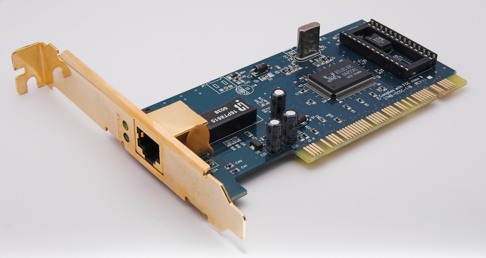

Ela possui 2 endereços: um físico e um lógico.

O endereço lógico é o IP (Internet Protocol), o protocolo de internet. Existem os endereços públicos e os privados. A maioria dos endereços IP são públicos, permitindo assim que as redes estejam acessíveis publicamente através da Internet, a partir de qualquer lado.

Já o endereço físico é o MAC (Media Access Control), que é único de cada placa e permite a transferência de dados. É composto por 48 bits (12 caracteres hexadecimais), sendo os primeiros 6 caracteres identificadores do fabricante e os 6 restantes identificadores da placa em si.

Ele é mantido na memória ROM, sendo posteriormente copiado para a memória RAM quando se da inicialização da placa.

**HUB**

É o equipamento que tem a função de concentrar os cabos — de acordo com seu número de entradas. Permite a conexão entre dispositivos através de cabos de par trançados e conectados entre si.

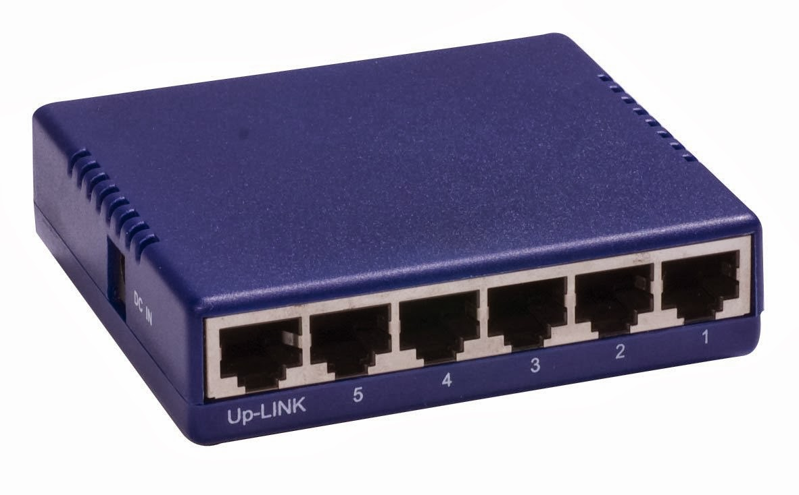

Tem como principal objetivo aumentar o alcance de uma rede local por meio da regeneração de sinais, porém só recebe em uma única porta e transmite para as outras.

Trabalha apenas com broadcast. Ao receber dados, distribui para todas as máquinas, ele não é capaz de transmitir somente para uma específica, o que implica ue apenas uma máquina por vez transmita para evitar colisões.

Caiu em decadência/desuso.

**Switch**

É uma evolução do Hub. Seu grande diferencial em comparação ao seu antecessor é que: os dados recebido da máquina de origem somente são repassados para a máquina de destino. A rede não fica presa a um único computador no envio de informações.

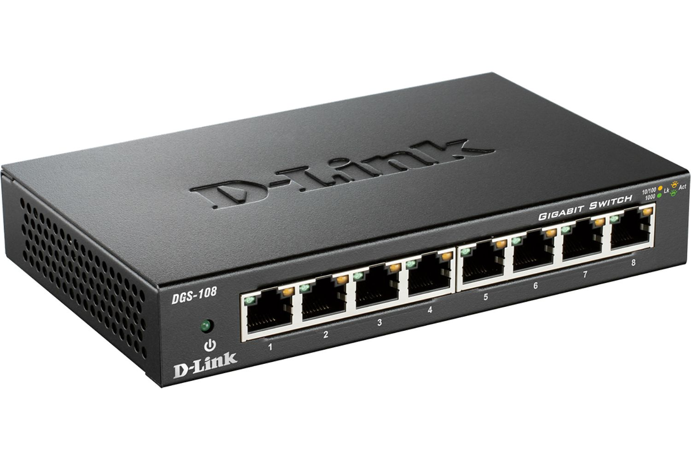

Eles são inteligentes, permitem fechar canais exclusivos de comunicação entre a máquina que está enviando e a que está recebendo — em unicast ou multicast.

Além disso, o Hub funciona em apenas uma via por vez (half-duplex) já o Switch funciona — em geral — em duas vias (full duplex). Dessa forma, a rede fica menos congestionada com o fluxo de informações e é possível estabelecer uma série de conexões paralelas.

Por fim, essa segmentação possibilita que diferentes pares possam conversar simultaneamente na rede, sem colisões.

Em suma, é semelhante a uma ponte com múltiplas porta, capaz de analisar dados que chegam a sua porta de entrada e filtrá-los para repassar apenas às portas específicas de destino.

**Router**

Os roteadores são equipamentos que permitem interligar várias redes e escolher a melhor rota para que a informação chegue ao destino. Ele encaminha ou direciona pacotes de dados entre redes de computadores, geralmente funcionando como um ponte entre redes diferentes.


Roteadores conectam redes diferentes; Switches segmentam a mesma rede.

Ele é o principal responsável por controlar o tráfego de internet.

**Modem**

É o equipamento responsável pelo modulação e demodulação do sinal de internet. Ele converte os dígitos binários do computador em sinais analógicos: e também converte os sinais analógicos em dígitos binários.

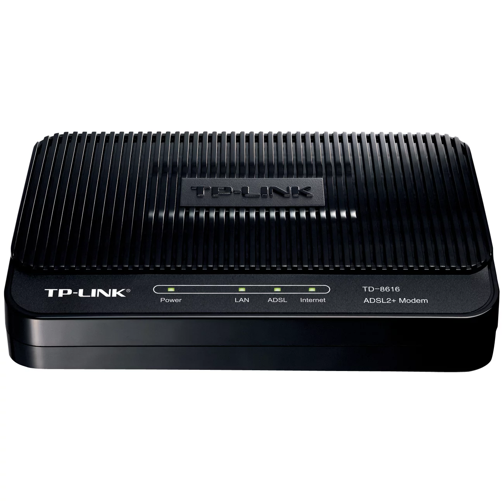

O Modem é um dispositivo de entrada/saída de dados que modula um sinal digital em um sinal analógico e desmodula o sinal analógico e converte para o sinal digital. Existem 3 tipos: acesso discado, ADSL e cabeado.

O Modem de acesso discado é inserido na placa-mãe. É muito lento e não pode ser usado ao mesmo tempo que a linha telefônica. Entrou em desuso.

O Modem ADSL oferece acesso em banda larga por meio de cabos ou wireless. Muito mais rápido que seu antecessor e não ocupa a linha telefônica, ou seja, ambos podem ser usados simultaneamente.

Por último, o Modem cabeado não utiliza as linhas telefônicas, ele é conectado por meio de cabos coaxiais. Alguns modelos possuem roteador acoplado internamento, outros não, sendo necessário comprar um roteador e utilizar ambos para ter acesso à internet.

## Cabeamento Estruturado

É um método padronizado de cabear uma rede, considerando as normas de segurança, melhores práticas e o maior aproveitamento de recursos dos equipamentos.

Uma de suas principais características é a capacidade de se redirecionar por diferentes caminhos, dentro de uma mesma estrutura de cabeamento para que pontos distintos se comuniquem.

A maioria das normas de cabeamento é internacional. Todos os padrões definem o tipo de cabo utilizado, assim como os limites e requisitos — distância, segmentos, frequência, etc — que a estrutura deve seguir para garantir o funcionamento adequado.

Algumas normas:

- NBR 14.565
- ANSI/TIA 568
- ANSI/TIA 569

**Par trançado**

Cabo de cobre dividido em 8 fios, cada um com uma responsável específica. 

São divididos em categorias que determinam  velocidade de transmissão dos dados e o alcance em metros que o cabo pode suportar sem a perda de pacotes.

***UTP ↓***
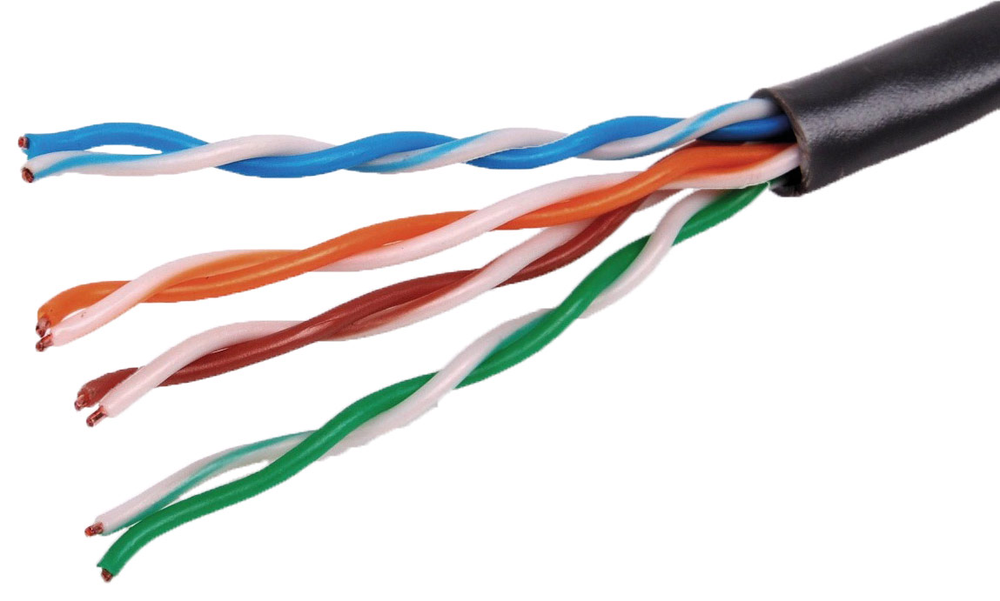

***STP ↓***
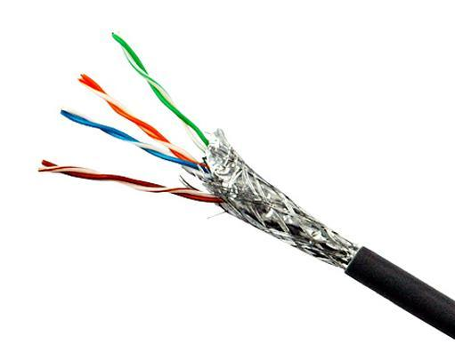

A grande diferença entre eles é que um tem isolamento e o outro não. A falta de isolamento pode causar muitos problemas, como interferências e danos.

**Cabo coaxial**

Cabo de fios de cobre, tendo um fio central responsável como condutor do pulso elétrico, malha metálica realizando isolamento e uma blindagem plástica contra interferências externas.

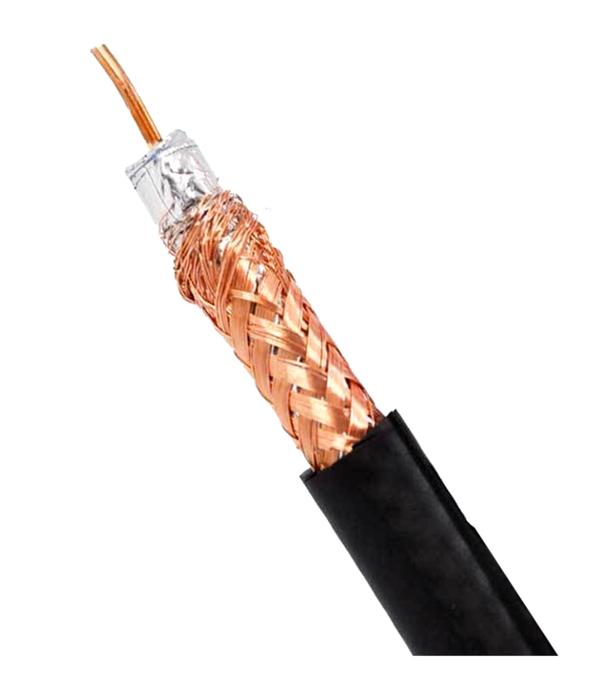

**Fibra ótica**

Tecnologia guiada por cabo que oferece a maior velocidade de transmissão de dados. A fibra é composta por pedaços de vidro que permitem a propagação dos raios de luz que são convertidos por conversores das fibras.


Por ser luz, sua velocidade chega na casa dos Gbps, algo muito maior do que os outros cabos podem alcançar.


A conexão feita entra continentes usa a fibra ótica, essa conexão é chamada de backbone.

**Rack**

O rack é um armário para hospedar os equipamentos de hardware, como switches, roteadores, modens e fibra ótica. Ele também serve para organizar os cabos em patch panels.


É essencial em data centers e infraestruturas de redes.

## Modelo OSI e TCP/IP


***Aplicação ↓***


***Apresentação ↓***


***Sessão ↓***

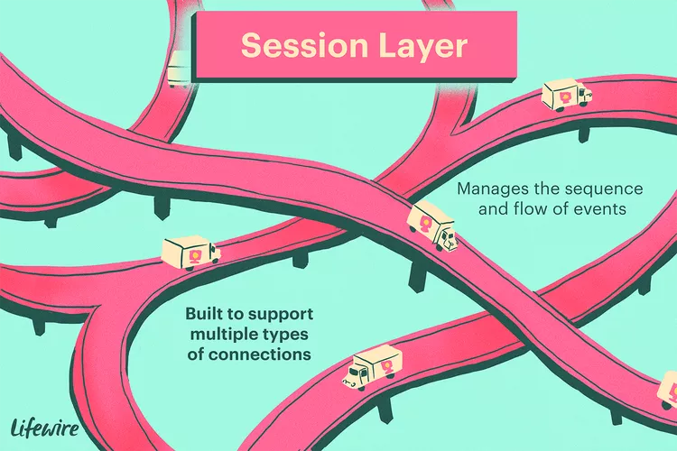

***Transporte ↓***


***Rede/Network ↓***

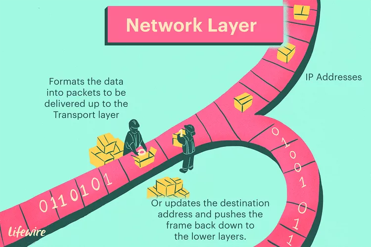

***Enlace/Data link ↓***

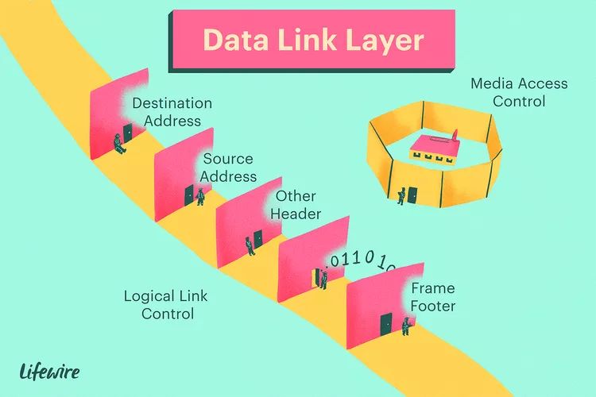

***Físico ↓***


## IPV4 e IPV6

IP → Internet Protocol é o protocolo responsável pelo endereçamento dos pacotes de rede na camada de rede do modelo OSI, ou seja, é responsável por gerar um endereço ao computador, ou qualquer servidor, no momento de conexão com a internet.

Atualmente existem 2 formatos: PPV4 e IPV6.

***IPV4 ↓***

Formato de 32 bits dividido em 8 octetos onde cada octeto pode variar em 255.

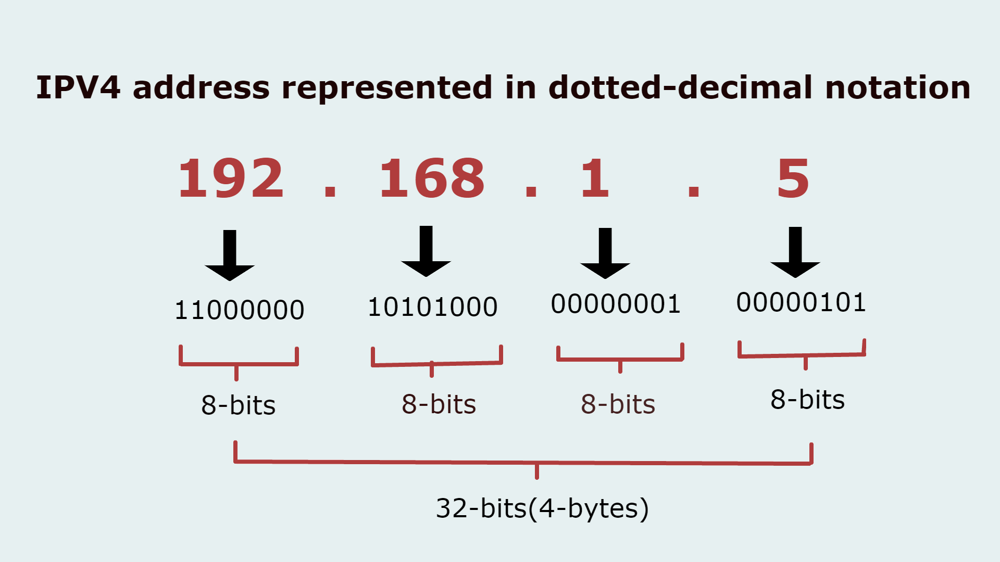

***IPV6 ↓***

Formato de 128 bits dividido em 16 pares.

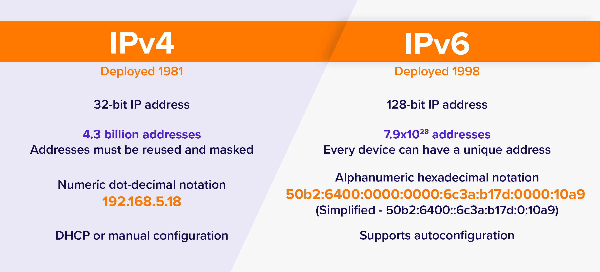

## Cálculo de Sub Rede

A ideia da sub net ou sub rede é segmentar uma rede grande em redes menores, permitir uma conexão entre todas essas redes e permitir o controle de qualidade de server, que nada mais é do que alocar requisitos da cada sub rede de acordo com a necessidade de cada uma (principalmente velocidade).

**Classes de endereço de IP**

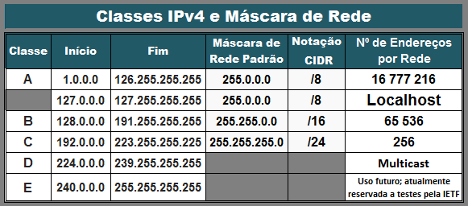

Dividido em 5 classes, cada uma com um nicho específico. Esses nichos basicamente se dividem pela quantidade de dispositivos que a rede suporta:

- Classe _A_
  - 126 $(2^7 - 2)$
- Classe _B_
  - 16.382 $(2^{14} - 2)$ 
- Classe _C_
  - 2.097.150 $(2^{21 - 2})$ 
- Classe _D_
  - N/A 
- Classe _E_
  - N/A 

Quanto maior o número de redes (sub redes), menor é disponível o número de endereços por rede. As classes D e E não são muito utilizados pelo usuário final, sua funcionalidade é mais para testes, departamentos governamentais e outras cenas específicas. 

Para fazer o cálculo de endereço de IP para sua forma binária é necessário dividir cada octeto pelo resultado da base, que é a base 2 de expoentes 0 a 7, retornando: 1, 2, 4, 8, 16, 32, 64 e 128. 


Fórmula hosts de redes: $2^b-2$ 

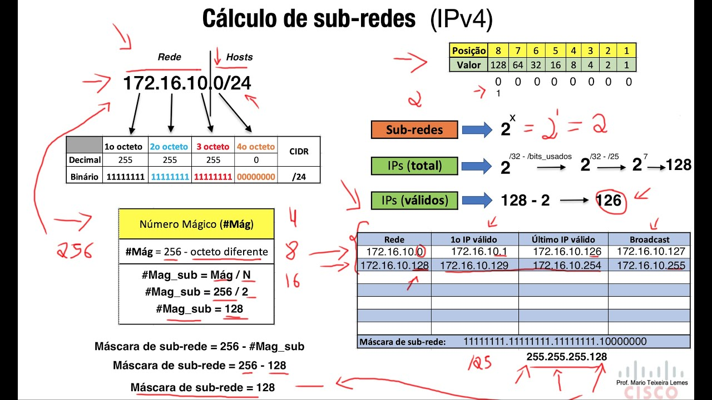

## Domínios, DNS e Latência

O servidor raiz recebe a requisição de um domínio e vai de, nível a nível, encaminhando para os próximos domínios e servidores até chegar ao servidor de destino.

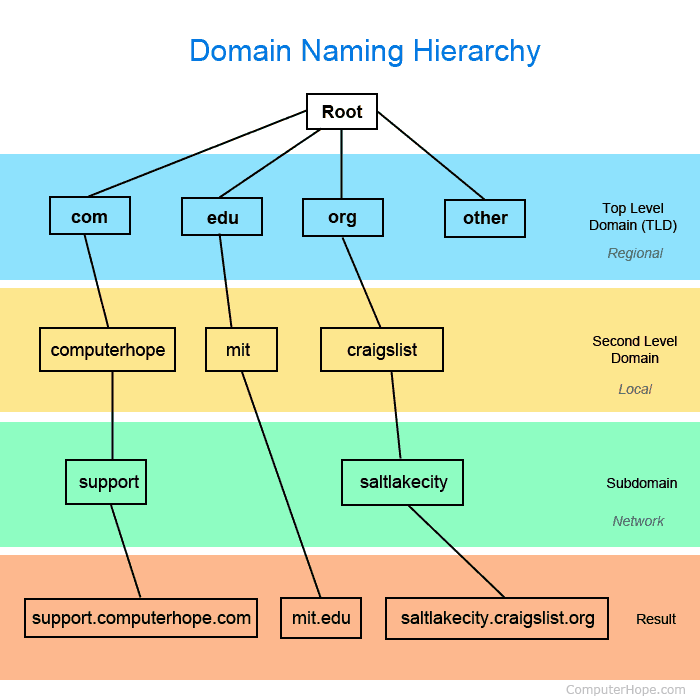

Sobre latência, ela é o tempo de requisição da origem até o destino. Uma latência mínima é uma conexão muito rápida, já latências maiores podem ocasionar problemas de lentidão no sistema.

A primeira vez que a requisição é feita, o pacote realmente sai da origem até o destino e volta. Isso pode demorar, por este motivo existe o conceito de memória cache.

O cache se localiza em vário servidores que pegam na origem principal do servidor raiz o conteúdo e replicam. Dessa forma, o próximo acesso é feito por este cache, com uma latência muito menor.

## Principais Comandos de Configuração

Apresenta informações sobre o IP da máquina e suas configurações:

```bash
ipconfig
```

Limpa o cache DNS na máquina:

```bash
ipconfig /flushdns
```

Protolo ICNP, envia 4 pacotes de uma origem para um destino, serve para testar conexão:

```bash
ping <dns>
```

Retorna informações sobre os endereços e servidor de um domínio.

```bash
nslookup <dns>
```

Retorna quanto roteadores foram necessário "saltar" para conectar a origem ao destino:

```bash
tracert <dns>
```

Retorna a tabela de roteamento:

```bash
route print
```

Retorna o mapeamento de quais portas estão sendo usadas na máquina:

```bash
netstat
```