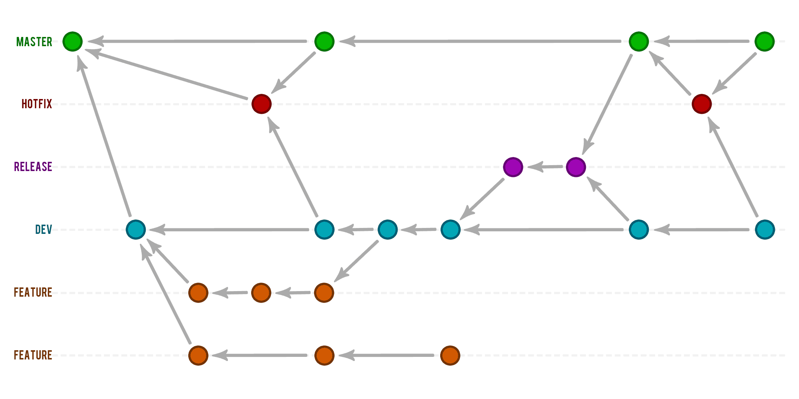

# Git & Versionamento

- [Git \& Versionamento](#git--versionamento)
  - [O Que é Git?](#o-que-é-git)
  - [Repositórios Git](#repositórios-git)
    - [SSH](#ssh)
      - [Criptografias Usadas](#criptografias-usadas)
      - [Como Gerar? (Windows)](#como-gerar-windows)
      - [Como Acessar?](#como-acessar)
  - [Mudanças no Repositório e Status](#mudanças-no-repositório-e-status)
    - [Conventional Commits](#conventional-commits)
  - [Branches](#branches)
    - [Tipos e Nomeações](#tipos-e-nomeações)
  - [Git Ignore](#git-ignore)
        - [Cheat Sheet](#cheat-sheet)

## O Que é Git?

**Versionamento ↓**

- Registro de mudanças em arquivos; o que possibilita recuperação ou acesso a versões anteriores
- Desenvolvimento de código em colaboração com outros integrantes

O Git é um sistema de versionamento de código, ele guarda os registros de versão como snapshots do estado do projeto, além da referência/caminho para o mesmo.

Boa parte das operações são praticamente instantâneas, isso ocorre devido ao fato de que a maioria das operações feitas pelo Git são locais, o que facilita o acesso aos arquivos, já que todos estão no próprio computador.


O Git pode ser usado direto em linha de comando ou, para aqueles que preferem uma interface mais amigável, é possível utilizar das ferramentas de uma plataforma de hospedagem de código-fonte, como o GitHub e o GitLab, e até dentro do próprio editor de texto ou IDE.

Ao fazer o uso do Git na máquina local pela primeira vez é necessário configurar o ambiente, criando usuário e email.

```bash
git config --global user.name "your name" 

git config --global user.email youremail@example.com
```

É possível verificar se está tudo certo usando o comando:

```bash
git config --list
```

Caso seja necessário usar um usuário e e-mail especificamente para um único repositório, é só entrar no seu diretório raiz e configurar ambos sem a opção `--global`.

```bash
cd ~/Root/myapp

git config user.name "your name" 
git config user.email youremail@example.com
```

## Repositórios Git

Os repositórios podem existir dentro de 2 formas:

- Local, no próprio computador desenvolvedor
- Remoto, na nuvem em uma plataforma de hospedagem

Existem várias formas para ter acesso/fazer o download de um repo remoto para a máquina local. 

Pode ser feita a transferência de arquivos e pastas diretamente, seja pelo download, por pendrive, HD, etc.

Outra forma é o o método HTTPS, o qual usa o Git para transferir o código para a máquina local com a URL do projeto. Também é possível usar uma chave SSH, que nada mais é do que uma credencial de acesso de um protocolo SSH, usado principalmente para automatizar processos e implementar acesso único por administradores de sistemas e usuários avançados.

Para projetos locais começados do zero, é necessário inicializar o  projeto com o comando `git init`. Este comando irá gerar uma pasta `.git` dentro do repositório, dessa forma as alterações e versionamento serão mapeados pelo Git.

```bash
C:\Users\PathForTheLocalRepo> git init
```

Novo repositório ↓

```bash
C:\Users\PathForTheLocalRepo> git remote add origin git@github.com:user/project-name.git
```

O `origin` é um exemplo de apelido descritivo, é como nomear o repositório remoto. Pode ser escolhido qualquer nome que faça sentido para o projeto.

Repositório existente ↓

```bash
C:\Users\PathForTheLocalRepo> git clone https://github.com/repo.git
```

É possível listar também todos os repositórios remotos associados com o projeto local:

```bash
git remote -v
```

Caso tenha um erro na url passada como repositório remoto, ou seja preciso atualizar por motivos de modificações, é possível alterar com o seguinte comando:

```bash
git remote set-url origin https://github.com/repo.git
```

Outra alteração possível é do apelido do repositório remoto:

```bash
git remote rename origin new-name
```

### SSH


É um mecanismo de segurança oferecido pelos serviços de hospedagem.

O protocolo SSH (secure shell) é um dos parâmetros de trabalho que garantem que as informações estarão devidamente protegidas. Ele garante que cliente e servidor remoto troquem informações de maneira segura e dinâmica. 

O processo é capaz de criptografar os arquivos enviados ao diretório do servidor, garantindo que alterações e o envio de dados sejam realizados da melhor forma.

Tem a função de permitir aos usuários e desenvolvedores realizarem qualquer modificação em sites e servidores utilizando uma conexão simples, sendo um método seguro para garantir que não haverá nenhuma invasão destes arquivos e códigos.

Na prática,  o SSH fornece o mecanismo para que haja a autenticação desse usuário remoto, criando uma conexão por meio do protocolo e as informações são transportadas nesse modelo de secure shell,  com a criptografia protegendo os dados.

Ele é acessado via terminal, independentemente do sistema operacional usado.

#### Criptografias Usadas

**Simétrica ↓**


Realizada por meio de uma chave secreta, essa sendo compartilhada apenas entro o servidor e o usuário. Sua função é criptografar e descriptografar a mensagem que é transferida neste processo, no entanto, o SSH só oferece a leitura do conteúdo mediante a apresentação dessa chave.

Ela é criada por um algoritmo que, automaticamente, envia a chave para as duas partes envolvidas: cliente e servidor. No entanto, não há a transferência dessa informação entre as duas partes, cabendo ao algoritmo enviar a cada uma separadamente.

Cada vez que uma sessão SSH é criada, uma nova chave de criptografia é gerada no momento anterior à autenticação. Assim, na hora de transferir o arquivo, o usuário já tem a senha utilizada para criptografar o conteúdo e então realizar esse envio ao servidor.

**Assimétrica ↓**


É o oposto do modelo simétrico: são usadas duas chaves, uma para o cliente e outra para o servidor, para que haja a criptografia dos dados transferidos.

As chaves são chamadas de pública e privada, formando a combinação necessária para gerar o SSH e seu protocolo de segurança.

Nesse modelo, a chave pública é distribuída de forma aberta e compartilhada. Porém, a partir dela não é possível descobrir qual é a chave privada. Isso porque mensagens criptografadas por chaves públicas só podem ser descriptografadas pela chave privada da mesma máquina.

A chave privada, neste processo, deve permanecer inacessível a terceiros, sendo unicamente de posse e uso do cliente. Isso é fundamental, uma vez que seu uso possibilita descriptografar as chaves públicas, e assim acessar o conteúdo transferido.

**Hashing ↓**


É um método unidirecional de criptografia usado no SSH. 

Consiste em criar um hash, por meio de um algoritmo, para garantir que a mensagem será protegida em uma forma específica de criptografia e códigos de autenticação. 

O processo é feito usando HMACs (Hash-based Message Authentication Codes), garantindo que não haja violação nos códigos que serão recebidos pelo servidor remoto.

#### Como Gerar? (Windows)

**Gerando uma Nova Chave ↓**

No Git Bash, comece com o seguinte comando:

```bash
ssh-keygen -t ed25519 -C youremail@example.com
```

Se for uma sistema herdado que não de suporte ao algoritmo Ed25519, é necessário usar:

```bash
ssh-keygen -t rsa -b 4096 -C youremail@example.com
```

Estes comandos criam uma nova chave SSH, usando o e-mail como uma etiqueta. Será solicitado um arquivo para salvar a chave, ao pressionar "enter" sem especificar um local, ela será salva no local padrão.

Observe que, se uma chave SSH foi criada anteriormente, ssh-keygen pode pedir para reescrever a outra chave. Nesse caso, é recomendado criar uma chave SSH personalizada. Para fazer isso, é necessário digitar o local do arquivo padrão e substituir `id_ALGORITHM` pelo nome da chave personalizada.

```bash
> Enter file in which to save the key (/c/Users/YOU/.ssh/id_ALGORITHM):[Press enter]
```

Para maior segurança, é possível adicionar uma senha/frase secreta segura.

```bash
> Enter passphrase (empty for no passphrase): [Type a passphrase]
> Enter same passphrase again: [Type passphrase again]
```

Para evitar a necessidade de inserir a frase secreta toda vez que se conectar, ela pode ser salva com segurança no agente SSH.

A frase secreta pode ser adicionada posteriormente ou alterada, não é necessário gerar um novo par de chaves.

```bash
$ ssh-keygen -p -f ~/.ssh/id_ed25519
> Enter old passphrase: [Type old passphrase]
> Key has comment 'your_email@example.com'
> Enter new passphrase (empty for no passphrase): [Type new passphrase]
> Enter same passphrase again: [Repeat the new passphrase]
> Your identification has been saved with the new passphrase.
```

**Adicionando a Chave ao ssh-agent ↓**

Em um terminal PowerShell com privilégios elevados de admin, é necessário primeiro se certificar que o agente ssh está em execução.

```shell
Get-Service -Name ssh-agent | Set-Service -StartupType Manual
Start-Service ssh-agent
```

Em uma janela sem permissões elevadas, segue o comando para adicionar a chave privada ao agente ssh.

```shell
ssh-add c:/Users/YOU/.ssh/id_ed25519
```

Caso a chave tenha sido criada com um nome diferente ou é uma chave existente de outro nome, é preciso substituir `id_ed25519` no comando pelo nome do arquivo da chave privada.

**Inicialização Automática ↓**

É possível configurar para que o ssh-agent seja inicializado automaticamente quando o shell é executado. Para isso, é preciso copiar as seguintes linhas e colar no arquivo `~/.profile` ou `~/.bashrc` no shell do Git:

```shell
env=~/.ssh/agent.env

agent_load_env () { test -f "$env" && . "$env" >| /dev/null ; }

agent_start () {
    (umask 077; ssh-agent >| "$env")
    . "$env" >| /dev/null ; }

agent_load_env

# agent_run_state: 0=agent running w/ key; 1=agent w/o key; 2=agent not running
agent_run_state=$(ssh-add -l >| /dev/null 2>&1; echo $?)

if [ ! "$SSH_AUTH_SOCK" ] || [ $agent_run_state = 2 ]; then
    agent_start
    ssh-add
elif [ "$SSH_AUTH_SOCK" ] && [ $agent_run_state = 1 ]; then
    ssh-add
fi

unset env
```

Se a chave privada não estiver em um dos locais padrão, é preciso informar ao agente de autenticação SSH o local onde ela se encontra.

```shell
ssh-add ~/path/to/my_key
```

**Adicionando ao GitHub ↓**

Após gerar um par de chaves e adicionar ao agente SSH, o processo dentro do GitHub é simples:

1. Nas configurações há a página de chaves SSH e GPD
2. Clique na opção de Nova chave SSH ou Adicionar chave SSH
3. No campo de título, é necessário adicionar uma etiqueta descritiva para a nova chave, um nome para identifica-la.
4. Selecionar o tipo de chave: autenticação ou assinatura
5. No campo de chave, colar a chave pública
6. Clique em Adicionar chave SSH

#### Como Acessar?

**Login e Senha ↓**

É preciso primeiro se conectar ao servidor da hospedagem do site. É necessário inserir o endereço, geralmente domínio do site ou até mesmo o IP, e a senha de acesso.

Após isso, o terminal pode ser acessado normalmente. Ao final, os seguintes comandos são necessários:

```bash
$ ssh user@site-address.domain
```

Ou

```bash
$ ssh user@site-ip-address
```

```bash
Are you sure you want to continue? (yes/no)
> yes
```

A senha de acesso será solicitada, é só digitar e pressionar "enter". Isso irá permitir a visualização de todos os arquivos do servidos, incluindo pastas.

É justamente o arquivo `public_html/` que será o diretório a receber todas essas mudanças.

**Par de Chaves ↓**

É ainda mais seguro e simples:  o servidor tem uma chave pública e o usuário tem uma chave privada. Quando cruzadas, geram uma combinação de texto que garante a autenticidade das informações de acesso que o cliente tem para transferir os arquivos.

A chave pública fica armazenada no servidor, enquanto a privada fica no computador do usuário. Quando a solicitação de acesso é feita, as informações são cruzadas e, se tudo estiver certo, a descriptografia acontece normalmente.

## Mudanças no Repositório e Status

**Estados do Git**


Um arquivo dentro do repositório pode apresentar 5 status: 

- **Untracked**
  - Arquivos que não estão sendo monitorados, ou seja, que não foram adicionados no mapeamento do Git.

- **Unmodified**
  - Arquivos que não possuem modificações desde o último mapeamento, arquivos exatamente iguais a `origin/main`.

- **Modified**
  - Arquivos mapeados que foram modificados.

- **Staged** 
  - Guarda os arquivos já preparados para o próximo commit.

- **Commited**
  - Arquivos que já foram comitados para o repositório.

O comando `git status` vai apresentar as informações de como se encontra o repositório e cada estado dos arquivos dentro dele.

```bash
git status
```

O comando `git add` é usado para adicionar os arquivos ao mapeamento ou para o estado de **staged**.

```bash
git add file-name.ext
```

Ou para adicionar todos os arquivos:

```bash
git add --A

git add .
```

Já o comando `git diff` mostra exatamente quais linhas foram modificadas — tanto o que foi removido ou alterando quanto o que foi acrescentado — desde o último commit.

```bash
git diff
```

Para arquivos que já estão no estado **staged**, é necessário adicionar o `--staged` ao final do comando.

```bash
git diff --staged
```

Por fim, o comando `git commit` comita os arquivos para o repositório local. Assim, este arquivo completa um ciclo e passa de **staged** para **unmodified**.

```bash
git commit -m "comment"
```

Cada commit armazena o estado completo do projeto em um determinado momento por meio de um snapshot. Ou seja, cada commit é um registro completo do repositório no momento em que esse commit foi criado.

Todo commit conta com um id único e traz uma referência aos commits anteriores. Assim, através dessa cadeia de commits, o Git registra um histórico completo de todos os commits realizados no repositório.

Também é possível alterar o commit, como sua mensagem ou até adicionar arquivos novos:

```bash
git commit --amend -m "comment"
```

Se for necessário remover algum arquivo, se usa o comando `git rm`.

```bash
git rm file-name.ext
```

Agora, se não é necessariamente a remoção de um arquivo que precisa ser feita, mas sim voltar ao estado **unmodified** para desfazer modificações feitas desde o último commit, se usa o comando `git restore`.

De um arquivo do estado **modified** para o estado **unmodified**:

```bash
git restore file-name.ext
```

De um arquivo do estado **staged** para o estado **modified**:

```bash
git restore --staged file-name.ext
```

`git log` apresenta um histórico de todos os commits que foram feitos no repositório.

Para reverter um commit é necessário saber seu id e usar o seguinte comando:

```bash
git revert "commit-id"
```

O commit anterior não é apagado, na verdade, funciona como uma novo commit, que fica registrado acima do anterior e desfaz as alterações do mesmo.

Já para resetar para um commit anterior, é necessário saber o id do commit para o qual quer voltar.

```bash
git reset --hard "commit-id"
```

Com este comando, o commit realmente é apagado do histórico.

Mesmo que seja possível alterar o histórico de commits, é recomendado evitar a modificação excessiva, uma vez que isso pode tornar o histórico confuso. Ele deve ser uma representação precisa do progresso do projeto ao longo do tempo.

**Interações Entre Repo Local e Remoto**

Após o comando commit, as alterações só ficam salvas no repositório local, para que sejam transferidas também para o repositório remoto é necessário usar o comando `git push`.

```bash
git push origin main

git push -u origin main
```

Agora, se há alterações no repositório remoto, a transferência para o local é feita com o comando `git pull`. Isso vai puxar o código remoto e unir com o local, mas este comando não apresenta quais serão as modificações antes de fazer este merge.

Para comparar ambos local e remoto e ver as modificações antes de fazer o pull, pode se usar o comando `git fetch` — para puxar o código — e o `git diff` — para observar as alterações.

```bash
git fetch

git diff origin/main
```


### Conventional Commits

> https://www.conventionalcommits.org/pt-br/v1.0.0-beta.4/

## Branches

As branches são as ramificações do código que podem ser usadas para um desenvolvimento paralelo entre as branches. 

Elas podem ser usadas tanto para controlar melhor o fluxo de desenvolvimento colaborativo, quanto para controlar o fluxo do desenvolvimento individual, tendo a segurança de que se ocorrer alguma erro na branch paralela, a principal estará segura como um checkpoint sem as alterações que ocasionaram o erro.

Quando for necessário — e seguro — essas branches podem ser unidas.


Para criar uma nova branch se usa o comando `git branch`.

```bash
git branch branch-name
```

Para saber em qual branch se está trabalhando existe um ponteiro, chamando Head, que faz este comunicado. Com o comando `git log` as informações tanto sobre o histórico de commits, quanto do ponteiro serão exibidas.

```bash
git log --oneline --decorate
```

O comando `git checkout` é o responsável por fazer a troca entre as branches, da atual para a que se quer trabalhar.

```bash
git checkout branch-name
```

Para fazer a união entre as branches, ou seja, trazer o conteúdo e alterações de uma para a outra, é necessário usar o comando `git merge` quando se está trabalhando na branch que quer unir com outra.

```bash
git checkout branch-name

git merge main
```



### Tipos e Nomeações

As branches se dividem em 2 tipos: regulares e temporárias.

**Regulares**

Essas branches vão estar disponíveis no repositório de forma permanente. Suas convenções de nomes são simples e diretas:

- Development (dev)
  - É a branch principal para o desenvolvimento. 
  - Seu objetivo é restringir para que o desenvolvimento ocorra nela e não na branch main diretamente.
  - Modificações nela devem ser submetidas por reviews e, depois de testes, serem unidas com a branch main.

- Master/Main (master/main)
  - É a branch padrão disponível no repositório Git.
  - Deve estar estável o tempo todo e não permitir qualquer check-in direto.
  - Só pode receber merge depois de um code review.
  - Todos os membros do time são responsáveis por manter a branch estável e atualizada.

- QA (QA)
  - Ou test branch, contêm todos os códigos para testes QA e testes de automação de todas as modificações implementadas.
  - Antes que qualquer mudança passe para o ambiente de produção, deve ser submetida por testes QA para garantir uma base de códigos estável.

**Temporárias**

Estas branches podem ser criadas e deletadas quando for necessário.

- Bug fix
- Hot fix
- Feature
- Experimental
- WIP

Há muitos formatos e convenções de nomes recomendados para branches temporárias, alguns destes são:

**Começar com o Nome do Grupo**

- **BUG**
  - Para um bug que precisa ser concertado.

```bash
git branch bug-logo-alignment-issue
```

- **WIP**
  - Para um trabalho em progresso que não vai terminar tão cedo.

```bash
git branch wip-ioc-container-added 
```

**Usar ID Único**

Também se poder usar o ID de um rastreador de issue. Uma de suas vantagens é a possibilidade de acompanhar o progresso por um sistema externo.

```bash
git bash wip-8712-add-testing-module
```

**Hífen e Underscore**

O uso de hífen e underscore se faz extremamente necessário para se manter a legibilidade dos nomes. Como não se pode usar espaços em branco, é preciso achar outros métodos de separação das palavras ou a sua branch pode acabar assim (impossível de ler):

```bash
git branch featureupgradejqueryversionloginmodule
```

**Com Nome do Autor**

Alguns times e empresas preferem que as branches tenham o nome do autor, de forma que facilite acompanhar o trabalho e progresso de cada desenvolvedor no sistema.

`<author>_<branch-type>_<branch-name>`

```bash
oliwer_feature_new-experimental-changes
```

**Evitar**

- Usar somente números.

```bash
git branch 19753
```

- Usar todas as convenções simultaneamente.

- Nomes longos e muito descritivos.

```bash
git branch wip_login_module_which_will_used_in_the_public_website
git branch wip_login_module_which_will_used_in_the_internal_website
```

## Git Ignore

O Git vê arquivos de 3 formas:

- **Rastreado**
  - Um arquivo que já foi preparado ou confirmado.

- **Não Rastreado**
  - Um arquivo que não foi preparado nem confirmado.

- **Ignorado**
  - Um arquivo que o Git foi forçado a ignorar.

Os arquivos ignorados costumam ser artefatos de desenvolvimento e arquivos gerados por máquina que podem ser derivados da fonte do repositório ou que não devem passar por commit. Exemplos comuns incluem:

- Caches de dependência, como o conteúdo de `/node_modules` ou `/packages`

- Código compilado, como arquivos `.o`, `.pyc` e `.class`

- Diretórios de saída de build, como `/bin`, `/out` ou `/target`

- Arquivos gerados no período de execução, como `.log`, `.lock` ou `.tmp`

- Arquivos de sistema ocultos, como `.DS_Store` ou `Thumbs.db`

- Arquivos pessoais de configuração do IDE, como `.idea/workspace.xml`

Esse mapeamento de arquivos que devem ser ignorados é feito por um arquivo especial chamado `.gitignore` que fica na origem do repositório. Ele é um arquivo que precisa ser editado e fazer o commit de forma manual, não há um comando git ignore explícito.

As entradas neste arquive também podem seguir um padrão de correspondência:

```
* → representa caractere coringa
  ex. *.css
/ → ignora nomes de caminhos relativos oa arquivo .gitignore
  ex. /temp
# → para adicionar comentários no arquivo .gitignore
```

```gitignore
# Ignore os arquivos de sistema do Mac
.DS_store

# Ignore a pasta node_modules
node_modules

# Ignore todos os arquivos de texto
*.txt

# Ignore arquivos relacionados às chaves de API
.env

# Ignore arquivos de configuração de SASS
.sass-cache
```

Para adicionar ou alterar o arquivo global, é necessário executar o comando:

```bash
git config --global core.excludesfile ~/.gitignore_global
```

> Para leitura futura e adicionar anotações posteriormente: 
> https://www.atlassian.com/br/git/tutorials/saving-changes/gitignore
> https://www.freecodecamp.org/portuguese/news/gitignore-explicado-o-que-e-o-gitignore-e-como-adiciona-lo-ao-seu-repositorio/


> Gerador de gitignore
> https://www.toptal.com/developers/gitignore/

##### Cheat Sheet


