# Integração e Entrega Continua

- [Integração e Entrega Continua](#integração-e-entrega-continua)
  - [Contextualizando a Integração Contínua](#contextualizando-a-integração-contínua)
    - [Controle de Versão](#controle-de-versão)
    - [Estratégias de Ramificação](#estratégias-de-ramificação)
  - [Builds e Testes Automatizados](#builds-e-testes-automatizados)
    - [Build Pipeline](#build-pipeline)
  - [Continuous Delivery e Deploy](#continuous-delivery-e-deploy)
    - [Entrega vs. Deploy](#entrega-vs-deploy)
  - [Estratégias de Releases](#estratégias-de-releases)
    - [Release Antipatterns](#release-antipatterns)
  - [Princípios da Entrega Contínua](#princípios-da-entrega-contínua)

## Contextualizando a Integração Contínua

Hoje em dia, as aplicações raramente são criadas a partir de um único desenvolvedor, em realidade, equipes multidisciplinares trabalham em uma mesma base de código. Cada desenvolvedor terá o seu código local em sua máquina, embora haja um repositório remoto. 

Muitas vezes o desenvolvedor deverá fazer alterações solicitadas pelo cliente, corrigir bugs e assim por diante. As alterações, inicialmente, são feitas no código local de cada desenvolvedor e só então deverão ser aplicadas no repositório compartilhado. É neste contexto que se chega ao ponto crítico.

A depender do tamanho e complexidade do código alterado, é comum que a sincronização entre local e remoto demorem, então esta etapa é feita normalmente ao fim do processo de desenvolvimento. No momento em que os desenvolvedores começam a sincronizar os códigos, aparecem os problemas. Trata-se de uma etapa delicada, tanto que em alguns casos existe um desenvolvedor sênior que irá monitorar esse processo.

Como se trata de um processo demorado, outros ambientes ficam desatualizados, como o de teste. Muitas vezes, são testados casos que não são mais reais dentro do projeto, por isso é necessário conseguir acelerar esse processo.

É aí que entra a ideia de integração contínua, que nada mais que o conceito de integrar atualizações frequentemente na base diária. Há um tempo, sprint, com várias interações; ao fim deste, acontecem as integrações, e isto aumenta o risco de problemas, exatamente pela sincronização se dar ao final do clico de software.

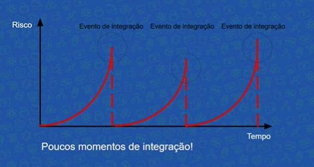

O código que foi planejado e funcionava localmente, pode sofrer incompatibilidade com as alterações de outros desenvolvedores, além de problemas de versões e bugs. Tudo isso pode atrasar o projeto. O ideal é que pequenas alterações sejam feitas com constância; assim é possível garantir que o software funcione de maneira adequada, e que dessa maneira o feedback sempre será mais rápido.

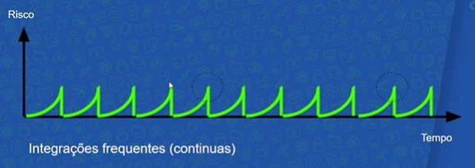

Segundo a Thought Works, integração contínua é:

> "Continuous Integration (CI) is a development practice that requires developers to integrate code into a shared repository several times a day."

Há várias técnicas e ferramentas que podem ajudar na aplicação da CI.

### Controle de Versão

Em uma equipe de desenvolvimento, muitas vezes é necessário uma ajuda para sincronizar e manter o histórico do código, com ferramentas como o Git e SVN. Em tese, a CI não possui a necessidade de muitas ferramentas, mas estes auxílios de controle de versão geralmente são o padrão em práticas de desenvolvimento, principalmente em equipes.

O Git é o mais usado, mas a ferramente em si não importa, desde que contenha tudo de necessário para a construção do projeto e não complique o processo de clonar e iniciar o projeto:

- Código
- Scripts
- Migrações. Schemas
- IDE Configs

Não comite o que pode ser construído (gem, jar, image, modules, class files - código compilado e artefatos da construção do projeto, etc).

**Organizando Repositórios ↓**

Em uma organização, é comum que se tenha mais um projeto e domínio, dessa forma, é preciso organizar os repositórios de cada um em padrão definido. 

O conceito de multi-repo define que cada projeto deve ficar em seu próprio repositório, de um tamanho razoável com escopo bem definido, sem haver misturas entre projetos diferentes. Este também permite a definição de permissões de acesso bem definidas para cada projeto, onde a equipe só tera as permissões dos repositórios nos projetos em que está trabalhando.

No entanto, nos últimos anos, surgiu uma nova forma de organização de projetos dentro de repositórios. Empresas grandes de tecnologia, como Google e Facebook, não utilizam o esquema multi-repo, porque são empresas que trabalham em inúmeros projetos de maneira concomitante. Empresas que atuam com outra dimensão de projetos utilizam o mono-repo, ou seja, um único e gigantesco repositório que acumula todos os projetos.

A desvantagem do segundo modelo é o repositório precisará ser realmente grande, e o build pode ser lento, talvez nem o Git seja mais a ferramenta adequada para fazer o controle de versões para esta situação. Contudo, como temos apenas um grande repositório temos uma administração relativamente mais simples, então a verificação de padrões é facilitada. A refatorações são globais, afinal estão todos dentro da mesma base.

### Estratégias de Ramificação

A ideia de integração contínua é alterar de maneira contínua o repositório principal. Martin Fowler declara:

> Everyone commits To the Mainline every day

A regra da CI é antecipar os problemas. A princípio, o branch pode ser um perigo, um ampliador de risco. Existem algumas regras que podem minimizar esse risco:

- Commits simples e releasable, orientados à uma tarefa
- Branches de vida curta, margens mais simples
- Estratégia combinada pela equipe

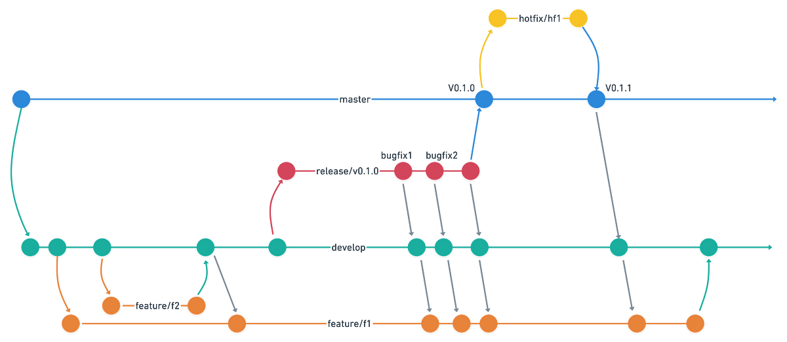

Existem várias modelos de quais padrões a semântica das branches irá seguir, dentre eles: Git Flow (o mais popular), workflow, github flow, pull request flow, one flow, trunk based development, entre outros.

No entanto, muitos branches geram mais burocracia, o que pode apresentar algumas desvantagens. Por isso é necessário que a equipe defina estratégias e um modelo específico.

Alguns branching models famosos são:

- Temporários 
  - (branches locais) 
  - São branches localizados apenas na máquina local e deverão se extinguir, são utilizados para organizar fluxos de trabalho e depois realizar o commit.
- Feature Branches 
  - São utilizados para implementar funcionalidades ou orientar tarefas.
- Historical Branches 
  - (master e develop) 
  - As alterações ficam organizadas em commits baseados na cronologia no caso de um projeto de software.
- Environment Branches 
  - (staging e production) 
  - Existem branches que são baseados no ambiente, isto é, em que espaço é realizado o deploy.
- Maintenance Branches 
  - (release e hotfix) 
  - Temos, ainda, os branches de manutenção do sistema.

Uma nova funcionalidade pode demorar para ser implementada, então muitas vezes faz sentido termos um feature branch para desenvolver até a nova versão estar estável. Contudo, até nestes casos existem metodologias que evitam a criação de branches de vida longa. O nome dessas metodologias são Feature Flags e Branch by Abstraction.

Uma Feature Flag é o conceito de não usar uma branch nova, mas sim inserir o código diretamente na branch master, sem ele ser visível para a equipe. Ele serve também para testar a funcionalidade.

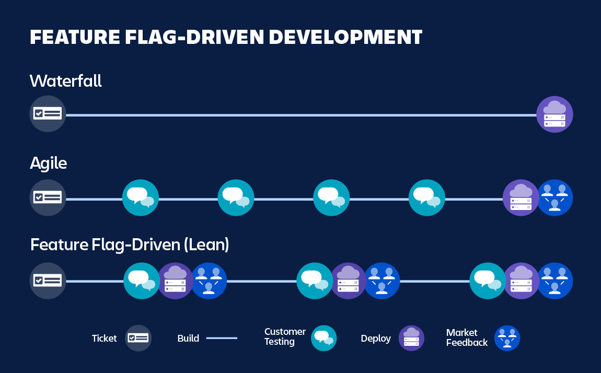

Já o Branch by Abstraction envolve introduzir uma abstração no código principal, ou seja, uma camada intermediária para isolar o código que utiliza o módulo, portanto todas as chamadas deverão passar pela camada de abstração. Essa camada pode ser uma interface, várias ou mesmo uma classe que realiza delegações; uma vez que é aplicada essa técnica de desacoplamento, podemos gradativamente fazer a re-implementação.

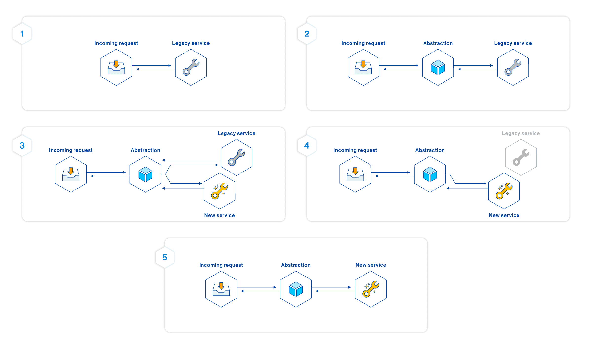

Criamos uma abstração dentro do código com dois caminho, em fase de desenvolvimento ele pode ser testado, embora na fase de produção ele não exista ainda.

**Merge e Rebase ↓**

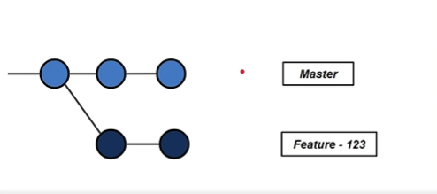

Em algum momento, o desenvolvedor decide enviar as atualizações para o master, isto é, realizar a sincronização. O comando clássico para essa situação é o merge, e então ocorre o chamado `merge commit`, cria-se um novo commit que representa esse momento de sincronização.

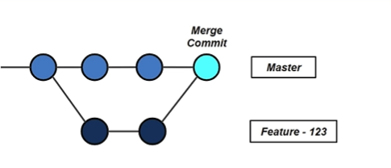

Há desenvolvedores que não gostam desse processo, afinal trata-se de um commit que simplesmente representa um evento e que seu estado é baseado nas alterações realizadas na feature branch e na commit do master. Dessa maneira já não temos uma linha histórica muito interessante no desenvolvimento do projeto, o que pode gerar confusões.

Outra maneira de sincronizar o branch é pelo uso do rebase. Neste caso, a ideia é que se mude a base do commit, e então as modificações são aplicadas nessa nova base. Dessa maneira, temos um histórico diferente de trabalho, e é por isso que o rebase deve ser aplicado apenas em máquina local.

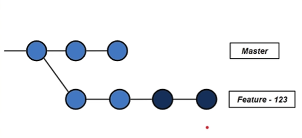

A mudança então pode ser enviada de fato ao master e novamente temos um histórico linear. Quando este processo estiver concluído, podemos inclusive excluir a feature branch.

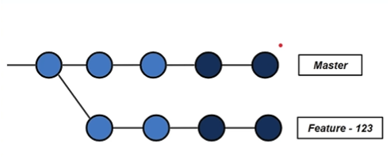

## Builds e Testes Automatizados

No caso da integração contínua, é preciso utilizar testes automatizados. O ideal é que a cada alteração, seja realizado um novo teste automatizado, para termos certeza de nenhum problema será gerado.

- Testes fazem parte da construção do software
- Devem ser realizados antes do commit
- TDD pode ajudar neste processo
- Desempenho bom em testes

Porém, testes demorados podem ser uma barreira para a integração contínua, por isso devem ser bem pensados e com desempenho otimizado. É importante que os teste sejam realizados de forma consistente para mantar um feedback continuo.

Deve seguir os seguintes:

- Build a cada commit
- Tudo automatizado / single command
- Build sem depender da IDE
- Tudo está no repositório

### Build Pipeline

(etapas do build)

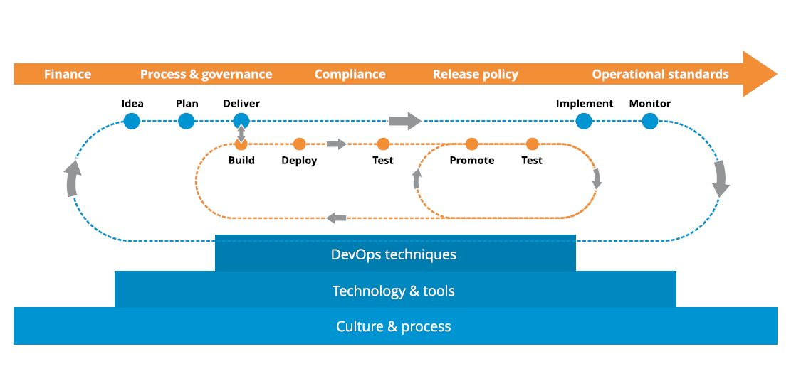

(servidor de integração contínua | CI Daemon)

Além de iniciar a build, o servidor de integração também tem como responsabilidades publicar ou disponibilizar o artefato de build no repositório - dessa forma,  os desenvolvedores sempre podem baixar a última versão - e publicar o status da última build do projeto - até pode publicar um histórico sobre os últimos builds e mostrar mais informações sobre o tempo do build, testes, etc.

É importante lembrar - e devemos pensar também no conceito de entrega contínua - que o software funcional é a principal métrica que devemos nos atentar.

É tarefa de toda uma equipe resolver um problema no build o mais rápido possível, afinal não poderá ser realizados novos commits até que o build esteja estável e confiável novamente.

Sobre isso, Kent Beeck afirma:

> Nobody has a higher priority task than fixing the build

Caso o build não possa ser corrigido em um intervalo de tempo curto, o commit que gerou o problema deve ser desfeito para o que o projeto continue, e este é um ponto fundamental.

## Continuous Delivery e Deploy

O passo seguinte a integração contínua é a entrega. Segundo o manifesto ágil:

> Working software over comprehensive documentation

> Our highest priority is to satisfy the customer through early and continuous delivery of valuable software

Um software funcional é aquele usado pelo cliente com suas novas features de maneira confiável. A integração contínua é uma parte fundamental para se chegar a essa fase de entrega contínua. Dentro da arquitetura da aplicação, é anexado um novo requisito funcional: "deployability". Esta característica deveria ser pensada desde o início, pois devemos entregar com frequência o software funcional.

Um deployment pipeline é um fluxo em que o artefato passa e cada etapa incrementa e agrega mais segurança ao se aproximar do ambiente de produção. Deploys de baixo risco são aqueles experimentais, contínuos, atualizações pontuais acompanhadas.

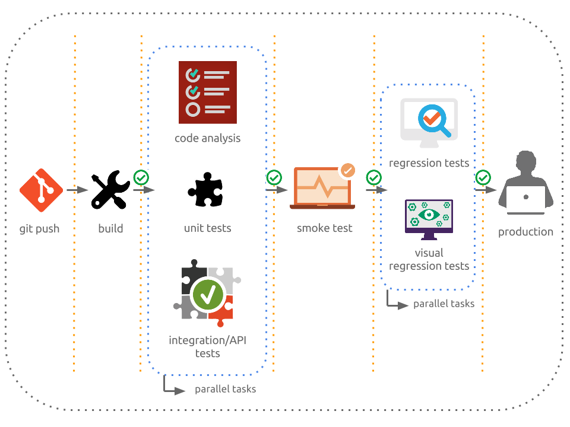

Para que o risco seja diminuído na hora do deploy de software, sua publicação dese ver: frequente, granular e automatizada. 

As equipes de desenvolvimento normalmente possuem divisões, como as pessoas do QA,deploy e operações. As tarefas são delegadas para os subgrupos durante o projeto. Equipes separadas que mal se comunicam dificultam o andamento do trabalho, aumentam a possibilidade de problemas e atrasam os deploys.

A entrega contínua também exige uma mudança no comportamento e na cultura da empresa: as pessoas precisam trabalhar integradas.

### Entrega vs. Deploy

Pipeline de deploy inicial:

**Build Unit Test → Testes de Aceitação Automatizados → Homologação UAT → Produção**

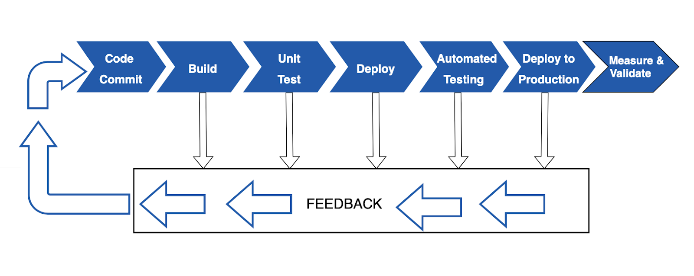

Quando uma etapa falha, o processo "reseta", voltando a etapa inicial para se verificar o que aconteceu e, só então, recomeçando o processo dentro do pipeline, desde o início.

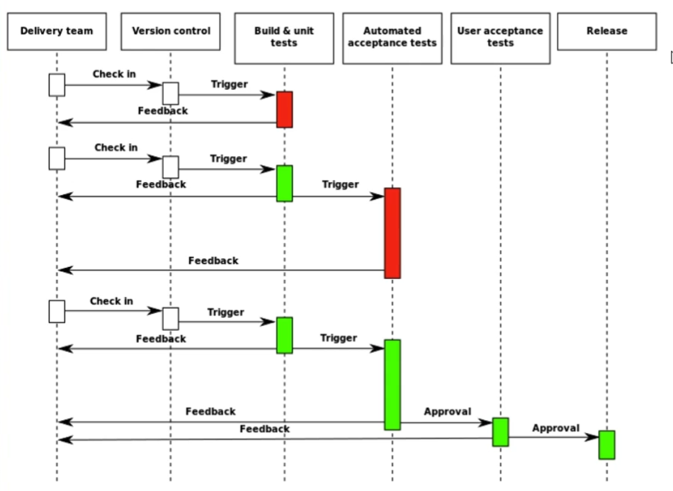

Ambos entrega contínua e deploy contínuo são conceitos similares, onde sua diferença reside na última etapa do pipeline de construção de software entre a homologação e produção.

Na entrega contínua as modificações e atualizações não são enviadas prontamente para a produção, ou seja, ficam "paradas" na homologação. Não existe uma razão técnica para segurar estas alterações, elas são de fato seguras e funcionais, mas os motivos envolvem estratégias de negócio. Como exemplo, uma empresa que deseja lançar um conjunto de features novas para o cliente em um evento especial de vendas.

Já no deploy contínuo, as modificações vão de fato para o ambiente de produção.

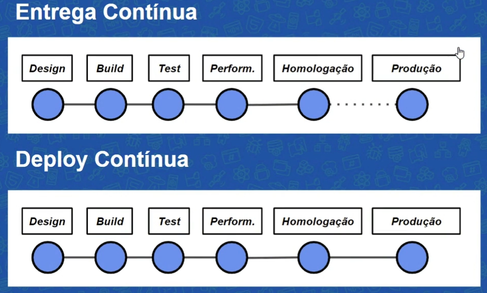

Como boas práticas nestes pipelines, se entende que:

- O pipeline é a única forma de deploy
  - Assim, mantendo um estado seguro para o ambiente de prod
- Manter o processo no pipeline o mais rápido possível, sendo ágil
- Build deve ser executado apenas uma vez
  - Nos processos seguintes, é utilizado o artefato daquela build
- Build deve ser independente do ambiente
  - O software não deve levar configurações hardcode
- Os ambientes devem ser iguais ou semelhantes aos de produção para evitar incompatibilidades
- Os ambientes devem ser efêmeros
  - Dessa forma, os cenários (ambientes) estarão limpos para novos testes
- O deploy para ambientes deve ser sempre igual para todos

**Build (Commit Stage) ↓**

- Unit tests, build, analysis
- Não demore mais de 10min (feedback rápido)
  - Não teste UI, evite DB, evite `async`
  - Use repo do artefato como cache
- Todo o time é responsável
- Manter código qualidade para todos os scripts
- Manter os ambientes atualizados (dos devs)
- Resultados (quando passa nos testes)
  - Plano de testes
  - Artefato
  - Relatório de qualidade

**Automated Acceptance Testing Stage ↓**

Garantir que a aplicação está funcional e dentro das regras de negócio.

- Equipe define as especificações (analistas, qa, dev)
- Responsabilidade a equipe
- Smoke tests para o ambiente
- Mock de sistemas externos
- Bons requisitos
- Boas práticas no design e implementação de testes
- Desempenho não é o mais importante

A responsabilidade da definição do teste é dividida entre toda equipe, assim como a correção de erros. Para garantir que o ambiente está adequado, devemos realizar um conjunto de pequenos testes dos recursos principais. Precisamos de bons requisitos para escrever as especificações e o teste na aplicação final real. Testes de aceitação são caros de escrever e manter, por isso desde o início devemos utilizar boas práticas no momento de criá-los. O desempenho importa, claro, mas não é o mais importante, geralmente são lentos.

**Stage de Homologação UAT ↓**

Trata-se de um universo amplo: construção do modelo de testes, recriação do ambiente de produção e assim por diante, mas estes são os pontos principais desta etapa do pipeline. Testa o deploy em ambiente igual (ou muito semelhante ao de prod), a equipe recebe feedback sobre aceitação e usabilidade da aplicação, valida se o software atenda as expectativas.

- Testes manuais pelo cliente
  - O cliente consegue usar o sistema de acordo com o esperado? 
  - Realiza as ações requisitadas? 
  - Apresenta dificuldade?
  - Feedback do cliente
- Valida o software
- Usabilidade contínua
- Equipe participativa

Em paralelo com a UAT, às vezes é necessário fazer os testes de carga.

- Estabelecer metas claras e saber o baseline
- Usar ferramentas de monitoração
- JMeter, Gatling, Webload, Apache Bench, LoadNinja
- Não precisa rodar a cada build, mas é ideal que siga um ciclo constante

Os testes de carga buscam descobrir qual é a real capacidade do nosso sistema, ou seja, seu baseline. Conhecendo nosso sistema, devemos estabelecer metas claras e utilizar ferramentas de monitoração para descobrir as modificações arquiteturais que são necessárias.

Estes testes são mais caros devido a sua complexidade. Na fase de homologação não precisamos rodar a cada commit ou build, mas que o projeto seja monitorado desde o início. Podemos começar pelos testes de aceitação e criar um cenário, para elaborar os testes de carga ou fazer um replay dos dados de reprodução: gravamos o comportamento das requisições e realizamos um replay desses dados. Algumas ferramentas que podemos utilizar para isto são JMeter, Getling, Webbload, Apache Bench, LoadNinja.

## Estratégias de Releases

Era comum no meio dos desenvolvedores utilizar alguns "carimbos" de qualidade do software, como o Pré-Alpha, Alpha, Beta, Release Candidate e Release. Hoje em dia é utilizado o pipeline, com etapas sofisticadas com releases durante o desenvolvimento do projeto.

Para além dos pontos de redução de riscos, também há o "twelve-factor app", que são boas práticas documentadas que fornecem uam referência de como a aplicação deve se comportar dentro de um ambiente de nuvem. Ainda há outras medidas para deixar o sistema ainda mais confiável na última fase do pipeline.

Para que os deploys sejam contínuos, é preciso realizar releases incrementais, mesmo que a funcionalidade seja grande, assim para chegar ao estado final do sistema. Deploy é criar um ambiente, garantir que ele exista de maneira correta, instalar o software e configurá-lo. Já o release é a publicação de fato, o momento em que o cliente utiliza o produto.

**Blue-Green ↓**

Temos duas questões principais:

- Como evitar que a aplicação fique offline durante o deploy (zero downtime)?
- Como voltar para a versão anterior (rollback) em caso de erro?

Nesta estratégia, o deploy já foi realizado, mas temos duas versões: uma antiga (azul), e a nova (verde), que já está em ambiente de produção. Entre as versões há um roteador, então, em algum momento, podemos modificar o fluxo para o novo ambiente, a nova versão. O ambiente velho (blue), fica no ar ainda um bom tempo caso algum problema surja. 

As conexões que existiam para o azul ficarão disponíveis até que realmente apenas a versão verde esteja totalmente funcional.

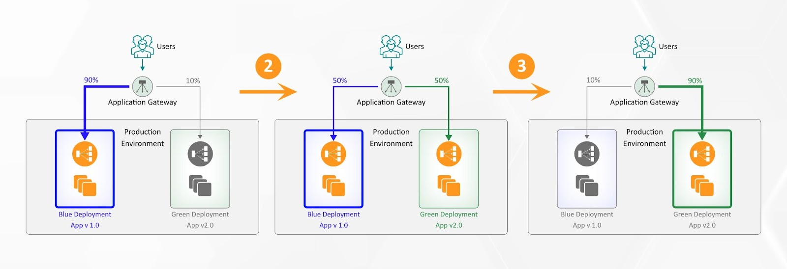

**Canary Release ↓**

É bem semelhante a estratégia anterior, considerada quase como sua evolução. Neste caso, as duas versões são utilizadas ao mesmo tempo, tanto azul quanto a verde, mas a nova versão não é acessada por todos os usuários. Uma parcela dos usuários que têm acesso a nova versão serão agentes de um teste.

O critério de direcionamento da nova versão em teste para alguns usuários varia, podemos usar 5% do nosso tráfego para a nova versão e monitorar o comportamento do sistema. Outro critério possível é o geográfico ou em estratégias de mercado, idade e assim por diante, isso vai variar de acordo com as necessidades do negócio e dados disponíveis sobre os usuários.

Uma vez que o teste for concluído, os usuários integralmente são direcionados para a nova versão. Esse metodologia também é utilizada para A/B Test.

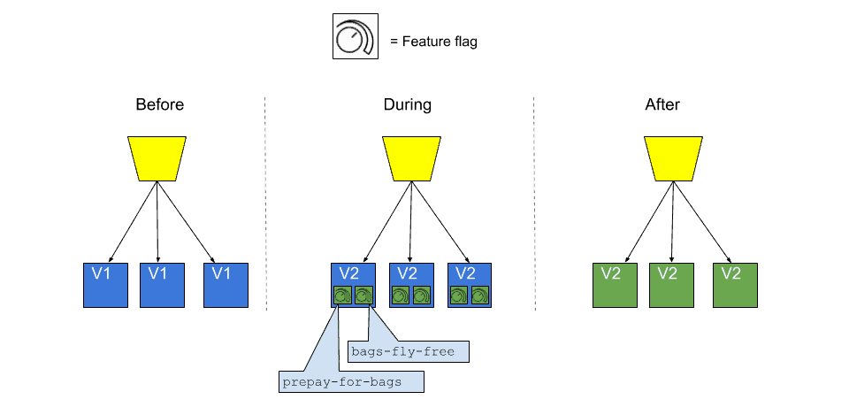

**Feature Toggle ↓**

Outra estratégia com o mesmo objetivo é o Feature Toggles, também um dark launching, mas neste caso trata-se de uma configuração no código que disponibiliza um switch de versões. Um exemplo é quando é oferecida a condição de "beta tester" para o usuário de alguma aplicação; caso a resposta seja positiva, alguma configuração no cadastro possibilitará o acesso à nova feature. 

Mas temos a mesma base de código, não são duas versões blue ou green.

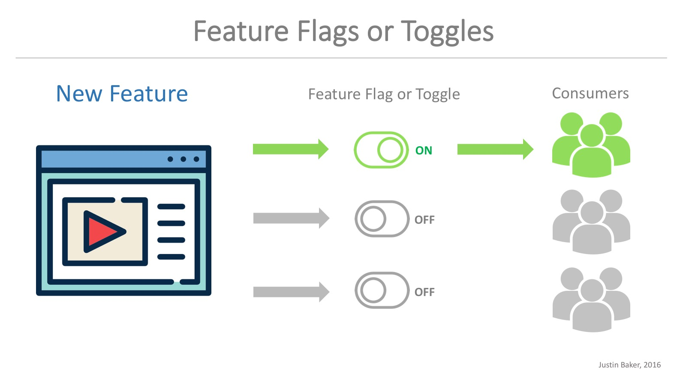

Esta estratégia pode ser combinada ao Canary Release: uma parcela dos usuários que será direcionado para a versão nova utilizará o Feature Toggles habilitado. Há pessoas que defendem que toda a nova funcionalidade deve ser um Feature Toggles, mas para isso ser implementado de maneira correta deve-se elaborar uma estratégia para lidar com essa proposta.

### Release Antipatterns

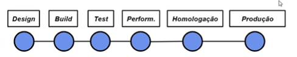

**1. Gerenciamento manual de ambientes**

Cada ambiente precisa ser configurado e reconfigurado, e existem vários; deveria ser fácil destruir o pipeline e reconstruí-lo com a mesma facilidade. Se etapas que já são complexas forem executadas manualmente, teremos a presença de erros e inconsistências. Há casos em que o deploy funcionou em ambiente de homologação, mas não de produção, e é importante mencionar que são ambientes muito similares.

O mesmo pode ocorrer dentro do ambiente de produção, por exemplo o cluster, que possui várias máquinas envolvidas. Se as máquinas não forem idênticas a medida que o software se expande complexifica, teremos problemas. Isso ocorreu porque algo foi aplicado manualmente.

A regra de ouro é: 

> Todos os ambientes são tratados como código, versionados e criados de maneira automatizada.

**2. Deploy manual**

Geralmente temos um manual que define as etapas de um deploy, mas geralmente a aplicação evolui e a documentação não é mais precisa e real. Há desenvolvedores que não sabem como o deploy é de fato realizado, afinal é um fazer delegado a poucas pessoas dentro da empresa em algumas configurações de equipe. Os deploys podem ser lentos e durarem horas ou dias. Nessa configuração teremos um deploy vagaroso, sujeito a erros e não confiável.

A regra de ouro é: 

> Apenas duas tarefas devem ser executadas manualmente: escolher a versão do release e o clique em "deploy button".

Dessa maneira, qualquer pessoa da equipe pode realizar o deploy; o resto é automatizado, encapsulado e seguro.

**3. Deploy apenas no fim do ciclo**

Por exemplo, os desenvolveremos em aplicações estáveis e grandes focam em testes de criação de novas features e não interagem com a equipe de produção. Dessa maneira, não sabemos se as novas features serão de fato funcionais e estáveis em produção.

Desse modo, teremos como resultado uma equipe pouco integrada, os problemas serão avistados apenas no dia da publicação, e isso torna o processo mais lento.

A regra neste caso é: 

> Deployment faz parte do desenvolvimento desde a primeira interação, todos definem um delivery team.

Tendo em mente esses 3 antipatterns clássicos, as regras ficam claras:

- Gerenciamento automatizado de ambientes
- Deploy automatizado
- Deploy frequente em cada ciclo de desenvolvimento

## Princípios da Entrega Contínua

A entrega contínua pode ser definida pelo conceito de:

> Entregar software com alta qualidade e grande valor, de maneira eficiente, rápida e confiável

A métrica principal é o software executável que satisfaz o cliente. O deploy não deve ser algo complexo ou extraordinário, sim algo simples, fácil e de baixo risco.

Os princípios básicos da entrega contínua se constituem por:

- **I. Automatize**
- **II. Versione**
- **III. Repita**
- **IV. Garanta qualidade**
- **V. Defina "done"**
- **VI. Crie delivery team**
- **VII. Use melhoria contínua**

A automatização facilita e simplifica o processo, além de diminuir as chances de erros por alterações manuis inesperadas, o versionamento ajuda no controle e histórico de versões, com ambos processos sendo repetidos até a garantia da qualidade da aplicação. É necessário definir o que conceitua o código como "done", criar um time de entrega e estabelecer uma cultura de melhoria contínua.

Conhecendo os princípios, podemos passar para os elementos que compõem esse tipo de entrega:

- **Cultura DevOps**
  - Feedback, colaboração e confiança
  - Melhoria e aprendizagem contínua
- **Patterns**
  - São os padrões de deploy, ou releases de baixo risco
  - Deployment pipeline
  - Deployment patterns (blue/green, canary, feature toggle...)
- **Arquitetura**
  - A arquitetura é uma fase importante, pois quando falamos sobre arquitetura estamos mencionando a estrutura do sistema.
  - Deve ser estipulada no começo do projeto
  - Novas propriedades:
    - Testability
    - Deployability
  - SOLID, Services, 12 Factor App