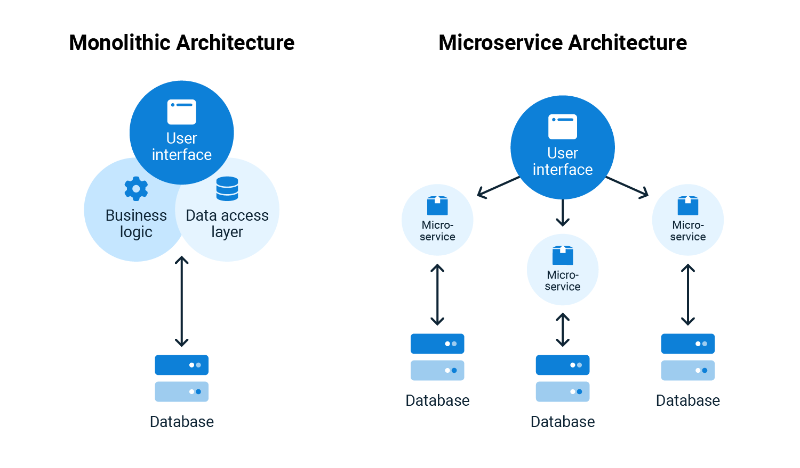

# Microsserviços: Padrões e Conceitos

- [Microsserviços: Padrões e Conceitos](#microsserviços-padrões-e-conceitos)
  - [Conceituando Microsserviços](#conceituando-microsserviços)
    - [Vantagens e Desvantagens](#vantagens-e-desvantagens)
    - [Tipos de Serviços](#tipos-de-serviços)
      - [Serviços de Domínio](#serviços-de-domínio)
      - [Serviços de Negócio](#serviços-de-negócio)
    - [Padrões](#padrões)
  - [Integrando Microsserviços](#integrando-microsserviços)
  - [Lidando com Dados](#lidando-com-dados)
    - [Padrão de Codificação](#padrão-de-codificação)
    - [Eventos Assíncronos](#eventos-assíncronos)
  - [Operações](#operações)
    - [Agregando Métricas](#agregando-métricas)

## Conceituando Microsserviços

**Entendendo a Web ↓**

Para começar, é importante entender como a internet funciona; ela opera por meio do protocolo HTTP. De forma simples, é um o protocolo baseado em requisição e resposta, comunicação entre cliente-servidor. O cliente sempre inicia a interação, enviando um pedido, o servidor processa esse pedido e envia uma resposta.

Quanto à construção de aplicações para a web e à programação para ela, é comum que se lide com diversos clientes, como diferentes navegadores, e até mesmo dispositivos móveis. As requisições desses clientes chegam até o servidor de diversas formas, muitas vezes por meio de um balanceador de carga, também conhecido como load balancer.

Um load balancer é um servidor web que recebe a requisição e a distribui para diferentes servidores, gerenciando a carga conforme necessário. 

Nesse sentido, a aplicação executa uma série de tarefas diversas, as chamadas aplicações monolíticas. Por exemplo: uma aplicação monolítica centralizada poderia lidar com atividades como o cadastro de estudantes e cursos, a gestão de pontos por meio de gamificação na plataforma, o processamento de pagamentos na área financeira, a disponibilização de conteúdos além dos cursos principais, entre outras funcionalidades, tudo integrado em uma única e abrangente aplicação.

Resumindo, são vários módulos (partes ou pedaços de código) que lidam com dados diferentes. E tudo isso é armazenado em um banco de dados.

Porém, essa abordagem de aplicação pode trazer alguns problemas, dentre eles:

- Demoras nos deploys
- Falhas podem ser críticas e derrubar todo o sistema
- 1 projeto = 1 tecnologia

Dessa forma, o que poderia ser uma pequena atualização ou construção, acaba sendo algo maior e mais demorado por estar embaixo de uma mesma aplicação. Além disso, em um sistema monolítico como esse, uma falha pode ter impacto em todo o sistema, afetando até mesmo áreas não relacionadas à origem da falha. Essa é outra grande desvantagem dessa abordagem.

Por fim, se tudo está dentro de um aplicação é então um projeto só, geralmente preso a uma tecnologia; nem sempre a mesma tecnologia vai resolver bem todos os problemas. O ideal seria ter maior liberdade para escolher a tecnologia que mais satisfaz as demandas da aplicação, mas se temos um projeto só, isso se torna muito mais difícil, mesmo com sa formas de contornar.

É a partir do entendimento dessas falhas que nasce as soluções apresentadas pela arquitetura de microsserviços.

**O que são Microsserviços? ↓**

Em uma arquitetura de microsserviços, cada parte do código será uma aplicação diferente, cada aplicação sendo um serviço diferente. A ideia de microsserviços é ter vários microsserviços, ou seja, vários desses serviços muito pequenos que tenham uma responsabilidade muito bem definida, sabendo o que cada um dos serviços vai fazer.

Como exemplo, podemos ter uma situação em que a loja oferece um serviço de catálogo. Esse catálogo, responsável por lidar com produtos, inclui funcionalidades como cadastro, exibição de produtos e organização dos mesmos. Essas operações são realizadas em um banco de dados dedicado exclusivamente ao catálogo, que abrange produtos, categorias, taxonomia e outros aspectos relacionados à lógica dos produtos.çl .

> Microsserviços são uma abordagem arquitetônica e organizacional do desenvolvimento de software, na qual o software consiste em pequenos serviços independentes que se comunicam usando APIs bem definidas. Esses serviços pertencem a pequenas equipes autossuficientes.

A questão central dos microsserviços é que, para construir uma aplicação completa, precisam estar interconectados.

Dessa forma, o microsserviço responsável pelos pedidos precisa estar ciente do microsserviço do catálogo de produtos. Ele não precisa conhecer todos os detalhes do banco de dados, a lógica completa ou a taxonomia dos produtos. Entretanto, ele precisa saber como acessar o endpoint para obter os detalhes de um produto ou pelo menos uma identificação para armazenamento.

Quando precisamos recuperar os dados desse pedido, teremos as informações necessárias sobre o produto para consultar no catálogo. Assim, os serviços se comunicam entre si. Essa comunicação pode se dar de várias maneiras, como por exemplo, utilizando o protocolo HTTP. Um serviço pode enviar solicitações para outro por meio do HTTP ou utilizando APIs REST, ou até mesmo protocolos mais complexos e específicos para esse propósito, como o GRPC ou similares. Portanto, a comunicação entre os microsserviços é importante e ocorre com frequência, sendo necessário estabelecer essa comunicação.

Outro ponto mencionado nessa definição formal é que esses serviços são operados por equipes autossuficientes. Isso significa que é possível ter tranquilamente uma equipe dedicada ao serviço de produto, com sua própria tecnologia, conjunto de ferramentas, gestão e metodologia ágil, enquanto outra equipe cuida do projeto de pagamentos, utilizando uma tecnologia e metodologia diferentes.

### Vantagens e Desvantagens

**Vantagens ↓**

- Projetos independentes = tecnologias independentes
- Falha em 1 serviço é isolada do resto do sistema
- Deploys menores e mais rápidos

Tendo projetos independentes implica que é possível adotar tecnologias independentes, equipes independentes e metodologias independentes. Isso significa que equipes distintas, com experiências e metodologias variadas, podem trabalhar em serviços diferentes para a mesma aplicação. Assim, se consegue alcançar uma maior flexibilidade.

Outro aspecto vantajoso é que, se um serviço apresentar falhas, o resto da aplicação continuará funcionando sem maiores interrupções. É possível também dimensionar serviços de maneira independente, assim alocando somente o que cada um demanda.

Ambos pontos influenciam para que seja possível ter diferentes escalas, utilizando tecnologias distintas e equipes separadas. Além disso, os deploys desses serviços tornam-se mais rápidos já que o processo pode ser agilizado.

E como o código só será alterado no serviço específico, não há necessidade de realizar novos testes nos outros serviços. Essa abordagem proporciona mais flexibilidade e segurança.

**Desvantagens ↓**

- Maior complexidade de desenvolvimento e infra
- Debug mais complexo
- Comunicação entre os serviços deve ser bem pensada
- Diversas tecnologias pode ser um problema
- Monitoramento é crucial e mais complexo

Inicialmente, há uma complexidade muito maior. tanto no desenvolvimento quanto na gestão da infraestrutura. Será necessário contar com vários servidores, incluindo aplicativos de banco de dados e servidores web mais robustos, para equilibrar a carga de forma eficaz e entender como realizar esse balanceamento.

Dessa forma, a complexidade associada é considerável. O processo de debug de código em uma arquitetura de microsserviços também é consideravelmente mais complexo. Isso ocorre porque, em uma aplicação monolítica, existe o que é chamado de stack trace. Ou seja, se ocorrer um erro, se pode visualizar toda a sequência de eventos que ocorreram na aplicação naquela stack trace, na pilha de execução, obtendo informações sobre tudo o que foi executado.

Por outro lado, em microsserviços, quando um cliente chama uma URL, um endpoint específico é acionado, o qual por sua vez chama um serviço, que pode chamar outro serviço e assim por diante. Se ocorrer um erro no quarto serviço dessa cadeia, rastrear todas essas chamadas e entender o que causou o erro se torna muito mais complexo.

A comunicação entre os serviços tem que ser muito bem pensada. Se o protocolo HTTP será utilizado, se será usado outro protocolo socket direto, se a comunicação será de forma síncrona ou assíncrona. Então isso tudo tem que ser bem pensado para cada caso.

Diversas tecnologias podem se tornar problemáticas. Às vezes, surge a necessidade de criar um novo serviço e aprender uma linguagem de programação diferente para desenvolvê-lo. 

Além disso, o monitoramento de aplicações em microsserviços é mais complexo e importante. É essencial saber o estado de cada serviço, se estão operacionais e se há algum microsserviço fora do ar. Portanto, é fundamental ter um sistema de monitoramento eficiente e gerar métricas precisas para arquiteturas e sistemas desse tipo.

Com isso em mente, começar diretamente com microsserviços é arriscado, pois se pode enfrentar complexidades desnecessárias no momento atual. E muitos problemas vão surgir antes do necessário.

Já se o começo é com a abordagem monolítica, o sistema pode ser desenvolvido com mais tranquilidade. Todo o sistema será todo acoplado, o que vai tornar o escalonamento mais difícil, mas pode-se entender o domínio, implantar as regras de negócio, etc.

No momento em que essa parte da aplicação está ficando muito complexa ou está recebendo muitas requisições, é quando ele pode ser divida em serviços bem definidos.

### Tipos de Serviços

**Data Service ↓**

Um data service é um tipo de serviço que simplesmente expõe dados, funcionando como uma camada fina entre os usuários e o banco de dados.

Sua função principal é receber dados e realizar o processamento necessário para manter a consistência desses dados. Por exemplo, se precisamos armazenar a data de atualização de um determinado produto, esse serviço ficará responsável por preencher esse campo. Além disso, se algum dado estiver em um formato inválido, ele tratará dessa questão. São serviços dedicados a manter a integridade dos dados.

**Business Service ↓**

É um tipo de serviço que, além de consumir dados de alguma forma, seja consumindo um data service ou tendo ele acesso direto a um banco de dados, ele fornece operações mais complexas.

**Translation Service ↓**

Os translation services (serviços de tradução), são, basicamente, uma forma de acessar algum recurso externo, mas mantendo certo controle.

Por exemplo, se quisermos consumir um serviço de log externo, podemos ter um serviço que a nossa aplicação vai consumir esse serviço e esse serviço consome o recurso externo para que tenhamos um maior controle. Se esse serviço externo mudar, modificaremos em um local só. Isso é algo existente, algo que podemos implementar.

**Edge Service ↓**

Um edge service, como o nome já diz, é algo que é entregue diretamente para o cliente e pode ter necessidades específicas.

Por exemplo, no caso da Alura, imagine que temos o mesmo sistema acadêmico, mas temos um edge service para os clientes web e um outro edge service para os clientes mobile, porque no aplicativo não precisamos, por exemplo, mostrar as perguntas do fórum na hora ou não precisamos mostrar a transcrição ou algo do tipo.

Se existem essas necessidades específicas para clientes específicos, podemos ter um edge service que cada um dos clientes vai consumir e esse edge service vai cuidar dessas necessidades específicas, limitando o acesso a dados que precisamos transferir.

#### Serviços de Domínio

É a separação de um pequeno domínio da aplicação como serviço, não um contexto ou módulo completo. É um tipo possível de Data Service.

**Domain-driven Design ↓**

Na prática, se começa modelando o domínio sem pensar na persistência. Esse serviço de domínio terá suas próprias regras e funcionalidades, garantindo que o serviço atenda às exigências do negócio. É essencial entender o domínio do que está sendo desenvolvido. 

A partir do modelo bem pensado e do domínio modelado, é possível avaliar quais ações serão disponibilizadas. Quais serão as requisições necessárias, sejam de leitura, inserção, atualização, alteração ou remoção de dados. Com base nisso, se constrói o serviço, implementando primeiro o contrato e depois a implementação propriamente dita.

O detalhamento do contrato, ou seja, como será exposta as ações, precisa ser cuidadosamente definido. Uma vez definido, será disponibilizado o acesso a esse recurso, a esse serviço.

É importante ressaltar que REST e RPC (Remote Procedure Call) podem coexistir. Embora essa abordagem possa ser criticada por alguns, visto que REST é simplesmente uma representação de recursos e RPC envolve a chamada de ações de funcionalidades, existe o Action Pattern em aplicações RESTful, que permite a exposição de ações além dos recursos.

Ao estudar profundamente o protocolo HTTP e como o serviço será exposto, se pode decidir se serão liberados todos os dados sem restrição através de REST ou se serão filtrados alguns detalhes e disponibilizadas apenas operações específicas, em vez de permitir a manipulação direta do recurso. Esses detalhes serão cuidadosamente considerados.

#### Serviços de Negócio

Para cados de operações que precisam de mais do que um único domínio, existe o serviço de negócio, ou Business Service. Esse tipo de serviço basicamente junta diversos Data Services ou serviços de domínio, seguindo um padrão que visa uma modelagem eficiente.

Esses casos envolvem detalhes mais complexos que vão além de um único domínio. Portanto, os serviços de negócio existem para lidar com essas situações. Eles encapsulam processos de domínio de alto nível e orquestram operações mais granulares.

Essa abordagem permite encapsular domínios relacionados, como o de estudantes e o financeiro, simplificando o processo e tornando-o mais próximo do contexto do negócio. Ao utilizar um serviço de domínio, se consegue encapsular várias operações sem expor detalhes desnecessários aos clientes.

Para criar um serviço de negócio, é preciso identificar o processo que se pretende expor. Por exemplo, "realizar matrícula" é um processo de negócio, enquanto "inserir um estudante" não é. A partir disso, é possível identificar os domínios necessários e definir a API focando no domínio, não nos dados em si.

Ao receber uma requisição no serviço de domínio, este consome os Data Services correspondentes, consultando e realizando requisições para os serviços de dados específicos. Isso permite separar os domínios de forma eficiente, mantendo a modularidade e a coesão na arquitetura.

### Padrões

**Strangler Pattern ↓**

Basicamente, o Strangler Pattern consiste em extrair partes do monólito de forma gradual, como se estivesse estrangulando o monólito até que ele se desfaça em pequenos serviços independentes.

Esse processo pode ser iniciado de diversas maneiras, como por exemplo, começar isolando os dados do monólito, separando o banco de dados em partes menores e, em seguida, sincronizando essas partes. Ou isolar o domínio do monólito, criando novos serviços que se conectam ao mesmo banco de dados. Em ambos os casos, o objetivo é extrair partes do monólito até que ele seja separado em serviços.

Esse processo de estrangulamento permite separar os domínios e os processos do monólito em serviços independentes, até que ele se torne uma coleção de serviços menores. Com isso, se alcança uma arquitetura mais modular e escalável, compatível com microsserviços.

**Sidecar Pattern ↓**

Às vezes, serviços diferentes podem ou precisam compartilhar código entre si.

O Sidecar Pattern consiste em determinar o processo comum e criar um módulo compartilhável que pode ser integrado aos diversos serviços. Esse módulo contém o código comum a ser compartilhado entre os serviços, permitindo que atualizações no código sejam replicadas em todos os serviços de forma eficiente.

Para implementar esse padrão, pacotes independentes pode ser criados para diferentes linguagens de programação, como pacotes no NPM para Node.js, no Composer para PHP ou no Maven/Gradle para Java. Assim, é possível compartilhar código entre os serviços sem a necessidade de criar um novo serviço exclusivamente para isso.

## Integrando Microsserviços

É o conceito de integração entre diversos microsserviços, ou seja, a comunicação entre serviços. Porém, vai além disso, também se preocupa com o ponto de entrada da arquitetura e como ele pode se manter único. 

Sendo separado em microsserviços, cada consulta de dados pode ser outra URL, com outro padrão, como JSON, XML ou até um formato binário. Para que isso se mantenham em um único ponto de entrada, unificando essas consultas e mantendo a API consistente, existe o processo de API Gateway.

**API Gateway ↓**

O Gateway, esse portão de entrada, fornece um proxy ou uma fachada, algo que você visualiza de forma simplificada para as necessidades reais. Inclusive, existe um padrão de projeto de codificação chamado FACADE, que fornece exatamente isso, um ponto de entrada para um subsistema, para algo mais complexo. Ele simplifica a API. Já o API gateway é como se fosse uma FACADE, mas nesse nível mais arquitetural do que de design.

Ele pode ser um serviço externo, um servidor web. A forma como será implementado depende, mas, o objetivo é ter um portão de entrada, um ponto que saberá como organizar o fluxo de determinada operação, serviço ou acesso.

Porém, existe uma desvantagem. Esse portão pode acabar se tornando um ponto central de falha. Se o API gateway cair, a aplicação toda cai. Portanto, isso precisa ser muito bem escalado. É possível ter algo como uma demanda elástica, por exemplo, que conforme as requisições chegam, isso cresce automaticamente.

O API Gateway pode realizar alguns trades como autorizar e redirecionar os requests. Ele pode ter algum decorator, por exemplo, receber uma requisição e adicionar diversos cabeçalhos para mandar para cada um dos serviços. Adicionar informações, remover informações desnecessárias, poder modificar um pouco essa requisição antes de encaminhá-la.

Isso pode acabar limitando o acesso ao conteúdo trafegado.

**Edge Pattern and Edge Services ↓**

Existe um tipo de serviço um pouco mais próximo do cliente. Isso é basicamente um gateway específico para determinadas pessoas clientes, que vai se concentrar nas necessidades reais das pessoas clientes. Quando se fala de pessoas clientes, pode ser interpresado como um cliente HTTP, alguém que vai chamar a API, por exemplo, ou cliente de negócio.

Para melhor atender este caso, existe a lógica de gateways específicos, ou seja, um Edge Service, para cada um desses tipos de pessoas clientes. Esse é o benefício de um Edge Pattern e, inclusive, existem projetos que só trabalham com Edge Services e não com API Gateways. Ou seja, não existe um ponto único e sim um ponto único de entrada para cada tipo de cliente. 

Essa é uma forma de pensar e desenvolver conforme o que faz mais sentido.

Quando um Edge Service é construído, as necessidades específicas da pessoa cliente são identificadas, e contratos específicos são oferecidos para cada uma elas. Então, a URL pode mudar, o que o aplicativo móvel consome pode ser diferente do que o navegador consome, a URL é outra, o recurso é outro, etc.

**Agregador de Processos ↓**

Um serviço de negócio agrega vários serviços de domínio para se ter um processo completo. Já um agregador de processos é algo necessário para agregar diversos desses processos. Então, temos um serviço de domínio e um serviço de negócio que os agrega. Além disso, podemos ter um agregador de processos que agrega diversos serviços de negócio. Isso é menos comum, como você pode imaginar, e será utilizado quando temos processos mais complexos, processos que dependem de vários outros processos.

Quando se tem mais de um processo complexo em um processo maior, é possível utilizar o process aggregator pattern, um padrão de agregação de processos onde se tem um tipo de serviço ainda mais de alto nível.

Um serviço de negócio agrega serviços de domínio. Um agregador de processos agrega serviços de negócio. São similares no conceito, mas vão agregar tipos diferentes. A partir disso, se fazem as chamadas para os serviços necessários e montam a resposta correta, baseado nas respostas que são recebidas de cada um dos processos, de cada um dos serviços de negócio.

Esse tipo de serviço, um agregador de processos, pode e deve ter alguma lógica de processamento. Para começar, é preciso, pelo menos, unir a resposta de diversos serviços. Isso, por si só, já é um processamento. Então, não é só um proxy, ele processa realmente as respostas para unir.

Conforme um agregador é construído, um novo modelo para o sistema é definido. Isso, pois, esse novo domínio, subdomínio, representará esses dados agregados.

É a parti desse modelo que é a API é pensada, onde os processos são desencadeados e tudo é gerado.

## Lidando com Dados

O princípio é sempre buscar seguir o padrão single service database, garantindo que cada serviço tenha seu próprio banco de dados dedicado. Nos casos de compartilhamento de banco de dados, é fundamental adotar práticas que preservem a independência dos serviços, tratando o banco compartilhado como se fossem bancos separados.

**Single Service Database ↓**

O ideal é seguir o conceito de Single Service Database, onde cada serviço possui seu próprio banco de dados dedicado. Isso permite uma escalabilidade mais granular, pois os recursos do banco de dados podem ser ajustados de acordo com as necessidades específicas de cada serviço. Por exemplo, um serviço com menos requisições pode utilizar um banco de dados em um servidor menos robusto, enquanto um serviço com mais tráfego necessita de um banco de dados mais poderoso.

Cada serviço conecta-se apenas ao seu próprio banco de dados, garantindo independência e isolamento. Assim, é possível gerenciar melhor a escalabilidade e evitar gargalos de desempenho.

- Problema: 
  - Escalabilidade do serviço e do banco são fortemente relacionados
- Solução: 
  - Cada serviço (que precisar) terá seu próprio banco de dados

**Shared Service Database ↓**

No entanto, em alguns casos, como por exigências contratuais ou necessidades de integração de dados, pode ser necessário adotar o Shared Service Database.

No cenário de um banco de dados compartilhado, é essencial tratá-lo como se fossem bancos separados em termos de acesso e operação. Mesmo que fisicamente seja o mesmo banco de dados, cada serviço deve interagir com ele de forma independente, como se fossem bancos distintos. Isso simplifica a manutenção e evolução do sistema, reduzindo o impacto de alterações nos contratos ou na estrutura dos dados.

- Problema: 
  - Às vezes precisamos centralizar os dados (até por motivos contratuais)
- Solução: 
  - Trate esse banco em cada serviço como se ele fosse separado.

### Padrão de Codificação

Basicamente, o CQRS, Common Query Responsibility Segregation, é a ideia de que modelos diferentes podem ser usados para buscar uma informação e para atualizar ou inserir uma informação. Ou seja, modelos diferentes para escrever e para ler. Em algumas situações, essa separação pode ser muito valiosa. Pode até se ter um banco de dados para escrita e outro para leitura, com algum tipo de sincronização entre eles.

No entanto, em muitos sistemas, esse padrão adiciona uma complexidade considerável. Portanto, é preciso estudá-lo mais detalhadamente.

A ideia por trás do CQRS é ter um modelo de escrita e um modelo de leitura. Com os dois separados, cada um pode realizar operações mais complexas. Por exemplo, ao cadastrar uma pessoa estudante, podemos inserir informações que geram outros dados, como a matrícula financeira, a data de atualização, entre outros. Ao ler esses dados, podemos buscar informações de outro domínio.

> https://www.youtube.com/watch?v=yd6V4w19iJU

### Eventos Assíncronos

Os eventos são um tema amplo por si só, abrangendo eventos de domínio e incluindo o conceito de event sourcing (fonte de eventos). O event sourcing envolve o armazenamento de todos os dados de aplicação por meio de eventos; cada evento representa uma modificação nos dados e, caso seja necessário reconstruir os dados, uma lista de eventos pode ser utilizada para isso.

Existem situações em que a resolução de um problema não pode ocorrer instantaneamente. Outros serviços podem então capturar esses eventos e realizar o processamento necessário, como verificação de fraude ou cobrança no cartão, sem impactar a experiência do cliente de forma síncrona. 

O cliente recebe uma resposta imediata, enquanto os eventos são processados em segundo plano. Essa abordagem permite que a interação do cliente com a plataforma seja contínua, mesmo enquanto processos mais demorados são executados nos bastidores.

Um exemplo mais simples é o envio de e-mails a partir de um formulário de contato. Em vez de esperar pelo envio do e-mail antes de retornar uma resposta ao usuário, podemos colocar o pedido de envio de e-mail em uma fila de mensagens assíncrona e retornar imediatamente uma confirmação ao usuário. O envio do e-mail pode então ser tratado em segundo plano.

Para lidar com eventos assíncronos, tecnologias como filas de mensagens, como RabbitMQ e ZeroMQ, e serviços de streaming de dados, como o Kafka, são frequentemente utilizados. Essas ferramentas permitem a distribuição eficiente de mensagens assíncronas entre os microsserviços, garantindo escalabilidade e desempenho.

## Operações

**Logs ↓**

É preciso ter um formato padrão para que todos os microsserviços exponham os logs e as informações da mesma forma, de modo que possa ser lido como se fosse uma única aplicação.

Portanto, os formatos de log devem ser compartilhados entre todos os serviços. Não se pode ter um serviço exportando algo e fazendo log de algo em XML, enquanto se tem outro no formato binário próprio, outro em TXT, e assim por diante. É necessário um formato único.

Além desse formato, a taxonomia também deve ser compartilhada, ou seja, deve haver algo em comum. Por exemplo: o que é um log de erro? O que é um log de warning? A classificação de logs, isto é, a organização de logs deve ser compartilhada, para que seja possível identificar quantas vezes ocorreram erros em toda a aplicação. Dessa forma, a visualização de todos os logs de todos os microsserviços esterá agregada e organizada.

Logs de monólitos são agregados por padrão, ou seja, todos os logs são gerados para algum lugar que o monólito salva. Já quando no caso de microsserviços, um serviço gera log em um lugar, outro microsserviço gera log para outro lugar. Portanto, é preciso cuidar da agregação nesse caso.

**Rastreando Chamadas ↓**

Também é preciso rastrear as chamadas, e é através de logs que isso é feito.

Imagine, novamente, um serviço monolítico no qual temos uma exceção, um erro acontecendo. Quando vamos depurar esse problema, analisamos a stack trace, isto é, a pilha de execução, aquele rastro que a execução deixa para avaliarmos o que aconteceu.

Já com microsserviços, isso não acontece, pois suponha que temos um serviço que faz uma chamada para outro, e no terceiro microsserviço, ele quebra. Como vamos debugar o primeiro serviço? Nesse caso, não é possível, pois não temos uma pilha de execução. Portanto, os logs são utilizados para rastrear as chamadas e fazer o que chamamos de tracing.

Existem serviços que organizam esse tracing e geram o que enxergamos como uma stack trace. Sendo assim, precisamos realizar logs e agregar até mesmo para rastrear chamadas. Além disso, precisamos ser capazes de reconstruir toda uma operação a partir de um identificador.

Por exemplo: um cliente fez uma requisição, a qual vai para um edge service. Esse edge service precisa gerar um identificador da chamada, e depois irá passar para um serviço de negócio. Esse serviço de negócio que recebe o identificador, chama para o serviço de domínio.

Esse serviço de domínio, por sua vez, pode chamar algum outro serviço de data, isto é, outro data service, o qual pode até armazenar isso no banco de dados.

O ponto é o seguinte: esse rastreador é enviado para todos os serviços que fazem parte da operação, e todos eles utilizam esse identificador para realizar os logs. A partir disso, conseguimos gerar o equivalente a uma call stack, ou uma stack trace, ou seja, a pilha de execução de chamadas.

Dessa forma, através desse trace ID, é possível geral uma pilha de execução. Existem formatos de ID que podem gerar e transferir os dados. É desnecessário quebrar a cabeça com regras, pois já existem padrões que podemos pesquisar e escolher o que melhor nos atende.

Por fim, é necessário usar ferramentas de gerenciamento específicas para visualizar essas chamadas, essas call stacks (ou stack traces), essas pilhas de execução. Essas ferramentas APMs (Application Performance Management), normalmente, fornecem alguma forma de agregar os logs e transformar em uma call stack.

### Agregando Métricas

Além disso, é imprescindível conhecer o status da aplicação como um todo, um status mais geral. Para visualizar esse status, é necessário o uso de métricas.

Um dos pontos é que, enquanto logs precisam de desenvolvimento, as métricas "só" precisam de instrumentação. Primeiramente, o que é instrumentação? Significa que precisamos configurar uma ferramenta que já temos no nosso servidor, instalar um novo programa e configurá-lo. Não é algo fácil e não é qualquer pessoa que faz. Isso demanda estudo e especialização. Portanto, instrumentar métricas também é uma tarefa muito importante e pode se tornar complexa.

Porém, métricas, no geral, normalmente não precisam de desenvolvimento. Por exemplo: para sabermos quantas requisições o sistema recebe, não precisamos ir até o edge service e realizar um log.

Nesse caso, o servidor web já faz isso e permite monitorar o uso de CPU do servidor, então é possível monitorar determinadas coisas sem desenvolvimento próprio, pois alguém já desenvolveu.

As métricas podem ser utilizadas para manter o sistema saudável. Assim como exames de sangue estão para a saúde de uma pessoa, métricas estão para a saúde de um sistema. Precisamos ter métricas para saber se nossos sistemas estão saudáveis ou estão quase morrendo e ficando offline.

É importante que, a partir das métricas, as informações estejam muito claras. Para isso, dashboards de alto nível são usados para facilitar a visualização do status atual da aplicação como um todo.

Métricas mais específicas podem trazer valor, para sabermos quando aumentar um servidor, quando diminuir, ou quando alterar determinada lógica. Às vezes, temos muita fraude, então podemos adicionar uma verificação a mais no front-end para evitar determinadas requisições.

As métricas não servem apenas para manter os sistemas em funcionamento, mas também para nos comunicarmos com o negócio e identificarmos, por exemplo, períodos do ano em que quase não recebemos requisições.