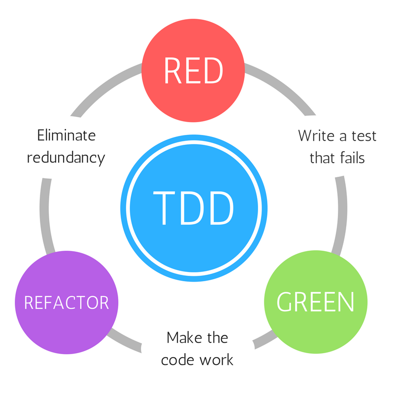

# Teste com Node.js e Jest

- [Teste com Node.js e Jest](#teste-com-nodejs-e-jest)
  - [Conceitos e Fundamentos](#conceitos-e-fundamentos)
    - [Tipos de Testes](#tipos-de-testes)
    - [Cultura de Testes](#cultura-de-testes)
    - [Fases de Teste](#fases-de-teste)
    - [Agile QA](#agile-qa)
  - [Testes Unitários e Estáticos](#testes-unitários-e-estáticos)
    - [Estáticos](#estáticos)
  - [Asserções e Jest](#asserções-e-jest)
    - [Relatórios](#relatórios)
  - [Implementando](#implementando)
    - [Matchers](#matchers)
  - [Testando](#testando)
    - [Mocks](#mocks)
    - [Hooks](#hooks)
    - [Supertest](#supertest)
  - [Bando de Dados, Imagem e Disparos de E-mail](#bando-de-dados-imagem-e-disparos-de-e-mail)
  - [Desenvolvimento Guiado Por Teste (TDD)](#desenvolvimento-guiado-por-teste-tdd)

## Conceitos e Fundamentos

Desenvolvedores tendem a cometer alguns erros em seus códigos, é importante prevenir problemas em ambientes de produção com a estratégia de testas sistemas.

(padrões de teste e boas práticas)

(triple a - arrange, act, assert)

(classificações)

(teste de caixa branca - acesso direto ao código)

Também conhecidos como testes estruturais, de código ou unitários; são uma abordagem de teste de software em que o testador tem conhecimento total da estrutura interna, lógica, implementação do código fonte e regras de negócios do que está sendo testado.

Eles são realizados com base na análise do código fonte.

Tipos de Testes de Caixa Branca

- Teste de Cobertura de Código (Code Coverage): 
  - Mede o percentual de código-fonte que está sendo coberto por testes. Os tipos comuns de cobertura incluem cobertura de linha, cobertura de ramificação e cobertura de caminho. Exemplo: Identificar partes do código não testadas em um script que gera relatórios.

- Teste de Caminho: 
  - Analisa todas as possíveis sequências de caminhos no código, garantindo que todos os fluxos lógicos tenham sido testados. Exemplo: Testar diferentes caminhos de uma função que calcula o preço total de uma compra com desconto.

- Teste de Fluxo de Controle: 
  - Garante que todas as declarações e decisões lógicas do código tenham sido executadas. Exemplo: Verificar se todas as ramificações de um código de verificação de autenticação são testadas.

- Teste de Unidade: 
  - Testa componentes individuais (funções, métodos, classes) do código para garantir que eles funcionem corretamente. Exemplo: Verificar se um método de validação de CPF está funcionando corretamente.

(teste de caixa preta - acesso indireto ao código)

Também conhecidos como testes de integração e retorno; possuem uma abordagem de teste de software em que os testadores analisam o comportamento externo de um sistema sem ter o conhecimento ou acesso sobre sua estrutura interna ou código fonte.

Eles se concentram em verificar se as entradas produzem as saídas esperadas e se as funcionalidades do sistema estão de acordo com as especificações.

Tipos de Testes de Caixa Preta

- Teste Funcional: 
  - Verifica se o sistema funciona de acordo com as especificações e requisitos. Exemplo: Verificar se ao “Autenticar” em uma api de login está sendo retornado o accessToken.

- Teste de Usabilidade: 
  - Avalia a facilidade de uso e a experiência do usuário do sistema. Exemplo: Avaliar se um aplicativo bancário possui uma interface intuitiva e fácil de usar para os clientes.

- Teste de Integração: 
  - Testa a interação entre componentes do sistema para garantir que trabalhem bem juntos. Exemplo: Testar se um aplicativo de redes sociais integra adequadamente recursos como publicar um novo post, adicionar comentários e curtir postagens.

- Teste de Aceitação: 
  - Garante que o sistema atende aos critérios de aceitação definidos pelo cliente. Exemplo: Confirmar se um aplicativo de delivery atende às expectativas do cliente, como entregar os itens corretos dentro do prazo.


Esses dois tipos de testes abordam diferentes aspectos do sistema e oferecem perspectivas distintas sobre seu funcionamento.

### Tipos de Testes

> https://www.alura.com.br/artigos/tipos-de-testes-principais-por-que-utiliza-los

→ E2E

- Ponta a ponta; alto nível
- Testes longos e completos
- Análise de todos os módulos e stacks
- Tempo longo e custo alto
- Complexa estrutura de testes

Os teste end-to-end são uma abordagem de teste de software que verifica todo o fluxo ou sistema, simulando o comportamento do usuário real, desde o início ao fim. Estes são projetados para avaliar a funcionalidade, integração e interação entre diferentes componentes de um sistema em um ambiente semelhante ao de produção.

Algumas das vantagens desse tipo de teste são a verificação de fluxo completo (cobrindo o fluxo do usuário, integração e funcionalidade), identificação de problemas complexos (relevando problemas não detectados nos outros tipos) e garantia da experiência do usuário (simulando possíveis falhas de usabilidade ou fluxos inadequados).

Entre os envolvidos no desenvolvimento e execução dos teste E2E estão: pessoas desenvolvedoras, analistas de testes, pessoas engenheiras de qualidade, gerentes de qualidade, pessoas profissionais de DevOps e especialistas em usuários. Cada um possuindo responsabilidades e funções para garantir a qualidade do software.

→ Integração (De Serviços)

- Testes de rotas e requisições
- Comunicação dos módulos
- Não analisa todo o fluxo da aplicação

→ Unitários

- Curtos e isolados
- Análise de funções ou métodos
- Não garante a integração de módulos

### Cultura de Testes

É um ambiente onde a equipe de desenvolvimento tem a capacidade de implementar e gerir os testes do sistema, entendem como estes afetam a qualidade do código e permitindo que problemas, que eventualmente passariam deste ambiente, sejam resolvidos em teste.

Consideramos 3 fatores fundamentais para uma boa cultura de testes:

- Qualidade
  - métrica de qualidade; objetivos e regras para o código e funcionalidades
- Confiança
  - Na qualidade do código, integração e entrega do produto
- Tempo
  - O investimento em testes e soluções diminui o tempo gasto em possíveis futuras falhas, permitindo desenvolver novas funcionalidades ou produtos
  - Economia e investimento de tempo

### Fases de Teste

O clico de vida de teste de softwares pode variar entre culturas, projetos e instituições diferentes, mas todos possuem pelo menos a maioria das seguintes fases (às vezes, sendo conhecidas por outros nomes):

1. Análise de Requisitos
   1. Quais funcionalidades presentes
   2. Quais testes e tipos de testes serão aplicados
2. Plano de Teste
   1. Quais ferramentas serão utilizadas 
   2. Divisão de responsabilidades
   3. Estimativas de tempo, recursos, gastos e complexidade
3. Caso de Teste
   1. Detalhamento dos testes em si
   2. Quais são as condições, dados de entrada
   3. Quais são os comportamentos esperados, dados de saída
   4. Quantidade de testes
4. Ambiente de Teste
   1. Onde e como os testes serão implementados
5. Implementação
   1. Documentação de resultados, problemas e possíveis melhorias

### Agile QA

> https://www.alura.com.br/artigos/agile-testing-o-que-e-qual-papel-qa-num-time-agil

## Testes Unitários e Estáticos

### Estáticos

## Asserções e Jest

> https://testrigor.com/blog/assertion-testing/

Asserção é um tipo específico de validação, checagem ou verificação; elas podem ser verdadeiras ou falsas.

```js
if (2 === 2) // true
if (15 > 42) // false
['pineapple', 'grape', 'banana'].includes('grape') // true
```

O próprio Node oferece algumas opções de asserções nativas, como o método `assert.strictEqual()`:

```js
assert.strictEqual(actual, expected[, message]);
```

```js
import assert from 'node:assert/strict';

assert.strictEqual(1, 2);
```

O Jest é um framework de testes muito usado com JavaScript, funciona em projetos Node, React, TypeScript, Babel, Angular e muitos outros.

> https://jestjs.io/docs/getting-started
>
> https://medium.com/@saddamhr/a-comprehensive-guide-to-testing-javascript-code-using-jest-9f010cf04ab7

Estrutura de pastas:

```
├── src
│   ├── app.js
│   ├── controllers
│       └── editorasController.js
│
|
├── tests
    ├── editorasController.test.js
```

É esperado que os testes se encontrem uma pasta própria nomeada de `tests` ou `__tests__`. Dessa maneira, certamente ficará mais fácil encontrar todos os testes quando necessário, pois a informação foi centralizada. O Jest encontrará da mesma forma os arquivos de teste que têm os prefixos de teste, porém, se não for utilizar estes prefixos no nome dos arquivos, nomear a pasta como __tests__ (com o sinal de subescrito duas vezes no começo e no fim) vai garantir que o Jest encontre os testes mesmo sem os sufixos.

```
├── src
│   ├── app.js
│   ├── controllers
│       └── editorasController.js
│
|
├── __tests__
    ├── editorasControllerTest.js
```

Entretanto, a convenção é sempre utilizar os sufixos `.test` ou `.spec` nos nomes dos arquivos.

O Jest ainda possibilita que sejam separados os teste de unidade e testes de integração. Em outras palavras, é possível criar subpastas para ambos os testes com as nomenclaturas `unit` e `int` e configurar pelo próprio Jest para rodá-las com comandos diferentes, como sugestão: `jest unit` e `jest int`.

Também é possível criar mocks de módulos completos, modificando totalmente a implementação interna.

### Relatórios

**File ↓**

A primeira coluna indica quais arquivos de teste do diretório estão sendo executados. Cada linha dessa coluna fornece as estatísticas para cada arquivo de teste localizado e executado pelo Jest.

**Stmts ↓**

Esta coluna lista a porcentagem de statements do código que foram cobertos pelos testes. Em programação, um statement (ou declaração) é cada comando individual que damos ao programa para que ele execute instruções.

**Branch ↓**

Sempre que o código de um programa apresenta ramificações no fluxo, por exemplo, blocos if…else ou switch, devemos garantir que todas as possibilidades sejam testadas. Ou seja, se existe um bloco if…else no programa, devemos escrever testes tanto para o código executado no bloco if quanto para o código executado no bloco else, e a porcentagem na coluna Branch mostra em quais arquivos há ramificações que precisam ter todas as suas condições testadas. Embora tenham o mesmo nome, não confundir estas branches com branches de versionamento do Git. O Jest não acessa o repositório do Git e nem há nenhum teste a ser feito nesse sentido.

**Funcs ↓**

Informa qual a porcentagem de funções presentes em cada arquivo que foram executadas/chamadas pelos testes.

**Lines ↓**

A porcentagem de linhas de código por onde os testes passaram durante a sua execução. Quando está em 100%, significa que os testes percorreram todas as linhas de código dos arquivos testados. Quando não está em 100%, devemos observar a coluna seguinte (Uncovered Lines), que vai indicar por quais linhas o Jest não passou ao executar os testes nos arquivos.

**Uncovered lines ↓**

Lista quais linhas de cada arquivo não foram percorridas pelo Jest. Você pode usar esta lista para consultar o código e pensar em quais testes podem ser adicionados para que estas linhas também sejam “cobertas”.

O Jest também fornece o relatório de cobertura de forma mais visual. Quando utilizamos a flag coverage, além de exibir o relatório no terminal, o Jest também cria a pasta coverage na raiz do projeto. Dentro desta pasta, você pode acessar a subpasta `lcov-report` para ver o relatório (report) e interagir com os arquivos, abrindo o arquivo index.html e navegando pelos arquivos.

## Implementando

### Matchers

O Jest utiliza funções chamadas de matchers, que servem para verificar e comparar resultados esperados e recebidos nos testes - ou seja, essas funções verificam se os resultados “combinam” entre si. Existe uma variedade de matchers, cada qual para uma finalidade diferente.

Os matchers podem ser do tipo:

- Comuns: 
  -  usados para testar igualdade de valores de forma exata;
- Veracidade: 
  -  usados para distinguir de forma explícita entre undefined, null e false;
- Number: 
  -  usados para comparar números equivalentes;
- String: 
  -  usados para verificar expressões regulares;
- Arrays e iteráveis: 
  -  usados para verificar a inclusão de um item em um array ou iterável;
- Exceções: 
  -  usado para testar se uma função lança um erro quando chamada;

## Testando

### Mocks

**fn() ↓**

**spyOn ↓**

### Hooks

### Supertest

## Bando de Dados, Imagem e Disparos de E-mail

## Desenvolvimento Guiado Por Teste (TDD)

É uma forma de desenvolver orientado a testes, onde o seu ciclo se inicia com a criação de um teste que irá falhar, seguido do desenvolvimento do código que passará no teste, por fim, quando positivo, será refatorado para otimizar o código.

O ciclo deve ser repetido até todas as partes serem satisfeitas - código otimizado e testes aprovados.

(escreva um teste que falhe → faço o teste passar → refatore o código)

