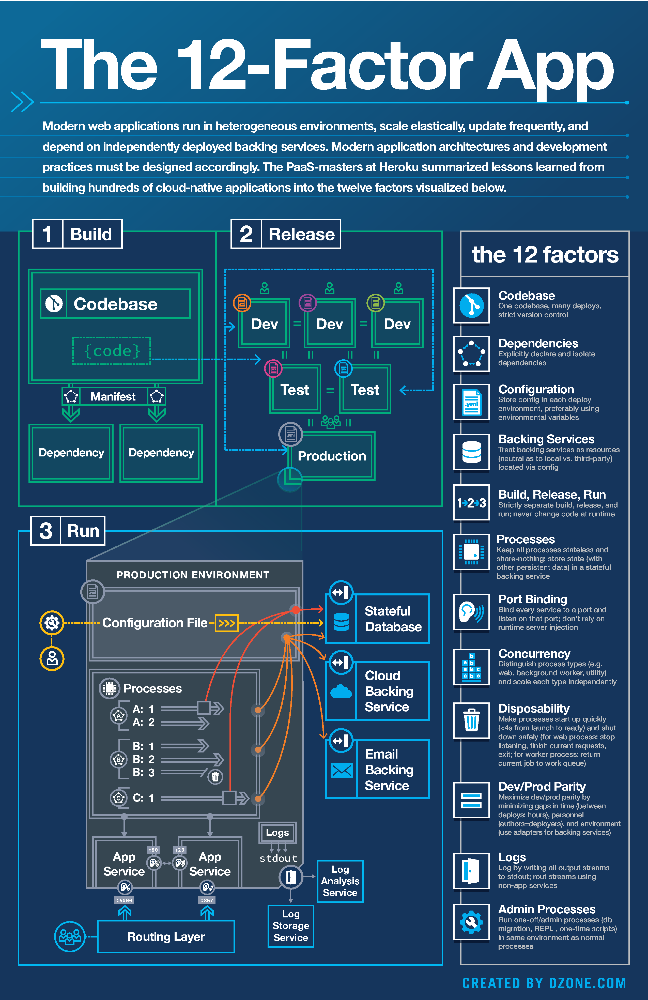

# 12 Factor App

- [12 Factor App](#12-factor-app)
  - [Contextualizando](#contextualizando)

## Contextualizando

> https://12factor.net/pt_br/

A metodologia de aplicações de doze fatores é uma metodologia de desenvolvimento, de trabalho de software, que pode trazer alguns benefícios se aplicada em determinados cenários. Ela traz 12 princípios orientados para que se atinga algum objetivo, como exemplo: manter um formato declarativo, firmar contratos claros e limpos de dependências, padronizar ambientes e configurações, entre outros fatores que podem melhor e facilitar o desenvolvimento, portabilidade, escalabilidade e deploy de aplicações.

É importante frisar que essa metodologia pode ser aplicada para aplicações escritas em qualquer linguagem, e que façam uso de qualquer combinação de serviços de suportes, que seria qualquer sistema terceiro -  banco de dados, filas, cache de memória, etc.

Mas vale a pena aplicar em todos os projetos? Depende, o ideal é entender cada fator, suas vantagens e desvantagens, antes de decidir aplicar; para aplicações mais simples, isso pode trazer uma complexidade desnecessária.

O alvo da metodologia é para construir softwares-como-serviço (SAS), que é basicamente um programa/sistema que não é vendido como produto, mas sim como um serviço, algo recorrente. Pode ser algo tanto gratuito, como pago em diferente modalidades, incluindo assinatura. Como exemplos: Gmail, Netflix, One Drive, Microsoft Office Online, Dropbox e Ferramentas Google.

É entregue um serviço de software, e não um produto que se compra, paga uma vez e instala na máquina, por exemplo. Softwares como serviços são armazenados no servidor do fornecedor do serviço, ele gerencia o serviço em si, ele gerencia os servidores, o código mantém. Já o produto, você entregaria, por exemplo, o sistema para o cliente que está comprando, e ele vai instalar na máquina dele, nos servidores dele, ele vai cuidar de manter esses servidores, etc. Existe essa diferença.

O alvo dessa metodologia é para criação desse tipo de aplicação, ou seja, aplicação de software como serviço, que depende de uma infraestrutura mais robusta para conseguir fornecer o acesso a vários clientes, que esteja em servidores de alta disponibilidade, etc.

Por fim, não é necessário nem usar todos os fatores na aplicação, é possível aplicar somente um ou um grupo menor deles de acordo com as necessidades da aplicação.

## Fator 1: Codebase

**_Uma base de código rastreada por um sistema de controle de versões, com muitos deploys._**

Uma base de código é qualquer repositório único (centralizado em um sistema de controle como o Subversion), ou um conjunto de repositórios que compartilham um commit raiz (descentralizado em um sistema de controle como o Git). Ou seja, uma base versionada onde o código é separado do servidor.

Sobre os deploys, são os múltiplos ambientes para aquele código, como ambiente de desenvolvimento, teste, homologação e, é claro, de produção.

## Fator 2: Dependencies

## Fator 3: Configuration

## Fator 4: Backing Services

## Fator 5: Build, Release, Run

## Fator 6: Processes

## Fator 7: Port Biding

## Fator 8: Concurrency

## Fator 9: Disposability

## Fator 10: Dev/Prod Parity

## Fator 11: Logs

## Fator 12: Admin Processes